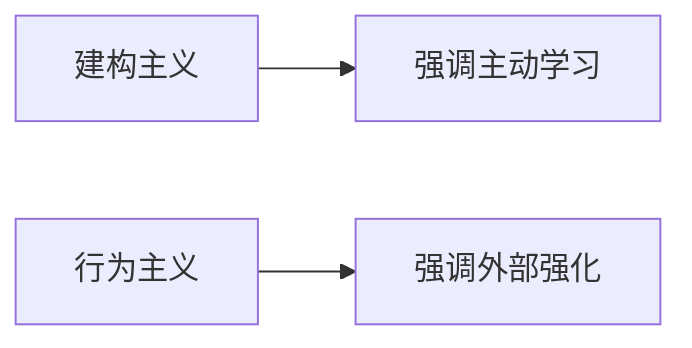

                 

<think>
嗯，我现在要写一篇关于数字时代个性化教育平台的文章，题目是《AI辅助下的学习路径设计》。首先，我得理解这个主题。个性化教育听起来像是根据每个学生的特点来定制学习计划，而AI在这里应该起到关键作用，帮助分析学生的学习情况，然后推荐合适的学习内容。

那么，我应该从哪里开始呢？可能得先介绍数字时代的教育是怎么回事，对比传统教育有哪些变化。然后，再详细说明AI在个性化教育中的角色，比如数据收集、分析和推荐系统。

接下来，我得想一下，如何设计学习路径。这可能涉及到学习理论，比如建构主义，或者行为主义，这些理论如何影响学习路径的设计。然后，AI如何利用这些理论，通过数据分析来调整学习内容。

数据和机器学习算法是关键，所以得解释一下这些算法的工作原理，比如决策树、神经网络，还有强化学习，这些算法如何帮助个性化教育平台进行预测和优化。

接下来，可能得讨论平台的架构，比如前端和后端如何设计，数据如何存储和处理。同时，用户体验也很重要，用户界面要友好，让学生和教师都能方便地使用。

案例研究也是必要的，通过实际的案例来展示AI辅助学习的效果，比如某个平台如何根据学生的表现调整课程内容。此外，实施个性化学习的步骤是什么，如何评估平台的有效性也是需要讨论的点。

最后，得考虑未来的趋势和伦理问题。AI在教育中的应用可能会带来新的技术，比如AR/VR，或者区块链来保证数据的安全性。同时，隐私保护和算法偏见也是需要关注的问题。

在写作过程中，我需要确保每个部分都详细且结构清晰。比如，在介绍AI的作用时，可以列出几个具体的应用，每个应用都详细解释。另外，数学公式和算法流程图的使用会帮助读者更好地理解原理，所以得花时间把这些内容整理清楚。

可能遇到的困难是如何平衡技术细节和可读性。毕竟，读者可能包括教育工作者和IT专家，但可能对某些算法不熟悉。所以，我需要尽量用通俗的语言解释复杂的概念，并提供足够的例子来说明。

另外，确保文章的逻辑连贯，每个章节之间有自然的过渡。例如，从理论基础到实际应用，再到案例分析，最后展望未来，这样的结构应该比较合理。

总的来说，我需要系统地组织内容，确保涵盖背景、理论、技术、案例、未来等多个方面，同时保持文章的深度和可读性。现在，我应该按照这个思路，逐步展开每个部分的内容，确保每个小节都有详细的解释和丰富的例子，这样读者才能全面理解AI在个性化教育中的作用和应用。
</think>

# 数字时代的个性化教育平台：AI辅助下的学习路径设计

## 关键词：个性化教育，人工智能，学习路径，教育技术，自适应学习

## 摘要：  
在数字时代，个性化教育正在成为教育领域的革命性趋势。通过人工智能（AI）技术，教育平台能够根据学生的学习情况、兴趣和能力，动态调整学习内容和路径。本文探讨了AI在个性化教育中的核心作用，分析了学习路径设计的关键原理、算法和技术，并通过实际案例展示了如何构建和实施AI驱动的个性化教育平台。文章还展望了未来的发展方向，并讨论了相关的伦理和挑战。

---

## 目录

1. 引言：数字时代的个性化教育  
   1.1 教育的数字化转型  
   1.2 个性化学习的重要性  
   1.3 AI在教育中的潜力  

2. AI在个性化教育中的基础与应用  
   2.1 机器学习的核心概念  
   2.2 数据驱动的教育分析  
   2.3 AI在教育中的具体应用场景  

3. 个性化学习路径的设计理论  
   3.1 学习理论基础  
   3.2 数据分析与学生画像  
   3.3 自适应学习系统的构建  

4. AI算法在学习路径设计中的应用  
   4.1 常见机器学习算法及其特点  
   4.2 神经网络与深度学习在教育中的应用  
   4.3 强化学习在学习路径优化中的作用  

5. 个性化教育平台的系统架构  
   5.1 平台架构设计  
   5.2 数据管理与集成  
   5.3 用户界面与体验优化  

6. 实施AI辅助学习路径的步骤  
   6.1 案例分析：AI驱动的教育平台  
   6.2 实施个性化学习路径的步骤  
   6.3 平台效果的评估与优化  

7. 未来趋势与伦理挑战  
   7.1 个性化教育的未来发展方向  
   7.2 AI在教育中的伦理问题  
   7.3 技术与教育的融合趋势  

---

## 正文

### 1. 引言：数字时代的个性化教育

#### 1.1 教育的数字化转型  
随着信息技术的飞速发展，教育正在经历一场深刻的数字化转型。传统的课堂教学模式逐渐被智能化、个性化的学习方式所取代。数字技术的应用不仅改变了教学方式，还为个性化教育提供了新的可能性。

#### 1.2 个性化学习的重要性  
个性化学习强调根据每个学生的特点（如兴趣、能力、学习风格）量身定制学习计划。这种教育模式能够提高学生的学习效率，激发他们的潜力，同时减少学习中的挫败感。

#### 1.3 AI在教育中的潜力  
人工智能技术在教育中的应用，使得个性化学习成为可能。AI可以通过分析学生的行为数据，预测学习难点，并推荐适合的学习资源，从而优化学习路径。

---

### 2. AI在个性化教育中的基础与应用

#### 2.1 机器学习的核心概念  
机器学习是AI的重要组成部分，它通过数据训练模型，使模型能够从经验中学习并做出预测。在教育中，机器学习可以用于学生行为分析、成绩预测等。

**图2-1：机器学习的基本流程**  

#### 2.2 数据驱动的教育分析  
个性化教育依赖于大量数据的收集和分析。这些数据包括学生的学习成绩、作业完成情况、在线行为等。通过数据挖掘，AI可以发现学生的学习规律，从而制定个性化策略。

**表2-1：学生数据的典型特征**  
| 特征类型 | 特征描述             |
|----------|----------------------|
| 学术成绩  | 学生成绩、进步速度   |
| 学习行为  | 上课出勤率、作业完成时间 |
| 兴趣偏好  | 喜欢的科目、学习方式  |

#### 2.3 AI在教育中的具体应用场景  
AI在教育中的应用包括智能辅导系统、自适应学习平台和教育管理系统的优化。例如，智能辅导系统可以根据学生的学习情况，实时提供个性化的学习建议。

---

### 3. 个性化学习路径的设计理论

#### 3.1 学习理论基础  
个性化学习路径的设计基于多种学习理论，如建构主义和行为主义。建构主义强调学生通过主动探索构建知识，而行为主义关注外部行为的强化。

**图3-1：建构主义与行为主义的核心区别**  

#### 3.2 数据分析与学生画像  
通过分析学生的数据，可以创建详细的“学生画像”。这些画像包括学生的知识水平、学习风格和兴趣爱好，帮助教师和系统更好地理解学生的需求。

#### 3.3 自适应学习系统的构建  
自适应学习系统通过实时调整学习内容和节奏，为学生提供个性化的学习体验。例如，系统可以根据学生的答题速度和准确性，动态调整题目难度。

**图3-2：自适应学习系统的流程**  

---

### 4. AI算法在学习路径设计中的应用

#### 4.1 常见机器学习算法及其特点  
在个性化教育中，常用的机器学习算法包括决策树、随机森林、支持向量机（SVM）和神经网络。每种算法都有其独特的优势和适用场景。

**表4-1：常见机器学习算法的特点**  
| 算法名称 | 描述                     | 优势               | 动态调整能力 |
|----------|--------------------------|--------------------|--------------|
| 决策树    | 通过树状结构进行分类     | 易于解释           | 中            |
| 随机森林  | 多棵决策树的集成          | 高准确率           | 高            |
| 神经网络  | 模拟人脑神经网络          | 强大学习能力       | 高            |
| SVM       | 支持向量机，用于分类和回归 | 高准确性           | 中            |

#### 4.2 神经网络与深度学习在教育中的应用  
深度学习技术，尤其是神经网络，已经在教育领域取得了显著成果。例如，通过自然语言处理（NLP），系统可以自动分析学生的作文并给出反馈。

**图4-1：神经网络的基本结构**  

#### 4.3 强化学习在学习路径优化中的作用  
强化学习是一种通过试错机制优化决策的方法。在教育中，强化学习可以用于自适应学习路径的设计，帮助学生找到最优的学习路径。

**图4-2：强化学习的试错机制**  

---

### 5. 个性化教育平台的系统架构

#### 5.1 平台架构设计  
个性化教育平台通常包括前端、后端、数据库和AI引擎四个部分。前端负责用户交互，后端处理业务逻辑，数据库存储数据，AI引擎负责学习路径的设计和优化。

**图5-1：个性化教育平台的架构图**  

#### 5.2 数据管理与集成  
数据是个性化教育的核心，平台需要高效地收集、存储和处理数据。常用的数据管理技术包括分布式存储和数据挖掘。

#### 5.3 用户界面与体验优化  
用户界面的设计直接影响用户体验。个性化教育平台需要设计直观、友好的界面，使学生和教师能够轻松使用。

---

### 6. 实施AI辅助学习路径的步骤

#### 6.1 案例分析：AI驱动的教育平台  
以某知名教育平台为例，分析其如何利用AI技术实现个性化学习路径设计。

#### 6.2 实施个性化学习路径的步骤  
1. 数据收集与分析  
2. 学习路径设计与优化  
3. 平台开发与测试  
4. 用户反馈与迭代  

#### 6.3 平台效果的评估与优化  
通过实验和数据分析，评估平台的效果，并根据反馈进行优化。

---

### 7. 未来趋势与伦理挑战

#### 7.1 个性化教育的未来发展方向  
未来，AI和虚拟现实（VR）的结合将为个性化教育带来更多的可能性，如沉浸式学习体验。

#### 7.2 AI在教育中的伦理问题  
数据隐私和算法偏见是AI教育应用中需要关注的伦理问题。如何保护学生数据隐私，避免算法偏见，是未来的重要课题。

#### 7.3 技术与教育的融合趋势  
随着技术的发展，教育与AI的结合将更加紧密，个性化教育将成为主流。

---

## 作者：AI天才研究院 & 禅与计算机程序设计艺术

