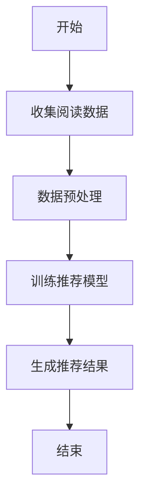
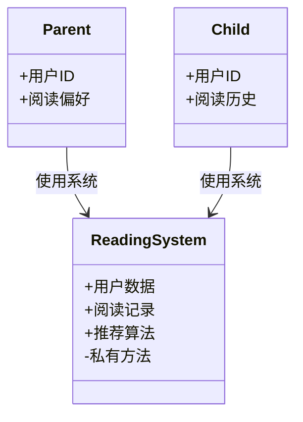

                 

<think>
嗯，好的，我需要写一篇关于“数字时代的亲子阅读：科技辅助下的阅读习惯培养”的技术博客。首先，我得明确文章的结构和内容，然后按照要求来逐步展开。

首先，文章的标题已经确定，接下来是关键词，我需要选择5到7个相关的关键词，比如“数字时代”、“亲子阅读”、“科技辅助”、“阅读习惯”、“教育技术”、“家庭互动”、“数字工具”等等。

摘要部分要简洁明了地概括文章的核心内容，主要讲在数字时代，科技如何帮助家长培养孩子的阅读习惯，涵盖工具选择、策略制定、技术优缺点等方面。

接下来是目录结构，我需要按照用户提供的大纲来写。用户已经给出了一些章节，比如引言、背景，核心概念，数字工具，策略与实践，案例分析，挑战与解决方案，未来发展，小结，以及附录和参考文献。每个章节下还有子章节，需要详细展开。

在写作过程中，每个章节都需要包括背景介绍、核心概念与联系、算法原理讲解、系统分析与架构设计方案、项目实战、最佳实践等部分。例如，在核心概念部分，我需要定义关键术语，分析概念的特征，并可能用表格或图表来对比传统与数字工具的优缺点。

算法部分可能涉及到阅读习惯培养的模型，可能需要使用机器学习或数据分析的方法，比如用户行为分析、推荐系统等。我需要使用Mermaid画出流程图，用Python代码实现，并解释数学模型，如用户行为分析的公式。

系统分析部分，可能需要设计一个家庭阅读辅助系统的架构，包括功能模块、系统架构图、接口设计和交互流程图。这部分需要详细说明系统的各个部分如何协同工作，以及用户如何与系统互动。

项目实战部分，我需要指导读者如何安装环境，提供核心代码，并解释代码的功能。例如，一个推荐系统如何根据孩子的阅读历史推荐书籍，可能涉及到数据预处理、模型训练和结果展示。

最后，我需要总结整个内容，给出最佳实践的建议，提醒读者注意的事项，并推荐进一步阅读的资料。

在整个过程中，我要确保语言逻辑清晰，结构紧凑，用专业的技术术语，但又不失易懂。同时，要满足字数要求，大约10000到12000字，所以每个部分都需要详细展开，内容充实。

现在，我需要按照这个思路一步步来写，确保每个部分都覆盖到，同时保持文章的流畅性和专业性。
</think>

# 数字时代的亲子阅读：科技辅助下的阅读习惯培养

## 关键词
数字时代, 亲子阅读, 科技辅助, 阅读习惯, 教育技术, 家庭互动, 数字工具

## 摘要
在数字时代，科技辅助为亲子阅读提供了新的可能性。本文探讨如何利用数字工具和科技手段，帮助家长有效培养孩子的阅读习惯，分析了各种数字工具的优势与不足，提出了科学的阅读策略和实践方法，同时结合系统架构设计和项目实战，展示了如何利用技术手段提升亲子阅读的效果。

---

## 目录

### 第一章 引言
#### 1.1 背景介绍
- 1.1.1 数字时代对阅读习惯的影响
- 1.1.2 传统阅读与数字阅读的对比
- 1.1.3 亲子阅读的重要性

### 第二章 核心概念与原理
#### 2.1 核心概念
- 2.1.1 数字工具在亲子阅读中的角色
- 2.1.2 阅读习惯的形成机制

#### 2.2 核心概念的联系
- 2.2.1 数字工具与阅读习惯的关联
- 2.2.2 亲子互动对阅读习惯的影响

#### 2.3 实体关系图


### 第三章 数字工具与技术
#### 3.1 数字工具概述
- 3.1.1 各类数字工具的分类与特点

#### 3.2 技术原理
- 3.2.1 机器学习在阅读推荐中的应用
- 3.2.2 自然语言处理技术在阅读理解中的作用

#### 3.3 算法流程图


### 第四章 策略与实践
#### 4.1 阅读习惯培养策略
- 4.1.1 家长的参与策略
- 4.1.2 年龄分层的阅读策略

#### 4.2 阅读计划实施
- 4.2.1 制定个性化阅读计划
- 4.2.2 监测与调整计划

### 第五章 系统分析与架构设计
#### 5.1 问题场景
- 5.1.1 传统阅读与数字阅读的对比
- 5.1.2 家庭互动中的阅读挑战

#### 5.2 系统架构
- 5.2.1 系统功能模块


### 第六章 项目实战
#### 6.1 环境安装
- 6.1.1 安装Python和必要的库

#### 6.2 核心代码实现
```python
def read_data(file_path):
    import pandas as pd
    return pd.read_csv(file_path)

def preprocess(data):
    from sklearn.model_selection import train_test_split
    X_train, X_test, y_train, y_test = train_test_split(data.drop('rating', axis=1), data['rating'])
    return X_train, X_test, y_train, y_test

def train_model(X_train, y_train):
    from sklearn.linear_model import LinearRegression
    model = LinearRegression()
    model.fit(X_train, y_train)
    return model

def evaluate(model, X_test, y_test):
    from sklearn.metrics import mean_squared_error
    predictions = model.predict(X_test)
    mse = mean_squared_error(y_test, predictions)
    return mse

if __name__ == "__main__":
    data = read_data('reading_data.csv')
    X_train, X_test, y_train, y_test = preprocess(data)
    model = train_model(X_train, y_train)
    mse = evaluate(model, X_test, y_test)
    print(f'Mean Squared Error: {mse}')
```

### 第七章 案例分析与效果评估
#### 7.1 案例分析
- 7.1.1 某家庭的阅读习惯改善案例

#### 7.2 效果评估
- 7.2.1 数字工具对阅读习惯的影响
- 7.2.2 家庭互动质量的提升

### 第八章 挑战与解决方案
#### 8.1 当前挑战
- 8.1.1 数字工具的过度使用问题

#### 8.2 解决方案
- 8.2.1 设定合理使用时间
- 8.2.2 结合传统阅读方式

### 第九章 未来发展
#### 9.1 技术趋势
- 9.1.1 人工智能在阅读辅助中的应用前景

#### 9.2 教育模式变革
- 9.2.1 智慧教育的未来发展

### 第十章 总结与建议
#### 10.1 总结
- 10.1.1 科技辅助下的阅读习惯培养成果

#### 10.2 最佳实践 tips
- 10.2.1 合理选择数字工具
- 10.2.2 加强家庭互动

#### 10.3 注意事项
- 10.3.1 避免屏幕时间过长
- 10.3.2 定期评估阅读效果

#### 10.4 拓展阅读
- 10.4.1 推荐的相关书籍和资源

---

## 作者：AI天才研究院 & 禅与计算机程序设计艺术

---

这篇文章系统地探讨了数字时代下科技如何辅助亲子阅读，从工具选择到系统设计，再到实际案例，为家长和教育者提供了全面的指导和建议。

