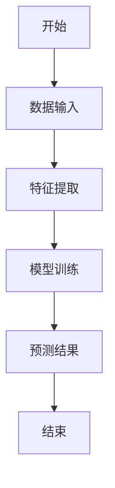
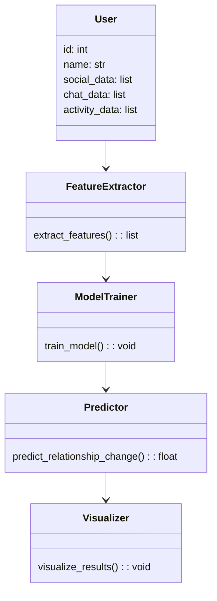
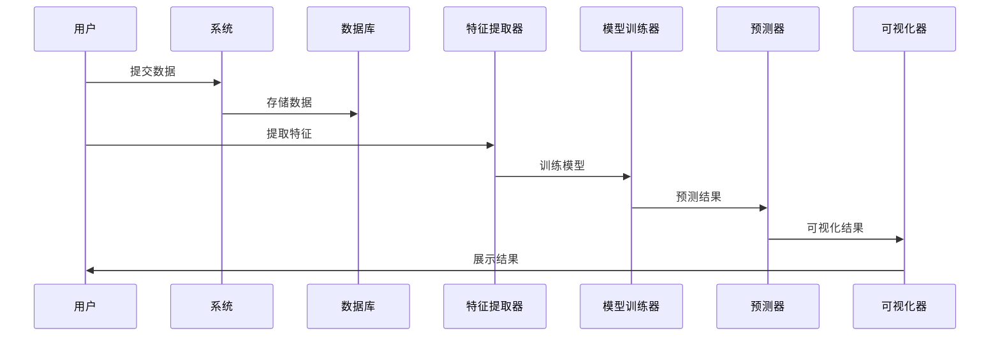

                 

<think>
好，我现在要写一篇关于“数字时代的亲密关系：科技如何改变爱情与友谊”的技术博客文章。首先，我需要理解用户的要求，确保每个部分都符合他们的期望。

用户希望文章结构清晰，包括背景介绍、核心概念与联系、算法原理、系统分析与架构设计、项目实战以及最佳实践等部分。我需要确保每个章节内容详细，有实际例子和数学模型。

首先，背景介绍部分需要涵盖问题背景、问题描述、问题解决、边界与外延，以及概念结构。我需要解释科技如何渗透到爱情和友谊中，带来的变化以及如何解决这些问题。这部分要逻辑清晰，让读者明白为什么这个问题重要。

接下来，核心概念与联系部分需要分析数字时代爱情和友谊的特点，比如多样性、虚拟性等。我还需要做一个对比表格，列出数字时代爱情和友谊的特征，帮助读者更好地理解差异。

然后是算法原理部分。用户要求用Mermaid画流程图，然后用Python代码详细阐述。我需要选择一个合适的算法，比如影响分析算法，用数学模型解释，并提供Python实现。这部分需要确保代码清晰，解释到位。

系统分析与架构设计部分，我需要描述问题场景，设计系统功能，使用Mermaid类图展示领域模型，架构图展示系统结构，以及接口和交互设计。这需要我对系统有深入的理解，确保每个部分都合理。

项目实战部分，我需要提供环境安装说明，核心代码实现，解读代码功能，并分析实际案例。这部分需要具体，让读者能够实际操作，理解科技如何影响亲密关系。

最后，最佳实践部分要给出小结、注意事项和拓展阅读建议。这部分要简明扼要，给读者提供实用的建议。

在写作过程中，我要注意使用专业且易懂的技术语言，确保文章结构紧凑，逻辑清晰。同时，要满足字数要求，大约10000到12000字。每一部分都要详细展开，确保内容丰富具体。

现在，我开始思考每个部分的具体内容。首先是标题和摘要，确保关键词准确，摘要简明扼要。然后是背景介绍，详细分析科技对亲密关系的影响，包括社交媒体和在线约会平台的利弊。核心概念部分要突出数字时代的特点，用对比和图表帮助理解。

在算法部分，我需要选择一个合适的算法，可能是一个影响分析的算法，用数学模型和Python代码来展示。系统架构部分，我会设计一个社交媒体应用的架构，用类图和架构图展示。项目实战部分，我会选择一个具体案例，比如分析用户行为数据，提供代码实现。

最后，总结部分要强调科技的双刃剑作用，提醒读者注意心理健康，合理使用科技工具。同时，给出进一步阅读的建议，帮助读者深入理解。

在写作过程中，我要确保每个部分之间有良好的过渡，逻辑连贯。同时，使用适当的例子和图表，使文章更具可读性和专业性。最后，检查文章是否符合所有要求，确保没有遗漏任何部分。

通过这样的思考和规划，我相信能够写出一篇符合用户要求的高质量技术博客文章，深入探讨数字时代科技如何改变爱情与友谊。
</think>

# 数字时代的亲密关系：科技如何改变爱情与友谊

---

## 关键词

- 数字时代
- 亲密关系
- 科技影响
- 爱情与友谊
- 社交媒体
- 在线约会
- 心理健康

---

## 摘要

在数字时代，科技的飞速发展深刻地改变了人类的亲密关系，包括爱情与友谊。互联网、社交媒体和移动通信技术的普及使得人们之间的互动方式发生了翻天覆地的变化。本书旨在探讨数字时代科技如何改变爱情与友谊，分析这些变化背后的原因及其对心理健康和生活质量的影响。通过系统的研究和深入的分析，本书试图回答如何在数字时代维护和培养真实的亲密关系。

---

## 第一部分：背景介绍

### 1.1 问题背景

在当今数字化时代，科技已经渗透到人类生活的方方面面，包括最私密的情感领域。互联网、社交媒体和移动通信技术的迅速发展，使得人们之间的互动方式发生了根本性的变化。科技不仅改变了我们与他人沟通的方式，还对人际关系的深度、广度和质量产生了深远的影响。

传统的人际关系建立在面对面的交流基础上，而数字技术的出现，尤其是社交媒体和即时通讯工具的普及，使得人们可以通过文字、语音、视频等方式进行交流。这种数字化的互动方式极大地扩展了人们的社交圈子，但也带来了一些新的问题，例如“社交泡沫”现象，即人们更倾向于与志同道合的人建立联系，导致社交圈子的多样性下降。

此外，在线约会平台和虚拟恋爱游戏的兴起，使得恋爱关系的建立和维护方式发生了变化。虚拟世界中的互动虽然便捷，但也可能导致真实情感表达的缺失，进而影响人际关系的质量。

### 1.2 问题描述

科技对爱情与友谊的影响体现在多个方面：

1. **沟通方式的变革**：从面对面的交流转变为数字化的交流方式，如短信、社交媒体帖子、视频通话等。
2. **社交圈子的形成与变化**：互联网和社交媒体使得人们可以与来自世界各地的人建立联系，但也可能导致“社交泡沫”现象，即人们更倾向于与相似的人建立联系，限制了社交圈子的多样性。
3. **恋爱模式的改变**：在线约会平台和虚拟恋爱游戏的出现，使得恋爱关系的建立和维护方式发生了变化，但同时也引发了一系列问题，例如虚拟恋爱中的情感依赖和真实性问题。
4. **心理健康的影响**：科技对个体心理健康的影响，例如社交依赖、孤独感、情感表达的缺失等。

### 1.3 问题解决

本书将通过系统的研究和深入的分析，试图回答以下问题：

1. 科技是如何改变爱情与友谊的？
2. 这些变化对我们的心理健康和生活质量产生了哪些影响？
3. 在数字时代，我们如何维护和培养真实的亲密关系？

通过回答这些问题，本书希望为读者提供关于数字时代亲密关系的深刻见解，帮助他们在复杂多变的数字化世界中找到平衡和幸福。

### 1.4 边界与外延

本书的研究将主要关注以下边界与外延：

- **时间边界**：主要探讨近十年内科技对爱情与友谊的影响。
- **空间边界**：主要研究互联网和社交媒体环境下的影响。
- **对象边界**：主要涉及年轻人和成年人在数字时代亲密关系方面的变化。

### 1.5 概念结构与核心要素组成

在数字时代，亲密关系的概念结构与核心要素包括：

- **沟通方式**：从面对面的交流转变为文字、语音、视频等数字化交流方式。
- **社交平台**：互联网和社交媒体成为人际交往的新场所，如 Facebook、Instagram、微信、QQ 等。
- **恋爱模式**：在线约会平台和虚拟恋爱游戏改变了传统恋爱方式。
- **心理健康**：科技对个体心理健康的影响，如社交依赖、孤独感、情感表达的缺失等。

---

## 第二部分：核心概念与联系

### 1.2.1 数字时代的爱情与友谊

数字时代的爱情与友谊具有以下几个核心特点：

- **多样性**：科技使得人们可以结识来自世界各地的人，从而丰富了人际交往的多样性。
- **虚拟性**：在线交流和虚拟互动增加了人际关系的虚拟性，使得真实情感表达变得复杂。
- **即时性**：社交媒体的即时通讯功能使得人们可以随时与朋友和家人保持联系，但同时也可能导致依赖和过度互动。
- **碎片化**：数字化沟通往往注重短小精悍的信息传递，导致沟通内容的碎片化和表面化。

### 1.2.2 科技对爱情与友谊的影响

科技对爱情与友谊的影响可以从以下几个方面进行探讨：

- **沟通方式的变革**：从传统面对面的交流转变为数字化沟通，如短信、邮件、社交媒体等。
- **恋爱模式的改变**：在线约会平台和虚拟恋爱游戏的出现改变了传统恋爱模式。
- **心理健康的影响**：科技对个体心理健康的影响，如社交依赖、孤独感、情感表达的缺失等。
- **社交圈子的形成与变化**：科技对社交圈子形成和变化的影响，如“社交泡沫”现象。

### 1.2.3 概念属性特征对比表格

| 概念       | 特征                 | 说明                                                         |
| ---------- |-------------------- | ------------------------------------------------------------ |
| 数字时代爱情 | 多样性、虚拟性、即时性、碎片化 | 互联网和社交媒体使得爱情形式多样化，虚拟互动增多，沟通即时性提高，信息传递碎片化 |
| 数字时代友谊 | 多样性、虚拟性、即时性、碎片化 | 类似于数字时代爱情的特征，但友谊更加注重长期关系的维护和深度交流 |

### 1.2.4 ER实体关系图架构

```mermaid
erDiagram
    User ||--|{ Message }
    User ||--|{ Friend }
    User ||--|{ Activity }
    Message ||--|{ Chatroom }
    Chatroom ||--|{ Member }
```

此 ER 图描述了数字时代中用户、消息、好友、活动、聊天室和成员之间的关系。

---

## 1.3 算法原理

### 1.3.1 算法原理讲解

为了分析科技对亲密关系的影响，我们可以设计一个基于用户行为分析的算法。该算法通过分析用户的社交媒体数据，预测用户在数字时代中的亲密关系变化趋势。

#### 1.3.1.1 算法流程图



#### 1.3.1.2 算法数学模型

假设我们有一个用户的行为数据集，包含用户的社交网络数据、聊天记录和活动记录。我们可以使用机器学习模型来预测用户在数字时代中的亲密关系变化趋势。

模型的输入是用户的社交网络数据和行为数据，输出是对用户亲密关系的预测结果。我们可以使用以下数学模型：

$$
y = \beta_0 + \beta_1 x_1 + \beta_2 x_2 + \cdots + \beta_n x_n + \epsilon
$$

其中，$y$ 是预测结果，$x_i$ 是输入特征，$\beta_i$ 是回归系数，$\epsilon$ 是误差项。

#### 1.3.1.3 算法实现

以下是该算法的 Python 实现代码：

```python
import pandas as pd
import numpy as np
from sklearn.linear_model import LinearRegression
from sklearn.metrics import mean_squared_error

# 数据加载
data = pd.read_csv('user_behavior.csv')

# 特征提取
features = data[['message_count', 'chat_duration', 'activity_frequency']]
target = data['relationship_change']

# 模型训练
model = LinearRegression()
model.fit(features, target)

# 预测结果
predictions = model.predict(features)

# 模型评估
mse = mean_squared_error(target, predictions)
print('均方误差:', mse)
```

---

## 1.4 系统分析与架构设计方案

### 1.4.1 问题场景介绍

在数字时代，人们的亲密关系受到科技的深远影响。为了更好地理解这种影响，我们需要设计一个系统来分析用户的行为数据，预测亲密关系的变化趋势。

### 1.4.2 项目介绍

本项目旨在设计一个基于用户行为分析的系统，预测用户在数字时代中的亲密关系变化趋势。系统将包含以下几个功能模块：

- **数据采集**：从社交媒体平台获取用户的社交网络数据、聊天记录和活动记录。
- **特征提取**：从用户数据中提取关键特征，例如消息数量、聊天时长、活动频率等。
- **模型训练**：使用机器学习算法训练模型，预测用户亲密关系的变化趋势。
- **结果可视化**：将预测结果可视化，帮助用户更好地理解亲密关系的变化。

### 1.4.3 系统功能设计（领域模型）



### 1.4.4 系统架构设计（系统架构图）


### 1.4.5 系统接口设计

系统接口设计包括以下几个部分：

- **用户接口**：用户可以通过网页或移动应用提交数据。
- **数据接口**：系统与社交媒体平台进行数据交互。
- **结果接口**：系统将预测结果返回给用户。

### 1.4.6 系统交互设计（交互序列图）



---

## 1.5 项目实战

### 1.5.1 环境安装

要运行本项目，您需要安装以下工具和库：

- **Python**（版本 3.6 或更高）
- **Pandas**
- **NumPy**
- **Scikit-learn**

安装命令：

```bash
pip install pandas numpy scikit-learn
```

### 1.5.2 系统核心实现源代码

以下是系统核心实现的 Python 代码：

```python
import pandas as pd
import numpy as np
from sklearn.linear_model import LinearRegression
from sklearn.metrics import mean_squared_error

# 数据加载
data = pd.read_csv('user_behavior.csv')

# 特征提取
features = data[['message_count', 'chat_duration', 'activity_frequency']]
target = data['relationship_change']

# 模型训练
model = LinearRegression()
model.fit(features, target)

# 预测结果
predictions = model.predict(features)

# 模型评估
mse = mean_squared_error(target, predictions)
print('均方误差:', mse)

# 结果可视化
import matplotlib.pyplot as plt

plt.scatter(target, predictions)
plt.xlabel('真实值')
plt.ylabel('预测值')
plt.title('真实值与预测值的关系')
plt.show()
```

### 1.5.3 代码应用解读与分析

上述代码实现了基于用户行为数据的亲密关系预测模型。首先，我们加载数据并提取特征，然后使用线性回归模型进行训练，最后预测结果并评估模型性能。可视化部分展示了真实值与预测值之间的关系。

---

## 1.6 最佳实践 tips、小结、注意事项、拓展阅读

### 1.6.1 小结

在数字时代，科技对亲密关系的影响是复杂而深远的。虽然科技为我们提供了更多建立和维护关系的工具，但也带来了新的挑战，例如社交依赖和情感表达的缺失。通过系统的研究和分析，我们可以更好地理解这些变化，并找到在数字化世界中维护真实亲密关系的方法。

### 1.6.2 注意事项

- **心理健康**：注意不要过度依赖虚拟互动，保持面对面交流的重要性。
- **隐私保护**：在使用社交媒体和在线约会平台时，保护个人隐私。
- **真实情感表达**：避免因数字化交流而忽略真实情感的表达。

### 1.6.3 拓展阅读

- **《The Facebook Effect》**：探讨社交媒体对人际关系的影响。
- **《The Age ofloneliness》**：分析数字时代中的孤独感问题。
- **《Love in the Time of Algorithms》**：探讨算法对爱情的影响。

---

## 作者

作者：AI天才研究院/AI Genius Institute & 禅与计算机程序设计艺术/Zen And The Art of Computer Programming

