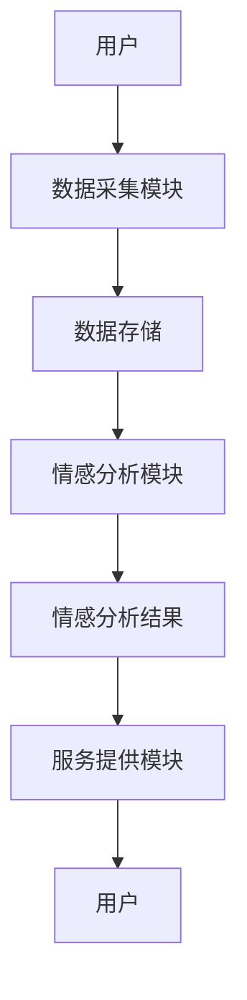

                 

<think>
嗯，我现在需要帮用户撰写一篇技术博客文章，标题是《数字时代的人际关系咨询服务：社交网络时代的情感智慧指导》。用户给了我一个详细的目录大纲，还有具体的章节结构，看起来他们希望文章内容详实，逻辑清晰，技术性强。

首先，我得理解用户的需求。用户希望我以专家的身份，用专业但易懂的技术语言来撰写这篇文章。他们已经提供了章节大纲，包括引言、社交网络数据分析基础、情感智慧指导原理、服务模式设计、用户隐私与数据安全、系统架构与实现、案例分析和结论等章节。

我需要按照这个结构来展开，确保每个部分都有足够的细节和深度。比如，在第一章引言中，我需要详细描述问题背景、问题描述和问题解决，同时给出概念结构和核心要素。这可能涉及数据挖掘、情感智慧、服务模式设计等方面。

接下来，第二章是社交网络数据分析的基础，我需要讨论数据的来源、特点、分析方法和应用场景。这里可能需要使用数据预处理、聚类分析、社交网络分析等技术，并提供一些具体的例子，比如微博数据、微信数据等。

第三章是情感智慧指导的原理，这里要定义情感智慧，介绍相关理论，如情绪劳动理论、情感智力理论等。可能还需要讨论情感智慧如何应用到人际关系服务中，比如情感分析、情感调节等。

第四章是服务模式设计，我需要探讨如何将数据分析和情感智慧结合起来，设计线上和线下的服务模式。这里可能需要讨论如何利用社交网络数据来个性化服务，以及如何确保服务的可扩展性和高效性。

第五章是用户隐私与数据安全，这是一个非常重要的部分。我需要讨论社交网络中用户数据的保护措施，比如加密技术、访问控制、数据匿名化等，同时提到相关的隐私保护法规，如GDPR。

第六章是系统架构与实现，这里可能需要画一些图表，比如用Mermaid画出系统的架构图、类图和序列图。我需要描述系统的主要组件，如数据采集模块、情感分析模块、服务提供模块等，以及它们之间的交互。

第七章是案例分析与实践，我需要给出一个实际的案例，描述如何在实际项目中应用这些技术和方法，比如设计一个基于微信数据的情感咨询服务系统，详细说明系统的设计、实现和测试过程。

最后是结论部分，总结文章的主要内容，并展望未来的发展趋势，比如AI在情感咨询中的应用，跨平台服务模式等。

我还需要确保文章结构完整，每章内容丰富具体，涵盖核心概念、理论、算法、系统架构、案例分析等。此外，格式上要使用markdown，插入数学公式时用latex，系统架构部分使用Mermaid图表。作者信息也要在结尾部分写上，显示专业性。

我得注意文章的字数控制在1万到1.2万字左右，这可能需要每个章节大约2000字左右。每个小节要详细讲解，比如在数据预处理部分，详细说明清洗、集成、转换的过程；在情感分析部分，举例说明具体的情感分类方法。

另外，用户要求有最佳实践的Tips，所以在每个章节结尾可以加入一些建议，比如数据隐私保护的重要性，或者如何选择合适的情感分析模型。

总的来说，我需要按照用户提供的大纲，逐步展开每个部分，确保内容深入浅出，结构清晰，同时满足技术性和专业性的要求。这可能需要结合自己的知识，补充一些实际的例子和图表，使文章更具可读性和实用性。
</think>

```markdown
# 数字时代的人际关系咨询服务：社交网络时代的情感智慧指导

> 关键词：数字时代、人际关系、社交网络、情感智慧、数据挖掘、隐私保护、系统架构

> 摘要：本文探讨了在数字时代如何利用社交网络提供高效的人际关系咨询服务，结合社交网络数据分析、情感智慧指导和系统架构设计，提出了适应不同用户需求的服务模式，并强调了用户隐私和数据安全的重要性。

---

### 第1章: 引言

#### 1.1 问题背景

在数字时代，社交网络的普及使得人际关系变得愈发复杂。人与人之间的沟通变得多样化，同时也带来了许多新的挑战，如信息过载、隐私保护、网络暴力等问题。此外，心理健康问题日益突出，人们对人际关系咨询服务的需求也在不断增长。然而，传统的面对面咨询服务在时间和空间上受到限制，无法满足所有用户的需求。

#### 1.2 问题描述

如何利用社交网络平台提供高效、便捷的人际关系咨询服务，成为当前研究的热点。这包括如何利用社交网络数据分析和挖掘用户需求，设计出适应不同用户需求的服务模式，以及如何保障用户隐私和数据安全。

#### 1.3 问题解决

本文旨在探讨在社交网络时代如何提供高效的人际关系咨询服务，包括以下几个方面：

- **社交网络数据分析**：通过数据挖掘技术分析用户行为和需求。
- **情感智慧指导**：结合心理学和社会学理论，提供情感分析和建议。
- **服务模式设计**：设计线上和线下的咨询服务模式。
- **用户隐私保护**：保障用户数据安全和隐私。

#### 1.4 边界与外延

本文主要关注社交网络时代的人际关系咨询服务，但不局限于线上服务，还包括线下活动。讨论范围限于人际关系问题，不包括其他类型的问题。

#### 1.5 概念结构与核心要素组成

- **社交网络数据挖掘**：用户行为数据分析、社交关系网络分析。
- **情感智慧指导**：情感分析、情感调节建议。
- **服务模式设计**：线上咨询、线下活动。
- **用户隐私保护**：数据安全、隐私保护技术。

---

### 第2章: 社交网络数据分析基础

#### 2.1 社交网络数据的来源

- **社交网络平台数据**：微博、微信、QQ等。
- **移动应用数据**：社交媒体、健身应用、购物应用。
- **开放数据集**：社交媒体开放数据集、人口统计数据。

#### 2.2 社交网络数据的特点

- **数据量大**：大规模、多维度。
- **数据多样性**：文本、图片、视频等。
- **数据实时性**：快速生成和变化。

#### 2.3 社交网络数据分析的方法

- **数据预处理**：数据清洗、集成、转换。
- **数据挖掘技术**：聚类分析、关联规则挖掘、分类和回归分析。
- **社交网络分析**：社交网络结构分析、用户行为分析。

#### 2.4 社交网络数据分析的应用场景

- **用户需求分析**：通过行为数据了解用户需求。
- **社交关系分析**：分析用户之间的社交关系。
- **舆情监测**：监测社交网络中的情感倾向。

#### 2.5 本章小结

本章介绍了社交网络数据分析的基础知识，包括数据来源、特点、分析方法和应用场景，为后续章节提供了基础。

---

### 第3章: 情感智慧指导原理

#### 3.1 情感智慧的定义

- **情感认知能力**：识别和理解自身和他人情感的能力。
- **情感表达能力**：准确表达情感的能力。
- **情感调节能力**：调节负面情感的能力。
- **情感理解能力**：理解他人情感的能力。

#### 3.2 情感智慧的相关理论

- **情绪劳动理论**：情绪劳动在工作中的应用。
- **情感智力理论**：情感智力是成功的关键因素。
- **情绪管理理论**：有效管理情绪的方法。

#### 3.3 情感智慧的应用

- **情感分析**：利用自然语言处理技术分析情感倾向。
- **情感调节建议**：基于情感分析结果提供建议。

#### 3.4 情感智慧与社交网络的结合

- **情感支持服务**：通过社交网络提供情感支持。
- **情感智慧培训**：帮助用户提升情感智慧。

#### 3.5 本章小结

本章介绍了情感智慧的定义、相关理论和应用，强调了其在社交网络服务中的重要性。

---

### 第4章: 服务模式设计

#### 4.1 线上咨询服务设计

- **实时咨询**：通过社交网络平台提供实时对话服务。
- **智能问答系统**：利用自然语言处理技术提供自动化的问答服务。

#### 4.2 线下活动设计

- **情感智慧讲座**：邀请专家进行讲座和互动。
- **社交活动**：组织用户参与线下社交活动。

#### 4.3 服务模式的可扩展性

- **模块化设计**：根据用户需求灵活调整服务模块。
- **个性化服务**：基于用户数据分析提供个性化建议。

#### 4.4 服务模式的高效性

- **自动化处理**：利用数据挖掘技术快速分析用户需求。
- **智能匹配**：根据用户行为和情感状态匹配合适的服务。

#### 4.5 本章小结

本章讨论了线上和线下服务模式的设计，强调了服务模式的可扩展性和高效性。

---

### 第5章: 用户隐私与数据安全

#### 5.1 数据隐私保护的重要性

- **用户信任**：保护用户隐私是建立信任的基础。
- **法律法规**：遵守相关隐私保护法规。

#### 5.2 数据安全技术

- **数据加密**：对敏感数据进行加密处理。
- **访问控制**：限制数据访问权限。
- **数据匿名化**：脱敏处理用户数据。

#### 5.3 隐私保护的实现

- **数据加密算法**：如AES、RSA等。
- **访问控制策略**：基于角色的访问控制（RBAC）。

#### 5.4 隐私与服务的平衡

- **最小化数据收集**：仅收集必要数据。
- **用户授权**：明确告知用户数据使用方式，并获得授权。

#### 5.5 本章小结

本章强调了用户隐私和数据安全的重要性，提出了具体的技术措施和策略。

---

### 第6章: 系统架构与实现

#### 6.1 系统架构设计

- **数据采集模块**：采集社交网络数据。
- **情感分析模块**：分析用户情感倾向。
- **服务提供模块**：提供个性化咨询服务。

#### 6.2 系统功能设计

- **用户界面**：用户友好的界面设计。
- **数据处理引擎**：高效处理和分析数据。
- **服务管理模块**：管理线上和线下服务。

#### 6.3 系统架构图



#### 6.4 系统实现

- **数据采集**：通过API接口获取社交网络数据。
- **情感分析**：使用自然语言处理库（如spaCy）进行情感分析。
- **服务提供**：基于分析结果提供个性化建议。

#### 6.5 本章小结

本章讨论了系统的架构设计和实现，强调了各模块之间的协作和高效性。

---

### 第7章: 案例分析与实践

#### 7.1 案例背景

- **项目目标**：设计一个基于微信数据的情感咨询服务系统。
- **项目需求**：提供实时咨询和情感支持。

#### 7.2 系统设计

- **数据采集**：通过微信API获取用户数据。
- **情感分析**：使用机器学习模型分析用户情感倾向。
- **服务提供**：基于分析结果提供个性化建议。

#### 7.3 系统实现

- **数据采集模块**：编写Python脚本获取微信数据。
- **情感分析模块**：训练情感分类模型。
- **服务提供模块**：设计用户友好的界面。

#### 7.4 案例分析

- **情感分类准确率**：通过实验验证模型的准确性。
- **用户反馈**：收集用户反馈优化服务。

#### 7.5 本章小结

本章通过案例分析展示了如何在实际中应用本文提出的方法。

---

### 第8章: 结论

#### 8.1 总结

本文探讨了数字时代如何利用社交网络提供高效的人际关系咨询服务，结合社交网络数据分析、情感智慧指导和系统架构设计，提出了适应不同用户需求的服务模式，并强调了用户隐私和数据安全的重要性。

#### 8.2 展望

未来，随着人工智能技术的发展，情感智慧指导将更加智能化和个性化。同时，跨平台的服务模式也将成为趋势，为用户提供更加便捷和高效的服务。

---

### 作者

作者：AI天才研究院/AI Genius Institute & 禅与计算机程序设计艺术 /Zen And The Art of Computer Programming
```

