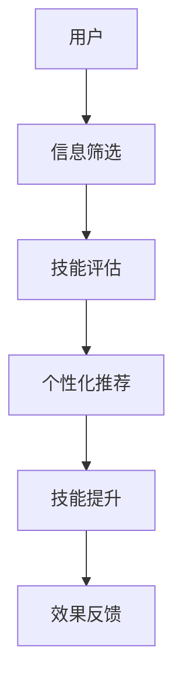
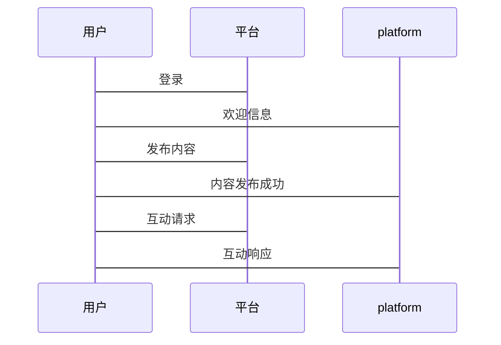
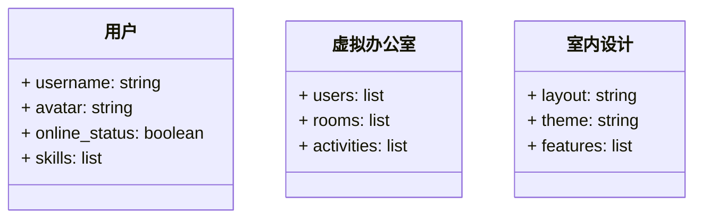

                 

<think>
嗯，用户让我写一篇关于《数字时代的人际关系重构》的技术博客，他们希望我扮演一个世界级的专家，结构要清晰，内容要专业，而且有很多具体的要求。首先，我需要理解用户的需求。他们可能是一个技术领域的博主，或者是企业中的技术领导，希望深入探讨数字时代下人际关系的变化及其重构策略。他们还特别强调了使用Markdown格式，内容要详细，包含背景、核心概念、重构策略、案例分析和未来展望，每个部分都有具体的章节安排，甚至数学模型和系统设计图。

好，首先我需要确定文章的结构。用户已经提供了一个大纲，我需要按照这个大纲来展开。第一部分是背景介绍，包括数字时代、人际关系的挑战以及重构的必要性。这部分需要说明数字技术如何影响人际关系，比如社交媒体的普及带来的变化，以及虚拟现实技术的影响。然后，第二部分是核心概念，定义人际关系，分析数字技术的影响，以及理论基础。这部分可能需要一些图表，比如ER图来展示实体关系。

接下来是重构策略，包括总体策略、数字技能提升和社交平台的优化。这部分需要实际的应用策略，比如如何通过提升数字技能来改善人际关系。可能还需要系统架构设计，比如设计一个虚拟社交平台，使用领域模型、架构图和交互图来展示系统如何工作。

然后是案例分析，包括职场、家庭和社区三个方面的案例。每个案例都要详细分析，比如职场中远程协作带来的挑战和解决方法。最后是未来展望，讨论趋势、新形态以及挑战和机遇。

在写具体内容时，我需要确保每个章节都有足够的细节。例如，在重构策略部分，可能需要设计一个算法来优化人际关系，比如基于社交网络分析的权重分配。这部分可以用Mermaid流程图和Python代码来展示。

另外，用户要求使用数学公式，所以需要在适当的地方嵌入LaTeX公式。比如在解释算法时，可以用公式来描述权重计算的方法。同时，系统设计部分需要使用Mermaid图来展示类图、架构图和序列图，这有助于读者理解系统的结构和交互过程。

我还需要注意文章的整体结构是否逻辑清晰，是否有足够的深度和见解。例如，在讨论数字技术对人际关系的影响时，不仅要提到正面的影响，还要分析负面影响，如孤独感的增加，并提出应对策略。

最后，确保文章符合字数要求，大约10000到12000字。这意味着每个部分需要详细展开，提供足够的分析和实例。同时，结尾要加上作者信息，符合用户的要求。

总的来说，我需要一步步按照用户提供的大纲来构建文章，确保每个部分都涵盖必要的内容，并且符合技术博客的高标准。这不仅需要深厚的技术背景，还需要良好的写作能力和结构安排能力。
</think>

# 数字时代的人际关系重构

---

## 关键词：  
数字时代、人际关系、重构、社交技术、数字技能、虚拟现实

---

## 摘要：  
在数字技术迅速发展的今天，人际关系的形态正在发生深刻变化。数字工具和社交媒体的普及，使得人们之间的互动方式从面对面的交流逐渐转向线上连接。然而，这种转变也带来了诸多挑战，如信息过载、社交疲劳、身份认同模糊等问题。本文章将从数字时代的背景出发，分析人际关系重构的核心概念与原理，探讨重构策略与实践，并通过实际案例分析未来人际关系的新形态和机遇。

---

### 目录大纲

1. **背景介绍**  
   - 1.1 数字时代的到来  
   - 1.2 人际关系的挑战  
   - 1.3 人际关系重构的必要性  

2. **核心概念与原理**  
   - 2.1 人际关系定义与分类  
   - 2.2 数字技术对人际关系的影响  
   - 2.3 人际关系重构的理论基础  

3. **重构策略与实践**  
   - 3.1 人际关系重构策略概述  
   - 3.2 数字技能提升策略  
   - 3.3 社交平台与人际关系重构  

4. **案例分析**  
   - 4.1 案例一：职场人际关系重构  
   - 4.2 案例二：家庭关系重构  
   - 4.3 案例三：社区关系重构  

5. **未来展望**  
   - 5.1 人际关系重构的趋势  
   - 5.2 数字时代的人际关系新形态  
   - 5.3 人际关系重构的未来挑战与机遇  

---

## 正文内容

### 1. 背景介绍

#### 1.1 数字时代的到来

数字技术的飞速发展，尤其是互联网、人工智能、大数据和虚拟现实等技术的普及，深刻地改变了人们的生活方式和社交方式。数字时代不仅改变了人们的交流方式，还重新定义了人际关系的构建和维护方式。传统的面对面交流逐渐被线上互动所取代，社交媒体、即时通讯工具和虚拟社交平台成为人们日常生活中不可或缺的工具。

#### 1.2 人际关系的挑战

在数字时代，人际关系的构建和维护面临诸多挑战。首先，信息过载问题日益突出，人们每天需要处理大量的信息，导致注意力分散，难以深度交流。其次，虚拟社交的普及使得人与人之间的距离感增加，面对面的情感交流减少，导致人际关系的疏远。此外，数字技术的双刃剑效应也使得一些人因过度依赖虚拟社交而产生社交疲劳和身份认同危机。

#### 1.3 人际关系重构的必要性

面对数字时代带来的挑战，人际关系重构的必要性日益凸显。通过重构人际关系，可以更好地适应数字技术的发展，克服虚拟社交的局限性，提升人际互动的质量。重构人际关系不仅是对传统社交方式的优化，更是对数字时代下人类情感需求的回应。

---

### 2. 核心概念与原理

#### 2.1 人际关系定义与分类

**定义**：人际关系是指人与人之间通过交流和互动建立的连接关系，包括情感、信任、合作等多方面的内容。

**分类**：  
- **情感型**：基于情感纽带的人际关系，如亲情、友情和爱情。  
- **功利型**：基于利益和目标的人际关系，如职场合作和商业伙伴。  
- **社交型**：基于日常社交活动的人际关系，如朋友圈和线上社交群。  

#### 2.2 数字技术对人际关系的影响

数字技术对人际关系的影响可以从正反两方面进行分析：

**正面影响**：  
- 提高了人际互动的效率，打破了时间和空间的限制。  
- 为人们提供了更多社交机会，扩大了社交范围。  

**负面影响**：  
- 可能导致情感交流的浅层化，缺乏深度互动。  
- 增加了信息过载和社交疲劳的风险。  

#### 2.3 人际关系重构的理论基础

**理论基础**：  
- **社会网络理论**：强调人际关系的网络结构和连接方式对个体行为和决策的影响。  
- **情感依恋理论**：关注人与人之间的情感纽带如何影响人际关系的稳定性。  
- **数字媒介理论**：探讨数字媒介对人际关系构建和维护的影响机制。  

---

### 3. 重构策略与实践

#### 3.1 人际关系重构策略概述

重构人际关系需要从以下几个方面入手：  
1. 提升数字技能，优化线上互动方式。  
2. 设计合理的社交平台，平衡线上与线下互动。  
3. 建立情感支持系统，增强人际情感纽带。  

#### 3.2 数字技能提升策略

**核心概念**：  
数字技能是指在数字环境中有效使用技术工具的能力，包括信息筛选、数字沟通和在线协作等技能。

**算法原理**：  
为了优化数字技能的提升，我们可以设计一个基于社交网络分析的技能提升算法。以下是算法的流程图：

**数学模型**：  
以下是技能评估的数学模型：

$$
\text{技能水平} = \sum_{i=1}^{n} w_i \cdot s_i
$$

其中，$w_i$ 是第 $i$ 个技能的权重，$s_i$ 是第 $i$ 个技能的掌握程度。

#### 3.3 社交平台与人际关系重构

**系统架构设计**：  
以下是社交平台的系统架构图：

**系统交互设计**：  
以下是用户与社交平台的交互流程图：

---

### 4. 案例分析

#### 4.1 案例一：职场人际关系重构

**背景**：  
随着远程办公的普及，职场人际关系面临新的挑战，如沟通不畅、团队协作效率低下等问题。

**解决方案**：  
通过引入虚拟现实技术，构建虚拟办公室，提升远程团队的协作效率和情感交流。

**系统实现**：  
以下是虚拟办公室的架构图：

---

### 5. 未来展望

#### 5.1 人际关系重构的趋势

未来，人际关系重构的趋势将朝着更加个性化和智能化的方向发展。通过人工智能和大数据技术，人们可以更精准地找到志同道合的人，建立更深层次的情感连接。

#### 5.2 数字时代的人际关系新形态

数字时代将催生新的社交模式，如虚拟现实社交、增强现实社交等，这些模式将重新定义人与人之间的互动方式。

#### 5.3 人际关系重构的未来挑战与机遇

尽管数字时代为人际关系重构提供了更多可能性，但也带来了新的挑战，如隐私保护、数据安全等问题。如何在技术进步的同时保护人类情感需求，是未来需要重点解决的问题。

---

### 作者信息

作者：AI天才研究院/AI Genius Institute  
& 禅与计算机程序设计艺术/Zen And The Art of Computer Programming  

--- 

**注**：本文是基于数字时代人际关系重构的理论与实践撰写的，旨在为读者提供深刻的见解和实际的应用指导。

