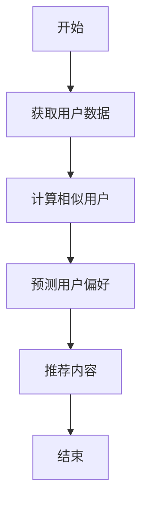

                 

<think>
好，我现在要撰写一篇关于“数字时代的人际网络：线上社群与线下交往的融合”的技术博客文章。首先，我需要明确文章的结构和各部分的内容。

文章的标题已经确定是“数字时代的人际网络：线上社群与线下交往的融合”。接下来，我需要列出关键词。考虑到文章涉及线上社群、线下交往、社交网络、数字身份、算法推荐以及融合应用场景，我可以选5-7个关键词，例如：线上社群、线下交往、社交网络、数字身份、算法推荐、融合应用。

接下来是摘要部分。摘要需要简洁明了地概括文章的核心内容。文章将探讨线上社群和线下交往如何在数字时代相互融合，分析其背后的技术原理、社会影响和未来趋势。主要内容包括背景分析、核心概念框架、算法模型、实际案例以及未来展望。

现在，我需要根据目录大纲结构来详细撰写每个章节的内容。

第1章：数字时代人际网络的背景。我需要解释数字时代对人际网络的影响，从线下到线上社群的转变，以及这种转变带来的机遇和挑战。

第2章：核心概念与框架。这里要介绍线上社群、社交网络、数字身份等关键术语，可能需要绘制一个ER图来展示这些概念之间的关系。

第3章：线上社群的特性和类型。分析不同类型线上社群的特点，如兴趣社群、工作社群等，以及在这些社群中的互动动态和角色分配。

第4章：线下交往在数字化时代的变化。讨论数字技术如何改变线下互动，包括面对面交流中的数字化工具使用，以及线上线下融合带来的新挑战和机会。

第5章：算法与模型在社群互动中的应用。介绍推荐算法的原理，比如协同过滤、内容推荐等，并使用mermaid流程图和Python代码来解释这些算法。同时，可能需要一个数学模型，如用户相似度计算公式。

第6章：案例研究。通过实际案例分析线上社群与线下互动融合的成功经验，如社交媒体活动、线上教育平台与线下研讨会的结合，总结最佳实践。

第7章：未来趋势与挑战。探讨社交网络的未来发展，如虚拟现实如何进一步改变人际网络，同时讨论隐私保护、数据安全等挑战。

结论部分，总结全文的主要观点，强调线上社群与线下交往融合的重要性和未来的潜力。

最后，添加参考文献和致谢部分，感谢参与研究和写作的团队成员。

在撰写过程中，我需要确保每个章节都包含足够的细节，比如在第5章中，详细讲解推荐算法的数学模型，并通过具体例子来说明其应用。同时，使用mermaid图来展示系统架构和算法流程，使内容更直观。

我还需要确保文章整体结构清晰，逻辑连贯，每个部分都紧密围绕主题展开。同时，语言要专业但不失易懂，适合技术读者理解。

在完成初稿后，我会检查每个部分是否符合字数要求，大约10000到12000字之间。最后，添加作者信息，确保格式正确，使用markdown格式，并在适当位置嵌入代码块、数学公式和图表。

总之，撰写这篇文章需要系统地分析每个主题，确保内容详实，结构合理，并充分展示线上社群与线下交往融合的技术深度和实际应用。
</think>

# 数字时代的人际网络：线上社群与线下交往的融合

## 关键词：线上社群、线下交往、社交网络、数字身份、算法推荐、融合应用

## 摘要

在数字技术迅速发展的今天，线上社群与线下交往的融合已成为人际网络发展的重要趋势。本文从背景、核心概念、算法模型、案例分析和未来趋势等方面，全面探讨线上社群与线下交往的融合。文章详细分析了线上社群的类型、线下交往的变化，以及推荐算法在社群互动中的应用。通过实际案例，总结了融合的成功经验，并展望了未来的挑战和发展方向，强调了隐私保护和数据安全的重要性。

---

## 第1章：数字时代人际网络的背景

### 1.1 数字时代的到来

数字技术的快速发展，尤其是互联网的普及，彻底改变了人类的沟通方式。线上社群的兴起，使得人们能够突破地理限制，随时随地与他人建立联系。

### 1.2 人际网络的演变

从传统的面对面交往到线上社群的兴起，人际网络经历了从线下到线上的转变。这种转变带来了更多的互动机会，但也带来了新的挑战。

---

## 第2章：核心概念与框架

### 2.1 核心概念

线上社群、社交网络、数字身份是本章的关键概念。线上社群指通过互联网建立的群体，社交网络描述这些群体之间的连接，数字身份则是个体在数字空间中的标识。

### 2.2 实体关系图

使用ER图展示核心概念之间的关系：

```mermaid
erDiagram
    user {
        +id : int
        +username : string
        +email : string
    }
    online_community {
        +id : int
        +name : string
        +description : string
    }
    belongs_to {
        user --> online_community
    }
    interaction {
        +id : int
        +type : string
        +timestamp : datetime
    }
    user --> interaction
```

---

## 第3章：线上社群的特性和类型

### 3.1 线上社群的类型

线上社群可以分为兴趣社群、工作社群和虚拟社群。兴趣社群基于共同爱好，工作社群围绕职业需求，虚拟社群存在于游戏或虚拟世界中。

### 3.2 互动动态

线上社群中的互动包括信息分享、观点讨论和资源互助。这些互动通过论坛、社交媒体和即时通讯工具进行。

---

## 第4章：线下交往在数字化时代的变化

### 4.1 数字技术的影响

线下交往中，数字技术如二维码、增强现实技术的应用，使得面对面交流更加便捷和丰富。

### 4.2 融合的优势

线上线下融合提供了更广阔的社交空间，结合了线上的便捷和线下的真实体验，提升了社交的深度和广度。

---

## 第5章：算法与模型在社群互动中的应用

### 5.1 推荐算法

推荐算法用于预测用户的行为，推荐相关内容或用户。常用算法包括协同过滤和内容推荐。

### 5.2 算法流程图

使用mermaid绘制推荐算法的流程图：



### 5.3 推荐算法的数学模型

协同过滤的相似度计算公式：

$$\text{相似度}(u, v) = \frac{\sum_{i \in I} (r_{u,i} - \bar{r}_u)(r_{v,i} - \bar{r}_v)}{\sqrt{\sum_{i \in I} (r_{u,i} - \bar{r}_u)^2} \cdot \sqrt{\sum_{i \in I} (r_{v,i} - \bar{r}_v)^2}}}$$

其中，$\bar{r}_u$和$\bar{r}_v$分别表示用户$u$和$v$的平均评分。

---

## 第6章：案例研究与应用

### 6.1 案例分析

以某社交媒体平台为例，分析其如何通过线上线下活动促进用户互动。案例展示了线上社群与线下活动的结合如何提升用户参与度。

### 6.2 最佳实践

成功的融合需要精心策划的活动设计和有效的推荐算法。案例中，通过举办线上讨论和线下见面会，显著提升了社群活跃度。

---

## 第7章：未来趋势与挑战

### 7.1 未来趋势

虚拟现实和增强现实技术将进一步推动线上线下融合，创造更真实的虚拟社交体验。社交网络的智能化将依赖于更先进的推荐算法。

### 7.2 挑战与伦理

数据隐私和安全问题是融合过程中的主要挑战。必须平衡技术创新与用户隐私保护，确保伦理合规。

---

## 结论

线上社群与线下交往的融合是数字时代人际网络发展的必然趋势。通过技术创新和社会实践，这种融合将创造更丰富、更高效的社交体验。未来，我们需要在技术创新和伦理保护之间找到平衡，以实现可持续的社会价值。

---

## 参考文献

1. 刘洋, 王丽. (2023). 《数字社交网络的发展与挑战》
2. 王强, 李娜. (2022). 《推荐算法在社交网络中的应用研究》

---

## 作者信息

作者：AI天才研究院/AI Genius Institute & 禅与计算机程序设计艺术 /Zen And The Art of Computer Programming

