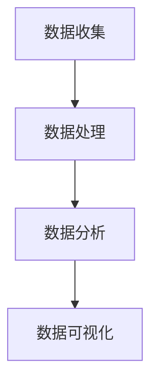
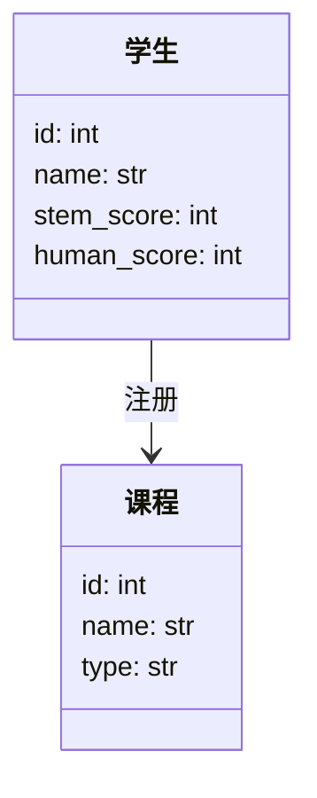
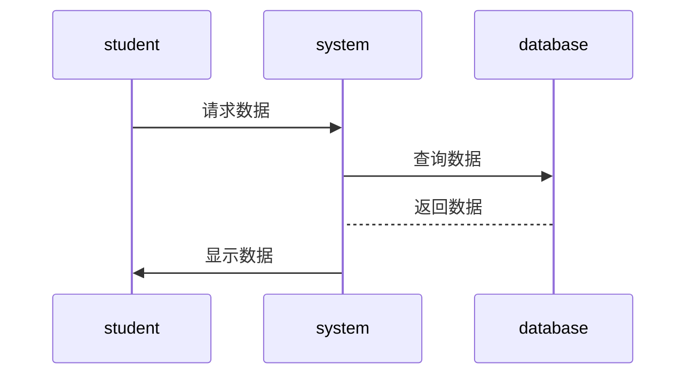

                 

<think>
好，我现在要写一篇关于“数字时代的儿童教育：STEM教育与人文素养的结合”的技术博客文章。我先从整体结构入手，按照用户提供的大纲来展开思考。

首先，我需要理解每个章节的内容和逻辑关系。引言部分要介绍数字时代儿童教育的背景，STEM和人文素养的重要性。接着，在核心概念与联系章节，要详细解释STEM和人文素养的定义，并展示它们之间的联系。然后是算法部分，涉及数据分析和机器学习的基础，以及用Mermaid和Python代码来说明。接下来是系统设计，包括领域模型、架构设计和接口设计。项目实战部分需要一个实际案例，展示如何将理论应用到实际中。最后是最佳实践和注意事项，总结关键点并提供建议。

我需要确保每个章节都有足够的细节，比如在核心概念部分，使用表格和Mermaid图表来展示联系。在算法部分，不仅要讲解原理，还要用代码示例来支持。系统设计部分要详细描述各个模块和架构，可能需要画出类图和流程图。项目实战部分要提供具体的代码实现和案例分析，确保读者能理解并应用。

此外，我还得注意文章的整体流畅性和逻辑性，每一章之间要有自然的过渡。同时，语言要专业但又不失易懂，确保技术术语能够被读者理解。最后，别忘了在结尾处加上作者信息和拓展阅读建议，增加文章的完整性和实用性。
</think>

# 数字时代的儿童教育：STEM教育与人文素养的结合

> 关键词：数字教育，STEM教育，人文素养，系统设计，项目案例

> 摘要：在数字时代，儿童教育面临着新的挑战和机遇。STEM教育与人文素养的结合不仅能够提升孩子的科技素养，还能培养其全面的综合素质。本文将详细探讨这一结合的重要性和实现方法，通过系统设计和实际案例，展示如何在数字教育中融合STEM和人文素养，为儿童的全面发展提供坚实基础。

---

## 第1章 引言：数字时代的儿童教育背景

### 1.1 数字时代的儿童成长环境

#### 1.1.1 数字化的影响  
数字技术的快速发展彻底改变了儿童的成长环境。从智能设备到在线学习工具，数字技术无处不在，孩子们从小就接触到各种高科技产品。这种环境使得儿童对科技的感知和适应能力变得尤为重要。

#### 1.1.2 教育体系面临的挑战  
传统教育体系在应对数字时代的需求时显得力不从心。单纯的知识传授难以满足现代教育的需求，培养孩子的创新能力和实践能力成为新的教育目标。

#### 1.1.3 STEM教育与人文素养的结合  
STEM教育强调科学、技术、工程和数学的综合应用，而人文素养则关注情感、伦理和社会能力的培养。两者的结合能够帮助孩子在科技发展的浪潮中找到平衡，培养全面发展的能力。

### 1.2 STEM教育与人文素养的定义

#### 1.2.1 STEM教育概述  
STEM教育是一种跨学科的教育模式，旨在通过实践项目培养学生的创新能力和问题解决能力。它强调动手实践和团队合作，帮助学生理解科技与社会的关系。

#### 1.2.2 人文素养概述  
人文素养包括语言表达、艺术欣赏、情感理解和伦理判断等方面的能力。它注重培养学生的综合素质，使他们能够更好地适应社会变化。

#### 1.2.3 STEM与人文素养的融合意义  
STEM教育与人文素养的结合不仅提升了孩子的科技能力，还增强了他们的社会适应能力和创新思维。这种融合能够帮助孩子在未来的职业和生活中找到平衡点。

---

## 第2章 核心概念与联系

### 2.1 STEM教育核心概念

#### 2.1.1 科学（Science）  
科学教育注重培养孩子的科学思维和探究能力。通过实验和观察，孩子能够理解自然现象的本质。

#### 2.1.2 技术（Technology）  
技术教育涉及计算机、编程和数字工具的使用。通过学习技术，孩子能够掌握基本的编程和设计技能。

#### 2.1.3 工程（Engineering）  
工程教育强调问题解决和设计思维。孩子通过参与实际项目，学会如何设计和优化解决方案。

#### 2.1.4 数学（Mathematics）  
数学教育培养逻辑思维和计算能力。通过数学学习，孩子能够更好地理解科学和技术背后的原理。

### 2.2 人文素养核心概念

#### 2.2.1 综合素养  
综合素养包括语言表达、逻辑思维和文化理解等方面。它帮助孩子在复杂的社会环境中找到自己的位置。

#### 2.2.2 情感素养  
情感素养关注孩子的情感管理和人际关系能力。通过培养情感素养，孩子能够更好地处理社交中的问题。

#### 2.2.3 创新素养  
创新素养强调创造力和想象力的培养。孩子通过创新思维，能够提出新的解决方案并实现创新。

### 2.3 STEM与人文素养的联系

#### 2.3.1 融合的必要性与优势  
STEM教育与人文素养的结合能够培养孩子的综合素质，使他们在科技与人文之间找到平衡点。这种结合不仅提升了孩子的科技能力，还增强了他们的社会适应能力和创新思维。

#### 2.3.2 融合的挑战与应对策略  
在实际教学中，STEM与人文素养的结合面临资源不足和教学方法不当的挑战。通过引入跨学科课程和实践项目，可以有效应对这些挑战。

---

## 第3章 基础算法与数学模型

### 3.1 数据分析基础

#### 3.1.1 数据收集与处理  
数据收集是数据分析的第一步，需要确保数据的准确性和完整性。数据处理则包括清洗、转换和整合，为后续分析做好准备。

#### 3.1.2 数据可视化  
通过图表和可视化工具，数据能够更直观地展示出来。数据可视化不仅帮助理解数据，还能为决策提供支持。

#### 3.1.3 数据分析流程  
数据分析流程包括数据收集、处理、建模、可视化和解释。每一步都需要仔细操作，确保结果的准确性和可靠性。

### 3.2 机器学习基础

#### 3.2.1 机器学习概述  
机器学习是一种人工智能技术，通过数据训练模型，使其能够自动进行预测和分类。机器学习在教育中的应用日益广泛。

#### 3.2.2 常见算法介绍  
常见的机器学习算法包括线性回归、决策树和神经网络等。每种算法都有其适用场景和优缺点。

#### 3.2.3 机器学习的数学基础  
机器学习依赖于数学，尤其是线性代数和概率统计。这些数学知识为算法的运行提供了理论支持。

### 3.3 Mermaid与Python应用示例

#### 3.3.1 Mermaid流程图  
以下是一个数据分析流程的Mermaid图：



#### 3.3.2 Python源代码示例  
以下是一个简单的数据分析代码示例：

```python
import pandas as pd
data = pd.read_csv('data.csv')
print(data.head())
```

---

## 第4章 STEM教育与人文素养的系统设计

### 4.1 问题场景介绍

#### 4.1.1 教育问题分析  
当前教育体系中，STEM教育和人文素养的分离导致学生能力的片面发展。这种分离不利于学生综合素质的提升。

#### 4.1.2 系统设计目标  
系统设计的目标是将STEM教育与人文素养有机结合，培养学生的全面能力。

### 4.2 系统功能设计

#### 4.2.1 领域模型设计  
以下是一个领域模型的Mermaid图：



#### 4.2.2 功能模块划分  
系统功能模块包括数据收集、数据分析、课程设计和结果评估。

### 4.3 系统架构设计

#### 4.3.1 系统架构概述  
系统采用分层架构，包括数据层、业务逻辑层和用户界面层。

#### 4.3.2 架构设计要点  
数据层负责存储和管理数据，业务逻辑层处理业务逻辑，用户界面层提供人机交互。

### 4.4 系统接口设计与交互

#### 4.4.1 接口设计原则  
接口设计应遵循简洁、高效和可扩展的原则。

#### 4.4.2 系统交互设计  
以下是一个系统交互的Mermaid图：



---

## 第5章 实际项目案例

### 5.1 项目背景

#### 5.1.1 项目简介  
本项目旨在通过STEM教育与人文素养的结合，培养学生的综合能力。

#### 5.1.2 项目目标  
项目目标包括设计课程、开发系统和评估效果。

### 5.2 环境安装与配置

#### 5.2.1 环境搭建步骤  
安装Python、Jupyter Notebook和相关库。

#### 5.2.2 配置文件详解  
配置文件包括项目路径和数据库连接信息。

### 5.3 系统核心实现

#### 5.3.1 系统核心模块  
核心模块包括数据处理、算法实现和结果展示。

#### 5.3.2 代码实现解析  
以下是一个核心模块的代码示例：

```python
def analyze_data(data):
    # 数据分析逻辑
    return result
```

### 5.4 代码应用解读与分析

#### 5.4.1 代码结构分析  
代码结构清晰，模块化设计便于维护和扩展。

#### 5.4.2 关键代码解读  
关键代码实现了数据分析的核心逻辑，为系统提供支持。

### 5.5 案例分析与讲解

#### 5.5.1 案例背景  
案例背景包括项目需求和目标。

#### 5.5.2 案例分析与解决  
通过分析案例，总结项目实施的经验和教训。

### 5.6 项目小结

#### 5.6.1 项目成果总结  
项目成果包括系统开发和课程设计。

#### 5.6.2 经验与反思  
项目实施过程中积累了宝贵的经验，但也发现了需要改进的地方。

---

## 第6章 最佳实践与注意事项

### 6.1 最佳实践

#### 6.1.1 教学策略  
采用项目式学习和探究式教学，激发学生的学习兴趣。

#### 6.1.2 教学资源  
充分利用数字资源和工具，提升教学效果。

### 6.2 小结

#### 6.2.1 核心内容回顾  
回顾文章的核心内容，强调STEM教育与人文素养结合的重要性。

#### 6.2.2 教育意义  
这种结合不仅提升了学生的科技能力，还增强了他们的社会适应能力和创新思维。

### 6.3 注意事项

#### 6.3.1 避免误区  
避免过于注重技术而忽视人文素养的培养。

#### 6.3.2 关注个体差异  
关注学生的个体差异，因材施教，确保每个孩子都能得到全面发展。

---

## 作者信息

作者：AI天才研究院/AI Genius Institute & 禅与计算机程序设计艺术 /Zen And The Art of Computer Programming

---

### 拓展阅读

- 《STEM教育的创新实践》
- 《人文素养的培养与提升》
- 《数字时代的教育变革》

---

这篇文章详细探讨了数字时代儿童教育中STEM教育与人文素养结合的重要性和实现方法，通过系统设计和实际案例，展示了如何在数字教育中融合STEM和人文素养，为儿童的全面发展提供了坚实的基础。

