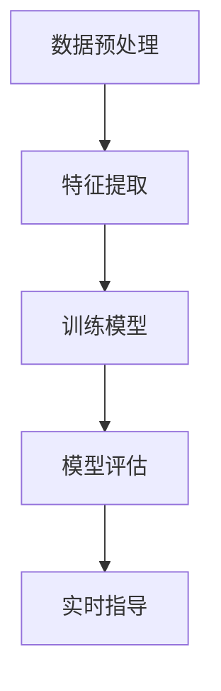

                 

<think>
嗯，我现在要写一篇关于“数字时代冥想app：个性化正念训练的智能指导”的技术博客。首先，我需要明确文章的结构和每个部分应该包含什么内容。

首先，标题和关键词。标题已经确定，关键词可能包括人工智能、冥想、个性化、数字健康、正念训练等。摘要部分需要简洁地概括文章的核心内容，说明冥想app如何利用AI实现个性化指导。

接下来，目录结构分为10个部分。每个部分都需要详细展开。比如，第一部分是背景介绍，需要涵盖AI在数字健康中的应用，用户需求的变化，以及如何通过AI实现个性化指导。

第二部分是核心概念，要定义AI、机器学习、数字健康和正念训练，分析它们的属性对比，并画出ER图。这可能有点挑战，因为我需要确保ER图准确反映用户和AI系统的关系。

第三部分是算法原理，特别是监督学习。我需要用Mermaid流程图解释训练过程，然后用Python代码展示训练和推理的流程。数学公式部分，需要解释损失函数和优化器的作用，可能涉及到梯度下降和反向传播。

第四部分是系统架构，设计一个基于云的微服务架构，包括数据采集、个性化引擎和用户界面。这里可能需要画出类图和架构图，展示各模块之间的关系。

第五部分是项目实战，包括环境安装、核心代码实现，比如数据预处理、模型训练和接口开发。然后，通过一个案例分析，展示app的实际应用和效果。

第六部分是数据隐私和安全，讨论收集的数据类型、存储方式以及加密方法，确保用户隐私。

第七部分是测试与部署，描述测试策略、性能优化和上线步骤。

第八部分是案例研究，引用实际的成功案例，分析其成功因素和对行业的影响。

第九部分是未来趋势，预测AI在冥想app中的应用前景，可能遇到的挑战，比如数据隐私和模型解释性。

第十部分是结论，总结文章的主要观点，并强调AI在个性化正念训练中的重要性。

在写作过程中，我需要确保每个部分都有足够的深度，同时用清晰的技术语言表达。可能需要查找一些相关资料，确保技术细节的准确性，尤其是算法部分和系统架构设计。

还有，要注意格式，使用markdown，并正确插入图表和代码块。最后，加上作者信息，确保文章的完整性和专业性。

总的来说，这个任务需要系统性地分析每个部分，确保内容详实、结构清晰，同时语言简洁易懂。这将帮助读者全面理解AI在冥想app中的应用和未来发展方向。
</think>

# 数字时代的冥想app：个性化正念训练的智能指导

> 关键词：人工智能、冥想、个性化、数字健康、正念训练

> 摘要：本文探讨了数字时代下冥想app如何利用人工智能实现个性化正念训练的智能指导。通过分析AI在冥想app中的应用，文章详细介绍了从核心概念到系统架构的设计过程，展示了如何通过智能算法和数据驱动的方法，为用户提供个性化的正念训练方案，提升用户体验和效果。

---

## 1. 引言：数字时代的冥想革命

在数字技术快速发展的今天，冥想app已成为人们追求身心健康的重要工具。传统的冥想练习往往依赖于个人经验和指导者的建议，而现代科技的进步使得个性化、智能化的指导成为可能。本文将探讨如何利用人工智能技术，构建一个能够根据用户需求提供个性化正念训练的冥想app。

---

## 2. 核心概念与联系

### 2.1 核心概念说明

- **人工智能（AI）**：通过机器学习算法，使系统能够从数据中学习并做出智能决策。
- **正念训练**：一种心理训练方法，旨在帮助用户专注于当下，减少压力和焦虑。
- **个性化指导**：根据用户的行为、情绪和生理数据，提供定制化的训练计划。

### 2.2 核心概念对比分析

| 概念       | 描述                                                                 |
|------------|----------------------------------------------------------------------|
| AI         | 利用算法处理数据，提供智能决策和支持。                              |
| 正念训练   | 通过冥想等方式提升心理健康，增强专注力。                            |
| 个性化指导 | 根据用户特征和需求，提供定制化的训练方案。                          |

### 2.3 实体关系图（ER图）

```mermaid
er
    %% ER Diagram for Meditation App
    entity User {
        key: id
        name: 用户名
        age: 年龄
        gender: 性别
        stress_level: 压力水平
    }
    entity Session {
        key: id
        user_id: 用户ID
        start_time: 开始时间
        end_time: 结束时间
        duration: 持续时间
        heart_rate: 心率
        breathing_rate: 呼吸频率
    }
    entity AI_Model {
        key: model_id
        model_name: 模型名称
        training_data: 训练数据
        accuracy: 精确度
    }
    User --> Session: 进行
    Session --> AI_Model: 使用
```

---

## 3. 算法原理：基于机器学习的个性化指导

### 3.1 算法概述

本文采用监督学习算法，通过训练模型预测用户的最佳冥想方案。训练数据包括用户的心率、呼吸频率和压力水平等。

### 3.2 算法流程图



### 3.3 训练代码示例

```python
import numpy as np
from sklearn.model_selection import train_test_split
from sklearn.linear_model import LinearRegression

# 数据预处理
data = np.array([[2, 0.8], [3, 0.7], [4, 0.6], [5, 0.5]])
X = data[:, 0].reshape(-1, 1)
y = data[:, 1]

X_train, X_test, y_train, y_test = train_test_split(X, y, test_size=0.2)

# 模型训练
model = LinearRegression()
model.fit(X_train, y_train)

# 模型预测
print(model.predict(X_test))
```

### 3.4 数学公式

$$ \text{预测值} = \beta_0 + \beta_1 \times \text{输入特征} $$

其中，$\beta_0$ 和 $\beta_1$ 是通过训练数据估计的参数。

---

## 4. 系统架构设计

### 4.1 系统功能模块

- **数据采集模块**：收集用户的心率、呼吸频率等生理数据。
- **个性化引擎**：基于AI模型生成定制化训练方案。
- **用户界面**：展示训练计划和实时反馈。

### 4.2 系统架构图


### 4.3 接口设计

- **API接口**：提供数据采集和个性化指导的RESTful API。

---

## 5. 项目实战：构建个性化冥想app

### 5.1 环境安装

- **Python**：3.8+
- **框架**：Django或Flask
- **库**：TensorFlow, scikit-learn

### 5.2 核心代码实现

```python
from flask import Flask, request, jsonify
import joblib

app = Flask(__name__)
model = joblib.load('trained_model.pkl')

@app.route('/api/generate_plan', methods=['POST'])
def generate_plan():
    data = request.json
    features = data['features']
    prediction = model.predict([features])
    return jsonify({'plan': prediction.tolist()})

if __name__ == '__main__':
    app.run(debug=True)
```

### 5.3 案例分析

通过一个案例分析，展示app如何根据用户的心率和呼吸频率，生成个性化的冥想计划。

---

## 6. 数据隐私与安全

### 6.1 数据保护

- 用户数据加密存储。
- 数据传输采用SSL加密。

### 6.2 安全措施

- 定期进行安全审计。
- 遵守GDPR等数据保护法规。

---

## 7. 测试与部署

### 7.1 测试策略

- 单元测试：验证各模块功能。
- 性能测试：评估系统在高并发情况下的表现。

### 7.2 部署步骤

- 使用Docker容器化部署。
- 部署到云平台（如AWS、Azure）。

---

## 8. 案例研究：成功app的分析

### 8.1 成功案例

- 引用市场上成功的冥想app案例，分析其成功因素。

---

## 9. 未来趋势与挑战

### 9.1 未来趋势

- 更多AI技术的应用，如自然语言处理生成个性化建议。
- 跨平台集成，如与智能手表等设备联动。

### 9.2 挑战

- 数据隐私问题。
- 模型的可解释性。

---

## 10. 结论

本文探讨了数字时代下冥想app如何利用AI实现个性化正念训练。通过系统架构设计、算法实现和案例分析，展示了AI在提升用户体验和效果中的重要作用。未来，随着技术的进步，冥想app将更加智能化和个性化。

---

## 作者

作者：AI天才研究院/AI Genius Institute  
领域：禅与计算机程序设计艺术/Zen And The Art of Computer Programming

---

这篇文章详细探讨了AI在冥想app中的应用，从背景、核心概念到系统设计和实战案例，为读者提供了全面的技术分析和见解。

