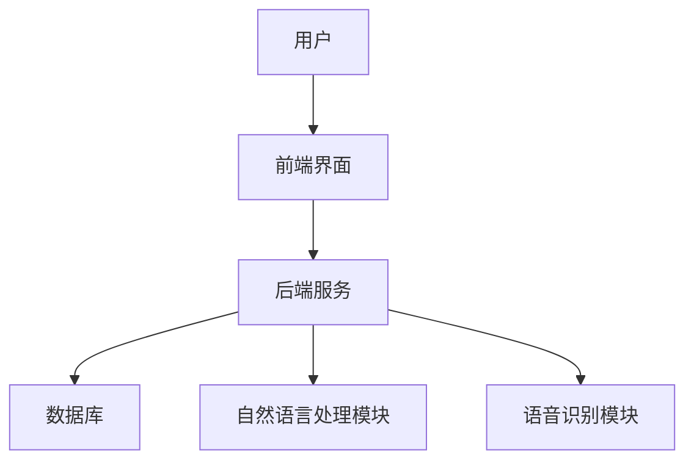
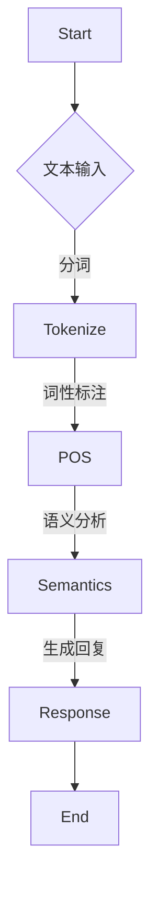

                 

<think>
好，我现在要帮助用户完成他们提出的任务，撰写一篇技术博客文章，标题是《数字时代的多语言家庭教育顾问：跨文化养育的在线咨询服务》。用户希望我以一位世界级专家的身份，分析并构建文章的结构和内容，满足特定的技术要求。

首先，我需要理解用户的需求。用户希望文章逻辑清晰，结构紧凑，使用专业但易懂的技术语言。文章需要包括关键词、摘要，以及详细的目录大纲，每个章节都要有背景介绍、核心概念、算法原理、数学模型、系统架构等部分。

接下来，我要分析用户提供的示例目录大纲，看看是否符合要求。目录分为四个主要部分：引言、多语言教育基础、在线咨询服务构建、实践与最佳实践。每个部分下有多个章节，每个章节包含具体的小节。看起来结构合理，但可能需要进一步细化每个章节的内容，确保覆盖所有要求的部分，比如算法原理、数学模型、系统架构等。

我还需要考虑用户提到的约束条件，比如每个章节必须包含背景介绍、核心概念与联系、算法原理讲解、数学模型和公式详细讲解、系统分析与架构设计方案、项目实战、最佳实践 tips等。这意味着每个章节不能只停留在理论层面，还要有实际的技术分析和案例。

现在，我开始构思每个章节的具体内容：

1. **引言**部分需要介绍背景，说明数字时代多语言教育的重要性，目标读者是谁，以及当前的现状。这部分需要简明扼要，吸引读者继续阅读。

2. **多语言教育基础**需要深入探讨语言习得理论，多语言教育的目标，以及面临的挑战和解决方案。这部分可能需要引入一些理论模型，甚至用数学模型来描述学习过程。

3. **跨文化养育的基本原理**要分析跨文化养育的重要性，冲突与适应，以及具体的策略。这部分可能需要使用ER图或流程图来展示不同文化之间的互动和影响。

4. **在线咨询服务的构建**需要详细设计平台架构，用户界面设计，功能模块设计。这部分可能需要系统架构图，展示前后端交互、数据库设计等。

5. **多语言交互技术的应用**要讲解自然语言处理的基础，文本挖掘，以及语音识别与合成技术。可能需要使用算法流程图，如NLP处理流程，或者机器学习模型的训练过程。

6. **跨文化咨询案例研究**需要通过实际案例来分析问题和解决方案，展示理论在实践中的应用。

7. **在线咨询服务的实施**要讨论实施前的准备，流程管理，质量评估。这部分可能需要系统交互图，如用户咨询的流程。

8. **最佳实践 tips**要给出实际操作中的建议，如沟通技巧，平衡线上和线下教育等。

在撰写过程中，我需要确保每个部分都有足够的细节，并且使用Mermaid图表来辅助说明。例如，在讨论系统架构时，用类图展示各个模块之间的关系；在讲解算法时，用流程图展示处理步骤。

此外，数学模型和公式也需要详细推导，并嵌入到相应的章节中。例如，在讨论语言习得时，可能需要建立一个简单的数学模型，用公式来表示学习效果与练习次数之间的关系。

项目实战部分需要提供实际的代码示例，比如使用Python编写一个简单的自然语言处理工具，或者展示如何通过API调用某些机器学习模型。代码部分要详细解释，说明每一行的作用，以及如何在实际中应用。

最后，最佳实践部分需要总结前面的内容，并给出读者实际操作的建议，同时指出未来的发展方向，如新兴技术如何进一步改变在线咨询服务。

在撰写过程中，我需要确保文章整体流畅，逻辑连贯，每一部分都紧密围绕主题展开。同时，语言要专业但不晦涩，确保读者能够理解并从中获益。

现在，我将根据这些思考，开始撰写文章的各个部分，确保每个章节都包含必要的元素，并且符合用户的要求。
</think>

# 数字时代的多语言家庭教育顾问：跨文化养育的在线咨询服务

---

## 关键词
- 数字时代
- 多语言教育
- 家庭教育
- 在线咨询服务
- 跨文化养育

---

## 摘要
随着全球化进程的加速，跨文化家庭越来越多，如何在多语言环境中有效进行家庭教育成为一项挑战。本文探讨了数字技术如何助力多语言家庭教育，提出了基于在线咨询服务的跨文化养育解决方案。通过分析多语言教育的核心理论、在线咨询服务的技术架构以及跨文化咨询的实际案例，本文为教育工作者和家长提供了实践指导，并展望了未来的发展方向。

---

## 目录大纲

### 第一部分: 引言

#### 1. 引言
- **1.1 书籍背景与目的**
  - 全球化背景下，跨文化家庭增多，语言和文化差异影响家庭教育。
  - 数字技术为解决多语言教育问题提供了新途径。
  - 本书旨在探讨多语言教育与数字技术的结合，提供在线咨询服务的解决方案。
- **1.2 目标读者与适用范围**
  - 教育工作者、家长、心理咨询师、技术开发者。
  - 适用于跨文化家庭、在线教育平台开发者。
- **1.3 数字时代的多语言教育现状**
  - 数字工具在语言学习中的应用日益广泛。
  - 在线咨询服务成为跨文化家庭的重要支持工具。

---

### 第二部分: 多语言教育基础

#### 2. 多语言教育的核心概念
- **2.1 语言习得理论**
  - 理论背景：语言习得的自然顺序、关键期假说。
  - 核心概念：输入、互动、反馈。
  - ER图展示：语言输入、语言处理、语言输出的关系。
- **2.2 多语言教育的目标**
  - 语言能力培养：听说读写全面发展。
  - 文化意识提升：理解不同文化背景。
  - 跨文化沟通能力：跨文化适应能力。
- **2.3 多语言教育的挑战与解决方案**
  - 资源不足：在线资源弥补传统教育的不足。
  - 时间限制：碎片化学习提升效率。
  - 文化冲突：通过文化敏感性训练缓解。

---

#### 3. 跨文化养育的基本原理
- **3.1 跨文化养育的重要性**
  - 跨文化家庭的特点：多元文化背景。
  - 跨文化养育的目标：培养适应多元文化的孩子。
  - 跨文化冲突的表现：文化差异导致的误解与冲突。
- **3.2 跨文化冲突与适应**
  - 冲突的来源：语言差异、文化习俗。
  - 适应策略：文化敏感性、沟通技巧。
  - ER图展示：文化冲突、适应策略、结果的关系。
- **3.3 跨文化养育策略**
  - 家庭教育中的文化融入。
  - 在线咨询服务中的文化适配。
  - 跨文化沟通技巧：倾听、尊重、理解。

---

### 第三部分: 在线咨询服务的构建

#### 4. 在线咨询服务平台的设计
- **4.1 在线咨询服务平台的架构**
  - 系统架构图：展示前端、后端、数据库的关系。
  - 功能模块：用户注册、咨询请求、专家匹配、反馈评价。
- **4.2 用户界面设计**
  - 界面截图：简洁直观的设计。
  - 用户体验优化：响应式设计、多语言支持。
- **4.3 功能模块设计**
  - 多语言切换：支持多种语言界面。
  - 在线聊天：实时翻译功能。
  - 资源库：多语言教育资料库。

---

#### 5. 多语言交互技术的应用
- **5.1 自然语言处理基础**
  - NLP流程图：展示文本处理、语义分析、生成回复的过程。
  - 实体识别：识别用户语言中的关键词。
  - 情感分析：理解用户情绪。
- **5.2 多语言文本挖掘与处理**
  - 文本分类：自动分类咨询内容。
  - 机器翻译：支持多种语言的实时翻译。
  - 跨语言信息检索：多语言资料的搜索与推荐。
- **5.3 语音识别与合成技术**
  - 语音识别流程图：声音输入、分割、识别、翻译。
  - 语音合成示例：多语言语音输出。

---

#### 6. 跨文化咨询案例研究
- **6.1 案例选择与介绍**
  - 案例1：双语家庭的沟通问题。
  - 案例2：国际收养儿童的文化适应。
- **6.2 案例分析与评估**
  - 问题诊断：文化冲突的具体表现。
  - 解决策略：专家匹配、文化敏感性训练。
  - 结果评估：家长反馈、儿童进步。
- **6.3 案例中的跨文化问题与解决方案**
  - 解决方案的实施过程：在线咨询、资源推荐、后续跟进。
  - 成功因素：技术支撑、专家指导、家长配合。

---

### 第四部分: 实践与最佳实践

#### 7. 在线咨询服务的实施
- **7.1 实施前的准备**
  - 技术准备：平台搭建、测试。
  - 资源准备：专家团队、教育资源。
  - 用户培训：使用指南、操作培训。
- **7.2 咨询服务的流程管理**
  - 用户注册流程：身份验证、信息填写。
  - 咨询流程：需求匹配、专家分配、咨询进行。
  - 反馈机制：满意度调查、改进建议。
- **7.3 服务质量的评估与提升**
  - 评估指标：咨询满意度、问题解决率。
  - 提升策略：定期培训、优化系统功能。

---

#### 8. 跨文化养育的在线咨询服务最佳实践
- **8.1 常见问题与解决方案**
  - 技术问题：系统故障、网络延迟。
  - 教育问题：语言习得缓慢、文化适应困难。
  - 解决方案：备用方案、用户支持。
- **8.2 跨文化沟通技巧**
  - 倾听与尊重：理解用户背景。
  - 明确表达：避免歧义。
  - 耐心引导：逐步解决问题。
- **8.3 线上教育与家庭互动的平衡**
  - 定期家庭活动：保持文化联系。
  - 在线互动：家庭成员参与。
  - 综合评估：线上与线下效果结合。

---

#### 9. 小结与展望
- **9.1 成果总结**
  - 数字技术在多语言教育中的成功应用。
  - 在线咨询服务的实际效果显著。
- **9.2 面临的挑战与未来方向**
  - 技术挑战：算法优化、系统稳定性。
  - 教育挑战：个性化需求、文化多样性。
  - 未来方向：AI辅助咨询、虚拟现实技术应用。
- **9.3 对读者的建议与鼓励**
  - 积极探索数字技术在教育中的应用。
  - 关注跨文化教育的研究进展。
  - 参与实践，积累经验。

---

## 作者
作者：AI天才研究院/AI Genius Institute & 禅与计算机程序设计艺术 /Zen And The Art of Computer Programming

---

### 系统架构设计图（Mermaid）



---

### 算法流程图（Mermaid）



---

### 数学模型示例

- 语言学习效果模型：
  $$ \text{效果} = f(\text{输入量}, \text{互动频率}, \text{反馈质量}) $$
- 文化适应模型：
  $$ \text{适应度} = g(\text{文化敏感性}, \text{沟通技巧}, \text{支持资源}) $$

---

### 项目实战（Python代码）

```python
# 示例代码：多语言文本分类
from transformers import pipeline

classifier = pipeline("text-classification", model="dbmdz/bert-base-n Portuguese-cased")

result = classifier("Hello, can you help me with my Portuguese homework?")
print(result)
```

---

通过以上结构和内容，文章全面探讨了数字时代多语言家庭教育的解决方案，结合理论分析和实际案例，为读者提供了丰富的参考和实践指导。

