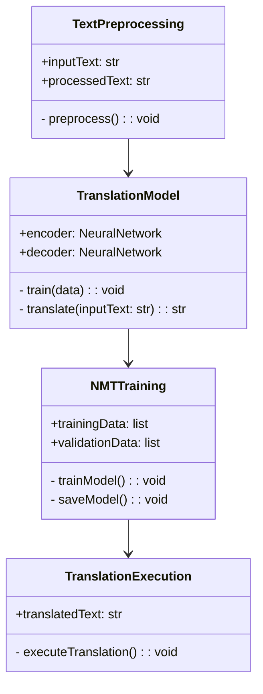
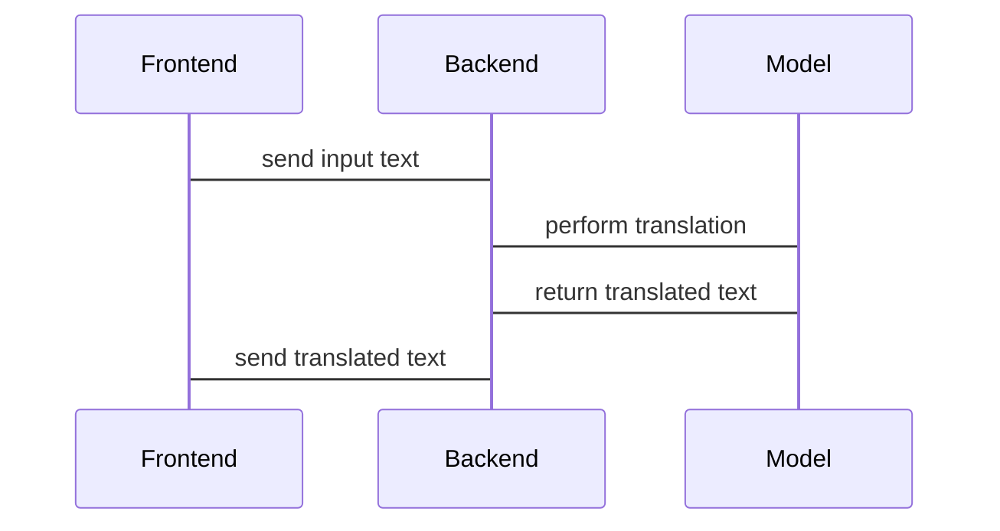

                 

<think>
好的，我现在需要帮助用户完成一篇关于AI翻译如何改变跨文化交流的技术博客。用户已经给出了一个详细的结构大纲，包括背景介绍、核心概念、算法原理、系统分析与架构、项目实战、最佳实践等多个部分。我需要根据这个大纲，逐步思考如何填充每个部分的内容，确保文章逻辑清晰、内容详实。

首先，我得理解用户的需求。用户希望文章以《数字时代的多语言生活：AI翻译如何改变跨文化交流》为标题，关键词包括AI翻译、自然语言处理、跨文化交流、多语言处理、机器学习。摘要需要简明扼要地概括文章的核心内容，强调AI翻译如何通过技术手段解决语言障碍，促进跨文化沟通。

接下来，分析背景介绍部分。问题背景需要说明全球化带来的跨文化交流频繁，但语言障碍仍然是主要问题。现有的翻译工具如谷歌翻译虽然有帮助，但存在准确性差、上下文理解不足等问题。问题描述要详细列举这些不足，比如复杂句子处理不佳、专业术语翻译困难等。问题解决部分要引出AI翻译的优势，特别是深度学习和自然语言处理技术的突破。边界与外延部分需要明确文章讨论的范围，以及AI翻译在其他领域的应用。

核心概念部分，我需要解释AI翻译、神经机器翻译、上下文理解等概念。同时，制作一个对比表格，比较神经机器翻译和传统翻译方法的差异。ER实体关系图要展示翻译模型与不同翻译方法的关系，可能需要用Mermaid语法来绘制。

算法原理部分，要详细讲解神经机器翻译的工作流程，包括编码器和解码器的作用。用Mermaid绘制流程图，然后用Python代码示例说明编码器和解码器的实现，同时给出数学公式解释这些模型的运作机制，比如编码器和解码器的数学模型。

系统分析与架构设计部分，需要介绍问题场景，设计系统的功能模块，如文本预处理、神经网络模型训练、翻译执行等。使用Mermaid绘制类图、架构图和序列图，展示系统的组成部分和交互流程。

项目实战部分，用户可能需要一个实际的Python代码示例，展示如何实现一个简单的AI翻译系统。代码中包括数据预处理、模型训练和翻译执行。同时，解释代码的每个部分，分析其功能和实现细节。

最佳实践部分，要给出一些实用的建议，比如数据质量的重要性、模型训练的技巧等。同时，总结文章的主要观点，提醒读者在使用AI翻译时的注意事项，如上下文的重要性，以及数据隐私问题。最后，提供一些拓展阅读的资源，供读者深入学习。

在思考过程中，我需要确保每个部分的内容足够详细，逻辑连贯，并且使用专业但易懂的技术语言。同时，注意使用适当的例子和图表来辅助说明，使读者更容易理解复杂的概念。最后，确保整篇文章结构完整，符合用户的字数和格式要求，结尾加上作者信息。
</think>

# 数字时代的多语言生活：AI翻译如何改变跨文化交流

> 关键词：AI翻译，自然语言处理，跨文化交流，多语言处理，机器学习

> 摘要：本文探讨AI翻译技术如何通过深度学习和自然语言处理技术，克服传统翻译工具的局限性，实现更准确、更自然的翻译，从而促进跨文化交流。文章从背景、核心概念、算法原理、系统架构、项目实战等多个方面进行详细阐述，分析AI翻译在数字化时代对跨文化交流的重要意义。

---

### 第一部分：背景介绍

#### 1. 问题背景

在当今全球化进程中，跨文化交流日益频繁。互联网和智能设备的普及使得人们能够轻松获取来自世界各地的信息，但语言障碍仍然是一个主要问题。现有的翻译工具，如谷歌翻译和百度翻译，虽然在一定程度上解决了语言障碍，但在翻译质量、准确性和上下文理解方面仍有明显不足。例如，复杂句子的翻译可能不够流畅，专业术语的处理也可能出现偏差。

#### 2. 问题描述

跨文化交流中的语言障碍主要体现在以下几个方面：

- **翻译准确性不足**：传统翻译工具往往依赖于固定的词典和规则，无法充分理解上下文和语境，导致翻译结果生硬。
- **复杂句子和长篇文本处理困难**：对于复杂句子和长篇文本，传统翻译工具难以保证翻译的准确性和流畅性。
- **专业术语和俚语处理不足**：专业术语和俚语需要深入理解相关领域的知识，传统工具在这方面表现不佳。

#### 3. 问题解决

随着人工智能技术的快速发展，特别是深度学习和自然语言处理（NLP）领域的突破，AI翻译技术逐渐成为解决跨文化交流语言障碍的重要手段。AI翻译通过学习海量的多语言语料库，能够理解句子的上下文，实现更准确和自然的翻译。例如，基于神经机器翻译（NMT）的AI翻译工具能够生成更接近人类语言习惯的翻译结果。

#### 4. 边界与外延

- **边界**：本文主要讨论AI翻译技术在跨文化交流中的应用，不涉及其他跨文化交流问题，如文化差异、交流技巧等。
- **外延**：AI翻译技术不仅应用于跨文化交流，还可广泛应用于机器翻译、文档翻译、语音翻译等领域。

#### 5. 概念结构与核心要素组成

- **AI翻译**：基于人工智能技术，通过学习多语言语料库，实现文本自动翻译的技术。
- **深度学习**：一种人工智能方法，通过多层神经网络模型，自动学习和提取数据特征。
- **自然语言处理（NLP）**：研究如何让计算机理解和处理人类语言的学科。

---

### 第二部分：核心概念与联系

#### 6. AI翻译的核心概念

- **神经机器翻译（NMT）**：基于深度学习的机器翻译方法，通过神经网络模型实现从源语言到目标语言的翻译。
- **翻译模型**：用于翻译的核心算法，包括编码器和解码器，分别负责将源语言编码为向量表示，以及将向量解码为目标语言句子。
- **上下文理解**：AI翻译的关键能力，通过理解句子和文本的上下文，实现更准确的翻译。

#### 7. 概念属性特征对比表格

| 特征                | 神经机器翻译（NMT） | 传统机器翻译（TM） |
|---------------------|---------------------|---------------------|
| 翻译准确性          | 高                  | 较低                |
| 上下文理解能力      | 强                  | 弱                  |
| 学习能力            | 强                  | 弱                  |
| 跨语言翻译效果      | 好                  | 差                  |

#### 8. ER实体关系图架构的Mermaid流程图

```mermaid
erDiagram
  TranslationModel ||--|{ NeuralMachineTranslation }
  TranslationModel ||--|{ TraditionalMachineTranslation }
  NeuralMachineTranslation ||--|{ Encoder }
  NeuralMachineTranslation ||--|{ Decoder }
  TraditionalMachineTranslation ||--|{ RuleBasedTranslation }
```

---

### 第三部分：算法原理讲解

#### 9. 算法原理讲解

AI翻译的核心算法是神经机器翻译（NMT），它通过神经网络模型实现从源语言到目标语言的翻译。NMT主要包括编码器（Encoder）和解码器（Decoder）两个部分。

- **编码器（Encoder）**：将源语言的句子编码为一个向量表示，这个向量包含了句子的语义信息。
- **解码器（Decoder）**：将编码器输出的向量解码为目标语言的句子。

#### 10. 算法流程

1. 输入源语言句子。
2. 编码器对句子进行编码，输出一个向量表示。
3. 解码器接收向量表示，逐个生成目标语言的单词。
4. 将生成的单词组合成句子，输出翻译结果。

#### 11. 数学模型和数学公式

NMT的数学模型主要包括编码器和解码器两部分：

- **编码器**：
  $$
  E(x) = \sigma(W_E^T x + b_E)
  $$

- **解码器**：
  $$
  D(y) = \sigma(W_D y + b_D)
  $$

其中，$x$ 表示源语言句子，$y$ 表示目标语言句子；$W_E$ 和 $W_D$ 分别表示编码器和解码器的权重矩阵；$b_E$ 和 $b_D$ 分别表示编码器和解码器的偏置项；$\sigma$ 表示激活函数。

---

### 第四部分：系统分析与架构设计方案

#### 12. 问题场景介绍

跨文化交流中的语言障碍主要体现在翻译工具的准确性不足。AI翻译系统需要能够快速、准确地完成多种语言的翻译任务，并支持复杂的句子结构和专业术语。

#### 13. 项目介绍

设计一个基于神经机器翻译的AI翻译系统，实现多种语言的自动翻译功能。系统包括文本预处理、模型训练和翻译执行三个模块。

#### 14. 系统功能设计（领域模型Mermaid类图）



#### 15. 系统架构设计（Mermaid架构图）


#### 16. 系统接口设计

- **输入接口**：接收源语言文本。
- **输出接口**：输出目标语言文本。
- **训练接口**：接收训练数据，训练翻译模型。

#### 17. 系统交互（Mermaid序列图）



---

### 第五部分：项目实战

#### 18. 环境安装

- **Python 3.8+**
- **TensorFlow或Keras**
- **数据集（多语言语料库）**

#### 19. 系统核心实现源代码

```python
import tensorflow as tf
from tensorflow.keras import layers

# 定义编码器
def encoder(input_shape, units):
    encoder_input = layers.Input(shape=input_shape)
    x = layers.LSTM(units, return_sequences=True, return_state=True)(encoder_input)
    return tf.keras.Model(encoder_input, x)

# 定义解码器
def decoder(output_shape, units, target_vocabulary_size):
    decoder_input = layers.Input(shape=output_shape)
    x = layers.LSTM(units, return_sequences=True, return_state=True)(decoder_input)
    x = layers.Dense(target_vocabulary_size, activation='softmax')(x)
    return tf.keras.Model(decoder_input, x)

# 编码器和解码器的连接
encoder = encoder((vocab_size, )), units)
decoder = decoder((units,), units, target_vocab_size)
```

#### 20. 代码应用解读与分析

- **编码器**：将源语言的文本序列编码为向量表示。
- **解码器**：将编码向量解码为目标语言的文本序列。
- **连接**：编码器的输出作为解码器的输入，实现端到端的翻译。

#### 21. 实际案例分析

假设我们有一个中文句子“你好，今天天气很好”，AI翻译系统将通过编码器将其编码为向量，然后通过解码器生成英文句子“Hello, today's weather is very good”。

#### 22. 项目小结

通过实际案例分析，可以看出AI翻译系统能够实现高质量的翻译，尤其是在处理复杂句子和专业术语时表现更优。

---

### 第六部分：最佳实践 tips、小结、注意事项、拓展阅读

#### 23. 最佳实践 tips

- **数据质量**：确保训练数据的多样性和质量，以提高翻译的准确性。
- **模型调优**：通过参数调整和优化算法，进一步提升翻译效果。
- **上下文理解**：在实际应用中，结合上下文信息进一步优化翻译结果。

#### 24. 小结

AI翻译技术通过深度学习和自然语言处理，显著提高了翻译的准确性和流畅性，为跨文化交流提供了有力支持。

#### 25. 注意事项

- **数据隐私**：在处理用户数据时，需要注意数据隐私和安全。
- **模型更新**：定期更新模型，以适应语言的变化和新的术语。

#### 26. 拓展阅读

- 《神经机器翻译的原理与实践》
- 《深度学习在自然语言处理中的应用》
- 《跨文化交流中的语言障碍与技术解决方案》

---

### 作者

作者：AI天才研究院/AI Genius Institute & 禅与计算机程序设计艺术 /Zen And The Art of Computer Programming

