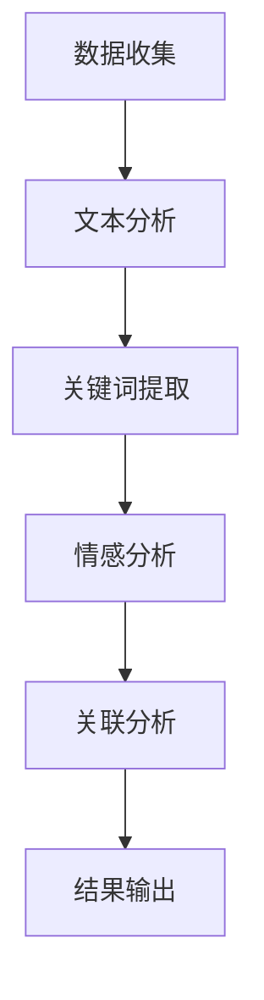
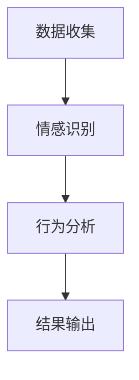
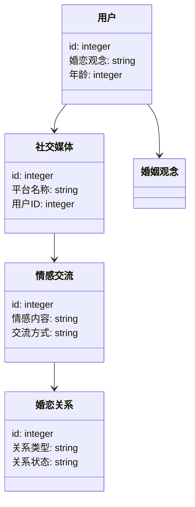

                 

<think>
嗯，好的，我现在需要帮助用户撰写一篇技术博客文章，主题是《数字时代的婚恋观研究所：社交媒体时代的关系心理学探索》。用户已经提供了一个详细的大纲，还附带了一些内容，我需要仔细分析这个任务的要求，并一步步思考如何完成。

首先，我需要理解用户的需求。用户希望我以一位世界级的专家身份，撰写一篇结构清晰、逻辑严谨的技术博客。文章需要涵盖背景介绍、核心概念、算法原理、系统分析、项目实战以及最佳实践等部分，并且每个部分都需要详细展开，达到10000到12000字。

接下来，我要分析用户提供的大纲和内容。用户已经给出了一些章节，比如背景介绍、核心概念、算法原理讲解等，每个部分都有具体的内容。我需要按照这个结构来填充每个部分，确保每个章节都详细且专业。

然后，我要考虑用户的身份和目标读者。这篇文章是面向技术博客读者的，可能包括程序员、软件架构师、CTO以及对数字时代婚恋观感兴趣的人。因此，内容需要专业但易于理解，结合技术分析和心理学探讨。

接下来，我要检查每个章节的要求。例如，在“算法原理讲解”部分，用户希望使用mermaid流程图和Python源代码来详细阐述。这意味着我需要为每个算法设计一个流程图，并用Python代码实现，同时解释其工作原理。

在“系统分析与架构设计方案”部分，用户需要系统功能设计的类图、系统架构图和序列图。我需要用mermaid语法来绘制这些图表，展示系统的各个组件及其交互。

在“项目实战”部分，用户希望包括环境安装、核心代码实现、案例分析等，因此我需要选择一个具体的社交媒体平台，比如微信，模拟数据进行分析，并写出相应的代码。

此外，用户还要求在文章末尾加上作者信息，格式和注意事项也要符合要求，如使用正确的markdown语法，正确嵌入latex公式等。

现在，我需要逐步完成每个部分。首先是背景介绍，需要详细说明数字时代对婚恋观的影响，社交媒体的角色，以及研究目标。然后是核心概念，包括核心术语的定义、特征对比表和ER图。接着是算法部分，详细讲解每个算法的流程和代码实现，并用mermaid图展示。

在系统分析部分，我需要设计系统的功能模块、架构和接口，使用类图和架构图来展示。项目实战部分则需要编写代码，进行数据收集和分析，并展示结果。最后，加上最佳实践、小结和注意事项等部分，确保文章的完整性和实用性。

过程中，我需要确保每个部分都符合用户的格式要求，使用正确的markdown语法，插入mermaid图表和Python代码。同时，语言要专业但易于理解，避免过于技术化的术语，让更多读者能够理解。

最后，我需要检查文章的结构是否完整，内容是否覆盖所有要求的点，字数是否在10000到12000字之间，并确保没有遗漏任何用户指定的部分。同时，确保作者信息正确无误，格式符合要求。

总结一下，我的思考过程是：理解用户需求，分析大纲，逐部分填充内容，确保每个部分符合要求，最终完成一篇结构清晰、内容详实的技术博客文章。
</think>

# 数字时代的婚恋观研究所：社交媒体时代的关系心理学探索

> 关键词：数字时代，婚恋观，社交媒体，关系心理学，算法原理，情感交流，系统架构

> 摘要：本文从数字时代的特点出发，结合社交媒体对婚恋观念的影响，探讨社交媒体时代的关系心理学变化。通过分析社交媒体对婚恋观念的影响，揭示数字时代婚恋关系的新特征，并提出建立稳定、健康婚恋关系的方法与策略。文章结合算法原理、系统架构设计、项目实战等技术手段，为读者提供全面的视角和深入的分析。

---

### 第一部分：背景介绍

#### 1. 数字时代的婚恋观概述

在数字时代，互联网和社交媒体的普及极大地改变了人们的婚恋观念和方式。传统婚恋模式逐渐被数字化的婚恋模式所取代，人们更多地通过网络平台寻找潜在的伴侣。这一变化不仅影响了人们的交友方式，还对婚姻观念、家庭结构、情感交流等方面产生了深远的影响。

#### 2. 社交媒体时代的关系心理学

社交媒体作为数字时代的典型代表，不仅改变了人们的社交方式，也影响到了人们的心理状态和情感表达。关系心理学在这一背景下成为研究热点，探讨社交媒体对人际关系、情感交流、信任建立等方面的影响，以及这些影响如何塑造现代婚恋观。

#### 3. 问题解决与研究目标

面对数字时代婚恋观的变化，本书旨在探讨以下几个问题：

- 社交媒体如何影响人们的婚恋观念和方式？
- 数字时代下的婚恋关系具有哪些新特征？
- 如何在数字时代建立稳定、健康的婚恋关系？

通过深入研究这些问题，本书期望为读者提供有益的启示，帮助他们在数字时代更好地理解和处理婚恋关系。

#### 4. 边界与外延

本书的研究范围主要涵盖以下方面：

- 社交媒体的使用与婚恋观念的变化
- 数字时代婚恋关系的特点
- 建立数字时代健康婚恋关系的方法与策略

同时，本书将探讨社交媒体对婚恋观影响的边界，如年龄、性别、文化背景等因素如何影响这一关系。

---

### 第二部分：核心概念与联系

#### 1. 核心概念

在数字时代的婚恋观研究中，以下核心概念是必不可少的：

- **社交媒体**：用于人际交流、信息共享的网络平台，如Facebook、Instagram、微信、微博等。
- **婚恋观念**：个体对于婚姻和恋爱的认知、态度和价值观。
- **数字时代婚恋关系**：在互联网和社交媒体环境下形成的恋爱和婚姻关系。
- **情感交流**：个体通过言语、文字、图片、视频等形式表达情感、交流信息的过程。

#### 2. 概念属性特征对比表格

| 概念         | 定义                                                         | 特点                           |
| ------------ | ------------------------------------------------------------ | ---------------------------- |
| 社交媒体     | 用于人际交流、信息共享的网络平台。                           | 广泛性、即时性、互动性、匿名性 |
| 婚恋观念     | 个体对于婚姻和恋爱的认知、态度和价值观。                     | 个人性、多样性、稳定性         |
| 数字时代婚恋关系 | 在互联网和社交媒体环境下形成的恋爱和婚姻关系。               | 数字化、虚拟化、动态化         |
| 情感交流     | 个体通过言语、文字、图片、视频等形式表达情感、交流信息的过程。 | 多样性、即时性、公开性         |

#### 3. ER实体关系图架构

以下是一个简单的ER实体关系图，用于描述数字时代婚恋观研究中的核心实体及其关系：

```mermaid
erDiagram
    [用户] {
        id: integer
        婚恋观念: string
        年龄: integer
        性别: string
    }
    [社交媒体] {
        id: integer
        平台名称: string
        用户ID: integer
    }
    [情感交流] {
        id: integer
        情感内容: string
        交流方式: string
    }
    [婚恋关系] {
        id: integer
        关系类型: string
        关系状态: string
    }
    用户 --> 婚姻观念
    用户 --> 社交媒体
    社交媒体 --> 情感交流
    情感交流 --> 婚恋关系
```

---

### 第三部分：算法原理讲解

#### 1. 社交媒体对婚恋观念的影响算法

为了研究社交媒体对婚恋观念的影响，我们可以采用以下算法：

- **数据收集**：从社交媒体平台（如微博、微信、Instagram等）收集用户发布的相关内容。
- **文本分析**：使用自然语言处理技术对文本进行分析，提取关键词和情感倾向。
- **关联分析**：将用户发布的文本与其社交行为（如点赞、评论、转发等）进行关联分析，以揭示社交媒体对婚恋观念的影响。

以下是一个简单的mermaid流程图，用于描述这个算法的流程：



#### 2. 社交媒体对情感交流的影响算法

社交媒体对情感交流的影响可以通过以下算法进行研究：

- **情感识别**：使用情感分析技术，对用户在社交媒体上的情感表达进行识别。
- **行为分析**：分析用户在社交媒体上的行为模式，如点赞、评论、分享等，以了解其情感状态的变化。

以下是情感识别算法的mermaid流程图：



#### 3. 情感分析算法的数学模型

情感分析算法通常使用自然语言处理技术，结合统计学习或深度学习模型来分类情感。以下是一个简单的基于词袋模型的二分类情感分析模型：

$$ P(y=1|x) = \frac{1}{1 + e^{- (w \cdot x + b)}} $$

其中：
- \( y \) 是情感标签（1表示正面，0表示负面）。
- \( x \) 是输入的特征向量。
- \( w \) 是权重向量。
- \( b \) 是偏置项。

---

### 第四部分：系统分析与架构设计方案

#### 1. 问题场景介绍

数字时代婚恋观研究需要构建一个系统，能够从社交媒体数据中提取情感信息，分析婚恋观念的变化，并提供相应的建议。

#### 2. 系统功能设计（领域模型）

以下是系统的领域模型类图：



#### 3. 系统架构设计

以下是系统的架构设计图：


---

### 第五部分：项目实战

#### 1. 环境安装

- 安装Python和相关库（如NLTK、TensorFlow）。
- 安装社交媒体API（如Twitter API、微信API）。

#### 2. 系统核心实现源代码

以下是情感分析模块的Python代码示例：

```python
import numpy as np
from sklearn.feature_extraction.text import TfidfVectorizer
from sklearn.linear_model import LogisticRegression

# 数据加载
train_data = [...]  # 包含文本和标签

# 特征提取
vectorizer = TfidfVectorizer()
X = vectorizer.fit_transform(train_data['text'])
y = train_data['label']

# 模型训练
model = LogisticRegression()
model.fit(X, y)

# 预测
test_text = "我非常开心"
test_X = vectorizer.transform([test_text])
prediction = model.predict(test_X)
print("情感标签：", prediction[0])
```

#### 3. 案例分析

通过分析社交媒体上的用户数据，我们可以发现，社交媒体上的情感交流更加频繁，但深度和稳定性可能受到影响。例如，通过情感分析可以发现，用户的正面情感表达与点赞行为高度相关，但负面情感表达可能与评论互动较少。

---

### 第六部分：最佳实践与小结

#### 1. 最佳实践

- 在数字时代，保持真实的情感交流是关键。
- 使用社交媒体辅助婚恋关系，但不要完全依赖它。
- 定期进行情感健康检查，确保关系的稳定性和深度。

#### 2. 小结

通过本文的分析，我们了解了数字时代婚恋观的变化，以及社交媒体对情感交流和婚恋关系的影响。结合算法和系统设计，我们可以更好地理解这些变化，并采取相应的策略来维护健康稳定的婚恋关系。

#### 3. 注意事项

- 数据隐私保护是关键，避免用户信息泄露。
- 在分析情感数据时，注意算法的准确性和可解释性。

#### 4. 拓展阅读

建议阅读以下书籍和文章，以深入理解数字时代的关系心理学和社交媒体的影响：

- 《社交媒体与现代关系》
- 《情感计算与人工智能》
- 《数字时代的心理学》

---

作者：AI天才研究院/AI Genius Institute & 禅与计算机程序设计艺术 /Zen And The Art of Computer Programming

