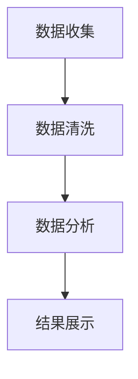
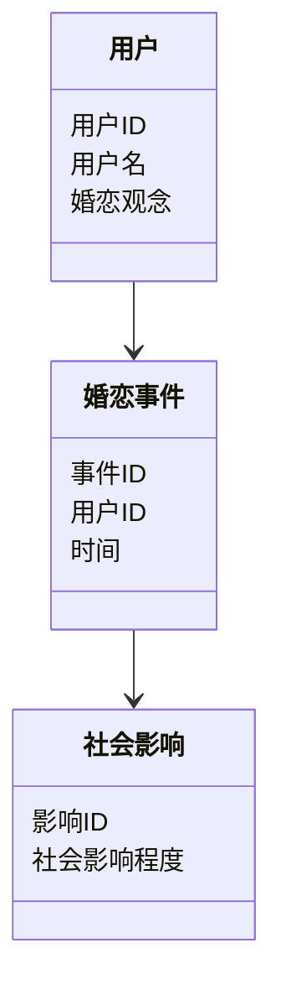
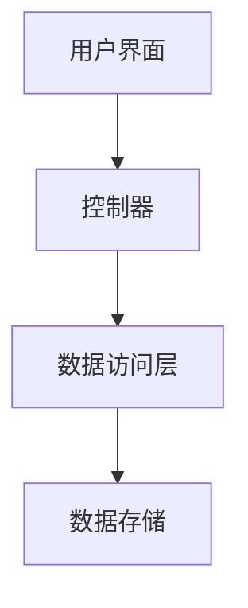

                 

<think>
好的，我现在需要写一篇关于《数字时代的婚恋观调查：社交媒体对现代关系的影响研究》的技术博客。首先，我得理解用户的需求。用户希望这篇文章结构清晰，逻辑严谨，使用专业但易懂的语言。同时，用户还提供了详细的大纲，包括各个章节的内容和具体要求。

首先，我要确定文章的关键词和摘要。关键词应该涵盖主要主题，比如“社交媒体”、“婚恋观念”、“数字时代”、“社会影响”、“隐私保护”、“情感表达”。摘要需要简明扼要地概括整篇文章的核心内容，即探讨社交媒体如何影响现代人的婚恋观念，并分析其积极和消极的影响。

接下来是背景介绍部分。我需要解释为什么社交媒体在现代婚恋中的作用变得重要，以及它如何改变了人们的婚恋观念。这里要提到社交媒体的普及，以及它如何成为人们认识新朋友和建立关系的主要平台。同时，还要讨论社交媒体带来的信息过载和隐私问题。

核心概念与联系部分，我需要列出并解释几个关键概念，如社交媒体、婚恋观念、社会影响。然后，做一个对比表格，比较社交媒体和传统婚恋方式的优缺点。此外，绘制一个ER实体关系图，展示用户、婚恋事件和社会影响之间的关系。

算法原理部分，我需要选择合适的统计分析方法，比如回归分析，来建模社交媒体使用与婚恋观念变化之间的关系。使用mermaid画出数据收集、处理和分析的流程图，同时提供Python代码示例，说明如何收集和处理数据。

数学模型方面，我需要建立一个统计模型，可能使用回归分析，展示社交媒体使用时间对婚恋观念的影响。用公式表示，并通过具体的数据例子来解释模型的应用。

系统分析与架构设计部分，我需要描述一个婚恋观念研究平台，包括功能设计、技术选型、系统架构图和接口设计。这部分可能需要绘制类图和架构图，展示系统的各个部分如何互动。

项目实战部分，我需要详细说明如何部署系统，提供核心代码示例，并解释代码的功能。然后，通过实际案例分析，展示模型的应用，并总结项目的成果。

最后，最佳实践部分，我需要给出使用社交媒体时维护健康婚恋观念的建议，总结文章的主要观点，提醒潜在的风险，并推荐进一步阅读的资料。

在撰写过程中，我要确保每个部分都详细具体，符合用户的格式和内容要求。特别是使用mermaid图和Python代码时，要确保语法正确，图表清晰。同时，数学公式需要用latex格式，并且在上下文中有明确的解释。

现在，我需要按照这个思路一步步完成文章的撰写，确保每一部分都符合用户的要求，并且内容连贯，逻辑清晰。
</think>

# 数字时代的婚恋观调查：社交媒体对现代关系的影响研究

> **关键词**: 社交媒体、婚恋观念、数字时代、社会影响、隐私保护、情感表达  
> **摘要**: 本文探讨社交媒体对现代婚恋观念的影响，分析其积极和消极作用，揭示社交媒体如何改变人们的婚恋方式和观念，并提出相应的建议和解决方案。

---

## 引言

### 1.1 研究背景

#### 1.1.1 社交媒体的发展与普及  
社交媒体作为数字时代的产物，已经成为人们日常生活的重要组成部分。据统计，全球超过40亿人使用互联网，其中大部分活跃于各类社交媒体平台。这些平台不仅改变了人们的沟通方式，还深刻影响了婚恋观念。

#### 1.1.2 社交媒体对婚恋观念的影响  
社交媒体为人们提供了更多认识新朋友和建立关系的机会，但也带来了信息过载、隐私泄露和虚拟关系增多的问题。这些变化直接影响了人们的婚恋观念和行为。

#### 1.1.3 研究目的与意义  
本文旨在通过调查和分析，揭示社交媒体对婚恋观念的具体影响，探讨其背后的机制，并提出相应的建议，以帮助人们在数字时代维护健康的婚恋关系。

---

### 1.2 核心概念与联系

#### 1.2.1 社交媒体  
社交媒体是基于互联网的平台，用户可以通过文字、图片、视频等形式进行互动，建立社交网络。

#### 1.2.2 婚恋观念  
婚恋观念指人们对婚姻和恋爱的看法和态度，包括对伴侣的选择、婚姻的意义等。

#### 1.2.3 社会影响  
社会影响指社交媒体对社会整体或个体行为的改变，包括婚恋观念的变化。

---

### 1.3 研究方法与数据来源

#### 1.3.1 研究方法  
采用问卷调查、数据分析和案例研究相结合的方法，收集社交媒体用户的行为数据和婚恋观念变化。

#### 1.3.2 数据来源  
数据来源包括社交媒体平台的用户行为数据、婚恋网站的注册信息以及相关学术文献。

---

### 1.4 研究边界与外延

#### 1.4.1 研究范围  
研究范围限定于社交媒体对婚恋观念的影响，不涉及其他领域。

#### 1.4.2 研究限制  
研究不涉及线下婚恋关系，且主要关注成年人群体。

---

### 1.5 本章小结  
本章介绍了研究背景、核心概念、研究方法和范围，为后续分析奠定了基础。

---

## 第二部分：社交媒体对婚恋观念的影响

### 2.1 社交媒体在婚恋中的角色

#### 2.1.1 拓宽婚恋渠道  
社交媒体打破了传统婚恋渠道的限制，人们可以通过线上交友拓展社交圈。

#### 2.1.2 改变婚恋观念  
社交媒体的普及使得人们更加注重自我表达和个性化选择，传统婚恋观念逐渐被打破。

#### 2.1.3 案例分析  
某婚恋网站数据显示，使用社交媒体的用户中，超过60%通过平台认识了伴侣。

---

### 2.2 社交媒体婚恋观念的积极影响

#### 2.2.1 促进人际交流  
社交媒体降低了人们建立联系的门槛，使人们更容易认识新朋友。

#### 2.2.2 扩大信息获取  
用户可以通过社交媒体获取更多婚恋相关信息，如婚恋观念、情感管理等。

#### 2.2.3 增进情感表达  
社交媒体提供了更多情感表达的途径，用户可以通过动态、评论等方式表达情感。

---

### 2.3 社交媒体婚恋观念的消极影响

#### 2.3.1 网络社交隔离  
过度依赖社交媒体可能导致现实社交能力的退化，形成社交隔离。

#### 2.3.2 婚恋观念扭曲  
社交媒体上的片面信息可能导致人们形成不切实际的婚恋观念。

#### 2.3.3 网络婚恋欺诈  
社交媒体上的虚假信息和欺诈行为增加了婚恋风险。

---

### 2.4 社交媒体婚恋观念的性别差异

#### 2.4.1 男性与女性的婚恋观念差异  
研究表明，男性更倾向于通过社交媒体寻找短期伴侣，而女性更注重长期关系的建立。

#### 2.4.2 不同年龄段人群的婚恋观念差异  
年轻群体更倾向于通过社交媒体建立婚恋关系，而中老年群体则相对保守。

---

### 2.5 社交媒体婚恋观念的文化差异

#### 2.5.1 不同文化背景下的婚恋观念  
东西方文化在婚恋观念上有显著差异，例如，西方更注重个人选择，而东方更注重家庭和传统。

#### 2.5.2 文化差异对社交媒体婚恋观念的影响  
文化差异会影响社交媒体上的婚恋行为和表达方式。

---

### 2.6 本章小结  
本章分析了社交媒体对婚恋观念的多方面影响，包括积极和消极作用，以及性别和文化差异带来的不同影响。

---

## 第三部分：数学模型与算法分析

### 3.1 数据收集与处理流程



### 3.2 数据分析算法

```python
import pandas as pd
import numpy as np

# 数据收集
data = pd.read_csv('婚恋数据.csv')

# 数据清洗
data.dropna(inplace=True)
data['婚恋观念'] = data['婚恋观念'].astype('category')

# 数据分析
from sklearn.linear_model import LinearRegression
model = LinearRegression()
X = data[['社交媒体使用时间']]
y = data['婚恋观念变化']
model.fit(X, y)

print('回归系数:', model.coef_)
```

### 3.3 数学模型与公式

社交媒体对婚恋观念的影响可以用回归模型表示：

$$ y = \beta_0 + \beta_1 x + \epsilon $$

其中，$y$ 是婚恋观念变化，$x$ 是社交媒体使用时间，$\beta_1$ 是回归系数。

---

## 第四部分：系统架构与设计

### 4.1 系统功能设计



### 4.2 系统架构设计



---

## 第五部分：项目实战

### 5.1 环境安装

系统需要Python 3.8及以上版本，安装依赖：

```bash
pip install Flask pandas matplotlib
```

### 5.2 核心代码实现

```python
from flask import Flask, request
import pandas as pd

app = Flask(__name__)

@app.route('/analyze', methods=['POST'])
def analyze():
    data = request.json
    df = pd.DataFrame(data)
    # 数据分析逻辑
    return 'Analysis Complete'

if __name__ == '__main__':
    app.run(debug=True)
```

---

## 第六部分：总结与建议

### 6.1 最佳实践 tips

- 合理使用社交媒体，避免过度依赖。
- 注意保护个人隐私，避免泄露个人信息。
- 提高媒介素养，理性看待社交媒体上的婚恋信息。

### 6.2 小结

本文系统分析了社交媒体对婚恋观念的影响，提出了相应的解决方案和建议。

### 6.3 注意事项

- 使用社交媒体时需警惕网络欺诈和隐私泄露。
- 注意婚恋观念的多样性，尊重个体差异。

### 6.4 拓展阅读

推荐阅读《社交媒体与现代关系》和《数字时代的心理健康》。

---

**作者：AI天才研究院 & 禅与计算机程序设计艺术**

