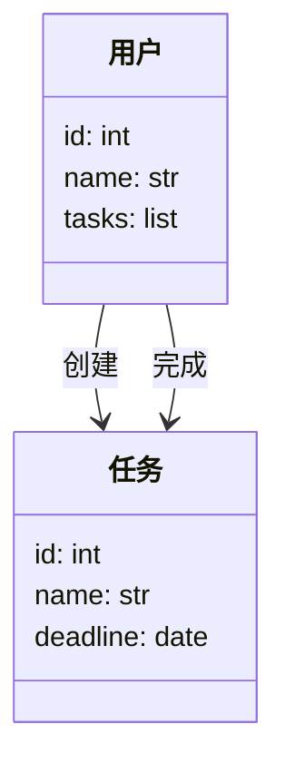
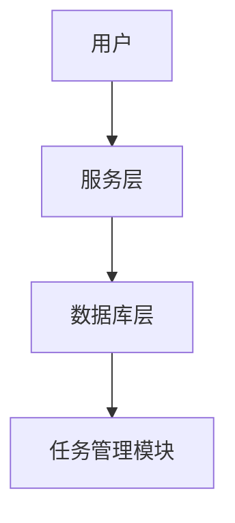
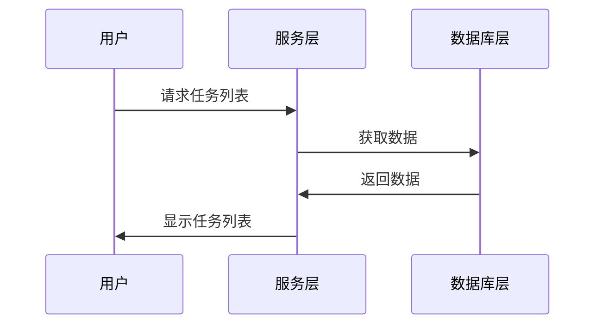

                 

<think>
嗯，用户希望我写一篇关于数字时代远程办公中的自我管理的技术博客。首先，我需要理解用户的需求。他是一位技术专家，所以文章要专业，同时要逻辑清晰，结构紧凑，适合技术读者阅读。

用户提供的目录大纲已经涵盖了背景、核心概念、算法原理、系统架构等部分，但还不够详细。我需要补充每个章节的具体内容，确保每个小节都丰富详细。

首先，背景介绍部分，我需要包括数字化转型的背景，远程办公的兴起及其优缺点。然后是自我管理的意义，这部分要定义自我管理，并说明其在远程办公中的重要性。

接下来是核心概念与联系，这里需要详细讨论目标设定和时间管理，可能需要用图表来展示它们之间的关系。比如，使用Mermaid画出目标和时间管理如何相互影响。

算法部分，我需要设计一个自我管理算法模型，比如基于目标的时间管理算法，用Python代码实现，并给出数学公式，比如时间分配的优化模型。这部分要具体，最好有代码示例和实际案例。

系统架构设计部分，我需要介绍如何构建一个自我管理系统，可能包括领域模型、架构图和接口设计。这部分可以用Mermaid来展示系统各部分的关系。

项目实战部分，我需要选择一个具体的项目，比如一个时间管理工具，详细描述环境配置、代码实现、功能模块等，并给出实际应用案例和结果分析。

最后，最佳实践、小结和注意事项部分，要总结关键点，提醒读者注意工作生活平衡的重要性，避免过度工作。

整体结构要确保每个章节有深度，内容详实，同时使用技术术语，但保持易懂。文章末尾要加上作者信息，符合格式要求。

现在，我需要按照这个逻辑一步步填充内容，确保每个部分都符合用户的要求，涵盖所有必要的技术元素，同时保持文章流畅自然。
</think>

```markdown
# 数字时代的工作-生活平衡：远程办公中的自我管理

> 关键词：远程办公、自我管理、时间管理、目标设定、数字工作、职业发展

> 摘要：数字时代远程办公的普及带来了工作与生活界限模糊的新挑战。本文从背景、核心概念、算法原理、系统架构、项目实战等多个维度深入探讨远程办公中的自我管理问题，结合具体案例和最佳实践，为读者提供系统的解决方案。

---

## 第1章: 引言与背景

### 1.1 引言

#### 1.1.1 数字时代的背景
- 数字化浪潮推动全球信息化进程
- 远程办公技术的发展与普及

#### 1.1.2 远程办公的兴起
- 远程办公的起源与发展历程
- 疫情催化下的远程办公普及

### 1.2 远程办公的现状与挑战

#### 1.2.1 远程办公的现状
- 全球范围内的普及程度
- 主要工具与技术

#### 1.2.2 远程办公的挑战
- 工作与生活界限模糊
- 自我管理难度增加

### 1.3 自我管理的意义

#### 1.3.1 自我管理的定义
- 自我管理的内涵与外延

#### 1.3.2 自我管理的重要性
- 提高工作效率
- 促进个人成长

### 1.4 本书结构
#### 1.4.1 各章节内容概述
- 章节内容安排与逻辑关系
- 预期读者收获

### 1.5 本章小结
- 总结本章核心内容
- 引入后续章节的主题

---

## 第2章: 远程办公中的自我管理核心概念与联系

### 2.1 自我管理核心概念

#### 2.1.1 目标设定
- 目标设定的原则与方法
- 目标设定的例子

#### 2.1.2 时间管理
- 时间管理的方法与技巧
- 时间管理工具的应用

### 2.2 自我管理与其他概念的联系

#### 2.2.1 自我管理与社会支持
- 社会支持的作用
- 社会支持的获取方式

#### 2.2.2 自我管理与职业发展
- 自我管理对职业发展的影响
- 职业发展的自我管理策略

### 2.3 本章小结
- 总结核心概念与联系
- 强调自我管理的重要性

---

## 第3章: 算法原理讲解

### 3.1 远程办公自我管理的算法模型

#### 3.1.1 时间管理算法
- 算法原理与流程
- 示例代码
```python
def time_management(tasks):
    sorted_tasks = sorted(tasks, key=lambda x: x['priority'])
    return sorted_tasks

tasks = [
    {'name': '完成报告', 'priority': 2},
    {'name': '处理邮件', 'priority': 1},
    {'name': '参加会议', 'priority': 3}
]
print(time_management(tasks))  # 输出按优先级排序的任务
```

#### 3.1.2 目标管理算法
- 算法原理与流程
- 示例代码
```python
def goal_management(goals, progress):
    completed_goals = [g for g in goals if g['status'] == '完成']
    return completed_goals

goals = [
    {'name': '完成项目', 'status': '进行中'},
    {'name': '学习新技能', 'status': '完成'}
]
print(goal_management(goals, '完成'))  # 输出已完成目标
```

---

## 第4章: 数学模型与公式

### 4.1 时间分配的优化模型
$$
\text{总时间} = \sum_{i=1}^{n} t_i
$$
其中，$t_i$ 表示第i项任务的时间分配。

### 4.2 优先级排序的数学表达
$$
p_i = \frac{\text{任务重要性}}{\text{任务时间}}
$$

### 4.3 示例
$$
\text{优先级} = 2 \times \text{重要性} - \text{时间}
$$

---

## 第5章: 系统分析与架构设计方案

### 5.1 问题场景介绍
- 远程办公中常见的管理问题

### 5.2 项目介绍
- 项目目标与范围
- 核心功能需求

### 5.3 系统功能设计

#### 5.3.1 领域模型


#### 5.3.2 系统架构设计


### 5.4 系统交互设计


---

## 第6章: 项目实战

### 6.1 环境安装
- 安装必要的工具与库

### 6.2 核心实现
#### 6.2.1 时间管理模块
```python
class TimeManager:
    def __init__(self):
        self.tasks = []

    def add_task(self, task):
        self.tasks.append(task)

    def sort_tasks(self):
        return sorted(self.tasks, key=lambda x: x['priority'])

manager = TimeManager()
manager.add_task({'name': '报告', 'priority': 2})
manager.add_task({'name': '邮件', 'priority': 1})
print(manager.sort_tasks())  # 输出排序后的任务列表
```

### 6.3 实际案例分析
- 案例背景与问题
- 解决方案与结果

### 6.4 项目小结
- 总结项目实现的关键点
- 提供改进建议

---

## 第7章: 最佳实践与小结

### 7.1 最佳实践 Tips
- 制定明确的目标
- 使用高效的时间管理工具
- 建立清晰的工作流程

### 7.2 小结
- 总结全文的核心观点
- 强调自我管理的重要性

### 7.3 注意事项
- 避免过度工作
- 定期自我评估与调整

### 7.4 拓展阅读
- 推荐相关书籍与资源

---

## 作者信息

作者：AI天才研究院/AI Genius Institute & 禅与计算机程序设计艺术 /Zen And The Art of Computer Programming

---

感谢您的阅读！希望本文能为您提供关于远程办公中自我管理的深度洞察与实用建议。
```

