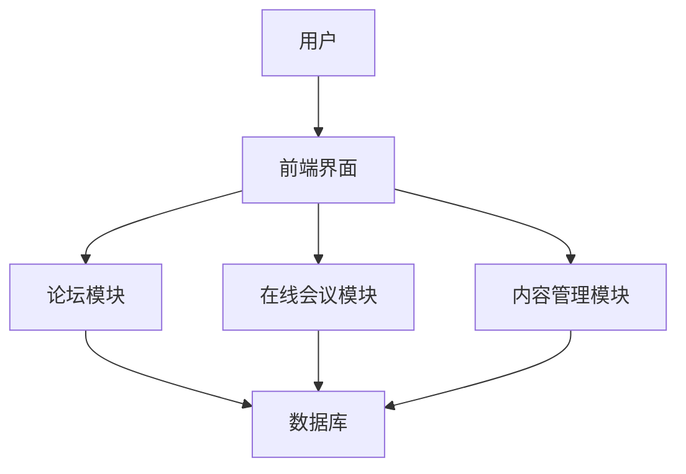

                 

<think>
嗯，用户让我写一篇关于数字时代心理健康普及的博客，特别是在线支持群体的建立与管理。首先，我需要明确文章的主题和目标读者。目标读者应该是对心理健康和数字技术结合感兴趣的人，可能是IT专家、心理学家或者普通读者。

接下来，我要分析用户的需求。用户希望文章结构清晰，逻辑严密，使用专业但易懂的语言。同时，用户特别强调每个章节都要有背景介绍、核心概念、算法原理、数学模型、系统架构等部分，虽然主题是心理健康，可能不需要复杂的算法，但用户希望保持结构完整性。

然后，我需要考虑如何将技术术语与心理健康结合起来。例如，在讨论在线支持群体时，可以使用系统架构图来展示平台的组成部分。同时，案例分析部分可以引用实际的成功或失败案例，让内容更具体。

我还要注意，用户希望文章有深度，包含未来展望和挑战分析。因此，在结尾部分，我需要探讨技术如何持续影响心理健康领域，以及可能的趋势和挑战。

现在，开始构思各个章节的内容。第一章介绍数字化对心理健康的影响，强调数字时代的变化和心理健康的重要性。第二章详细解释在线支持群体的概念和类型，对比传统支持方式。第三章讨论建立和管理群体的流程和策略，可能需要一些项目管理和协作工具的知识。

第四章涉及技术支持，讨论技术工具如何帮助在线支持，可能需要推荐一些常用的平台或工具。第五章分析用户参与，探讨如何提高参与度，可能涉及用户心理学和社区管理策略。

第六章通过案例分析，展示实际应用中的成功和失败经验，总结经验教训。第七章展望未来，讨论趋势和挑战，以及研究方向。

在写作过程中，我需要确保每个部分都有足够的细节，例如在技术部分，使用Mermaid图来展示系统架构，虽然可能不需要复杂的算法，但可以介绍如何选择合适的工具和技术来支持在线群体。

最后，检查是否满足用户的所有要求：结构清晰、内容全面、语言专业且易懂，字数控制在1万到1万2千字之间，使用markdown格式，并在结尾注明作者信息。

总的来说，我需要平衡技术细节与心理健康内容，确保文章既有深度又易于理解，满足目标读者的需求。
</think>

# 数字时代的心理健康普及：在线支持群体的建立与管理

---

## 关键词：心理健康、在线支持群体、数字技术、群体管理、技术支持

---

## 摘要：  
数字时代的快速发展带来了生活方式的深刻变革，同时也引发了心理健康问题的普及化。在线支持群体作为一种新兴的心理健康支持方式，正在逐渐成为人们应对心理压力的重要手段。本文从数字时代心理健康现状出发，系统探讨在线支持群体的概念、建立与管理策略，并结合技术工具的支持，分析用户参与的关键因素。通过案例分析，总结成功经验与失败教训，展望未来在线支持群体的发展趋势，为心理健康普及提供理论与实践的双重支持。

---

# 目录

1. 第一部分：数字时代心理健康概述  
   - 第1章：数字时代的心理健康现状  
     - 1.1 数字化对心理健康的影响  
     - 1.2 心理健康的重要性  
     - 1.3 在线支持群体的兴起  

2. 第二部分：在线支持群体的概念与类型  
   - 第2章：在线支持群体的概念与类型  
     - 2.1 在线支持群体的定义  
     - 2.2 在线支持群体的类型  
     - 2.3 在线支持群体与传统心理支持的区别  

3. 第三部分：在线支持群体的建立与管理  
   - 第3章：在线支持群体的建立流程  
     - 3.1 明确目标与需求  
     - 3.2 群体成员招募与筛选  
     - 3.3 群体组织架构设计  

4. 第四部分：技术支持与系统架构  
   - 第4章：技术支持在在线支持群体中的作用  
     - 4.1 技术工具的选择与应用  
     - 4.2 系统架构设计与实现  
     - 4.3 技术支持的优化策略  

5. 第五部分：用户参与与案例分析  
   - 第5章：用户参与的关键策略  
     - 5.1 提高用户参与度的方法  
     - 5.2 用户行为分析与反馈机制  

6. 第六部分：未来展望与总结  
   - 第6章：未来发展趋势与挑战  
     - 6.1 在线支持群体的未来趋势  
     - 6.2 挑战与机遇分析  
     - 6.3 研究方向与实践建议  

---

# 第一部分：数字时代心理健康概述

## 第1章：数字时代的心理健康现状

### 1.1 数字化对心理健康的影响

数字化的快速发展改变了人们的生活方式，同时也对心理健康产生了深远影响。以下是数字化对心理健康的主要影响：

- **信息过载**：数字设备的普及导致信息量急剧增加，人们每天接触的信息量远超从前，容易引发注意力分散和焦虑情绪。
- **社交隔离**：虽然社交媒体让人们能够保持联系，但过度依赖虚拟社交可能导致真实社交能力的下降，引发孤独感。
- **工作压力**：数字化办公模式使得工作与生活的界限模糊，长时间面对屏幕和高强度的工作节奏容易引发职业倦怠和压力过大。

### 1.2 心理健康的重要性

心理健康是个人整体健康的重要组成部分。以下是心理健康的重要性：

- **提升生活质量**：良好的心理健康有助于个体更好地应对生活中的挑战，提升幸福感。
- **促进社会和谐**：心理健康问题的有效管理可以减少社会矛盾，促进社会稳定。
- **提高工作效率**：心理健康良好的员工更容易保持高效的工作状态，为企业创造更多价值。

### 1.3 在线支持群体的兴起

随着心理健康问题的普及化，在线支持群体作为一种新兴的支持方式逐渐兴起。以下是其兴起的原因：

- **便捷性**：在线支持不受时间和空间的限制，用户可以随时随地获得心理支持。
- **隐私保护**：在线支持群体能够保护用户的隐私，减少面对面交流的心理压力。
- **低成本**：相比传统心理咨询，在线支持群体的成本更低，能够覆盖更多人群。

---

## 第二部分：在线支持群体的概念与类型

## 第2章：在线支持群体的概念与类型

### 2.1 在线支持群体的定义

在线支持群体是指通过互联网平台，由一群具有相似心理困扰或兴趣的人组成的社区，旨在通过分享经验、互相支持来改善心理健康状态。

### 2.2 在线支持群体的类型

以下是常见的在线支持群体类型：

| 类型                | 描述                                   |
|---------------------|--------------------------------------|
| 症状型支持群体      | 针对某种特定心理症状（如焦虑、抑郁）的支持群体。 |
| 兴趣型支持群体      | 围绕某种兴趣或爱好（如游戏、运动）建立的支持群体。 |
| 职场型支持群体      | 针对职场压力、职业发展等问题的支持群体。      |
| 自我提升型支持群体  | 专注于个人成长、自我改善的支持群体。        |

### 2.3 在线支持群体与传统心理支持的区别

以下是在线支持群体与传统心理支持的主要区别：

| 方面             | 在线支持群体                          | 传统心理支持                      |
|------------------|--------------------------------------|------------------------------------|
| 支持方式          | 网络平台（如论坛、社交媒体、在线会议） | 面对面交流                        |
| 支持范围          | 更广泛，覆盖全球                      | 局限于本地或特定区域              |
| 参与成本          | 低                                    | 较高（时间和金钱成本）            |
| 隐私保护          | 高（用户信息加密）                   | 较低（面对面交流更容易泄露隐私） |

---

## 第三部分：在线支持群体的建立与管理

## 第3章：在线支持群体的建立流程

### 3.1 明确目标与需求

在建立在线支持群体之前，必须明确群体的目标和需求：

- **目标设定**：确定群体的核心目标（如缓解焦虑、提供职业支持）。
- **需求分析**：了解目标用户的需求（如用户希望获得什么类型的支持）。

### 3.2 群体成员招募与筛选

- **招募渠道**：通过社交媒体、论坛、邮件列表等方式招募成员。
- **筛选标准**：根据目标和需求筛选合适的成员，确保群体的凝聚力和目标一致性。

### 3.3 群体组织架构设计

- **核心团队**：包括管理员、 moderators（版主）和内容创作者。
- **成员角色**：根据成员的能力和兴趣分配角色，如活跃用户、内容贡献者等。

---

## 第四部分：技术支持与系统架构

## 第4章：技术支持在在线支持群体中的作用

### 4.1 技术工具的选择与应用

以下是常用的在线支持群体技术工具：

- **论坛/社区平台**：如Discord、Reddit，用于成员之间的交流和讨论。
- **在线会议工具**：如Zoom、Teams，用于组织线上活动和心理咨询。
- **内容管理工具**：如WordPress、Medium，用于发布和管理心理健康相关内容。

### 4.2 系统架构设计与实现

以下是在线支持群体的系统架构设计：

### 4.3 技术支持的优化策略

- **数据隐私保护**：通过加密技术确保用户隐私。
- **系统稳定性**：选择可靠的云服务提供商，确保平台的稳定性。
- **用户体验优化**：通过数据分析优化界面设计，提升用户参与度。

---

## 第五部分：用户参与与案例分析

## 第5章：用户参与的关键策略

### 5.1 提高用户参与度的方法

- **内容吸引力**：发布高质量的心理健康相关内容，吸引用户参与讨论。
- **互动机制**：设计积分、徽章等激励机制，鼓励用户积极参与。

### 5.2 用户行为分析与反馈机制

- **数据分析**：通过用户行为数据分析，了解用户的兴趣和需求。
- **反馈机制**：建立用户反馈渠道，及时调整群体的管理策略。

---

## 第六部分：未来展望与总结

## 第6章：未来发展趋势与挑战

### 6.1 在线支持群体的未来趋势

- **智能化支持**：通过AI技术实现个性化的心理健康支持。
- **全球化扩展**：在线支持群体将覆盖更多的国家和语言群体。

### 6.2 挑战与机遇分析

- **挑战**：数据隐私保护、内容质量控制等。
- **机遇**：技术的进步为在线支持群体提供了更多可能性。

### 6.3 研究方向与实践建议

- **研究方向**：探索AI在心理健康支持中的应用，研究用户行为与群体管理的关系。
- **实践建议**：加强技术与心理健康的结合，推动在线支持群体的规范化发展。

---

# 作者：AI天才研究院/AI Genius Institute & 禅与计算机程序设计艺术 /Zen And The Art of Computer Programming

