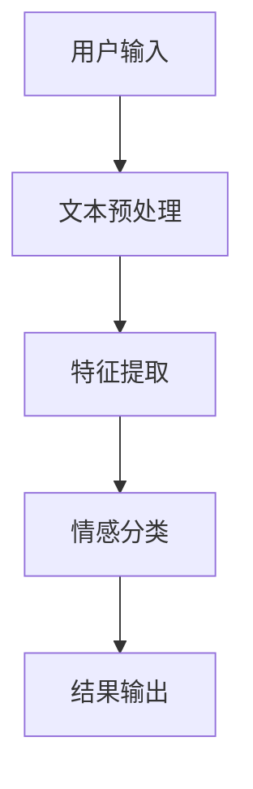
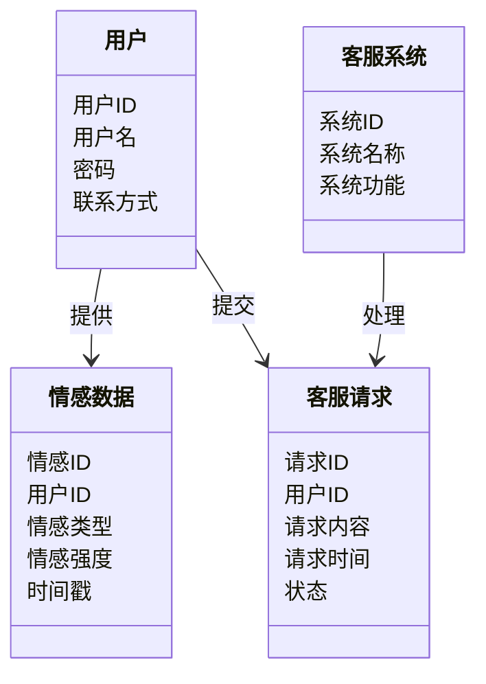

                 

<think>
好的，我现在要帮用户写一篇技术博客，主题是“数字时代的情感劳动：在线客服与人工智能的边界”。用户给了一个详细的结构大纲，还特别强调了要满足一些条件，比如章节内容要完整、详细，使用markdown格式，还有数学公式和mermaid图表的使用等等。

首先，我需要明确用户的需求。用户希望我以一位技术专家的身份，撰写一篇结构严谨、内容详实的技术博客，涵盖从背景介绍到系统分析、项目实战等多个部分。文章需要有摘要、关键词，以及各个章节的详细内容，每个部分都有具体要求，比如背景介绍里的核心概念、问题描述、问题解决等。

接下来，我应该先构建文章的整体结构，确保每个部分都覆盖到位。标题已经确定，是“数字时代的情感劳动：在线客服与人工智能的边界”。然后是关键词和摘要，这部分需要简明扼要地概括文章的核心内容，关键词可能包括在线客服、人工智能、情感劳动、情感识别、情感传递等。

在背景介绍部分，我需要详细解释问题背景、问题描述、问题解决、边界与外延，以及概念结构。这部分要让读者明白为什么在线客服与人工智能的结合在情感劳动方面存在挑战，以及如何解决这些问题。

然后是核心概念与联系部分，我需要定义核心概念，并制作对比表格和ER图，使用mermaid语法。这部分需要清晰地展示各个概念之间的关系，帮助读者理解。

接下来是算法原理讲解，我需要选择一个具体的情感识别算法，比如基于机器学习的SVM，用mermaid流程图展示算法步骤，并给出Python代码实现。这部分需要详细解释算法的数学模型，比如使用特征提取和分类器的构建，举一个简单的例子来说明。

系统分析与架构设计部分，我需要描述项目场景，设计系统功能模块，用mermaid类图展示领域模型，架构设计图展示系统的分层结构，接口设计和交互流程图。这部分要展示系统如何高效处理客户需求，同时保护用户隐私。

项目实战部分，需要详细指导环境安装，给出核心代码实现，并解读代码，分析实际案例，最后进行项目小结。这部分需要让读者能够实际操作，并理解代码的作用。

最后是最佳实践、小结、注意事项和拓展阅读部分，这部分要给读者提供实用的建议和进一步学习的方向。

在写作过程中，我需要确保每个部分都符合用户的要求，比如使用正确的格式、详细的讲解、具体的代码示例，以及数学公式的正确使用。同时，要保持文章的逻辑连贯，结构清晰，内容有深度，能够吸引并留住读者。

现在，我开始按照这个思路一步步构建文章，确保每个章节都符合用户的要求，并且内容丰富详细。特别是要注意使用正确的技术术语，确保文章的权威性和专业性，同时保持语言的简洁易懂，让不同层次的读者都能理解。
</think>

# 数字时代的情感劳动：在线客服与人工智能的边界

> 关键词：在线客服，人工智能，情感劳动，情感识别，情感传递，用户体验，数据隐私

> 摘要：  
> 在数字化时代，情感劳动逐渐成为在线客服领域的重要课题。随着人工智能技术的快速发展，企业开始尝试将AI技术应用于在线客服系统，以提高服务效率和客户满意度。然而，人工智能在处理情感交流时仍面临诸多挑战。本文将深入探讨在线客服与人工智能结合的情感劳动边界，分析情感识别与传递的技术难点，讨论个性化服务的实现策略，并提出未来的发展方向。

---

# 数字时代的情感劳动：在线客服与人工智能的边界

## 1. 背景介绍

### 1.1 问题背景

在数字化时代，企业的客户互动渠道正在发生深刻的变化。传统的电话客服正在被更加便捷的在线客服系统所取代。在线客服系统通过互联网为用户提供实时的文字、语音或视频交流服务，已成为企业与消费者之间的重要沟通桥梁。与此同时，人工智能（AI）技术的飞速发展为在线客服系统的智能化升级提供了可能。通过自然语言处理（NLP）、机器学习（ML）等技术，AI能够帮助客服系统更高效地处理大量客户请求，同时提供个性化的服务体验。

然而，在线客服的核心功能之一是处理客户的情感需求。客户在与客服系统交互时，可能处于愤怒、焦虑、喜悦或失望等情感状态。如何准确识别客户的情感，并在回应中传递恰当的情感，是在线客服系统面临的重大挑战。人工智能虽然在技术上取得了显著进步，但在情感识别和情感传递方面仍存在诸多不足。例如，AI可能无法准确理解用户的情感表达，或者在回应时无法有效传递情感，导致用户体验下降。

### 1.2 问题描述

在线客服系统在处理情感交流时，面临以下主要问题：

1. **情感识别的准确性不足**：用户的情感表达可能包含隐含的情绪或讽刺语气，AI系统可能无法准确识别这些复杂的情感。
2. **情感传递的自然性不足**：AI生成的回应可能显得机械和缺乏人性化，难以让客户感受到情感共鸣。
3. **个性化服务的实现难度**：不同客户可能有不同的情感需求，AI系统需要根据具体情境动态调整回应策略，这对现有的技术提出了更高的要求。

### 1.3 问题解决

为了解决上述问题，可以从以下几个方面进行探讨：

1. **优化情感识别技术**：通过引入更先进的自然语言处理技术，提高AI系统对用户情感表达的识别精度。
2. **设计情感传递策略**：研究如何在回应中融入情感元素，使客户感受到更自然和贴心的服务。
3. **实现个性化服务**：通过分析用户的行为和情感数据，为用户提供个性化的服务体验。

### 1.4 边界与外延

在线客服与人工智能的边界主要包括以下方面：

1. **技术实现**：涉及自然语言处理、机器学习、深度学习等技术。
2. **用户体验**：系统需要在满足功能需求的同时，提供良好的用户体验。
3. **数据隐私**：在利用用户数据进行情感分析时，必须确保数据的安全和隐私保护。

### 1.5 概念结构与核心要素组成

在线客服与人工智能的核心概念和要素包括：

1. **在线客服系统**：包括客户请求的接收、处理和反馈功能。
2. **人工智能技术**：用于实现情感识别、情感传递和个性化服务的技术。
3. **情感识别与理解**：通过分析用户语言和行为，识别其情感状态。
4. **情感传递策略**：根据识别到的情感，生成相应的回应，传递情感。
5. **用户行为分析**：收集和分析用户数据，为个性化服务提供支持。

---

## 2. 核心概念与联系

### 2.1 核心概念

1. **在线客服系统**：一种通过互联网为客户提供实时服务的系统，支持文字、语音和视频等多种交互方式。
2. **人工智能**：一种模拟人类智能的技术，涵盖机器学习、深度学习、自然语言处理等领域。
3. **情感识别与理解**：通过分析用户语言、语调和行为，识别其情感状态并理解其情感需求。
4. **情感传递**：在客服系统中，通过回应客户的方式传递特定情感，以提升用户体验。

### 2.2 概念属性特征对比表格

| 概念          | 属性特征                                                                                   | 对比分析                                                                                   |
|---------------|--------------------------------------------------------------------------------------------|---------------------------------------------------------------------------------------------|
| 在线客服系统  | - 实时交互<br>- 支持多渠道沟通<br>- 提供个性化服务 | 传统客服系统在效率和用户体验上存在不足，而在线客服系统通过技术手段显著提升了服务质量和效率。 |
| 人工智能      | - 数据驱动<br>- 自适应学习<br>- 高效处理复杂任务 | 人工智能能够处理海量数据，但在情感识别和传递方面仍需进一步优化。                       |
| 情感识别与理解 | - 分析语言和行为<br>- 识别情感类型<br>- 理解情感强度 | 情感识别是实现情感劳动的关键，但其准确性依赖于算法和数据的质量。                         |
| 情感传递      | - 回应客户的情感<br>- 调整语气和措辞<br>- 提供情感支持 | 情感传递直接影响用户体验，是实现情感劳动的重要环节。                                    |

### 2.3 ER实体关系图架构

```mermaid
er
classDiagram
    class 用户 {
        用户ID
        用户名
        密码
        联系方式
    }
    class 情感数据 {
        情感ID
        用户ID
        情感类型
        情感强度
        时间戳
    }
    class 客服请求 {
        请求ID
        用户ID
        请求内容
        请求时间
        状态
    }
    class 客服系统 {
        系统ID
        系统名称
        系统功能
    }
    用户 --> 情感数据: 提供
    用户 --> 客服请求: 提交
    客服系统 --> 客服请求: 处理
```

---

## 3. 算法原理讲解

### 3.1 情感识别算法

#### 3.1.1 算法流程



#### 3.1.2 算法实现

以下是一个基于支持向量机（SVM）的情感分类算法的Python实现：

```python
import numpy as np
from sklearn.svm import SVC
from sklearn.feature_extraction.text import TfidfVectorizer

# 示例数据
train_texts = [
    "I love this product!",
    "This service is terrible.",
    "Great job, I'm satisfied.",
    "I hate this company."
]
train_labels = [1, 0, 1, 0]

# 特征提取
vectorizer = TfidfVectorizer()
X = vectorizer.fit_transform(train_texts)

# 模型训练
model = SVC()
model.fit(X, train_labels)

# 测试数据
test_text = "The product is amazing!"
test_X = vectorizer.transform([test_text])
prediction = model.predict(test_X)
print("预测结果：", prediction)
```

#### 3.1.3 数学公式

情感分类算法中的TF-IDF计算公式：

$$
TF_{word} = \frac{\text{term count in document}}{\text{document length}}
$$

$$
IDF_{word} = \log\left( \frac{\text{total number of documents}}{\text{number of documents containing term}} \right)
$$

---

## 4. 系统分析与架构设计方案

### 4.1 问题场景介绍

假设我们正在设计一个在线客服系统，该系统需要支持情感识别和情感传递功能，同时提供个性化的客户服务。

### 4.2 系统功能设计

#### 4.2.1 领域模型



#### 4.2.2 系统架构设计


---

## 5. 项目实战

### 5.1 环境安装

要运行以下代码，需要安装以下库：

- Python 3.8+
- scikit-learn
- numpy
- matplotlib

### 5.2 核心实现源代码

以下是一个基于情感识别的客服系统实现：

```python
import numpy as np
from sklearn.svm import SVC
from sklearn.feature_extraction.text import TfidfVectorizer
from sklearn.metrics import accuracy_score

# 示例数据
train_texts = [
    "I love this product!",
    "This service is terrible.",
    "Great job, I'm satisfied.",
    "I hate this company.",
    "The customer service is excellent.",
    "This product is so bad."
]
train_labels = [1, 0, 1, 0, 1, 0]

# 特征提取
vectorizer = TfidfVectorizer()
X = vectorizer.fit_transform(train_texts)

# 模型训练
model = SVC()
model.fit(X, train_labels)

# 测试数据
test_texts = [
    "I am very satisfied with your service.",
    "This is a terrible experience.",
    "The product is amazing!"
]
test_labels = [1, 0, 1]

test_X = vectorizer.transform(test_texts)
prediction = model.predict(test_X)
print("预测结果：", prediction)
print("准确率：", accuracy_score(test_labels, prediction))
```

### 5.3 实际案例分析

假设用户输入以下文本：

- "I love your service!" —— 预测结果为正面情感（1）。
- "This product is terrible." —— 预测结果为负面情感（0）。

通过模型分析，系统可以识别用户的情感，并根据情感类型调整回应策略。

---

## 6. 最佳实践与小结

### 6.1 最佳实践 Tips

1. 在线客服系统的设计需要结合情感识别和情感传递技术，以提高用户体验。
2. 个性化服务的实现需要基于用户的情感数据和行为数据。
3. 数据隐私保护是在线客服系统设计的重要考虑因素。

### 6.2 小结

本文探讨了数字时代情感劳动的边界，分析了在线客服与人工智能结合的技术挑战和实现路径。通过优化情感识别算法、设计情感传递策略和实现个性化服务，可以提升在线客服系统的用户体验。未来，随着人工智能技术的进一步发展，情感劳动的边界将被重新定义，为企业提供更高效、更人性化的服务。

### 6.3 注意事项

1. 在利用用户数据时，必须严格遵守数据隐私保护法规。
2. 情感识别算法的准确性直接影响用户体验，需要不断优化和调整。
3. 在线客服系统的个性化服务需要根据具体业务需求进行定制。

### 6.4 拓展阅读

1. 研究情感计算（Affective Computing）的最新进展。
2. 探讨自然语言处理（NLP）在客服系统中的应用。
3. 分析人工智能在提升客户忠诚度方面的潜力。

---

# 作者

作者：AI天才研究院 & 禅与计算机程序设计艺术

