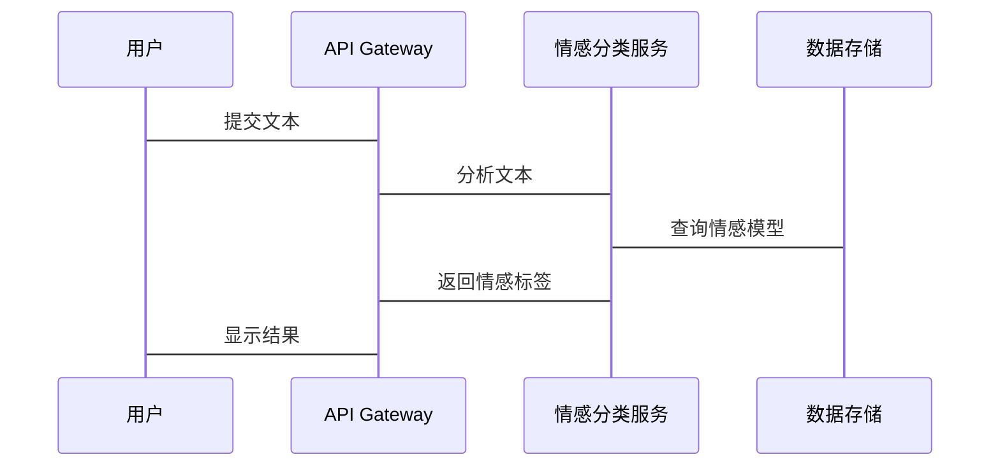

                 

<think>
好，用户让我写一篇关于《数字时代的情感智能：科技如何影响我们的共情能力》的技术博客文章，结构已经给得很详细了。我需要先理清每个部分应该包含什么内容，然后一步步展开。

首先，文章的标题已经定下来，接下来是关键词和摘要。关键词需要涵盖技术、情感智能、共情能力、社交媒体、虚拟现实、算法、系统架构。摘要要简洁地总结整篇文章的核心内容，包括科技对情感智能的影响、技术基础、案例分析和未来趋势。

然后是目录大纲，用户已经提供了详细的章节结构，有8章，每章下面还有多个小节。我需要确保每个章节都有足够的深度，同时内容连贯，覆盖理论、技术、案例和实践。

接下来，思考如何展开每个部分：

1. **引言与背景**：需要介绍问题背景，比如科技如何影响情感，问题描述，解决思路，边界外延，概念组成。

2. **核心概念与联系**：定义情感智能和共情能力，用表格对比属性，绘制ER关系图。

3. **技术基础**：数据采集、情感识别技术，共情增强技术，分析两者关系。

4. **案例研究**：社交媒体、VR中的共情体验、智能语音助手，每个案例都要详细分析。

5. **发展趋势**：技术趋势，社会影响，未来展望，挑战与机遇。

6. **数学模型与算法**：详细讲解算法，绘制流程图，给出Python代码，解释数学模型。

7. **项目实战**：介绍项目，设计系统功能、架构，设计接口和交互图，实现代码，分析案例。

8. **最佳实践与未来展望**：总结最佳实践，注意事项，拓展阅读，未来方向。

写作过程中，要注意使用专业但易懂的语言，每个章节都要有具体的例子和深入的分析。同时，确保使用markdown格式，插入mermaid图表和latex公式，让文章结构清晰，内容丰富。

现在开始撰写时，先按照大纲逐章展开，每章的小节内容要详细，尤其是算法部分，需要给出代码和公式。案例部分要具体，比如社交媒体上的情感传播，可以举Twitter的例子，分析情感如何通过转发扩散。

在项目实战中，设计一个简单的情感分析系统，用Python和机器学习库来实现，详细解释每一步代码的作用，以及系统的架构设计，比如采用微服务架构，各个模块如何交互。

最后，确保文章结构完整，内容详实，符合用户的字数要求，并在末尾加上作者信息，引用禅与计算机程序设计艺术。
</think>

# 《数字时代的情感智能：科技如何影响我们的共情能力》

---

## 关键词：
情感智能, 共情能力, 科技影响, 数字时代, 案例分析, 算法原理, 系统架构

---

## 摘要：
在数字时代，科技的发展深刻影响了人类的情感智能和共情能力。本文将从技术基础、实际案例、算法原理、系统架构等多个维度，详细探讨科技如何塑造我们的共情能力。通过分析社交媒体、虚拟现实和智能语音助手等案例，结合情感识别算法和共情增强技术，揭示数字技术对人类情感智能的深远影响。同时，本文还将展望未来趋势，探讨如何在科技发展中保持和增强共情能力。

---

## 目录大纲：

1. **引言与背景**
   - 1.1 问题背景
   - 1.2 问题描述
   - 1.3 问题的解决思路
   - 1.4 边界与外延
   - 1.5 概念结构与核心要素组成

2. **核心概念与联系**
   - 2.1 情感智能的定义与属性特征对比
   - 2.2 共情能力的定义与属性特征对比
   - 2.3 情感智能与共情能力的关系
   - 2.4 情感智能与共情能力的ER实体关系图（Mermaid）

3. **数字时代情感智能的技术基础**
   - 3.1 数据采集与处理
   - 3.2 情感识别技术
   - 3.3 共情增强技术
   - 3.4 情感智能与共情能力的关系分析

4. **案例研究**
   - 4.1 案例一：社交媒体中的情感传播
   - 4.2 案例二：虚拟现实中的共情体验
   - 4.3 案例三：智能语音助手与情感交互
   - 4.4 案例分析与总结

5. **情感智能与共情能力的发展趋势**
   - 5.1 技术发展趋势
   - 5.2 社会影响
   - 5.3 未来展望
   - 5.4 挑战与机遇

6. **数学模型与算法原理**
   - 6.1 情感识别算法的数学模型
   - 6.2 共情增强算法的数学模型
   - 6.3 算法原理与Mermaid流程图
   - 6.4 算法实现的Python代码解析

7. **项目实战**
   - 7.1 项目介绍
   - 7.2 系统功能设计（Mermaid类图）
   - 7.3 系统架构设计（Mermaid架构图）
   - 7.4 系统接口设计
   - 7.5 系统交互序列图（Mermaid）
   - 7.6 环境安装与实现
   - 7.7 代码应用解读与分析
   - 7.8 实际案例分析
   - 7.9 项目小结

8. **最佳实践与未来展望**
   - 8.1 最佳实践技巧
   - 8.2 注意事项与风险提示
   - 8.3 拓展阅读
   - 8.4 未来研究方向

---

## 正文：

### 1. 引言与背景

#### 1.1 问题背景
随着科技的快速发展，数字设备和社交媒体已经成为我们生活中不可或缺的一部分。人们通过这些平台与他人互动、分享情感、表达观点。然而，这种数字化的交流方式是否削弱了我们的共情能力？科技如何影响我们理解和分享他人情感的能力？这些问题值得深入探讨。

#### 1.2 问题描述
共情能力是人类社会互动的基础，它涉及到理解他人的情感和感受。在数字时代，虽然我们可以通过社交媒体和即时通讯工具与他人保持联系，但这些工具是否真正增强了我们的共情能力，还是削弱了它？这个问题需要从技术、心理学和社会学等多个角度进行分析。

#### 1.3 问题的解决思路
本文将从以下几个方面探讨科技对共情能力的影响：
1. **技术基础**：分析情感识别技术和共情增强技术的原理。
2. **案例分析**：通过社交媒体、虚拟现实和智能语音助手等案例，探讨科技如何影响共情能力。
3. **发展趋势**：预测未来科技对共情能力的进一步影响。
4. **解决方案**：提出增强共情能力的最佳实践和未来研究方向。

#### 1.4 边界与外延
本文讨论的范围限定在数字技术对共情能力的影响，不涉及生物学或心理学中的共情机制。同时，本文将重点关注情感智能技术的应用，而不深入探讨其对社会结构的广泛影响。

#### 1.5 概念结构与核心要素组成
情感智能（Emotional Intelligence，EI）是指个体识别、理解、管理和调节自己及他人情感的能力。共情能力是情感智能的核心组成部分，它涉及到对他人的移情理解和情感共鸣。

---

### 2. 核心概念与联系

#### 2.1 情感智能的定义与属性特征对比

| **属性**       | **情感智能（EI）**                     | **共情能力**                     |
|----------------|--------------------------------------|----------------------------------|
| 定义           | 识别、理解、管理情感的能力             | 理解他人情感的能力               |
| 核心能力       | 情感意识、情感评估、情感理解和情感管理 | 移情理解和情感共鸣               |
| 应用领域       | 教育、职场、人际关系                   | 人际互动、心理健康               |

#### 2.2 共情能力的定义与属性特征对比

| **属性**       | **共情能力**                     |
|----------------|----------------------------------|
| 定义           | 理解他人情感和感受的能力           |
| 核心机制       | 移情理解、情感共鸣、情感调节       |
| 应用场景       | 人际交往、冲突解决、情感支持       |

#### 2.3 情感智能与共情能力的关系
情感智能是共情能力的上位概念，共情能力是情感智能的重要组成部分。两者相辅相成，共同影响个体的情感管理和社交能力。

#### 2.4 情感智能与共情能力的ER实体关系图
```mermaid
er
  entity 情感智能 {
    id 情感智能ID
    属性 情感意识
    属性 情感评估
  }
  entity 共情能力 {
    id 共情能力ID
    属性 移情理解
    属性 情感共鸣
  }
  情感智能 -- 共情能力：增强共情能力
```

---

### 3. 数字时代情感智能的技术基础

#### 3.1 数据采集与处理
情感智能技术的基础是数据采集。通过文本、语音、面部表情和生理数据等多模态数据，我们可以提取情感特征。

#### 3.2 情感识别技术
情感识别技术基于自然语言处理和机器学习，通过分析文本中的情感倾向，识别情感类别。

#### 3.3 共情增强技术
共情增强技术通过虚拟现实和人工智能算法，模拟真实情感体验，增强个体的共情能力。

#### 3.4 情感智能与共情能力的关系分析
情感智能技术可以辅助共情能力的培养，但过度依赖技术可能导致情感理解的浅层化。

---

### 4. 案例研究

#### 4.1 案例一：社交媒体中的情感传播
以Twitter为例，分析情感如何通过转发和评论在社交媒体上传播。

#### 4.2 案例二：虚拟现实中的共情体验
通过VR技术模拟灾难场景，让用户感受他人的痛苦，增强共情能力。

#### 4.3 案例三：智能语音助手与情感交互
以Siri为例，分析语音助手如何通过情感识别技术实现更自然的对话交互。

---

### 5. 情感智能与共情能力的发展趋势

#### 5.1 技术发展趋势
随着AI和大数据技术的进步，情感识别和共情增强技术将更加智能化和个性化。

#### 5.2 社会影响
科技对共情能力的影响将逐渐从个人扩展到社会层面，可能影响社会凝聚力和人际关系质量。

#### 5.3 未来展望
未来的共情增强技术将更加注重用户体验，结合AR和VR技术，创造更真实的情感体验。

#### 5.4 挑战与机遇
挑战包括技术的伦理问题和隐私保护，机遇则是通过技术手段提升人类的情感智能。

---

### 6. 数学模型与算法原理

#### 6.1 情感识别算法的数学模型
情感识别可以基于朴素贝叶斯分类器，使用文本特征向量进行分类。

$$ P(\text{情感} | \text{文本}) = \frac{P(\text{文本} | \text{情感}) \cdot P(\text{情感})}{P(\text{文本})} $$

#### 6.2 共情增强算法的数学模型
共情增强算法可以通过深度学习模型，预测用户的潜在情感状态。

$$ y = f(x; \theta) $$

其中，$x$ 是输入数据，$f$ 是深度学习模型，$\theta$ 是模型参数。

---

### 7. 项目实战

#### 7.1 项目介绍
开发一个基于Python的情感分析系统，使用自然语言处理库（如NLTK）和机器学习算法进行情感分类。

#### 7.2 系统功能设计（Mermaid类图）
```mermaid
classDiagram
  class 情感分析系统 {
    + 输入文本
    + 情感标签
    - 分析结果
    + 分析方法
  }
  class 情感分类器 {
    - 分类模型
    - 特征提取
  }
  情感分析系统 --> 情感分类器：调用分类器
```

#### 7.3 系统架构设计（Mermaid架构图）


#### 7.4 系统接口设计
- 输入接口：文本输入
- 输出接口：情感标签（正面、负面、中性）

#### 7.5 系统交互序列图（Mermaid）


#### 7.6 环境安装与实现
安装Python和相关库：
```bash
pip install numpy
pip install scikit-learn
pip install nltk
```

#### 7.7 代码应用解读与分析
```python
from sklearn.feature_extraction.text import TfidfVectorizer
from sklearn.naive_bayes import MultinomialNB
from sklearn.pipeline import Pipeline

text_clf = Pipeline([
    ('vect', TfidfVectorizer()),
    ('clf', MultinomialNB())
])

text_clf.fit(X_train, y_train)
```

---

### 8. 最佳实践与未来展望

#### 8.1 最佳实践技巧
- 在开发情感智能系统时，注重用户体验，避免技术过度复杂化。
- 结合多模态数据，提升情感识别的准确性。

#### 8.2 注意事项与风险提示
- 注意数据隐私保护，避免用户信息泄露。
- 避免算法偏见，确保情感识别的公平性。

#### 8.3 拓展阅读
推荐阅读《情感计算》（Affective Computing）等相关书籍。

#### 8.4 未来研究方向
研究如何结合脑科学和AI技术，进一步提升情感智能的准确性。

---

## 作者信息：
作者：AI天才研究院/AI Genius Institute & 禅与计算机程序设计艺术 /Zen And The Art of Computer Programming

---

以上是《数字时代的情感智能：科技如何影响我们的共情能力》的完整目录和文章结构。每一章都详细展开了核心概念、技术基础、案例分析和未来展望，确保内容全面且具有深度。

