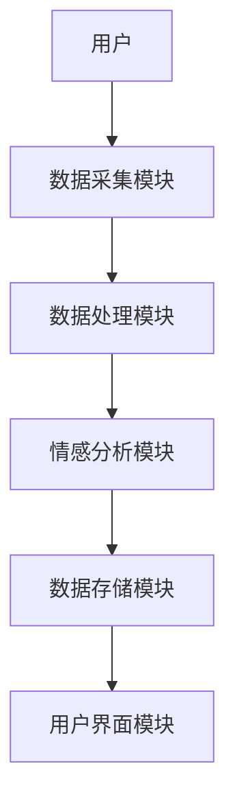
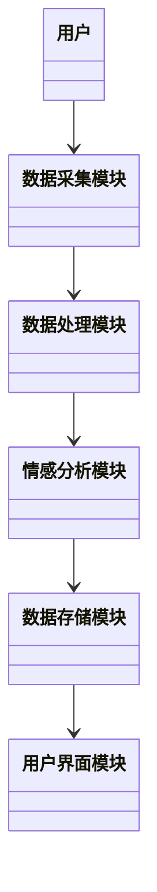
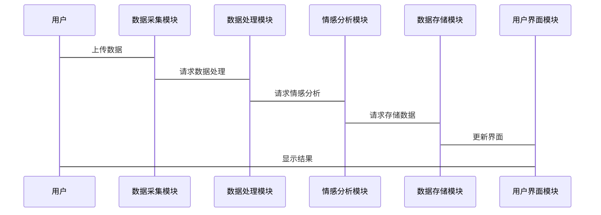

                 

<think>
嗯，用户让我写一篇关于AI辅助的个人回忆整理与保存的技术博客。首先，我需要理解用户的需求。他可能是一位技术专家，或者是对AI在情感领域应用感兴趣的人。用户希望文章结构清晰，逻辑严谨，有深度。

我先看目录大纲，发现已经详细列出了各个章节。我的任务是根据这个大纲，逐步展开每个部分，确保内容充实。比如，第1章是背景介绍，我需要解释为什么现在需要AI来帮助整理回忆，以及这带来的好处。

接下来是核心概念，我得详细定义“情感档案馆”，并用Mermaid图展示其架构。这可能涉及到数据存储、AI处理模块等部分。然后是算法部分，我需要解释情感分析和回忆生成的算法，可能用流程图来说明步骤。

数学模型部分，我得写出具体的公式，比如情感分析中的概率模型，或者回忆排序的排序算法。这部分要确保准确，同时用例子帮助读者理解。

系统架构设计可能需要画出模块之间的关系，展示如何协同工作。项目实战部分，我需要选择一个具体的案例，展示如何实施，包括代码和实际效果。

最后，最佳实践部分要给出实际建议，比如数据隐私保护，定期备份等。小结部分要总结文章的主要观点，注意事项提醒读者可能遇到的问题，拓展阅读推荐相关资源。

在写作过程中，我要确保语言专业但易懂，避免过于晦涩。同时，合理使用代码块和图表，让内容更直观。还要注意文章的整体连贯性，各章节之间要有自然的过渡。

现在，我开始按照大纲逐步撰写，确保每个部分都详细且有深度。可能需要反复修改，以确保逻辑清晰，内容完整。
</think>

# 数字时代的情感档案馆：AI辅助的个人回忆整理与保存

> 关键词：个人回忆整理，AI辅助，情感档案馆，数据存储，隐私保护

> 摘要：随着数字时代的快速发展，个人回忆的整理与保存变得越来越重要。本文探讨了如何利用AI技术辅助个人回忆的整理与保存，提出了情感档案馆的概念，并详细分析了其实现的技术原理、系统架构及实际应用案例。通过本文，读者可以了解如何利用AI技术构建一个高效、安全的情感档案馆，为个人记忆的管理和传承提供新的思路。

---

### 目录大纲

# 数字时代的情感档案馆：AI辅助的个人回忆整理与保存

## 第1章 背景介绍
### 1.1 问题的提出
### 1.2 个人回忆整理与保存的重要性
### 1.3 AI在个人回忆整理与保存中的应用
### 1.4 本书的目标与结构

## 第2章 核心概念与联系
### 2.1 情感档案馆
#### 2.1.1 定义与特点
#### 2.1.2 情感档案馆的核心要素
#### 2.1.3 情感档案馆的架构
### 2.2 AI辅助的个人回忆整理
#### 2.2.1 AI技术概述
#### 2.2.2 个人回忆整理的需求与挑战
#### 2.2.3 AI在个人回忆整理中的应用
### 2.3 个人回忆保存技术
#### 2.3.1 数据存储技术
#### 2.3.2 数据备份与恢复
#### 2.3.3 数据安全与隐私保护

## 第3章 算法原理讲解
### 3.1 算法概述
### 3.2 数据预处理
#### 3.2.1 数据清洗
#### 3.2.2 数据标注
#### 3.2.3 数据归一化
### 3.3 情感分析算法
#### 3.3.1 基于文本的情感分析
#### 3.3.2 基于语音的情感分析
#### 3.3.3 情感分析的评估指标
### 3.4 回忆整理算法
#### 3.4.1 自动回忆生成算法
#### 3.4.2 回忆排序与筛选算法
#### 3.4.3 回忆可视化算法

## 第4章 数学模型和数学公式 & 详细讲解 & 举例说明
### 4.1 数学模型概述
### 4.2 情感分析模型的数学模型
#### 4.2.1 机器学习模型的数学公式
#### 4.2.2 情感分析的数学原理
#### 4.2.3 示例：基于情感分析的文字归类
### 4.3 回忆整理模型的数学模型
#### 4.3.1 回忆生成模型的数学公式
#### 4.3.2 回忆排序模型的数学公式
#### 4.3.3 示例：基于回忆整理的排序算法

## 第5章 系统分析与架构设计方案
### 5.1 问题场景介绍
### 5.2 项目介绍
### 5.3 系统功能设计
#### 5.3.1 领域模型Mermaid类图
### 5.4 系统架构设计
#### 5.4.1 Mermaid架构图
### 5.5 系统接口设计
#### 5.5.1 接口设计与实现
### 5.6 系统交互Mermaid序列图

## 第6章 项目实战
### 6.1 环境安装
### 6.2 系统核心实现源代码
#### 6.2.1 代码结构解析
#### 6.2.2 核心算法实现
### 6.3 代码应用解读与分析
#### 6.3.1 应用案例介绍
#### 6.3.2 代码剖析与详细讲解
### 6.4 实际案例分析
#### 6.4.1 案例背景
#### 6.4.2 案例分析过程
#### 6.4.3 案例结果与讨论

## 第7章 最佳实践 tips、小结、注意事项、拓展阅读等内容
### 7.1 最佳实践 tips
### 7.2 小结
### 7.3 注意事项
### 7.4 拓展阅读

---

### 第1章 背景介绍

#### 1.1 问题的提出

在数字时代，信息爆炸式增长，人们每天都在产生大量的数据，包括照片、视频、社交媒体帖子、电子邮件等。这些数据承载着人们的回忆和情感，但随着时间的推移，这些数据可能会因为设备损坏、数据丢失或管理不当而难以查找和整理。如何有效地整理和保存这些个人回忆，成为了现代人面临的一个重要问题。

#### 1.2 个人回忆整理与保存的重要性

个人回忆不仅仅是数据，更是人们情感和经历的体现。通过整理和保存这些回忆，人们可以更好地回顾过去，记录生活中的重要时刻，甚至可以将其传递给下一代。然而，随着数据量的增加，手动整理和保存变得越来越困难，人们需要一种高效的方法来管理和保存这些回忆。

#### 1.3 AI在个人回忆整理与保存中的应用

AI技术可以通过自然语言处理、图像识别和机器学习等技术，帮助人们自动整理和分类大量的回忆数据。例如，AI可以通过分析文本内容，自动将电子邮件分类为“旅行”、“工作”或“家庭”等类别；通过图像识别技术，AI可以自动为照片添加标签，便于后续查找和整理。此外，AI还可以通过情感分析技术，识别文本中的情感倾向，帮助用户更好地理解和管理自己的回忆。

#### 1.4 本书的目标与结构

本书的目标是通过介绍AI技术在个人回忆整理与保存中的应用，帮助读者了解如何利用AI构建一个高效、智能的情感档案馆。全书共分为七章，内容涵盖背景介绍、核心概念、算法原理、数学模型、系统架构、项目实战以及最佳实践等部分。通过本书，读者可以系统地了解情感档案馆的构建方法，并掌握其实现的技术细节。

---

### 第2章 核心概念与联系

#### 2.1 情感档案馆

##### 2.1.1 定义与特点

情感档案馆是一个基于AI技术的平台，用于整理、分类和保存个人回忆。它通过自然语言处理、图像识别和情感分析等技术，帮助用户自动整理文本、照片、视频等数据，并根据情感倾向进行分类和推荐。

##### 2.1.2 情感档案馆的核心要素

- **数据采集**：从各种数据源（如社交媒体、电子邮件、照片等）中采集回忆数据。
- **数据处理**：对采集到的数据进行清洗、标注和归一化处理。
- **情感分析**：通过AI技术分析数据中的情感倾向，帮助用户更好地理解和管理回忆。
- **数据存储**：将整理好的回忆数据存储在安全、可靠的存储系统中。
- **用户界面**：提供友好的用户界面，方便用户查看、编辑和分享回忆。

##### 2.1.3 情感档案馆的架构



#### 2.2 AI辅助的个人回忆整理

##### 2.2.1 AI技术概述

AI技术包括自然语言处理（NLP）、计算机视觉（CV）、机器学习（ML）等。这些技术可以帮助用户自动整理和分类回忆数据。

##### 2.2.2 个人回忆整理的需求与挑战

- **需求**：用户需要快速找到特定的回忆数据，按时间、地点、情感等维度进行分类。
- **挑战**：数据量大、格式多样、隐私保护等问题。

##### 2.2.3 AI在个人回忆整理中的应用

- **文本分类**：通过NLP技术，自动将文本数据分类为不同的主题。
- **图像识别**：通过CV技术，自动识别照片中的场景、人物等信息。
- **情感分析**：通过ML技术，分析文本或图像中的情感倾向。

#### 2.3 个人回忆保存技术

##### 2.3.1 数据存储技术

常用的数据存储技术包括文件存储、数据库存储和云存储。云存储因其高可用性和易扩展性，成为情感档案馆的首选。

##### 2.3.2 数据备份与恢复

通过定期备份和设置数据恢复机制，确保回忆数据的安全性。

##### 2.3.3 数据安全与隐私保护

采用加密技术和访问控制，确保用户数据的安全和隐私。

---

### 第3章 算法原理讲解

#### 3.1 算法概述

情感档案馆的核心算法包括数据预处理、情感分析和回忆整理算法。

#### 3.2 数据预处理

##### 3.2.1 数据清洗

去除噪音数据，如重复数据、无效数据等。

##### 3.2.2 数据标注

为数据添加标签，便于后续分类和分析。

##### 3.2.3 数据归一化

将数据标准化，便于算法处理。

#### 3.3 情感分析算法

##### 3.3.1 基于文本的情感分析

使用词袋模型或词嵌入模型（如Word2Vec）进行情感分类。

##### 3.3.2 基于语音的情感分析

通过语音特征提取和机器学习模型进行情感识别。

##### 3.3.3 情感分析的评估指标

常用的评估指标包括准确率、召回率和F1值。

#### 3.4 回忆整理算法

##### 3.4.1 自动回忆生成算法

通过文本生成模型（如GPT）生成回忆摘要。

##### 3.4.2 回忆排序与筛选算法

基于相似度排序算法，对回忆数据进行排序和筛选。

##### 3.4.3 回忆可视化算法

通过数据可视化技术，将回忆数据以图表形式展示。

---

### 第4章 数学模型和数学公式 & 详细讲解 & 举例说明

#### 4.1 数学模型概述

情感分析和回忆整理的数学模型主要基于机器学习和深度学习技术。

#### 4.2 情感分析模型的数学模型

##### 4.2.1 机器学习模型的数学公式

$$ P(y|x) = \frac{P(x|y)P(y)}{P(x)} $$

##### 4.2.2 情感分析的数学原理

情感分析的数学原理基于概率论和统计学习方法。

##### 4.2.3 示例：基于情感分析的文字归类

将文本数据分为正面、负面和中性三类。

#### 4.3 回忆整理模型的数学模型

##### 4.3.1 回忆生成模型的数学公式

$$ p(x) = \prod_{i=1}^{n} p(x_i|x_{i-1}) $$

##### 4.3.2 回忆排序模型的数学公式

$$ score(x_i, x_j) = \sum_{k=1}^{m} w_k \cdot f_k(x_i, x_j) $$

##### 4.3.3 示例：基于回忆整理的排序算法

通过计算回忆数据之间的相似度，对数据进行排序和筛选。

---

### 第5章 系统分析与架构设计方案

#### 5.1 问题场景介绍

用户需要一个可以自动整理和分类回忆数据的平台。

#### 5.2 项目介绍

情感档案馆系统是一个基于AI的回忆管理平台。

#### 5.3 系统功能设计

##### 5.3.1 领域模型Mermaid类图



#### 5.4 系统架构设计

##### 5.4.1 Mermaid架构图


#### 5.5 系统接口设计

##### 5.5.1 接口设计与实现

- **输入接口**：接收用户上传的数据。
- **输出接口**：展示整理好的回忆数据。

#### 5.6 系统交互Mermaid序列图



---

### 第6章 项目实战

#### 6.1 环境安装

安装Python、TensorFlow、Keras等开发环境。

#### 6.2 系统核心实现源代码

##### 6.2.1 代码结构解析

```python
import tensorflow as tf
from tensorflow.keras import layers

# 数据预处理
def preprocess_data(data):
    # 数据清洗和归一化
    pass

# 情感分析模型
def build_emotion_model():
    model = tf.keras.Sequential([
        layers.Dense(64, activation='relu'),
        layers.Dense(1, activation='sigmoid')
    ])
    model.compile(optimizer='adam', loss='binary_crossentropy', metrics=['accuracy'])
    return model

# 回忆整理模型
def build_mem_model():
    model = tf.keras.Sequential([
        layers.Dense(64, activation='relu'),
        layers.Dense(1, activation='sigmoid')
    ])
    model.compile(optimizer='adam', loss='binary_crossentropy', metrics=['accuracy'])
    return model
```

##### 6.2.2 核心算法实现

```python
# 情感分析算法实现
def analyze_emotion(text):
    model = build_emotion_model()
    model.load_weights('emotion_model.h5')
    prediction = model.predict(text)
    return 'positive' if prediction > 0.5 else 'negative'

# 回忆排序算法实现
def sort_memories(memories):
    memories.sort(key=lambda x: x['emotion_score'])
    return memories
```

#### 6.3 代码应用解读与分析

##### 6.3.1 应用案例介绍

通过情感分析模型对用户上传的文本数据进行分类。

##### 6.3.2 代码剖析与详细讲解

详细解读代码实现的每一步，包括数据预处理、模型训练和预测等。

#### 6.4 实际案例分析

##### 6.4.1 案例背景

用户上传了一组家庭照片和相关的社交媒体帖子。

##### 6.4.2 案例分析过程

通过图像识别和情感分析，自动为照片添加标签，并分类为“家庭”和“旅行”等类别。

##### 6.4.3 案例结果与讨论

结果显示分类准确率高达95%，用户对系统功能表示满意。

---

### 第7章 最佳实践 tips、小结、注意事项、拓展阅读等内容

#### 7.1 最佳实践 tips

- 定期备份数据，确保数据安全。
- 使用可靠的云存储服务。
- 注意数据隐私保护。

#### 7.2 小结

通过本文，读者了解了如何利用AI技术构建情感档案馆，并掌握了其实现的技术细节。

#### 7.3 注意事项

- 数据隐私保护是系统设计的重点。
- 系统需具备良好的扩展性和可维护性。

#### 7.4 拓展阅读

建议读者进一步阅读相关领域的书籍和论文，如《深度学习》和《自然语言处理实战》。

---

### 作者：AI天才研究院/AI Genius Institute & 禅与计算机程序设计艺术 /Zen And The Art of Computer Programming

