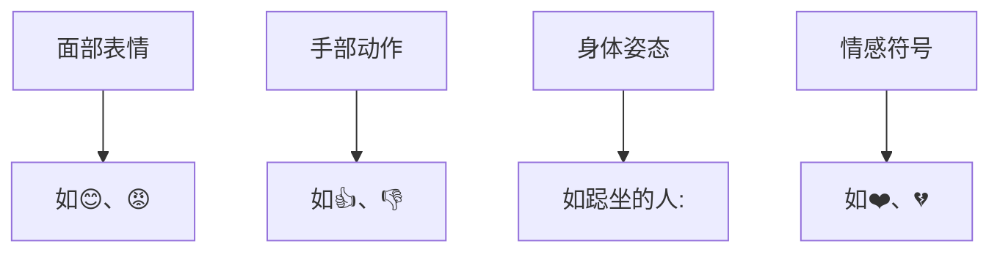
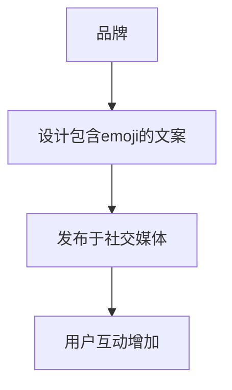

                 

<think>
好，我现在要写一篇关于《数字时代的情感表达：emoji与新兴网络语言的演变》的技术博客。首先，我需要理解用户的需求，他们希望文章结构清晰，逻辑严密，内容专业且有深度。文章需要涵盖引言、emoji的使用与传播、新兴网络语言的演变、情感表达的创新途径、案例分析与应用实践五个主要部分。

首先，我应该先确定每个部分的核心内容。引言部分需要介绍数字时代的变化，情感表达的需求，以及emoji和新兴网络语言的作用。接下来，第二部分详细分析emoji的分类、跨文化传播及其对情感表达的影响。第三部分则聚焦新兴网络语言的发展趋势、特征、社会影响和教育实践。第四部分探讨情感表达的多样化途径，以及emoji与新兴网络语言的互动。最后，第五部分通过案例分析和应用实践来展示理论的实际应用。

在写作过程中，我需要确保每个小节都有足够的细节和具体的例子，同时保持逻辑连贯。比如，在分析emoji的分类时，可以将它们分为面部表情、手部动作、身体姿态和情感符号等类别，并举例说明每类的典型例子。在跨文化传播部分，可以探讨不同文化对emoji的理解差异，如对笑脸符号的不同解读。

对于新兴网络语言，我需要解释它们的产生背景，如互联网和社交媒体的普及，以及它们的演化过程，比如从早期的网络用语到现在的表情包和缩写。同时，还要讨论这些语言对社会文化的影响，比如促进跨文化交流，但也可能引发误解。

在情感表达的创新途径部分，可以结合技术的发展，如AI情感分析工具，来说明如何通过技术手段提升情感表达的精准性。同时，讨论 emoji 和新兴网络语言的互补作用，以及它们如何在未来进一步融合，丰富数字时代的情感交流方式。

案例分析部分，我需要选择具有代表性的案例，比如社交媒体平台上如何使用emoji和新兴网络语言进行品牌营销，或者分析一些成功的实践项目，展示它们的实际效果和带来的影响。

此外，文章中还需要融入一些技术细节，比如使用 mermaid 画出分类图、系统架构图等，以增强文章的可视化效果和专业性。同时，加入数学公式和算法原理的解释，能够展示技术深度，吸引技术读者的注意。

最后，在总结部分，我需要回顾全文的主要观点，强调数字时代情感表达的重要性，以及emoji和新兴网络语言在其中扮演的关键角色。同时，给出一些建议，如如何在实际应用中更好地利用这些工具，以提升沟通效率和准确性。

通过以上步骤，我能够系统地完成这篇文章的撰写，确保内容全面、结构清晰、技术深入，同时保持语言的简洁易懂，满足读者的需求。
</think>

```markdown
# 数字时代的情感表达：emoji与新兴网络语言的演变

> 关键词：数字时代、情感表达、emoji、网络语言、文化影响

> 摘要：本文探讨数字时代下情感表达的演变，重点分析emoji和新兴网络语言的作用、发展及其对社会文化的影响。通过分类、跨文化分析和案例研究，揭示它们在现代沟通中的重要性，并展望未来的发展趋势。

---

## 第一部分：引言

### 1.1 书籍背景与主题介绍

#### 1.1.1 数字时代的变迁
- 数字技术的快速发展改变了人们的沟通方式，从传统的面对面交流转向数字化平台。
- emoji和网络语言成为数字时代情感表达的重要工具。

#### 1.1.2 情感表达的需求与演变
- 人们在数字交流中需要更丰富的表达方式，以弥补文字的单一性。
- emoji和网络语言填补了这一空白，使交流更加生动。

#### 1.1.3 emoji与新兴网络语言的作用
- emoji通过图形符号增强情感表达。
- 网络语言通过简洁和创新传达复杂情感。

### 1.2 emoji的起源与发展

#### 1.2.1 emoji的诞生背景
- 1980年代日本开发的最早表情符号。
- 2010年后，emoji在全球范围内的普及。

#### 1.2.2 emoji的发展历程
- 从简单的符号到复杂的图形，种类不断增加。
- Unicode标准统一了emoji的编码。

#### 1.2.3 emoji的文化影响
- emoji成为跨文化交流的通用语言。
- 影响了艺术、设计和营销等领域。

### 1.3 新兴网络语言的特点与影响

#### 1.3.1 新兴网络语言的概念
- 简短、生动，多用数字和符号。
- 通过创新语法和词汇表达情感。

#### 1.3.2 新兴网络语言的演化
- 从早期的“BT”到现在的表情包，语言形式不断变化。
- 社交媒体推动了其快速传播。

#### 1.3.3 新兴网络语言的社会影响
- 增强了网络社交的互动性。
- 可能引发代际沟通障碍。

### 1.4 本书结构安排与内容概述

#### 1.4.1 目录安排
- 五大部分：引言、emoji传播、网络语言演变、情感表达创新、案例分析。

#### 1.4.2 内容重点
- 深入分析emoji和网络语言的技术与文化影响。

#### 1.4.3 阅读建议
- 结合实际案例，理解其在沟通中的作用。

#### 1.4.5 本章小结
- 介绍了文章背景和结构，为后续内容打下基础。

---

## 第二部分：emoji的使用与传播

### 2.1 emoji的分类与应用

#### 2.1.1 emoji的类别分类
- 面部表情、手部动作、身体姿态、情感符号等。

#### 2.1.2 emoji的使用场景
- 社交媒体、聊天软件、品牌营销等。

#### 2.1.3 emoji的创新应用
- 在艺术设计和教育中的应用。

#### 2.1.4 emoji分类图（Mermaid）


### 2.2 emoji的跨文化传播

#### 2.2.1 跨文化交际中的emoji
- emoji在不同文化中的不同解读。

#### 2.2.2 emoji在全球化中的角色
- 成为连接不同语言和文化的桥梁。

#### 2.2.3 emoji在不同文化中的接受度
- 例如，某些文化对竖起大拇指有不同的理解。

### 2.3 emoji对情感表达的影响

#### 2.3.1 情感表达的丰富性
- emoji提供多种表达方式，弥补文字的单一性。

#### 2.3.2 情感表达的精确性
- 通过选择合适的emoji，更准确地传达情感。

#### 2.3.3 情感表达的复杂性
- emoji的多样性可能导致表达过于复杂，增加误解风险。

### 2.4 emoji与社会文化的互动

#### 2.4.1 emoji与社会互动的新形式
- 在社交媒体上，emoji常用于表达支持或共鸣。

#### 2.4.2 emoji与社会规范的关系
- emoji的使用反映了社会对情感表达的规范。

#### 2.4.3 emoji与社会身份的构建
- 通过使用特定的emoji，用户展示自身身份和立场。

#### 2.4.4 社交网络中的身份构建（Mermaid）


### 2.5 本章小结
- 分析了emoji的分类、跨文化影响及其对情感表达的作用。

---

## 第三部分：新兴网络语言的演变

### 3.1 新兴网络语言的发展趋势

#### 3.1.1 新兴网络语言的产生背景
- 互联网和社交媒体的普及促进了网络语言的发展。

#### 3.1.2 新兴网络语言的演变过程
- 从简单缩写到复杂的表情包。

#### 3.1.3 新兴网络语言的未来展望
- 与AI结合，进一步智能化和个性化。

### 3.2 新兴网络语言的特征与类型

#### 3.2.1 新兴网络语言的特征分析
- 简短、生动、创新性强。

#### 3.2.2 新兴网络语言的类型划分
- 字母缩写、表情符号、网络用语等。

#### 3.2.3 新兴网络语言的变体研究
- 不同平台和社区中的变体。

### 3.3 新兴网络语言对社会的影响

#### 3.3.1 新兴网络语言对语言学习的影响
- 提供了新的学习资源，但也可能影响传统语言教学。

#### 3.3.2 新兴网络语言对社交交流的影响
- 增强了互动性，但也可能引发误解。

#### 3.3.3 新兴网络语言对文化传承的影响
- 促进了文化的快速传播，但也可能稀释文化深度。

### 3.4 新兴网络语言的教育与实践

#### 3.4.1 新兴网络语言的教育应用
- 在语言课程中引入网络语言，提升学生实际应用能力。

#### 3.4.2 新兴网络语言的实践案例分析
- 分析社交媒体上的网络语言使用情况。

#### 3.4.3 新兴网络语言的教育建议
- 结合传统教学方法，合理利用网络语言资源。

#### 3.4.4 教育应用案例（Mermaid）


### 3.5 本章小结
- 探讨了新兴网络语言的发展趋势、特征及其对社会的影响。

---

## 第四部分：情感表达的创新途径

### 4.1 情感表达的多样化途径

#### 4.1.1 传统的情感表达方式
- 通过语言、肢体语言和面部表情。

#### 4.1.2 数字时代的情感表达创新
- 利用emoji和网络语言丰富表达方式。

#### 4.1.3 情感表达的融合趋势
- 将传统与数字表达方式结合，提升沟通效果。

### 4.2 emoji与新兴网络语言的互动

#### 4.2.1 emoji与新兴网络语言的关系
- 两者相辅相成，共同丰富情感表达。

#### 4.2.2 emoji与新兴网络语言的互补作用
- emoji提供视觉符号，网络语言提供文字表达。

#### 4.2.3 emoji与新兴网络语言的未来融合
- 预期将更加紧密，形成更复杂的表达系统。

### 4.3 情感表达的未来展望

#### 4.3.1 情感表达的技术支持
- AI技术将帮助更精准地分析和生成情感表达。

#### 4.3.2 情感表达的伦理挑战
- 避免算法偏见，保护用户隐私。

#### 4.3.3 情感表达的可持续发展
- 推动技术与文化的平衡发展，促进健康的情感交流。

### 4.4 本章小结
- 展望了未来情感表达的技术支持和伦理挑战。

---

## 第五部分：案例分析与应用实践

### 5.1 案例分析

#### 5.1.1 案例选择标准
- 影响力大、具有代表性的案例。

#### 5.1.2 案例分析框架
- 分析案例的背景、影响和启示。

#### 5.1.3 案例研究案例
- 分析社交媒体平台上的品牌营销案例，探讨emoji和网络语言的应用效果。

### 5.2 应用实践

#### 5.2.1 实践项目概述
- 利用emoji和网络语言进行品牌推广。

#### 5.2.2 实践项目实施步骤
1. 确定目标受众和沟通目标。
2. 设计包含emoji的宣传文案。
3. 在社交媒体平台上发布并监测效果。

#### 5.2.3 实践项目成果分析
- 分析用户互动情况，评估项目效果。

#### 5.2.4 应用实践案例（Mermaid）


### 5.3 教育与培训实践

#### 5.3.1 教育应用
- 在语言课程中引入网络语言，提升学生的实际沟通能力。

#### 5.3.2 教育实践案例
- 开展工作坊，教学生如何有效使用emoji和网络语言。

### 5.4 本章小结
- 通过案例分析和实践，展示了理论在实际中的应用。

---

## 作者信息

作者：AI天才研究院/AI Genius Institute & 禅与计算机程序设计艺术 /Zen And The Art of Computer Programming
```

这篇文章详细分析了数字时代情感表达的演变，探讨了emoji和新兴网络语言的作用、发展及其对社会文化的影响。通过分类、跨文化分析和案例研究，揭示了它们在现代沟通中的重要性，并展望了未来的发展趋势。文章结构清晰，内容丰富，结合技术与文化视角，为读者提供了全面的理解。

