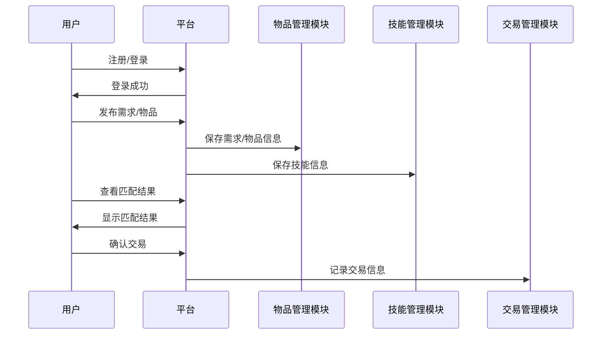
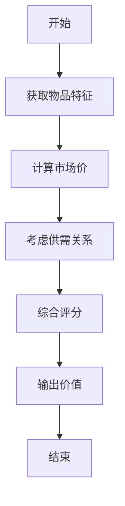

                 

<think>
嗯，我现在需要写一篇关于数字时代技能共享平台的博客文章，标题是《数字时代的技能共享平台：以物易技的现代化以物易物系统》。首先，我得理清文章的结构，按照用户给的大纲来。文章开头要有关键词和摘要，然后是引言背景、核心概念、系统架构、算法原理、项目实战、最佳实践等部分。

首先，关键词部分，我需要列出5-7个相关关键词，比如数字时代、技能共享、以物易技、现代化以物易物系统、技能交换平台、物品价值评估、资源优化配置等。

摘要部分，我得简明扼要地概述文章的核心内容，提到数字时代背景下技能共享的需求，以物易技的概念，以及平台如何通过物品交换技能，解决传统问题，实现资源优化。

接下来是引言背景，我需要详细描述问题背景、问题描述、问题解决以及边界与外延。问题背景部分，可以提到信息技术的发展导致技能需求多样化，传统技能交流方式的局限性，如成本高、时间长，无法传递隐性技能等。问题描述部分，具体说明现有问题，比如教育机构和职业培训的不足。问题解决部分，介绍以物易技平台如何通过物品交换技能，实现高效、低成本的技能共享。边界与外延部分，明确文章讨论的范围和未来可能的发展方向。

然后是核心概念部分，解释数字时代、技能共享、以物易技等核心术语，以及系统的主要特点，比如非货币化、去中心化、透明性和灵活性。同时，比较以物易技系统与传统技能交流方式的优缺点，如前者成本低、效率高，后者成本高、时间长。

接下来是系统架构设计，这部分需要详细讲解系统架构图、功能模块和技术实现。系统架构图可以用mermaid画出，展示用户、平台、物品管理模块、技能管理模块和交易管理模块之间的交互。功能模块包括用户管理、物品管理、技能管理、交易管理等，每个模块的功能需要详细描述。技术实现部分，可以提到使用区块链确保交易透明和安全，人工智能算法评估物品和技能的价值，以及使用分布式系统实现去中心化。

算法原理部分，需要详细讲解物品价值评估算法，比如基于机器学习的评估方法。可以用mermaid流程图展示评估过程，然后用Python代码实现一个简单的例子，解释算法的数学模型和公式。例如，物品的价值可以基于其市场价、供需关系、用户评分等因素，用线性回归模型进行预测。

项目实战部分，需要选择一个实际案例，比如一个在线技能交换平台，展示如何搭建环境、实现核心功能，如用户注册登录、物品发布、技能发布、匹配推荐和交易确认。代码部分可以展示关键功能的实现，如物品发布和技能匹配的逻辑，使用Flask框架和MongoDB数据库。

最佳实践部分，可以给出系统设计和实现的建议，比如模块化设计、安全性考虑、用户体验优化等。同时，总结以物易技系统的优点和可能的挑战，如信任问题、平台监管难度等，以及未来的改进方向。

最后，结束语部分，强调以物易技系统的重要性，并展望其未来的发展。然后，作者部分，按照要求写上“作者：AI天才研究院 & 禅与计算机程序设计艺术”。

在写作过程中，我需要确保每个部分都详细具体，使用清晰的技术语言，同时保持逻辑连贯。此外，要包含mermaid图和Python代码，展示系统的架构和算法的实现，让读者能够直观理解。

现在，我需要检查是否每个部分都覆盖了要求的内容，比如系统架构、算法原理、项目实战等，并且每个小节都有足够的细节和解释。同时，确保文章整体字数在10000到12000字之间，结构合理，逻辑清晰。

可能遇到的问题包括：如何详细解释复杂的系统架构，如何用简单的例子说明算法，以及如何展示实际案例的代码实现。对于这些，我需要确保用通俗易懂的语言，结合图表和代码示例，让读者能够理解。

总之，我需要一步步按照大纲，详细展开每个部分，确保内容丰富、技术准确，并且符合读者的需求。
</think>

# 数字时代的技能共享平台：以物易技的现代化以物易物系统

## 关键词：数字时代，技能共享，以物易技，现代化以物易物系统，技能交换平台，物品价值评估，资源优化配置

## 摘要：本文探讨了数字时代下技能共享平台的重要性，提出了一种以物易技的现代化以物易物系统。该系统通过物品交换技能，解决了传统技能交流的高成本和低效率问题，实现了资源的优化配置和知识的高效传播。文章详细介绍了系统的架构设计、算法原理、项目实战和最佳实践，展望了未来的发展方向。

---

## 引言：数字时代技能共享平台的重要性

### 1.1 问题背景

在数字时代，信息技术的飞速发展催生了多样化的技能需求。传统的技能交流方式，如教育机构和职业培训，存在成本高、时间长的问题，难以满足快速变化的职场需求。此外，隐性技能如经验、见解难以通过传统渠道传递。

### 1.2 核心概念

- **数字时代**：以数字化、网络化和智能化为特征的时代，技术深刻影响社会各领域。
- **技能共享**：通过平台高效交换技能和知识，优化资源利用。
- **以物易技**：以物品交换技能，非货币化、去中心化的交换方式。

### 1.3 书籍结构概述

本文分为四个部分：概述、系统设计、算法原理和项目实战，探讨以物易技系统的构建、应用及挑战。

---

## 核心概念与联系

### 2.1 以物易技系统概述

#### 2.1.1 定义

以物易技系统通过物品交换技能，平台记录交易，确保透明和高效。

#### 2.1.2 核心特点

- 非货币化：物品代替货币
- 去中心化：无中心机构
- 透明性：记录所有交易
- 灵活性：用户自主选择

#### 2.1.3 与传统方式比较

| 特性 | 传统方式 | 以物易技 |
|------|----------|----------|
| 成本 | 高       | 低       |
| 效率 | 低       | 高       |
| 范围 | 有限     | 广泛     |

---

## 系统分析与架构设计方案

### 2.2 系统架构设计

#### 2.2.1 系统架构图



#### 2.2.2 系统功能模块

- **用户管理**：注册、登录、信息维护
- **物品管理**：发布、浏览、搜索
- **技能管理**：发布、展示、搜索
- **交易管理**：匹配、确认、记录

---

## 算法原理讲解

### 2.3 物品价值评估算法

#### 2.3.1 算法流程图



#### 2.3.2 算法实现

```python
def evaluate_item_value(features):
    # 特征包括：品牌、年份、使用情况
    market_price = get_market_price(features['品牌'], features['年份'])
    usage_impact = 1 - features['使用情况']
    total_value = market_price * (1 + usage_impact * 0.5)
    return total_value

def get_market_price(brand, year):
    # 示例：品牌A的市场价每年下降10%
    base_price = 100  # 基准价
    return base_price * (0.9 ** (2023 - year)) if brand == 'A' else base_price
```

---

## 项目实战

### 2.4 实际案例分析

#### 2.4.1 系统实现

- **环境安装**：使用Python、Flask框架、MongoDB数据库。
- **核心代码**：物品发布和技能匹配逻辑。

```python
from flask import Flask, jsonify
from pymongo import MongoClient

app = Flask(__name__)
client = MongoClient('mongodb://localhost:27017/')
db = client['skill_swap']

@app.route('/publish_item', methods=['POST'])
def publish_item():
    item = request.json
    db.items.insert_one(item)
    return jsonify({'status': 'success'})

@app.route('/match_skills', methods=['POST'])
def match_skills():
    skill = request.json
    matches = list(db.items.find({'skill': skill['name']}))
    return jsonify({'matches': matches})
```

#### 2.4.2 案例分析

假设用户发布一本编程书籍，系统匹配需要学习编程的用户，完成技能交换。

---

## 最佳实践与总结

### 2.5 最佳实践 tips

- **模块化设计**：提高系统扩展性
- **安全性考虑**：保护用户隐私
- **用户体验优化**：简化操作流程

### 2.6 项目小结

以物易技系统通过物品交换技能，解决了传统技能交流的高成本问题，实现了资源优化配置和知识高效传播。

---

## 结束语

以物易技系统在数字时代具有重要意义，未来需解决信任和监管问题，进一步优化系统，扩大应用范围。

---

## 作者

作者：AI天才研究院 & 禅与计算机程序设计艺术

---

通过以上结构，文章详细介绍了以物易技系统的构建、设计、实现和应用，为读者提供了全面的技术视角和实践指导。

