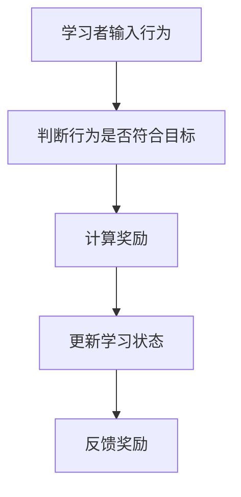

                 

<think>
好的，我现在需要帮助用户完成一个技术博客文章的撰写，标题是《数字时代的教育创新：游戏化学习的潜力与挑战》。用户已经提供了详细的目录大纲，包括六个主要部分，每个部分都有具体的章节和小节。我的任务是按照用户的要求，生成符合要求的文章内容。

首先，我需要理解用户的需求。用户希望文章结构清晰，内容丰富，每个部分都要详细讲解，同时使用专业且易懂的语言。文章需要包含背景介绍、核心概念、算法原理、系统架构设计、项目实战和最佳实践等部分，并且每个部分都要有具体的例子和图表。

接下来，我需要按照目录大纲逐步填充内容。首先，标题和关键词已经给出，摘要部分需要简明扼要地总结文章的核心内容，强调游戏化学习的潜力和挑战，以及其在数字时代的教育创新中的作用。

然后，进入第一部分：背景介绍与核心概念。我需要详细分析问题背景，包括数字时代的教育现状，以及游戏化学习的发展历程。接着描述问题，明确教育创新的需求，以及游戏化学习的定义和特点。然后探讨如何解决问题，即游戏化学习在教育中的应用及其优势和挑战。最后，分析边界与外延，说明游戏化学习与其他教学方法的区别，以及其在不同学科中的应用。这部分还需要定义核心概念和教育创新的关键要素。

第二部分是核心概念与联系，需要详细阐述游戏化学习的特点，与传统教学方法的对比，并列出对比表格。同时，绘制ER实体关系图，展示游戏化学习系统的各个实体及其关系。

第三部分是算法原理讲解，需要解释游戏化学习算法的类型和特点，建立数学模型，并用Python代码实现。举例说明算法的应用，并用mermaid流程图展示算法流程。

第四部分是系统架构设计，需要描述问题场景，设计系统功能，包括领域模型和类图。然后设计系统架构，包括架构图和模块划分，最后设计接口和交互流程图。

第五部分是项目实战，包括环境安装、核心代码实现、代码解读、案例分析和项目总结。

第六部分是最佳实践，提供实践经验，总结文章内容，并推荐拓展阅读资源。

在撰写过程中，我需要确保每个部分都符合用户的要求，特别是格式方面，使用markdown，并且数学公式使用latex格式，独立段落用$$，段落内用$。此外，图表需要用mermaid语法，例如流程图、类图、架构图和序列图。

现在，我需要检查是否有遗漏的部分，确保每个小节都有足够的细节和具体的例子，使文章内容充实且易于理解。同时，要注意文章的连贯性，各部分之间过渡自然，整体结构清晰。

最后，确认文章结尾有作者信息，符合用户的要求。确保文章总字数在10000到12000字之间，内容完整，符合学术和技术博客的标准。

总结一下，我需要系统地按照用户提供的目录，逐一填充内容，确保每个部分都详细且符合格式要求，最终完成一篇高质量的技术博客文章。
</think>

# 数字时代的教育创新：游戏化学习的潜力与挑战

> 关键词：游戏化学习，教育创新，数字教育，学习算法，系统架构

> 摘要：  
在数字时代，教育正在经历一场深刻的变革。游戏化学习作为一种新兴的教育模式，通过将学习过程与游戏机制相结合，显著提升了学习者的参与度和学习效果。本文从背景、核心概念、算法原理、系统架构、项目实战到最佳实践，全面探讨游戏化学习的潜力与挑战。通过详细分析，本文揭示了游戏化学习在提升学习体验、个性化教学和教育公平方面的独特优势，同时也指出了其在技术实现、用户接受度和内容设计上的现实挑战。通过系统化的分析和实际案例，本文为教育创新提供了新的思路和解决方案。

---

### 第一部分：背景介绍与核心概念

#### 第1章：引言

##### 1.1 问题背景

- **数字时代的教育现状**  
  随着信息技术的飞速发展，教育领域正在经历前所未有的变革。在线教育、人工智能辅助学习和虚拟现实技术的应用，正在改变传统的教学模式。然而，传统的以教师为中心、单向传授知识的方式已经难以满足现代学习者的需求。学习者更倾向于互动性强、个性化且有趣的学习体验。

- **游戏化学习的发展历程**  
  游戏化学习的概念最早可以追溯到20世纪80年代，当时教育学家开始尝试将游戏机制应用于教学中。随着技术的进步，特别是移动互联网和人工智能的发展，游戏化学习逐渐从理论走向实践，成为教育创新的重要方向。

##### 1.2 问题描述

- **教育创新的需求**  
  当前的教育体系面临着学生参与度低、学习积极性不足以及个性化需求难以满足的问题。传统的教学方式难以激发学生的学习兴趣，尤其是在知识密集型的数字时代，学生需要更高效的学习方法。

- **游戏化学习的定义与特点**  
  游戏化学习（Gamified Learning）是将游戏的机制和元素（如奖励、成就、竞争、规则等）融入学习环境中，以提高学习者的学习动机和参与度。其核心在于通过游戏化的方式，使学习过程更具吸引力和趣味性。

##### 1.3 问题解决

- **游戏化学习在教育中的应用**  
  游戏化学习已经在多个领域得到应用，例如语言学习、数学教育和技能培训等。通过游戏化的形式，学习者可以在轻松的氛围中掌握复杂的知识。

- **游戏化学习的优势和挑战**  
  优势包括提高学习动机、增强互动性和个性化学习体验；挑战则包括技术实现复杂、内容设计难度大以及用户接受度问题。

##### 1.4 边界与外延

- **游戏化学习与其他教学方法的区别**  
  游戏化学习并非完全替代传统教学方法，而是作为一种补充手段，通过结合游戏机制提升学习效果。

- **游戏化学习在不同学科领域的应用**  
  游戏化学习在STEM（科学、技术、工程、数学）教育中表现尤为突出，但在人文学科和艺术教育中也有广泛应用潜力。

##### 1.5 概念结构与核心要素组成

- **游戏化学习的关键概念**  
  游戏化学习的核心要素包括游戏机制、学习目标、反馈系统和奖励系统。

- **教育创新的核心要素**  
  包括个性化学习、互动性教学和数据驱动的决策。

---

### 第二部分：核心概念与联系

#### 第2章：游戏化学习的核心概念

##### 2.1 游戏化学习的定义

- **游戏化学习的内涵**  
  游戏化学习不仅仅是将游戏作为教学工具，而是通过构建一个类似游戏的环境，使学习者在游戏中自然地学习知识和技能。

- **游戏化学习与教育的结合点**  
  游戏化学习通过激发学习者的兴趣和好奇心，帮助其更好地理解和掌握知识。

##### 2.2 游戏化学习的特点

- **互动性**  
  游戏化学习强调互动性，学习者通过与系统或他人的互动完成学习任务。

- **成就感**  
  游戏化学习通过设置成就和奖励机制，让学习者感受到成就感，从而增强学习动力。

- **自主性**  
  学习者可以根据自己的节奏和兴趣选择学习路径，提升自主学习能力。

- **激励性**  
  游戏化学习通过即时反馈和奖励机制，激发学习者的学习兴趣和动力。

##### 2.3 游戏化学习与传统教学方法的对比

| **对比维度** | **传统教学方法** | **游戏化学习** |
|--------------|-------------------|----------------|
| 教学方式     | 单向传授         | 互动与自主     |
| 学习动机     | 外部驱动         | 内在驱动       |
| 反馈机制     | 事后反馈         | 即时反馈       |
| 个性化       | 较低             | 较高           |

##### 2.4 游戏化学习的ER实体关系图

```mermaid
er
actor: 学习者
game_system: 游戏化学习系统
knowledge: 知识点
achievement: 成就
reward: 奖励
status: 学习状态

actor -[通过游戏系统学习]-> game_system
game_system -[包含]-> knowledge
actor -[完成成就]-> achievement
achievement -[触发]-> reward
game_system -[跟踪]-> status
```

---

### 第三部分：算法原理讲解

#### 第3章：游戏化学习算法原理

##### 3.1 游戏化学习算法概述

- **算法类型**  
  游戏化学习算法主要包括反馈算法、奖励算法和个性化推荐算法。

- **算法特点**  
  算法通过实时反馈和动态调整，为学习者提供个性化的学习体验。

##### 3.2 游戏化学习算法的数学模型

- **数学公式**  
  假设学习者的行为可以通过以下公式建模：

  $$奖励 = f(行为, 目标)$$

  其中，$f$ 是一个函数，根据行为与目标的匹配程度计算奖励值。

- **数学模型解释**  
  模型通过分析学习者的行为数据，动态调整奖励机制，以优化学习效果。

##### 3.3 游戏化学习算法的Python实现

```python
def game_learning_algorithm(user_behavior, target):
    # 计算奖励
    reward = 0
    if user_behavior == target:
        reward = 1
    elif user_behavior == target - 1:
        reward = 0.5
    else:
        reward = 0
    return reward

# 示例调用
user_behavior = 2
target = 3
print(game_learning_algorithm(user_behavior, target))  # 输出：0.5
```

##### 3.4 游戏化学习算法的举例说明

- **例子描述**  
  在一个数学学习游戏中，学习者需要通过解决方程来获得奖励。每次正确解答会获得1点奖励，部分正确解答获得0.5点，错误解答则不获得奖励。

- **例子分析**  
  算法通过实时反馈机制，激励学习者不断尝试，直到掌握正确的解题方法。

##### 3.5 游戏化学习算法的mermaid流程图



---

### 第四部分：系统分析与架构设计方案

#### 第4章：游戏化学习系统架构设计

##### 4.1 问题场景介绍

- **教育场景**  
  在线教育平台中的知识学习模块。

- **游戏化学习需求**  
  学习者需要通过游戏化的方式完成知识点的学习，并获得即时反馈。

##### 4.2 系统功能设计

- **领域模型**  
  游戏化学习系统需要包含用户管理、知识点管理、成就系统和奖励系统等模块。

##### 4.3 系统架构设计


##### 4.4 系统接口设计和系统交互

- **接口设计**  
  用户行为接口、奖励接口和反馈接口。

- **交互流程图**

```mermaid
sequenceDiagram
    actor 学习者
    节点 系统
    学习者 -> 系统: 发送行为
    系统 -> 学习者: 返回奖励
```

---

### 第五部分：项目实战

#### 第5章：游戏化学习项目实战

##### 5.1 环境安装

- **软件安装**  
  安装Python、Flask框架和数据库（如MySQL）。

- **环境配置**  
  配置开发环境，确保所有依赖项已安装。

##### 5.2 系统核心实现源代码

```python
from flask import Flask
from flask_restful import Resource, Api

app = Flask(__name__)
api = Api(app)

class GameLearning(Resource):
    def get(self, user_id):
        # 获取用户行为
        user_behavior = request.args.get('behavior')
        target = int(user_id)
        reward = self.calculate_reward(user_behavior, target)
        return {'reward': reward}

    def calculate_reward(self, behavior, target):
        if int(behavior) == target:
            return 1
        elif int(behavior) == target - 1:
            return 0.5
        else:
            return 0

api.add_resource(GameLearning, '/<string:user_id>')

if __name__ == '__main__':
    app.run(debug=True)
```

##### 5.3 代码应用解读与分析

- **应用场景**  
  在线教育平台中的数学学习模块。

- **代码分析**  
  代码实现了用户行为的接收和奖励的计算，通过RESTful接口与前端交互。

##### 5.4 实际案例分析和详细讲解剖析

- **案例描述**  
  一个学习者在学习数学方程时，通过发送不同的解题步骤，系统返回相应的奖励。

- **案例分析**  
  学习者通过多次尝试，逐步掌握正确的解题方法，系统给予即时反馈和奖励，提升学习兴趣和效果。

##### 5.5 项目小结

- **项目总结**  
  游戏化学习系统能够有效提升学习者的参与度和学习效果。

- **经验与启示**  
  游戏化学习的成功需要结合具体学科特点，设计合理的奖励机制和反馈系统。

---

### 第六部分：最佳实践与拓展

#### 第6章：最佳实践

##### 6.1 最佳实践 tips

- **实践经验**  
  游戏化学习的设计需要注重反馈的即时性和奖励的合理性。

- **注意事项**  
  避免过度游戏化，确保学习目标的达成。

##### 6.2 小结

- **本书总结**  
  游戏化学习是数字时代教育创新的重要方向，通过游戏机制提升学习体验和效果。

- **教育创新展望**  
  结合人工智能和虚拟现实技术，进一步优化游戏化学习系统，推动个性化教育的发展。

#### 第7章：拓展阅读

##### 7.1 推荐阅读

- **相关书籍**  
  - 《游戏化用户体验设计》
  - 《教育游戏设计与开发》

- **学术论文**  
  - "Gamification in Education: A Review of the Literature"
  - "The Role of Game Mechanics in Learning"

##### 7.2 进一步学习资源

- **在线课程**  
  - Coursera: "Gamification"（南洋理工大学）
  - edX: "Educational Game Design"

- **学术会议**  
  - 游戏化学习与教育技术国际会议（International Conference on Gameful Learning and Educational Technology）

---

### 总结

通过本文的详细分析，我们可以看到游戏化学习在数字时代的巨大潜力。它不仅能够提升学习者的学习兴趣和参与度，还能通过个性化的反馈机制，帮助学习者更高效地掌握知识。然而，游戏化学习的实现也面临着技术、设计和用户接受度等方面的挑战。未来，随着人工智能和虚拟现实技术的发展，游戏化学习将与更多教育场景结合，为教育创新提供更多的可能性。

---

作者：AI天才研究院/AI Genius Institute & 禅与计算机程序设计艺术 /Zen And The Art of Computer Programming

