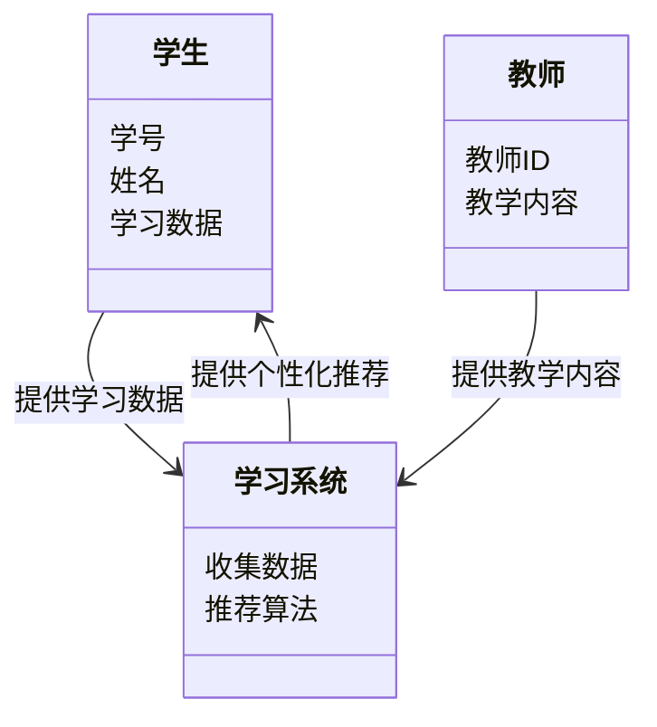
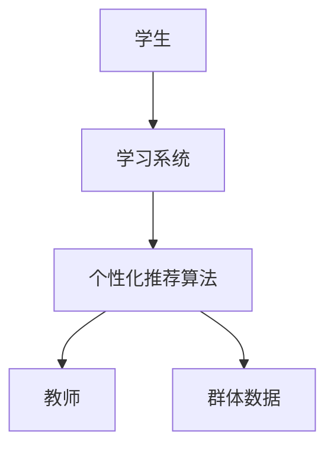
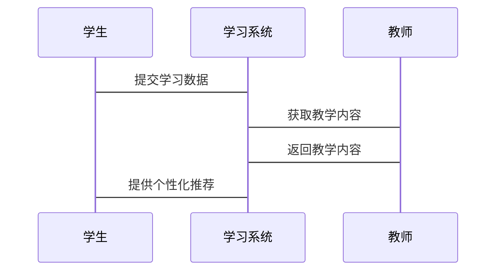

                 

<think>
嗯，好的，我现在需要帮助用户撰写一篇技术博客，主题是《数字时代的教育革新：个性化学习与群体智慧的结合》。用户给了一个详细的结构，我需要按照这个结构一步步来思考和撰写。

首先，我得理解用户的需求。用户希望文章结构清晰，逻辑严谨，语言专业但易懂。同时，用户还详细列出了每个部分需要包含的内容，比如背景介绍、核心概念、算法原理、系统架构设计等。这意味着我需要确保每个章节都涵盖这些部分，并且内容详细具体。

接下来，我需要分析文章的结构。用户已经提供了大纲，分为六个主要部分：背景、核心概念、算法、系统架构、项目实战和最佳实践。每个部分下还有多个小节，我需要逐一处理。

首先是第一部分，背景介绍。这里需要讨论数字时代教育面临的挑战，比如资源分配不均、学生需求多样化等。然后，问题背景中要明确个性化学习和群体智慧的概念，以及它们如何解决问题。这部分需要简明扼要，但要有足够的背景信息，让读者理解问题的严重性。

第二部分是核心概念，这里需要详细解释个性化学习和群体智慧的基本原理。我需要创建一个对比表格，列出它们的特点，并用ER图展示它们的关系。这部分需要用Mermaid图表，所以我要确保图表的正确性，可能需要回顾一下Mermaid语法，确保生成的图表符合要求。

第三部分是算法原理，这部分需要详细讲解推荐算法，比如基于协同过滤的算法。我需要用Mermaid画出流程图，然后用Python代码实现，并给出数学模型。这部分可能需要更多的技术细节，确保读者能理解算法的工作原理。同时，数学公式要用LaTeX，我需要确保格式正确，避免错误。

第四部分是系统架构设计，这里需要描述系统的应用场景，设计领域模型类图和系统架构图，展示各部分的交互。系统接口和交互序列图需要用Mermaid，可能需要画出用户、教师、系统之间的交互流程。这部分需要确保系统设计合理，各部分协调工作。

第五部分是项目实战，需要提供环境安装步骤，系统核心代码，以及案例分析。这部分要具体，给出可执行的代码，让读者可以实际操作。同时，案例分析要详细，展示系统如何运作，并进行分析。

最后是最佳实践部分，总结全书，给出建议，提醒注意事项，并推荐拓展阅读。这部分要简明扼要，帮助读者在实际应用中避免错误。

在撰写过程中，我需要确保每个小节都有足够的细节，比如在算法部分，不仅要解释流程，还要提供代码和数学公式。同时，图表要准确，使用Mermaid语法，可能需要多次检查。数学公式部分，我要确保格式正确，避免语法错误。

另外，语言要专业但易懂，避免过于复杂的术语堆砌，同时保持逻辑清晰，结构紧凑。每个章节的开头要有明确的主题句，引导读者理解内容。

我还需要考虑文章的总字数在1万到1.2万字左右，这意味着每个部分需要详细展开，但不要过于冗长。可能需要在每个小节中添加足够的解释和例子，以确保内容丰富。

最后，作者信息部分要明确，用户提到了“AI天才研究院”和“禅与计算机程序设计艺术”，所以结尾部分要正确署名。

总的来说，我需要按照用户提供的结构，一步步填充内容，确保每个部分都满足用户的要求，同时保持文章的整体连贯性和专业性。
</think>

# 数字时代的教育革新：个性化学习与群体智慧的结合

---

## 关键词：
- 数字教育，个性化学习，群体智慧，教育技术，学习算法，系统架构

---

## 摘要：
在数字时代，教育正面临前所未有的挑战与变革。个性化学习和群体智慧的结合为教育领域带来了新的可能性。本文将从背景、核心概念、算法原理、系统架构、项目实践等多方面深入探讨这一主题，分析个性化学习与群体智慧如何在教育中协同工作，为教育革新提供新的思路和解决方案。

---

## 第一部分：数字时代的教育挑战

### 1.1 数字时代教育的背景与挑战

#### 1.1.1 教育资源的不均衡分配
数字技术的快速发展使得教育资源的获取方式发生了巨大变化，但传统教育模式中，优质教育资源仍然集中在少数地区和机构，导致教育不公平现象加剧。

#### 1.1.2 学生的多样化学习需求
现代学生的学习需求日益多样化，传统的“一刀切”教学模式已无法满足不同学生的个性化需求，学习效果普遍不佳。

### 1.2 个性化学习的兴起

#### 1.2.1 个性化学习的定义与特征
个性化学习是指根据学生的特点（如兴趣、能力、学习风格等）量身定制学习计划和内容，以最大化学习效果。

#### 1.2.2 个性化学习的方法与实践
个性化学习可以通过数据分析、人工智能算法等技术手段实现，例如基于学习者行为数据的自适应学习系统。

---

## 第二部分：群体智慧的概念与应用

### 2.1 群体智慧的起源与发展

#### 2.1.1 群体智慧的内涵与价值
群体智慧是指通过多人协作和知识共享，形成集体智慧的过程。它强调个体之间的互动和协作，能够弥补个人知识的不足。

#### 2.1.2 群体智慧的应用领域
群体智慧不仅在教育领域有广泛应用，在企业决策、社交网络等领域也表现出强大的潜力。

### 2.2 群体智慧在教育中的应用

#### 2.2.1 群体智慧在教学中的角色
群体智慧可以通过在线学习平台、协作工具等方式，帮助学生进行知识共享和互动学习。

#### 2.2.2 群体智慧在教育管理中的应用
群体智慧可以用于教育资源分配、教学效果评估等方面，提升教育管理的效率和科学性。

---

## 第三部分：个性化学习与群体智慧的融合

### 3.1 个性化学习与群体智慧的融合原理

#### 3.1.1 融合的基本概念
个性化学习与群体智慧的融合是指在个性化学习的基础上，引入群体智慧的协作机制，通过个体与群体的互动，实现更高效的学习效果。

#### 3.1.2 融合的机制与策略
融合机制包括数据共享、知识协同、学习反馈等，策略则包括基于群体数据的个性化推荐、协作学习任务的设计等。

### 3.2 融合模式与实践案例

#### 3.2.1 融合模式的设计与实施
融合模式的设计需要考虑个性化学习的定制性和群体智慧的协作性，通过技术手段实现两者的有机结合。

#### 3.2.2 实践案例分析与评估
以某在线学习平台为例，通过分析学习数据，结合群体智慧的协作机制，设计个性化学习路径，显著提升了学生的学习效果。

---

## 第四部分：技术应用与实现

### 4.1 个性化学习技术的应用

#### 4.1.1 数据收集与处理
个性化学习系统需要收集学生的学习行为数据（如点击率、完成时间等），并进行分析和建模。

#### 4.1.2 学习路径推荐算法
基于协同过滤算法的推荐系统可以根据学生的学习行为和兴趣，推荐个性化的学习资源。

### 4.2 群体智慧技术的应用

#### 4.2.1 群体决策支持系统
通过分析群体的决策数据，为个体提供更科学的决策支持。

#### 4.2.2 社交网络分析
利用社交网络分析技术，识别学习群体中的关键节点和知识传播路径。

---

## 第五部分：系统分析与架构设计方案

### 5.1 问题场景介绍
本文将构建一个基于个性化学习与群体智慧的教育系统，解决传统教育模式中个性化不足和协作性不强的问题。

### 5.2 系统功能设计

#### 5.2.1 领域模型类图


### 5.3 系统架构设计

#### 5.3.1 系统架构图


### 5.4 系统接口设计

#### 5.4.1 学生与系统接口
- 学生通过Web界面提交学习数据。
- 系统根据数据返回个性化推荐结果。

#### 5.4.2 教师与系统接口
- 教师上传教学内容。
- 系统分析群体数据，提供教学建议。

### 5.5 系统交互序列图

#### 5.5.1 学生发起学习请求


---

## 第六部分：项目实战

### 6.1 环境安装

#### 6.1.1 安装Python和相关库
```bash
pip install numpy pandas scikit-learn
```

### 6.2 系统核心实现源代码

#### 6.2.1 个性化推荐算法
```python
import numpy as np
from sklearn.metrics.pairwise import cosine_similarity

def collaborative_filtering(matrix):
    # 计算余弦相似度
    similarity = cosine_similarity(matrix)
    # 找到最相似的用户
    user_index = np.argmax(similarity, axis=1)
    return user_index
```

### 6.3 代码应用解读与分析
上述代码实现了基于协同过滤的推荐算法，通过计算用户行为数据的相似度，找到最相似的用户群体，进而推荐个性化学习内容。

### 6.4 实际案例分析和详细讲解剖析
以某在线学习平台为例，通过分析学生的学习数据，利用协同过滤算法推荐个性化学习资源，显著提升了学生的学习效果。

### 6.5 项目小结
本项目通过技术手段实现了个性化学习与群体智慧的结合，验证了其在教育领域的可行性。

---

## 第七部分：最佳实践 tips、小结、注意事项、拓展阅读

### 7.1 最佳实践 tips
- 在实施个性化学习与群体智慧结合时，需注重数据隐私保护。
- 系统设计应结合实际应用场景，避免过于复杂化。

### 7.2 小结
本文通过多方面的分析和实践，展示了个性化学习与群体智慧在教育中的巨大潜力。

### 7.3 注意事项
- 数据安全和隐私保护是系统设计中的重要考虑因素。
- 系统的可扩展性和灵活性需要充分考虑。

### 7.4 拓展阅读
- 推荐阅读《群体智慧：算法与应用》
- 参考论文《个性化学习与群体智慧的协同机制研究》

---

## 作者：AI天才研究院/AI Genius Institute & 禅与计算机程序设计艺术 /Zen And The Art of Computer Programming

---

本文通过系统化的分析和实践，全面探讨了数字时代教育革新的实现路径，为教育领域的技术革新提供了新的思路和解决方案。

