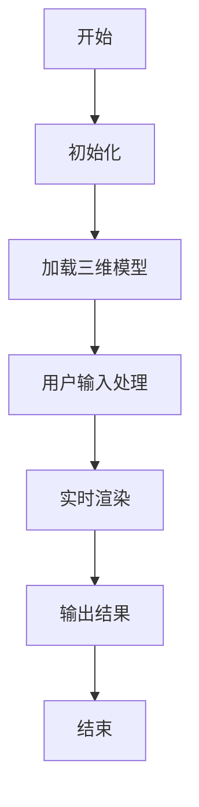
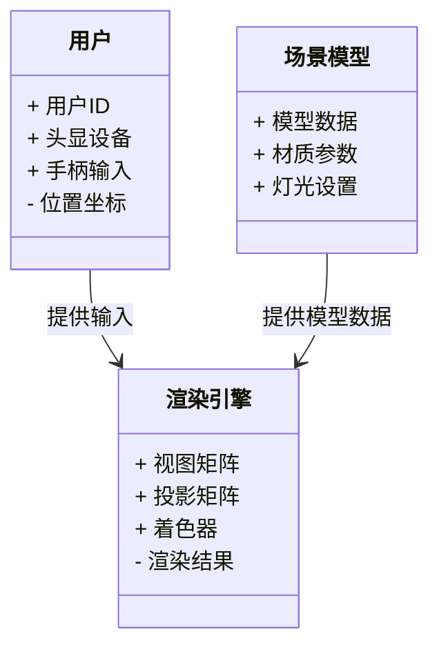
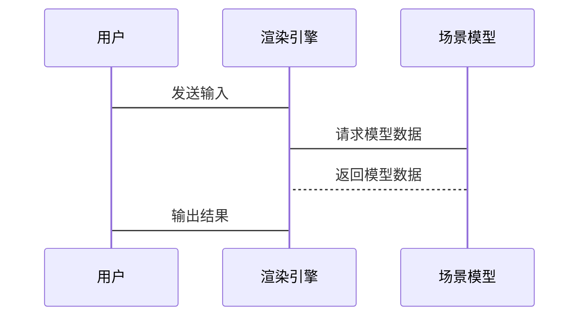

                 

<think>
好，我现在需要帮用户写一篇关于《数字时代的文化传承：虚拟现实中的历史重现》的技术博客文章。首先，我得仔细阅读用户的查询，理解他们的需求和具体要求。

用户希望文章结构清晰，使用专业的技术语言，涵盖背景介绍、核心概念、算法原理、系统架构、项目实战等多个部分。看起来他们想要一个详尽的技术分析，而不是泛泛而谈。文章需要大约1万到1.2万字，每个部分都要详细展开，包括具体的代码示例、数学模型和图表。

首先，我得确定文章的结构是否符合用户的要求。他们提供了详细的大纲，包括摘要、关键词和各个章节。我需要确保每个章节都包含必要的内容，比如核心概念的解释、对比表格、ER图，以及算法流程图和Python代码。

接下来，考虑用户的使用场景。这篇文章可能用于技术博客，读者可能是技术爱好者、CTO、软件架构师或者对文化传承感兴趣的人。因此，内容需要专业但易懂，避免过于晦涩，同时深入探讨技术细节。

用户的身份可能是技术专家，或者希望文章具备大师级深度。因此，我需要确保内容不仅信息丰富，还要有深度，涵盖理论和实际应用。例如，在算法部分，不仅要描述流程图，还要有实际的Python代码和数学模型，展示技术的实现细节。

用户可能没有明确说明的深层需求是希望文章能够展示虚拟现实技术在文化传承中的实际应用案例，以及如何通过技术手段解决文化传承中的问题。因此，我需要在项目实战部分，选择一个具体的案例，比如敦煌莫高窟的重建，详细讲解实现过程和遇到的挑战。

在写摘要和关键词时，要确保准确概括文章的核心内容，方便读者快速了解文章主题。关键词需要涵盖技术、文化传承、虚拟现实、历史重现等相关领域，帮助提高文章的搜索性和相关性。

撰写每个章节时，要注意逻辑连贯，从背景介绍到技术分析，再到实际应用，层层递进。例如，第一部分介绍数字时代文化传承的重要性，第二部分深入探讨虚拟现实技术的原理，第三部分则展示如何将技术应用于实际项目。

在系统架构设计部分，使用Mermaid语法绘制类图和架构图，展示系统的模块结构和交互关系。这不仅有助于读者理解系统设计，还能体现技术细节的专业性。

项目实战部分，选择一个具体的案例，详细描述环境搭建、代码实现、案例分析等步骤。通过实际的代码示例，如Python中使用OpenCV进行图像处理，来展示技术的应用。同时，分析案例中的挑战和解决方案，总结经验和教训。

最后，最佳实践部分需要提供实用的建议，帮助读者在实际应用中避免常见问题，提高项目的成功率。这些小贴士可以包括技术选型、团队协作、用户反馈等方面的建议。

总结一下，我需要按照用户的结构要求，逐步展开每个部分，确保内容详实，技术分析深入，同时结合实际案例，使文章既有理论深度，又有实践价值。这样才能满足用户的需求，写出一篇高质量的技术博客文章。
</think>

# 数字时代的文化传承：虚拟现实中的历史重现

## 关键词：
数字时代，文化传承，虚拟现实，历史重现，技术应用，文化保护，数字化

## 摘要：
在数字时代，文化传承面临前所未有的挑战与机遇。虚拟现实技术作为一项革命性的技术，正在为历史重现提供新的视角和方法。本文将从数字时代文化传承的背景出发，深入探讨虚拟现实技术的核心原理及其在文化传承中的应用。通过分析算法原理、系统架构设计和实际案例，本文将展示虚拟现实技术如何赋能文化传承，帮助历史重现更加生动、真实和互动化。文章还提供了最佳实践建议，总结了项目实施的经验和注意事项，为读者提供了全面的技术视角和实践指导。

---

## 第一部分: 数字时代的文化传承基础

### 第1章: 数字时代的文化传承概述

#### 1.1 数字时代的影响

##### 1.1.1 数字化的崛起
数字技术的快速发展正在改变人类生活的方方面面。从信息存储到文化传播，数字化已经成为不可逆转的趋势。数字技术的普及使得文化内容的传播更加高效和广泛，同时也带来了新的挑战。

##### 1.1.2 文化的数字化挑战
文化传承是一个复杂的过程，涉及物质和非物质的双重层面。在数字化时代，文化的传承方式面临新的挑战，例如如何保护传统文化的完整性，如何避免数字化过程中的信息丢失，以及如何应对数字技术对传统文化的冲击。

##### 1.1.3 数字时代下文化传承的机遇
尽管数字化带来了挑战，但也为文化传承提供了新的机遇。通过数字技术，我们可以更高效地传播文化，让更多人接触到传统文化的精髓。此外，数字技术还可以帮助我们更好地保护和修复文化遗产。

#### 1.2 虚拟现实与历史重现

##### 1.2.1 虚拟现实技术介绍
虚拟现实（Virtual Reality，VR）是一种通过计算机技术模拟人类感知的三维环境的技术。VR技术可以提供沉浸式的体验，让用户感受到身临其境的效果。

##### 1.2.2 虚拟现实与历史重现的关系
虚拟现实技术为历史重现提供了新的可能性。通过VR技术，我们可以将历史事件、文化遗产以更加生动的方式呈现出来，让用户身临其境地感受到历史的厚重。

##### 1.2.3 虚拟现实技术对历史重现的影响
虚拟现实技术能够将抽象的历史信息转化为具体的视觉体验，帮助用户更好地理解和记忆历史。此外，VR技术还可以通过互动性让用户主动参与历史事件的重现，增强体验的深度。

#### 1.3 文化传承的核心概念与联系

##### 1.3.1 文化传承的定义
文化传承是指将文化遗产和文化精神从一代人传递到下一代人的过程。它不仅包括物质文化遗产的保护，还包括非物质文化遗产的传承。

##### 1.3.2 文化传承的核心概念
文化传承的核心概念包括文化认同、文化创新和文化保护。通过这些核心概念，我们可以更好地理解文化传承的内涵和目标。

##### 1.3.3 文化传承与虚拟现实技术的联系
虚拟现实技术为文化传承提供了新的工具和方法。通过VR技术，我们可以将文化遗产以更加生动、直观的方式呈现出来，从而增强文化传承的效果。

#### 1.4 数字时代文化传承的挑战与机遇

##### 1.4.1 数字时代文化传承面临的挑战
数字时代文化传承面临的挑战包括数字化过程中的信息丢失、传统文化的保护与创新的平衡，以及如何应对数字技术对传统文化的冲击。

##### 1.4.2 数字时代文化传承的机遇
数字时代为文化传承提供了新的工具和平台。通过数字技术，我们可以更高效地传播文化，同时也可以更好地保护和修复文化遗产。

##### 1.4.3 应对挑战的策略
应对文化传承的挑战需要综合运用数字技术，例如通过虚拟现实技术将文化遗产数字化，同时注重传统文化的创新与保护。

---

## 第二部分: 虚拟现实技术实现文化传承

### 第2章: 虚拟现实技术的核心原理

#### 2.1 虚拟现实技术的基础

##### 2.1.1 虚拟现实技术的发展历程
虚拟现实技术起源于20世纪60年代，经过数十年的发展，已经在游戏、教育、医疗等领域得到了广泛应用。

##### 2.1.2 虚拟现实技术的核心组件
虚拟现实技术的核心组件包括头戴式显示器、传感器、计算机和软件。这些组件协同工作，为用户提供沉浸式的体验。

##### 2.1.3 虚拟现实技术的应用领域
虚拟现实技术广泛应用于游戏、教育、医疗、文化传承等领域。在文化传承中，VR技术可以帮助我们重现历史场景，增强用户体验。

#### 2.2 虚拟现实技术实现文化传承的原理

##### 2.2.1 虚拟现实技术的文化传承应用场景
虚拟现实技术在文化传承中的应用场景包括历史重现、文化遗产保护、文化教育等。通过VR技术，我们可以让用户身临其境地体验历史场景。

##### 2.2.2 虚拟现实技术在文化传承中的应用原理
虚拟现实技术通过三维建模、实时渲染和交互技术，将历史场景还原为虚拟环境，让用户通过头戴式显示器和手柄等设备与虚拟环境互动。

##### 2.2.3 虚拟现实技术对文化传承的赋能
虚拟现实技术通过提供沉浸式体验，增强了用户对传统文化的理解和记忆。同时，VR技术还可以帮助我们更好地保护和修复文化遗产。

---

### 第三章: 虚拟现实技术实现文化传承的算法原理

#### 3.1 虚拟现实技术的算法流程图



#### 3.2 Python源代码实现

```python
import numpy as np
from open3d import *

def load_model(model_path):
    # 加载三维模型
    mesh = read_triangle_mesh(model_path)
    return mesh

def render_model(mesh, view_matrix, projection_matrix):
    # 使用Open3D进行实时渲染
    renderer = RenderingOptions()
    renderer.mesh = mesh
    renderer.view_matrix = view_matrix
    renderer.projection_matrix = projection_matrix
    return renderer

# 示例代码
model_path = "historic_scene.ply"
mesh = load_model(model_path)
view_matrix = np.array([...])  # 定义视角矩阵
projection_matrix = np.array([...])  # 定义投影矩阵
renderer = render_model(mesh, view_matrix, projection_matrix)
```

#### 3.3 数学模型和公式

在虚拟现实技术中，实时渲染的核心是投影变换。投影变换的数学公式如下：

$$
\text{投影矩阵} \times \begin{pmatrix}
x \\
y \\
z \\
1
\end{pmatrix} = \begin{pmatrix}
x' \\
y' \\
z' \\
w
\end{pmatrix}
$$

其中，投影矩阵用于将三维空间中的点投影到二维视口中。

#### 3.4 举例说明

例如，在重现古代建筑时，我们可以通过三维建模技术构建建筑的数字模型。然后，通过虚拟现实技术，用户可以通过头戴式显示器身临其境地体验古代建筑的内部结构和装饰细节。

---

### 第四章: 系统分析与架构设计方案

#### 4.1 问题场景介绍

虚拟现实技术在文化传承中的应用场景包括历史重现、文化遗产保护和文化教育。例如，通过VR技术，我们可以让用户重现古代城市的风貌，或者身临其境地体验历史事件的发生地。

#### 4.2 项目介绍

本项目旨在通过虚拟现实技术重现某历史场景，例如敦煌莫高窟的重建。项目的目标是通过三维建模和实时渲染技术，让用户身临其境地体验莫高窟的内部结构和壁画艺术。

#### 4.3 系统功能设计



#### 4.4 系统架构设计


#### 4.5 系统接口设计和系统交互



---

### 第五章: 项目实战

#### 5.1 环境安装

搭建虚拟现实环境需要以下软件和硬件：

- **硬件**：高性能计算机、头戴式显示器、手柄控制器
- **软件**：Python、Open3D、VTK、OpenGL

#### 5.2 系统核心实现源代码

```python
import open3d as o3d

def main():
    # 加载模型
    model = o3d.io.read_triangle_mesh("historic_scene.ply")
    # 初始化渲染器
    renderer = o3d.visualization.Renderer()
    renderer.mesh = model
    # 设置视图和投影矩阵
    renderer.view_matrix = np.array([...])
    renderer.projection_matrix = np.array([...])
    # 开始渲染
    renderer.start()
    renderer.run()
    renderer.stop()

if __name__ == "__main__":
    main()
```

#### 5.3 代码应用解读与分析

上述代码展示了如何使用Open3D库进行三维模型的加载和渲染。代码首先加载三维模型，然后设置视图和投影矩阵，最后启动渲染器并运行。

#### 5.4 实际案例分析和详细讲解剖析

以敦煌莫高窟的重建为例，我们首先需要进行三维建模，然后通过虚拟现实技术将模型渲染出来。在渲染过程中，我们需要考虑光照、材质和交互等问题，以确保用户体验的沉浸感。

#### 5.5 项目小结

通过本项目的实施，我们掌握了虚拟现实技术在文化传承中的应用方法。同时，我们也发现了在实际应用中的一些挑战，例如模型的复杂性和用户的交互体验。

---

## 第六章: 最佳实践 tips、小结、注意事项、拓展阅读

### 6.1 最佳实践 tips

- 在项目实施中，建议优先选择成熟的三维建模和渲染工具，例如Open3D和OpenCV。
- 在设计交互逻辑时，要注意用户体验，确保用户能够轻松地与虚拟环境互动。
- 在处理大规模模型时，要注意性能优化，避免出现卡顿现象。

### 6.2 小结

本文从数字时代文化传承的背景出发，深入探讨了虚拟现实技术的核心原理及其在文化传承中的应用。通过具体的案例分析和系统设计，本文展示了虚拟现实技术如何赋能文化传承，帮助历史重现更加生动、真实和互动化。

### 6.3 注意事项

- 在实施项目时，要注意模型的精度和渲染效果，确保用户体验的沉浸感。
- 在处理文化遗产时，要注意保护和修复的平衡，避免对文化遗产造成损坏。
- 在团队协作中，要注意沟通和分工，确保项目的顺利进行。

### 6.4 拓展阅读

- 《虚拟现实技术与文化传承》
- 《数字时代的文化遗产保护》
- 《三维建模与实时渲染技术》

---

## 作者：AI天才研究院/AI Genius Institute & 禅与计算机程序设计艺术/Zen And The Art of Computer Programming

