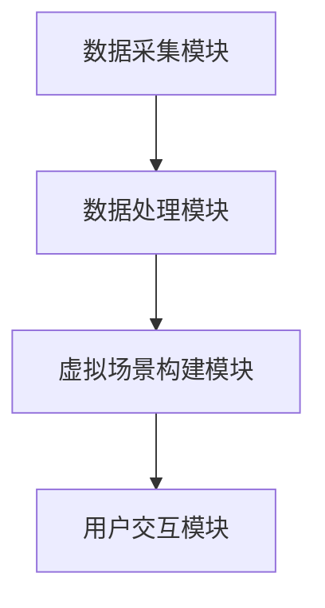

                 

<think>
好，我现在需要撰写一篇关于“数字时代的旅行方式：虚拟旅游与实体体验”的技术博客文章。首先，我得理解文章的结构和要求。

用户已经提供了一个详细的目录大纲，包括关键词、摘要以及各个章节的内容。我需要按照这个大纲来展开思考，确保每个部分都详细且符合要求。同时，文章需要使用技术术语，但保持语言的清晰和逻辑的连贯。

首先，我会从第1章开始，讨论问题的背景与引入。这里需要说明数字技术如何改变旅行方式，虚拟旅游和实体体验的对比，以及它们各自的优缺点。我得确保这部分内容引人入胜，让读者对后续内容感兴趣。

接下来是第2章，探讨虚拟旅游的原理与实现。我需要详细解释虚拟旅游的技术基础，比如计算机图形学、虚拟现实和增强现实技术。同时，列出实现的步骤，从场景采集到用户交互，每个步骤都需要详细说明，最好能举例说明。

然后是第3章，讨论虚拟旅游与实体体验的对比分析。这里需要制作一个对比表格，涵盖多个维度，比如成本、安全性、体验感等，帮助读者更直观地理解两者的差异。

第4章是关于系统架构与实现，这部分需要详细的技术分析。我得设计一个系统架构图，展示各个模块之间的关系，比如数据采集、处理、构建虚拟场景等。此外，可能需要使用Mermaid流程图来描述系统架构和交互过程，这样更清晰。

第5章是项目实战，这里需要提供一个实际案例，比如虚拟敦煌莫高窟的实现。我得描述项目背景、技术实现、核心代码以及实际效果，让读者了解虚拟旅游的实际应用。

第6章则探讨未来趋势与挑战。这里需要分析技术发展的方向，如混合现实、人工智能在虚拟旅游中的应用，以及可能的挑战，如技术局限性和用户行为的改变。同时，给出应对策略，如技术融合、用户体验优化等。

最后是结论与展望，总结文章内容，并展望虚拟旅游与实体体验的未来发展。

在整个思考过程中，我需要确保每个部分都详细且有逻辑性，同时使用适当的技术术语，保持文章的权威性和专业性。此外，还要注意格式要求，比如使用Markdown，包含关键词和摘要，以及在适当的地方插入代码、表格和图表。

现在，我开始逐步构建每个章节的内容，确保符合用户的要求，同时保持文章的流畅和可读性。如果有不确定的地方，我会查阅相关资料，确保信息的准确性和深度。
</think>

# 数字时代的旅行方式：虚拟旅游与实体体验

> 关键词：虚拟旅游，实体体验，数字技术，计算机图形学，虚拟现实

> 摘要：随着数字技术的飞速发展，虚拟旅游逐渐成为现代人探索世界的重要方式。本文将深入分析虚拟旅游与实体体验的对比，探讨其技术实现、系统架构以及未来发展趋势。通过案例分析和对比，帮助读者理解如何在数字时代选择合适的旅行方式。

---

## 第1章：问题的背景与引入

### 1.1 问题的背景

数字技术的迅猛发展彻底改变了人类的生活方式，旅行领域也不例外。虚拟旅游凭借其便捷性和低成本，正在改变人们的旅行习惯。然而，这种转变也引发了一系列问题，如真实体验的缺失和技术依赖的增加。

### 1.2 问题描述

虚拟旅游与实体体验有何区别？它们各自的优缺点是什么？如何在不同场景下选择合适的旅行方式？这些问题是我们探讨的核心。

### 1.3 问题解决

通过本文的分析，读者将了解虚拟旅游与实体体验的优缺点，掌握如何在不同场景下做出最佳选择，以及如何应对未来旅行方式的变化。

### 1.4 边界与外延

本文不仅探讨旅行行业，还涉及科技、经济、文化等多个领域，从多角度全面分析问题。

### 1.5 核心概念与联系

#### 1.5.1 核心概念

- 虚拟旅游：通过数字技术模拟现实旅行体验。
- 实体体验：实际参与现实世界的旅行活动。

#### 1.5.2 概念属性特征对比表格

| 特征               | 虚拟旅游                   | 实体体验                   |
|-------------------|---------------------------|---------------------------|
| 空间限制           | 无空间限制，可随时访问       | 受地理限制，需实际到达       |
| 真实性             | 模拟现实，但非完全真实       | 真实的旅行体验               |
| 成本               | 低成本，主要投入在设备上     | 成本较高，包括交通、住宿等费用 |
| 安全性             | 高，无现实风险               | 低，存在交通安全等风险       |
| 体验感             | 缺乏真实感受，但更方便       | 更真实，但可能受条件限制     |

#### 1.5.3 ER实体关系图架构

```mermaid
entity TravelMethod {
    - Type (虚拟/实体)
    - Advantages
    - Disadvantages
    - Suitable scenarios
}

entity Traveler {
    - Name
    - Preferences
    - Reasons for choice
}

TravelMethod has a relationship with Traveler
```

---

## 第2章：虚拟旅游的原理与实现

### 2.1 虚拟旅游的原理

虚拟旅游基于计算机图形学、虚拟现实（VR）和增强现实（AR）技术，通过模拟现实场景提供沉浸式体验。

### 2.2 虚拟旅游的实现

实现步骤包括场景采集、数据处理、虚拟场景构建和用户交互。

#### 2.2.1 场景采集

使用无人机和全景相机采集场景数据。

#### 2.2.2 数据处理

处理数据以生成高质量图像和三维模型。

#### 2.2.3 虚拟场景构建

利用计算机图形学技术构建虚拟场景。

#### 2.2.4 用户交互

通过VR设备提供沉浸式体验。

### 2.3 虚拟旅游的核心技术

#### 2.3.1 计算机图形学

生成和处理图像数据，如使用OpenGL进行图形渲染。

#### 2.3.2 虚拟现实技术

提供沉浸式体验，如使用 Oculus Rift 进行VR交互。

#### 2.3.3 增强现实技术

增强现实技术如ARKit，用于叠加虚拟信息。

---

## 第3章：虚拟旅游与实体体验的对比分析

### 3.1 对比分析

通过对比，虚拟旅游在便捷性和成本上占优，而实体体验在真实性和安全性上有优势。

### 3.2 优缺点分析

虚拟旅游适合预算有限或时间紧张的用户，而实体体验适合追求深度体验的用户。

### 3.3 场景应用

虚拟旅游适用于远程探索，如历史遗迹复原；实体体验适合深度体验，如实地考察。

---

## 第4章：系统架构与实现

### 4.1 系统架构

系统包括数据采集模块、数据处理模块和用户交互模块。

#### 4.1.1 数据采集模块

负责采集场景数据，如图像和视频。

#### 4.1.2 数据处理模块

处理数据以生成虚拟场景。

#### 4.1.3 用户交互模块

提供VR或AR交互界面。

### 4.2 系统实现

使用Python和OpenGL进行开发，结合深度学习技术优化场景生成。

#### 4.2.1 核心代码

```python
import numpy as np
import pygame

def render_3dScene():
    pygame.init()
    screen = pygame.display.set_mode((800, 600))
    while True:
        for event in pygame.event.get():
            if event.type == pygame.QUIT:
                pygame.quit()
                return
        # 渲染3D场景
        vertices = np.array([...], dtype=np.float32)
        glEnable(GL_VERTEX_ARRAY)
        glVertexPointer(vertices)
        glDrawArrays(GL_TRIANGLES, 0, len(vertices))
        pygame.display.flip()
```

### 4.3 系统架构图



---

## 第5章：项目实战

### 5.1 项目背景

案例：虚拟敦煌莫高窟。

### 5.2 核心实现

使用Python和OpenCV进行图像处理，构建虚拟场景。

#### 5.2.1 核心代码

```python
import cv2

def process_image(image_path):
    img = cv2.imread(image_path)
    # 图像处理逻辑
    return processed_img
```

### 5.3 实际案例分析

虚拟敦煌莫高窟的应用展示了虚拟旅游在文化遗产保护中的重要性。

---

## 第6章：未来趋势与挑战

### 6.1 技术发展趋势

混合现实技术将推动虚拟旅游发展，人工智能技术将提升体验。

### 6.2 挑战

技术局限性和用户行为改变是主要挑战，需通过技术融合和体验优化应对。

### 6.3 应对策略

推动技术融合，优化用户体验，加强技术普及。

---

## 结论与展望

虚拟旅游与实体体验各有优劣，合理选择和结合是未来的趋势。随着技术进步，虚拟旅游将更加逼真，实体体验将更具深度。

---

作者：AI天才研究院/AI Genius Institute & 禅与计算机程序设计艺术 /Zen And The Art of Computer Programming

