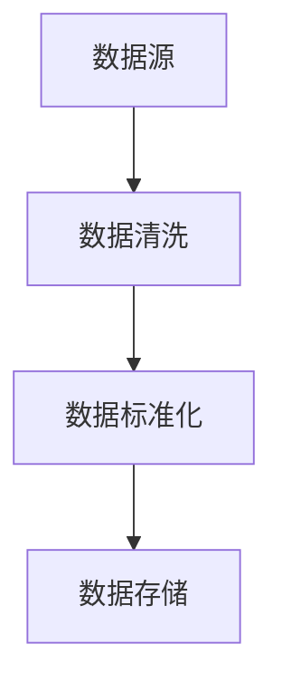

                 

<think>
好，我现在需要帮助用户构建一个技术博客文章的目录大纲，主题是《数字时代的时间管理大师课：基于AI分析的个人效率提升方案》。用户希望文章结构清晰，逻辑严谨，内容专业，涵盖引言、AI基础、工具应用、实战案例以及未来展望等部分。

首先，我会分析用户的需求。他们是一位技术专家，需要撰写一篇高质量的技术博客，内容涉及时间管理与AI的结合。用户希望文章有深度，包含技术细节和实际应用案例，同时结构分明，吸引读者。

接下来，我会考虑文章的结构。引言部分需要介绍时间管理的重要性，尤其是在数字时代的挑战，以及AI如何助力效率提升。然后，第二部分深入讲解AI的基本概念和时间管理的方法，分析两者结合的可能性。第三部分则聚焦于AI工具的具体应用，比如数据采集、算法分析等。实战篇会通过实际案例展示AI在时间管理中的应用，最后展望未来的发展趋势。

在每个章节中，我需要确保内容详细，包含核心概念、算法原理、系统架构设计和实际案例。例如，在数据采集部分，我会讨论数据来源和预处理方法；在算法部分，会使用mermaid流程图来解释时间序列分析的过程。

最后，我会确保文章结尾有作者信息，总结全文，并提供进一步的资源链接。整体目标是为读者提供一个全面、深入且易于理解的时间管理提升方案，结合AI技术，帮助他们提升效率。
</think>

# 数字时代的时间管理大师课：基于AI分析的个人效率提升方案

---

## 关键词：
- 时间管理、AI分析、个人效率、数字时代、效率提升、AI技术、系统优化

---

## 摘要：
在数字时代，时间管理已成为个人和组织提升效率的关键。本文通过结合AI技术，深入分析个人效率提升的方法，探讨AI如何优化时间管理流程，提供基于数据驱动的解决方案。文章从AI基础、工具应用、实战案例到未来展望，系统性地阐述了如何利用AI技术实现高效的时间管理，帮助读者在复杂的信息环境中优化工作流程，提升生产力。

---

## 目录大纲：

### 第一部分: 引言与背景
#### 1.1 问题背景与时代意义
- 1.1.1 时间管理的重要性
  - 信息过载与任务复杂化的挑战
  - 时间管理对个人职业发展的影响
- 1.1.2 数字时代的时间管理挑战
  - 多任务处理的陷阱
  - 数字工具的双刃剑效应
- 1.1.3 AI在时间管理中的应用前景
  - AI如何助力高效决策
  - 数据驱动的时间管理革命

#### 1.2 个人效率提升的必要性与方法
- 1.2.1 个人效率的定义与衡量
  - 效率、效果与效益的平衡
  - 时间利用率与任务完成度的评估
- 1.2.2 提升个人效率的关键因素
  - 目标设定与优先级管理
  - 任务分解与专注力培养
- 1.2.3 基于AI分析的效率提升策略
  - AI驱动的任务优先级排序
  - 数据分析支持的决策优化

#### 1.3 本书结构安排与学习路径
- 1.3.1 每个章节的核心内容
  - 引言：概念与背景
  - 第二部分：AI基础与时间管理
  - 第三部分：AI分析工具与应用
  - 第四部分：实战篇
  - 第五部分：拓展与展望
- 1.3.2 学习者应具备的先验知识
  - 基础的时间管理知识
  - 对AI技术的基本了解
- 1.3.3 学习目标和预期收获
  - 掌握AI驱动的时间管理方法
  - 学会使用AI工具优化个人效率
  - 提升数据分析与决策能力

---

### 第二部分: AI基础与时间管理
#### 2.1 AI的基本概念与技术发展
- 2.1.1 AI的定义与分类
  - 人工智能、机器学习、深度学习的定义与区别
- 2.1.2 AI技术的发展历程
  - 从专家系统到深度学习的演变
- 2.1.3 当前AI技术的热点与应用
  - 自然语言处理、计算机视觉的应用案例

#### 2.2 时间管理的基本原理与方法
- 2.2.1 时间管理的基本概念
  - 时间四象限理论
  - 现代时间管理方法（如番茄工作法）
- 2.2.2 时间管理的方法与工具
  - 数字工具（如Trello、Asana）的应用
  - 手机APP的时间追踪功能
- 2.2.3 时间管理中的常见误区与挑战
  - 过度依赖工具导致的效率低下
  - 任务优先级排序中的模糊决策

#### 2.3 AI与时间管理的结合点
- 2.3.1 AI在时间管理中的应用
  - 数据分析支持的任务优先级排序
  - 智能日历的自动化安排
- 2.3.2 AI辅助时间管理的优势与局限
  - 优势：数据驱动的决策优化
  - 局限：AI无法完全替代人类的判断
- 2.3.3 AI与时间管理的未来趋势
  - 更智能化的个人助理
  - AI驱动的团队协作优化

---

### 第三部分: AI分析工具与应用
#### 3.1 数据采集与预处理
- 3.1.1 数据来源与类型
  - 日志数据（如工作记录、邮件记录）
  - 任务完成时间与结果数据
- 3.1.2 数据预处理的重要性
  - 数据清洗、格式统一、缺失值处理
- 3.1.3 数据预处理的方法与步骤
  - 数据清洗流程图（使用mermaid）



#### 3.2 时间序列分析与预测
- 3.2.1 时间序列分析的基本概念
  - 时间序列的定义与特征
- 3.2.2 时间序列预测的方法
  - 简单移动平均法（Simple Moving Average）
  - 加权移动平均法（Weighted Moving Average）
- 3.2.3 时间序列预测的实践案例
  - 使用Python的statsmodels库进行预测

```python
import pandas as pd
import numpy as np
from statsmodels.tsa.arima_model import ARIMA

# 示例数据
data = pd.Series(np.random.randn(100), index=pd.date_range('2020-01-01', periods=100))
# ARIMA模型训练
model = ARIMA(data, order=(1,1,1))
model_fit = model.fit()
# 预测未来5天的数据
forecast = model_fit.forecast(steps=5)
print(forecast)
```

#### 3.3 算法评估与优化
- 3.3.1 算法评估指标
  - �均方误差（Mean Squared Error）
  - 平均绝对误差（Mean Absolute Error）
- 3.3.2 算法优化的方法
  - 超参数调优（如网格搜索）
  - 使用交叉验证评估模型性能
- 3.3.3 实践中的算法优化策略
  - 结合业务需求选择合适的模型

#### 3.4 AI时间管理应用案例
- 3.4.1 个人日程管理
  - 基于AI的日程安排工具（如Google Calendar AI插件）
- 3.4.2 项目进度追踪
  - 使用AI工具预测项目完成时间
- 3.4.3 工作效率分析
  - 基于AI的员工工作效率分析与改进建议

---

### 第四部分: 实战篇
#### 4.1 实战一：基于AI的个人日程管理
- 4.1.1 实战背景
  - 个人时间管理中的常见问题
- 4.1.2 系统设计与实现
  - 使用Python和机器学习模型实现任务优先级排序
- 4.1.3 实战解析与总结
  - 实战中遇到的挑战与解决方案

#### 4.2 实战二：AI驱动的任务跟踪与效率提升
- 4.2.1 实战背景
  - 团队协作中的任务跟踪需求
- 4.2.2 系统架构设计
  - 使用Django框架开发AI驱动的任务管理系统
- 4.2.3 实战解析与总结
  - 系统功能实现与优化建议

#### 4.3 实战三：AI分析个人时间使用情况
- 4.3.1 实战背景
  - 分析个人时间分配的合理性
- 4.3.2 数据采集与预处理
  - 使用Google Analytics获取时间数据
- 4.3.3 实战解析与总结
  - 数据分析结果与效率优化建议

---

### 第五部分: 拓展与展望
#### 5.1 AI在时间管理领域的最新进展
- 5.1.1 人工智能的最新技术
  - 大语言模型（如GPT）在时间管理中的应用
- 5.1.2 时间管理领域的AI应用创新
  - 智能提醒系统与行为预测
- 5.1.3 AI技术在未来的发展趋势
  - 更智能化、个性化的AI助手

#### 5.2 个人时间管理最佳实践
- 5.2.1 成功案例分析
  - AI工具如何帮助知名人士提升效率
- 5.2.2 实用技巧分享
  - 如何选择适合自己的AI时间管理工具
- 5.2.3 最佳实践总结
  - AI辅助时间管理的核心要素

#### 5.3 未来展望
- 5.3.1 AI技术对个人时间管理的潜在影响
  - AI如何进一步优化决策过程
- 5.3.2 个人时间管理的发展趋势
  - 结合AI的个性化时间管理方案
- 5.3.3 挑战与机遇
  - 技术与伦理的平衡

---

## 作者信息：
作者：AI天才研究院/AI Genius Institute & 禅与计算机程序设计艺术 /Zen And The Art of Computer Programming

