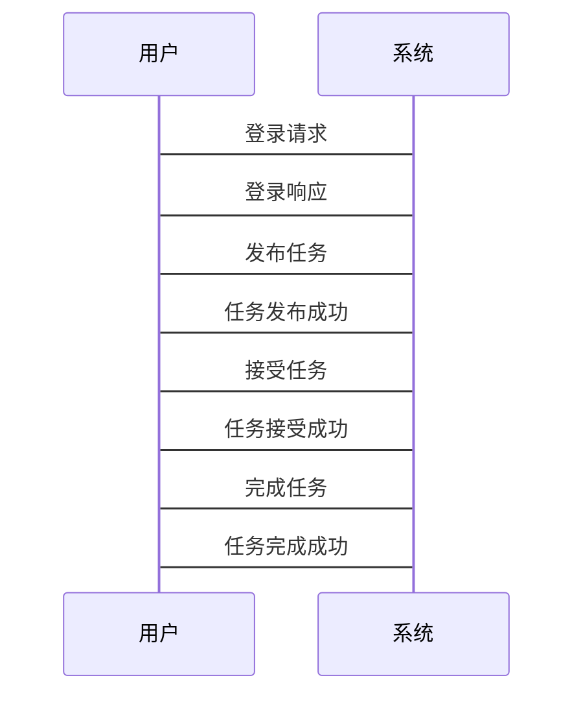

                 

<think>
嗯，我现在要写一篇关于《数字时代的时间银行2.0：基于区块链的社区互助系统》的技术博客。首先，我需要理解这个主题的核心内容。时间银行是一种通过存储和交换时间来提供互助服务的模式，而区块链技术可以为这个系统提供信任和透明度。

首先，我应该从背景介绍开始。数字时代带来了高效的数据处理和互联互通，但也带来了新的挑战，比如信任缺失和数据安全问题。时间银行作为一种互助模式，可以解决这些问题。区块链技术的出现，为时间银行的数字化转型提供了可能，因为它具备去中心化、不可篡改和透明的特点。

接下来，我需要解释核心概念与联系。时间银行的基本原理是用户存储时间，用于换取其他人的服务或资源。而区块链技术通过智能合约和分布式账本，确保交易的透明和不可篡改。这两者的结合，使得时间银行更加高效和可信。

然后是算法原理讲解。区块链的核心算法包括共识算法、加密算法和哈希算法。共识算法如工作量证明（PoW）和权益证明（PoS）确保所有节点达成一致；加密算法如RSA用于保护用户隐私；哈希算法如SHA-256用于生成区块的唯一标识。这些算法共同保证了区块链的安全性和可靠性。

接下来是数学模型和公式。时间银行可以建立一个积分系统，用户通过提供服务获得积分，消费积分换取其他服务。积分的计算可以基于用户提供的服务时间和质量。利用数学模型，我们可以量化这些交易，并通过区块链确保积分的公平分配和转移。

在系统设计部分，我需要分析系统的功能和架构。系统需要支持用户注册、登录，发布任务，接受任务，管理积分等功能。架构上，可以采用分层设计，包括数据层、业务逻辑层和用户界面层。使用Mermaid图可以清晰展示系统的组件和交互流程。

项目实战部分，我需要展示如何实现这个系统。首先，环境安装包括选择合适的区块链平台，如以太坊，然后配置开发环境。核心实现包括用户模块、任务模块和积分模块的开发。通过代码示例，详细讲解每个功能的实现细节。

最后，最佳实践、小结、注意事项和拓展阅读部分，总结项目中的经验教训，提供优化建议，提醒读者注意常见的问题，比如隐私保护和系统维护等。

总的来说，这篇文章需要结构清晰，逻辑严谨，内容详实。每个部分都要深入分析，确保读者能够理解时间银行和区块链技术的结合，以及如何实际应用到社区互助系统中。
</think>

# 数字时代的时间银行2.0：基于区块链的社区互助系统

> **关键词**: 区块链, 时间银行, 社区互助, 数字化, 区块链技术, 社会信任, 分布式系统

> **摘要**: 本文探讨了数字时代下时间银行的演变及其与区块链技术的结合。通过区块链技术构建社区互助系统，解决了传统时间银行中的信任和效率问题。文章详细介绍了区块链的核心算法、数学模型、系统设计及实际项目实现，展示了如何通过技术创新提升社区互助的效率和安全性。

---

## 第一部分：数字时代与时间银行概述

### 第1章：数字化时代的到来与挑战

#### 1.1 数字化时代的特征与影响

数字时代带来了数据的爆炸性增长和高效处理能力，改变了人们的日常生活方式。区块链技术作为数字化时代的新兴技术，通过去中心化和不可篡改的特性，为社会信任机制提供了新的解决方案。

#### 1.2 时间银行的概念与运作原理

时间银行是一种通过存储和交换时间来提供互助服务的模式。用户通过提供服务获得积分，积分可以用于兑换其他用户的服务或资源。其核心在于通过共享资源和技能，建立一个互助型的社会网络。

#### 1.3 数字化时间银行的需求与意义

在数字化时代，时间银行需要更加高效和透明的系统来支持其运作。区块链技术能够提供一个不可篡改的记录系统，确保交易的透明和安全，从而提升时间银行的可信度和效率。

### 第2章：区块链技术基础

#### 2.1 区块链的定义与基本结构

区块链是一种分布式账本技术，由多个区块组成，每个区块包含交易数据和区块头信息。区块通过哈希指针连接，形成一条不可篡改的链式结构。

#### 2.2 区块链的核心技术

##### 2.2.1 共识算法

共识算法是区块链的核心，用于确保所有节点达成一致。常见的共识算法包括工作量证明（PoW）和权益证明（PoS）。

##### 2.2.2 加密算法

加密算法用于保护数据的隐私和安全。RSA算法是一种常用的公钥加密算法，用于实现数据的加密和解密。

##### 2.2.3 哈希算法

哈希算法用于生成数据的唯一标识。SHA-256是一种常用的哈希函数，用于生成区块的唯一哈希值。

### 第3章：时间银行与区块链技术的结合

#### 3.1 区块链在时间银行中的应用

区块链技术可以用于记录时间银行中的交易，确保交易的透明和不可篡改。通过智能合约，可以自动执行交易的条件，减少中间人的信任成本。

#### 3.2 区块链技术在社区互助中的作用

区块链技术通过去中心化和透明性，解决了传统社区互助中的信任问题。用户可以在区块链上直接进行交易，无需依赖中间机构。

#### 3.3 数字化时间银行的优势与挑战

数字化时间银行的优势在于高效、透明和安全。然而，区块链技术的应用也面临技术复杂性和监管问题等挑战。

---

## 第二部分：社区互助系统设计与实现

### 第4章：系统需求分析与设计

#### 4.1 社区互助系统需求分析

##### 4.1.1 用户角色与功能需求

系统需要支持用户注册、登录、发布任务、接受任务和管理积分等功能。

##### 4.1.2 数据管理需求

系统需要记录用户的交易历史、积分和任务状态等数据。

##### 4.1.3 安全性需求

系统需要确保用户数据的安全性和隐私性，防止数据泄露和篡改。

#### 4.2 系统功能设计

##### 4.2.1 用户注册与登录

用户通过注册和登录功能，可以访问系统中的其他功能。

##### 4.2.2 任务发布与接受

用户可以发布任务，并指定任务的条件和报酬。其他用户可以接受任务，并完成任务以获得积分。

##### 4.2.3 积分管理

系统根据用户完成任务的情况，自动计算和分配积分。积分可以用于兑换其他用户的服务或资源。

### 第5章：系统架构设计

#### 5.1 系统架构概述

系统采用分层架构设计，包括数据层、业务逻辑层和用户界面层。

##### 5.1.1 系统架构设计原则

系统架构设计应遵循模块化、可扩展性和安全性原则。

##### 5.1.2 系统架构组件

系统主要组件包括用户模块、任务模块、积分模块和区块链模块。

#### 5.2 系统接口设计

##### 5.2.1 API接口设计

系统需要设计RESTful API接口，用于与其他系统的交互。

##### 5.2.2 数据接口设计

系统需要设计数据库接口，用于存储和管理用户数据。

#### 5.3 系统交互设计

##### 5.3.1 用户交互流程

用户通过登录、发布任务、接受任务和管理积分等流程，完成社区互助的全过程。

##### 5.3.2 系统交互Mermaid序列图



### 第6章：区块链技术的应用与实现

#### 6.1 区块链技术在社区互助系统中的具体应用

区块链技术用于记录和验证交易，确保交易的透明和不可篡改。通过智能合约，可以自动执行交易的条件，减少人为干预。

#### 6.2 区块链实现的核心技术

##### 6.2.1 共识算法实现

使用工作量证明（PoW）或权益证明（PoS）算法，确保区块链网络中的节点达成一致。

##### 6.2.2 加密算法实现

使用RSA加密算法，保护用户数据的隐私和安全。

##### 6.2.3 哈希算法实现

使用SHA-256哈希算法，生成数据的唯一哈希值，确保数据的完整性和不可篡改性。

### 第7章：项目实战

#### 7.1 环境安装与配置

##### 7.1.1 系统环境要求

需要安装Python、区块链开发框架（如以太坊）和相关开发工具。

##### 7.1.2 环境搭建步骤

1. 安装Python和必要的库。
2. 安装区块链开发框架。
3. 配置开发环境，如IDE和虚拟环境。

#### 7.2 系统核心实现源代码

##### 7.2.1 用户注册模块

```python
def register(user, password):
    # 加密密码
    hashed_password = hash(password)
    # 发送注册请求到区块链节点
    tx_hash = send_transaction('register', user, hashed_password)
    return tx_hash
```

##### 7.2.2 任务发布模块

```python
def publish_task(task_id, description, reward):
    # 发布任务
    tx_hash = send_transaction('publish_task', task_id, description, reward)
    return tx_hash
```

##### 7.2.3 积分管理模块

```python
def update积分(user,积分):
    # 更新用户积分
    tx_hash = send_transaction('update积分', user,积分)
    return tx_hash
```

#### 7.3 代码应用解读与分析

##### 7.3.1 用户注册代码解读

用户注册功能通过加密用户密码，并发送注册交易到区块链节点，确保用户的注册信息不可篡改。

##### 7.3.2 任务发布代码解读

任务发布功能通过发送交易到区块链节点，记录任务的详细信息，确保任务信息的透明和不可篡改。

##### 7.3.3 积分管理代码解读

积分管理功能通过发送交易到区块链节点，更新用户的积分，确保积分的公平分配和转移。

#### 7.4 实际案例分析与讲解

##### 7.4.1 案例介绍

假设有一个社区互助系统，用户A需要帮助搬家，发布任务并提供积分作为报酬。用户B接受任务并完成搬家，获得积分。

##### 7.4.2 案例解析

1. 用户A在系统中发布搬家任务，指定积分报酬。
2. 用户B接受任务并完成搬家。
3. 系统自动更新用户的积分，用户B获得积分，用户A的任务状态标记为完成。

##### 7.4.3 案例扩展

通过区块链技术，系统的交易记录可以在整个网络中被验证，确保交易的透明和不可篡改。用户可以通过区块链浏览器查看交易的详细信息。

### 第8章：最佳实践与总结

#### 8.1 最佳实践 tips

##### 8.1.1 系统优化建议

1. 定期进行系统维护和更新，确保系统的安全性和稳定性。
2. 使用高效的共识算法，减少交易确认的时间。

##### 8.1.2 安全性提升策略

1. 加强用户身份验证，防止恶意攻击。
2. 定期进行安全审计，发现和修复潜在的安全漏洞。

#### 8.2 小结

##### 8.2.1 主要内容回顾

本文详细介绍了数字时代下时间银行的演变及其与区块链技术的结合。通过区块链技术构建社区互助系统，解决了传统时间银行中的信任和效率问题。

##### 8.2.2 读者需知事项

读者需要具备一定的区块链技术和系统设计知识，以便更好地理解和实现基于区块链的社区互助系统。

#### 8.3 注意事项

##### 8.3.1 常见问题解答

1. 区块链技术如何确保交易的透明和不可篡改？答：通过区块链的分布式账本和哈希算法，确保每个交易都被记录在多个节点上，并通过哈希值验证数据的完整性。

2. 系统的安全性如何保障？答：通过加密算法和身份验证机制，确保用户数据的安全性和隐私性。

##### 8.3.2 使用与维护技巧

1. 在开发和部署系统时，建议使用专业的开发工具和框架，以提高开发效率。
2. 定期进行系统备份和数据恢复，防止数据丢失和系统故障。

#### 8.4 拓展阅读

1. 加入相关的技术社区，获取更多的技术资料和经验分享。
2. 关注区块链技术的最新发展，了解其在其他领域的应用和创新。

---

## 作者

作者：AI天才研究院/AI Genius Institute & 禅与计算机程序设计艺术 /Zen And The Art of Computer Programming

