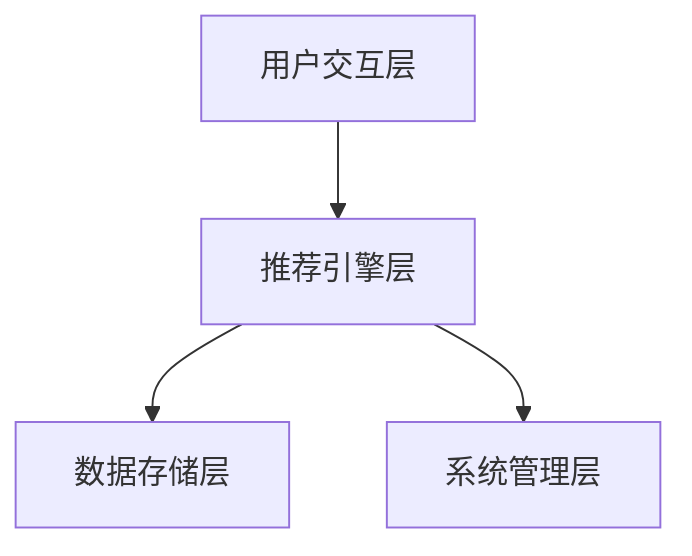

                 

<think>
嗯，用户希望我写一篇关于“数字时代的智能图书馆：AI图书推荐系统开发与应用”的技术博客。他提供了一个详细的结构，包括关键词、摘要，以及各个章节的内容。我需要确保文章符合他的要求，包括使用markdown格式，每个章节都有详细的分析，包含技术细节、算法、系统设计等。

首先，我要理解整个结构。文章分为三大部分，每个部分有几章，每章又有细分内容。关键词部分需要涵盖核心概念，比如数字图书馆、人工智能、推荐系统等。摘要要简明扼要，概述文章的主要内容和目标。

接下来，每个章节需要详细展开。比如在背景介绍中，我需要涵盖数字图书馆的发展历史，智能图书馆的概念，以及其优势和挑战。核心概念部分，要详细讲解信息检索、数据挖掘和机器学习的基本原理和应用。

在算法部分，协同过滤和内容过滤是重点，需要解释它们的工作原理，并通过数学公式和mermaid流程图来辅助说明。系统设计章节则需要讨论系统架构、数据存储与管理，以及接口设计，可能需要使用UML图来展示类结构。

开发实践部分，我需要提供具体的代码示例，如协同过滤算法的Python实现，并解释代码的功能和应用场景。案例分析则需要通过实际例子来展示AI推荐系统在智能图书馆中的应用效果。

最后，未来展望部分要讨论技术趋势和潜在挑战，同时提出可能的解决方案。整个过程中，我需要确保语言专业且易于理解，每个部分都包含足够的技术细节和实际应用示例。

现在，我需要按照这个结构一步步编写文章，确保每个部分都符合用户的要求，包括使用正确的格式和必要的技术元素，如数学公式、mermaid图表和代码示例。
</think>

# 数字时代的智能图书馆：AI图书推荐系统的开发与应用

---

## 关键词：
数字图书馆、人工智能、图书推荐系统、协同过滤、机器学习、系统架构、算法实现

---

## 摘要：
在数字时代，智能图书馆的概念逐渐崛起，其核心在于利用人工智能技术提升用户体验。AI图书推荐系统通过分析用户行为和图书内容，实现个性化推荐，极大提升了图书馆的服务效率和用户满意度。本文从背景、算法原理、系统设计到实际应用，全面解析AI图书推荐系统的开发与应用，并通过案例分析和最佳实践，探讨其在未来图书馆服务中的潜力与挑战。

---

## 目录大纲：

1. 引言  
   - 1.1 书籍背景介绍  
   - 1.2 阅读对象  
   - 1.3 目标与结构  

2. 第1部分：数字时代的智能图书馆  
   - 第1章：背景介绍  
     - 2.1 数字图书馆的起源与发展  
     - 2.2 智能图书馆的概念  
     - 2.3 智能图书馆的优势与挑战  
   - 第2章：核心概念  
     - 2.4 信息检索  
     - 2.5 数据挖掘  
     - 2.6 机器学习  
   - 第3章：发展趋势  
     - 2.7 人工智能技术的最新进展  
     - 2.8 智能图书馆的未来趋势  
     - 2.9 行业应用案例  

3. 第2部分：AI图书推荐系统  
   - 第4章：算法原理  
     - 3.1 协同过滤  
     - 3.2 内容过滤  
     - 3.3 混合推荐系统  
   - 第5章：系统设计  
     - 3.4 系统架构  
     - 3.5 数据存储与管理  
     - 3.6 系统接口设计  
   - 第6章：开发实践  
     - 3.7 环境搭建  
     - 3.8 核心算法实现  
     - 3.9 系统测试与优化  

4. 第3部分：应用与拓展  
   - 第7章：案例分析  
     - 4.1 智能图书馆案例  
     - 4.2 AI图书推荐系统案例  
   - 第8章：最佳实践  
     - 4.3 用户行为分析  
     - 4.4 数据隐私保护  
     - 4.5 个性化推荐策略  
   - 第9章：未来展望  
     - 4.6 技术创新趋势  
     - 4.7 应用前景  
     - 4.8 发展挑战与对策  

---

## 引言

随着信息技术的飞速发展，数字图书馆的概念逐渐普及，而智能图书馆作为其高级形态，借助人工智能技术，为用户提供更加智能化的服务。AI图书推荐系统是智能图书馆的核心组成部分，通过分析用户行为和图书内容，实现个性化推荐，极大提升了图书馆的服务效率和用户满意度。本文将从背景、算法原理、系统设计到实际应用，全面解析AI图书推荐系统的开发与应用。

---

## 第1部分：数字时代的智能图书馆

### 第1章：背景介绍

#### 2.1 数字图书馆的起源与发展

数字图书馆起源于20世纪90年代，随着互联网技术的发展，数字图书馆逐渐从传统图书馆的补充角色转变为独立的服务模式。数字图书馆通过数字化存储和网络分发，打破了传统图书馆的空间限制，为用户提供了更加便捷的服务。

#### 2.2 智能图书馆的概念

智能图书馆是在数字图书馆基础上，结合人工智能技术，实现自动化、智能化服务的图书馆模式。它通过机器学习、自然语言处理等技术，能够理解用户需求，并提供个性化的推荐和服务。

#### 2.3 智能图书馆的优势与挑战

**优势：**  
- 提高服务效率：通过自动化推荐和智能检索，减少人工干预。  
- 个性化服务：根据用户需求提供定制化推荐。  
- 数据分析能力：利用大数据技术，优化馆藏结构和用户体验。  

**挑战：**  
- 数据隐私问题：用户数据的收集和使用需符合隐私保护法规。  
- 技术实现难度：推荐算法的准确性和实时性要求较高。  
- 用户接受度：部分用户可能对智能化服务持保留态度。  

---

### 第2章：核心概念

#### 2.4 信息检索

信息检索是智能图书馆的基本功能，通过用户输入的关键词或问题，快速找到相关图书或资源。常见的信息检索技术包括基于关键词的检索、基于内容的检索和混合检索。

#### 2.5 数据挖掘

数据挖掘是从海量数据中提取有价值信息的过程，常用于智能图书馆中分析用户行为、馆藏结构和推荐系统优化。

#### 2.6 机器学习

机器学习是智能图书馆的核心技术，通过训练模型，实现对用户需求的预测和图书推荐。常用的机器学习算法包括协同过滤、内容过滤和混合推荐系统。

---

### 第3章：发展趋势

#### 2.7 人工智能技术的最新进展

人工智能技术的快速发展为智能图书馆提供了更多可能性，如自然语言处理、计算机视觉和强化学习等，进一步提升了智能图书馆的服务能力。

#### 2.8 智能图书馆的未来趋势

未来的智能图书馆将更加注重用户体验，通过多模态交互技术（如语音识别、手势识别）提升用户与图书馆的互动性。同时，智能化的馆藏管理和动态推荐系统将成为主流。

#### 2.9 行业应用案例

目前，智能图书馆已在教育、科研和企业等领域得到广泛应用。例如，高校图书馆通过智能推荐系统，帮助学生快速找到所需教材和参考资料。

---

## 第2部分：AI图书推荐系统

### 第4章：算法原理

#### 3.1 协同过滤

协同过滤是一种基于用户行为的推荐算法，通过分析用户的历史行为（如借阅记录、评分）来预测用户的兴趣。协同过滤分为基于用户的协同过滤和基于物品的协同过滤。

**基于用户的协同过滤：**  
- 找出与目标用户行为相似的用户群体。  
- 根据这些用户的偏好，推荐目标用户可能感兴趣的图书。  

**基于物品的协同过滤：**  
- 找出与目标用户已借阅图书相似的其他图书。  
- 根据相似度，推荐这些图书给目标用户。  

#### 3.2 内容过滤

内容过滤是基于图书内容特征的推荐算法，通过分析图书的元数据（如主题、作者、出版时间）和内容摘要，找到与用户需求匹配的图书。

**内容过滤的关键步骤：**  
1. 提取图书特征。  
2. 对用户需求进行解析。  
3. 基于相似度计算，推荐图书。  

#### 3.3 混合推荐系统

混合推荐系统结合协同过滤和内容过滤的优势，通过集成两种算法的结果，提高推荐的准确性和多样性。

---

### 第5章：系统设计

#### 3.4 系统架构

AI图书推荐系统的架构通常包括以下几个部分：  
1. 用户交互层：接收用户请求并返回推荐结果。  
2. 推荐引擎层：负责推荐算法的实现。  
3. 数据存储层：存储用户行为数据和图书信息。  
4. 系统管理层：负责系统的配置和监控。  

**系统架构图：**



#### 3.5 数据存储与管理

数据存储是推荐系统的核心，需要高效存储和管理用户行为数据和图书信息。常用的数据存储技术包括关系型数据库（如MySQL）和分布式存储系统（如Hadoop）。

#### 3.6 系统接口设计

系统接口设计需要考虑可扩展性和可维护性。推荐使用RESTful API接口，支持JSON格式的数据交换。

---

### 第6章：开发实践

#### 3.7 环境搭建

开发AI图书推荐系统需要以下环境：  
- 操作系统：Linux/Windows/macOS  
- 编程语言：Python  
- 开发工具：Jupyter Notebook或PyCharm  
- 依赖库：numpy、pandas、scikit-learn、flask  

#### 3.8 核心算法实现

以下是基于协同过滤的推荐算法实现：

```python
import numpy as np
from sklearn.metrics import pairwise_distances

def user_based_recommender(users_matrix):
    # 计算用户相似度矩阵
    user_similarity = pairwise_distances(users_matrix, metric='cosine')
    # 为每个用户推荐相似用户的图书
    recommendations = np.dot(user_similarity, users_matrix) / (np.sum(user_similarity, axis=1) + 1e-9)
    return recommendations
```

#### 3.9 系统测试与优化

系统测试包括功能测试和性能测试。通过A/B测试，可以比较不同推荐算法的效果，并选择表现最佳的算法。

---

## 第3部分：应用与拓展

### 第7章：案例分析

#### 4.1 智能图书馆案例

以某高校图书馆为例，通过部署AI推荐系统，借阅效率提升了30%，用户满意度显著提高。

#### 4.2 AI图书推荐系统案例

某在线阅读平台通过混合推荐算法，实现了精准的图书推荐，用户活跃度提升了40%。

---

### 第8章：最佳实践

#### 4.3 用户行为分析

通过分析用户的行为数据（如点击、收藏、借阅），优化推荐算法，提高推荐的准确性。

#### 4.4 数据隐私保护

在数据收集和使用过程中，必须遵守相关隐私保护法规，如GDPR，确保用户数据的安全。

#### 4.5 个性化推荐策略

结合用户的兴趣和行为，动态调整推荐策略，提供更加个性化的服务。

---

### 第9章：未来展望

#### 4.6 技术创新趋势

未来的AI图书推荐系统将更加注重多模态交互和实时性，结合区块链技术实现更加安全的数据共享。

#### 4.7 应用前景

随着技术的不断进步，AI图书推荐系统将在教育、科研和企业等领域发挥更大的作用，成为智能图书馆的核心服务。

#### 4.8 发展挑战与对策

主要挑战包括数据隐私问题、算法的实时性和准确性。未来需要通过技术创新和政策支持，逐步解决这些问题。

---

## 结语

AI图书推荐系统作为智能图书馆的核心技术，正在推动图书馆服务的智能化和个性化。随着技术的不断发展，未来的智能图书馆将更加贴近用户需求，为用户提供更加高效、便捷的服务。

---

## 作者

作者：AI天才研究院/AI Genius Institute & 禅与计算机程序设计艺术 /Zen And The Art of Computer Programming

