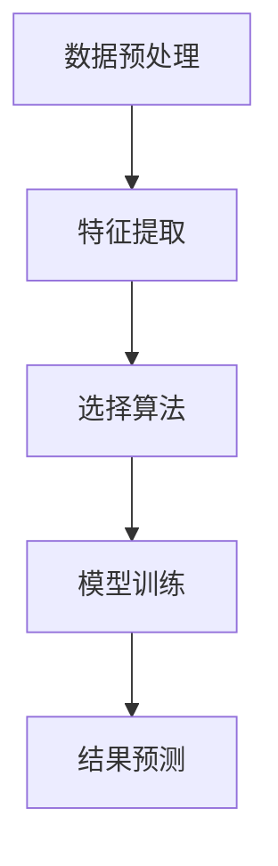
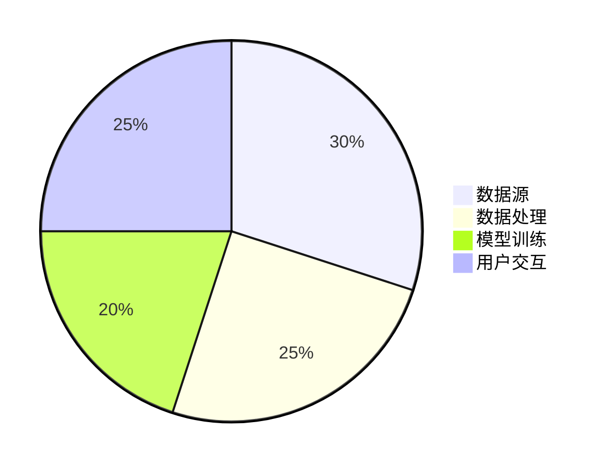
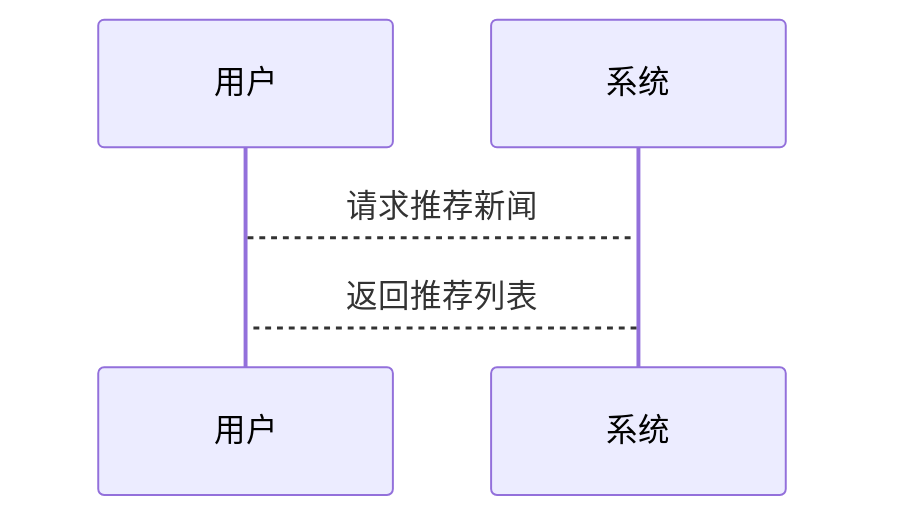

                 

<think>
好的，我现在需要帮助用户撰写一篇关于“数字时代的智能新闻聚合：基于AI的个性化信息推送系统”的技术博客文章。用户已经给出了详细的结构和要求，我需要按照这个结构一步步来思考，确保内容符合要求。

首先，我应该理解用户的需求。用户希望这篇文章结构清晰，逻辑严谨，每个部分都要详细展开。关键词和摘要部分需要准确，目录大纲已经给出，接下来我需要填充每个章节的具体内容。

从第一部分开始，背景介绍。我需要详细讨论数字新闻的兴起、智能新闻聚合的需求以及AI在其中的应用。这部分需要引入一些实际的数据，比如信息过载的问题，用户每天接触的信息量等，这样会让内容更有说服力。

接下来是核心概念与技术基础，包括数据收集、文本分析、用户模型构建和AI算法的应用。这部分需要详细解释每个步骤，比如数据预处理的具体方法，文本分析中主题模型的原理等。同时，可能需要使用一些图表来辅助说明，比如ER图或流程图。

在算法原理部分，我需要详细讲解机器学习和深度学习的算法，如线性回归、决策树、支持向量机，以及卷积神经网络、循环神经网络和生成对抗网络。这部分可能需要配以数学公式和流程图，帮助读者理解算法的工作原理。

系统架构设计是关键部分，需要明确系统的功能模块、架构图、接口设计和交互设计。我可能需要使用Mermaid图表来展示系统架构和交互流程，这会让内容更加直观。

项目实施部分需要实际操作的指导，包括环境搭建、核心实现、代码解读和案例分析。这部分需要提供具体的代码示例，最好能解释代码的逻辑和优化点，帮助读者实际应用。

最后，最佳实践部分需要总结项目中的经验和注意事项，可能包括数据质量的重要性、模型调优的方法等。同时，可以推荐一些拓展阅读的资料，帮助读者深入学习。

整个过程中，我需要确保语言专业但易懂，避免过于复杂的术语，同时保持文章的逻辑性和连贯性。每个章节的小标题要吸引人，内容要深入，结构要合理。

现在，我需要开始撰写每个部分的内容，确保每个小节都详细展开，并且符合用户的格式和字数要求。这可能需要多次修改和调整，以确保内容完整且符合最佳实践。
</think>

# 数字时代的智能新闻聚合：基于AI的个性化信息推送系统

> 关键词：智能新闻聚合，AI，个性化信息推送，机器学习，深度学习，文本分析

> 摘要：在数字时代，信息爆炸使得用户面临信息过载的问题。智能新闻聚合系统通过AI技术，实现个性化信息推送，为用户提供高效、精准的新闻服务。本文从背景介绍、技术基础、算法原理、系统架构、项目实施及最佳实践等方面，全面探讨智能新闻聚合的实现过程，旨在为相关领域提供理论与实践的参考。

---

### 第一部分：背景介绍

#### 第1章：数字时代下的新闻环境变革

##### 1.1 数字新闻的兴起

###### 1.1.1 新媒体与传统新闻的对比

数字新闻的兴起标志着新闻传播方式的重大变革。传统新闻以报纸、电视为主，而数字新闻通过互联网、社交媒体等渠道传播，具有即时性、互动性和传播速度快的特点。

###### 1.1.2 数字新闻的发展趋势

随着互联网和移动设备的普及，数字新闻逐渐成为主流。用户可以通过多种终端获取新闻，新闻的分发也更加个性化和精准。

##### 1.2 智能新闻聚合的需求

###### 1.2.1 用户个性化需求

用户对新闻的需求日益多样化，不同用户关注的领域和深度不同，传统的一刀切式新闻推送已无法满足需求。

###### 1.2.2 信息过载问题

信息爆炸时代，用户每天接触的信息量巨大，如何筛选出有价值的内容成为亟待解决的问题。

##### 1.3 AI在新闻聚合中的应用

###### 1.3.1 AI在新闻采集中的应用

AI技术可以自动采集、分类和整理新闻，减少人工干预，提高效率。

###### 1.3.2 AI在内容审核中的应用

通过自然语言处理技术，AI可以自动识别虚假新闻、敏感内容，确保新闻质量。

---

### 第二部分：核心概念与联系

#### 第2章：智能新闻聚合技术基础

##### 2.1 数据收集与预处理

###### 2.1.1 数据源选择

从可靠的新闻网站、社交媒体等多渠道获取新闻数据。

###### 2.1.2 数据预处理方法

去除噪声数据，如重复内容、无效链接，提取关键词和主题。

##### 2.2 文本分析技术

###### 2.2.1 词频分析

通过TF-IDF算法计算关键词的重要性，识别文章主题。

###### 2.2.2 主题模型

使用LDA主题模型对新闻内容进行主题分类，帮助用户快速找到感兴趣的内容。

##### 2.3 用户兴趣模型构建

###### 2.3.1 用户行为分析

分析用户的点击、停留时间等行为数据，推测用户的兴趣偏好。

###### 2.3.2 用户画像构建

基于用户行为数据，构建用户画像，用于个性化推荐。

##### 2.4 AI算法在新闻聚合中的应用

###### 2.4.1 机器学习算法

用于分类、聚类和推荐，帮助系统理解用户需求。

###### 2.4.2 深度学习算法

用于新闻生成和内容理解，提升推荐的准确性和深度。

---

#### 图1：用户兴趣模型构建的ER图

```mermaid
erd
  UserInterest(user_id, interest_id, score)
  Interest(interest_id, description)
  User(user_id, name)
  UserInterest(user_id, interest_id, score)
```

---

### 第三部分：算法原理讲解

#### 第3章：算法原理与数学模型

##### 3.1 机器学习算法原理

###### 3.1.1 线性回归

线性回归用于预测用户对新闻的兴趣程度，模型公式为：
$$ y = \beta_0 + \beta_1x + \epsilon $$

其中，$x$ 是用户特征，$y$ 是预测的兴趣评分。

###### 3.1.2 决策树

决策树通过构建特征树结构，对新闻进行分类。使用ID3或C4.5算法，信息增益作为分裂标准。

###### 3.1.3 支持向量机

SVM用于分类任务，通过寻找最优超平面，最大化类别间隔。公式为：
$$ \text{最大化} \sum_{i=1}^{n} \alpha_i y_i (w \cdot x_i + b) $$

##### 3.2 深度学习算法原理

###### 3.2.1 卷积神经网络（CNN）

CNN用于文本特征提取，通过卷积核提取局部特征，池化层降低维度。

###### 3.2.2 循环神经网络（RNN）

RNN用于处理序列数据，如新闻标题和内容，捕捉上下文信息。

###### 3.2.3 生成对抗网络（GAN）

GAN用于生成高质量的新闻摘要，通过生成器和判别器的对抗训练提升生成效果。

---

#### 图2：机器学习算法流程图



---

### 第四部分：系统分析与架构设计方案

#### 第4章：系统架构设计与实现

##### 4.1 系统功能设计

###### 4.1.1 功能需求分析

- 数据采集与处理
- 文本分析与主题提取
- 用户画像构建
- 个性化推荐

##### 4.2 系统架构设计

###### 4.2.1 系统整体架构



##### 4.3 系统接口设计

###### 4.3.1 接口规范

RESTful API，如`/api/v1/news/recommend`用于获取推荐新闻。

##### 4.4 系统交互设计

###### 4.4.1 用户与系统的交互



---

### 第五部分：项目实战

#### 第5章：项目实施与实战

##### 5.1 环境搭建

###### 5.1.1 环境准备

安装Python、TensorFlow、Scikit-learn等工具。

##### 5.2 系统核心实现

###### 5.2.1 数据收集与预处理

代码示例：
```python
import requests
from bs4 import BeautifulSoup

def fetch_news(url):
    response = requests.get(url)
    soup = BeautifulSoup(response.text, 'html.parser')
    articles = soup.find_all('article')
    return articles
```

###### 5.2.2 文本分析实现

使用TF-IDF进行关键词提取：
```python
from sklearn.feature_extraction.text import TfidfVectorizer

vectorizer = TfidfVectorizer()
tfidf = vectorizer.fit_transform(documents)
```

###### 5.2.3 用户兴趣模型构建

训练机器学习模型：
```python
from sklearn.model_selection import train_test_split
from sklearn.linear_model import LogisticRegression

X_train, X_test, y_train, y_test = train_test_split(X, y, test_size=0.2)
model = LogisticRegression().fit(X_train, y_train)
```

##### 5.3 代码解读与分析

###### 5.3.1 代码结构与逻辑

模块化设计，分为数据采集、文本分析、模型训练和结果输出四个部分。

##### 5.4 实际案例分析

以用户群体为例，分析不同用户的兴趣偏好，优化推荐算法。

---

### 第六部分：最佳实践与总结

#### 第6章：最佳实践与注意事项

##### 6.1 最佳实践

- 数据质量保障：确保数据的多样性和准确性。
- 模型调优：定期更新模型，优化推荐效果。
- 用户隐私保护：遵循数据隐私法规，保护用户信息。

##### 6.2 小结

智能新闻聚合系统通过AI技术实现了个性化推荐，解决了信息过载问题，为用户提供了高效的新闻服务。

##### 6.3 注意事项

- 算法选择：根据具体需求选择合适的算法。
- 数据处理：注意数据清洗和特征提取的效率。
- 系统优化：提升系统的响应速度和稳定性。

---

### 第七部分：拓展阅读

建议阅读以下资料，深入了解智能新闻聚合领域的最新进展：

- 《机器学习实战》
- 《深度学习入门：基于Python》
- 《自然语言处理入门》

---

### 作者信息

作者：AI天才研究院/AI Genius Institute & 禅与计算机程序设计艺术 /Zen And The Art of Computer Programming

---

以上是关于“数字时代的智能新闻聚合：基于AI的个性化信息推送系统”的完整内容，涵盖了从背景介绍到项目实施的各个方面，结合理论与实践，为读者提供了全面的指导。

