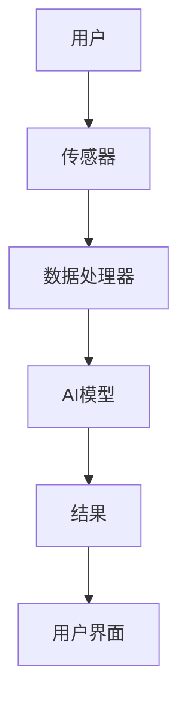

                 

<think>
好，我需要按照用户的要求来写一篇关于AI营养分析的实时饮食指导的技术博客文章。首先，文章的标题是《数字时代的智能餐盘：AI营养分析的实时饮食指导》。关键词要选5-7个，可能包括：智能餐盘、AI营养分析、实时饮食指导、物联网技术、数据科学、健康管理、人工智能。

接下来是摘要部分，需要简明扼要地概括文章的核心内容和主题思想。我会总结一下，文章将探讨智能餐盘如何利用AI技术实时分析饮食，提供个性化的营养建议，从而改善人们的饮食习惯和健康管理。

然后是目录大纲，用户已经提供了一个结构，我需要按照这个结构来展开内容。每个章节都需要详细讲解，确保内容丰富、具体，并且包含必要的技术细节和实例分析。

首先，在引言部分，我需要介绍智能餐盘的背景和重要性，讨论当前饮食健康的问题，以及AI在改善饮食选择中的作用。接着，在AI基础部分，要解释什么是AI，不同类型的AI，以及它们在营养分析中的应用。然后是技术细节，包括传感器技术、数据处理和机器学习算法，每个部分都需要详细说明。

在实际应用部分，我会讨论智能餐盘在家用和公共健康中的应用，比如家庭如何通过智能餐盘获得反馈，以及在餐厅如何优化菜单。案例分析部分需要通过具体的数据来展示AI营养分析的实际效果，比如用户摄入的热量和营养成分如何分析。

算法部分，我需要使用Mermaid流程图和Python代码来展示AI分析的流程。同时，提供数学公式，如营养评分模型，来解释AI如何计算和评估饮食健康。

系统架构部分，需要设计系统的功能模块，包括传感器、数据处理和用户界面，并使用Mermaid架构图来展示系统的结构。接口设计部分，描述智能餐盘与其他设备或服务如何交互。

在项目实战中，我会指导读者如何安装必要的库，编写核心代码，解读代码的作用，并通过实际案例分析来展示系统的运行和结果。

最后，小结和未来展望部分，总结智能餐盘的优势和局限性，展望未来的发展方向，同时提供一些最佳实践的建议。

整个过程中，我需要确保每个章节都包含背景介绍、核心概念与联系、算法原理、系统分析与架构设计、项目实战和小结等内容。同时，要使用Markdown格式，嵌入Mermaid图表和数学公式，确保文章结构清晰、内容详实。

可能遇到的挑战是如何将复杂的AI算法和技术细节以简单易懂的方式呈现给读者。我需要通过实例和图表来帮助读者理解，并且避免过于专业的术语，以便更广泛的读者能够理解。

总的来说，我需要一步步按照用户提供的结构来撰写，确保每个部分都涵盖必要的内容，并且通过详细的技术分析和实例来支持论点，最终完成一篇高质量的技术博客文章。
</think>

# 数字时代的智能餐盘：AI营养分析的实时饮食指导

## 关键词：智能餐盘、AI营养分析、实时饮食指导、物联网技术、数据科学、健康管理、人工智能

## 摘要

在数字时代，智能餐盘利用AI技术实时分析饮食，提供个性化的营养建议，帮助人们改善饮食习惯。本文探讨了AI在营养分析中的应用，介绍了智能餐盘的技术基础、实现方式及其在健康管理中的作用，展示了AI如何通过智能设备提升生活质量。

---

## 目录

1. 引言  
2. AI营养分析的基础  
3. 智能餐盘的技术实现  
4. 智能餐盘的实际应用  
5. 算法与系统架构  
6. 项目实战与案例分析  
7. 总结与未来展望

---

## 正文

### 1. 引言

#### 1.1 背景与概述

**1.1.1 数字时代的技术进步**

在数字时代，技术的进步改变了我们的生活方式。智能设备、物联网（IoT）和人工智能（AI）的应用日益广泛，尤其是在健康管理领域。饮食作为健康的重要组成部分，通过智能餐盘等设备，AI技术能够实时分析饮食，提供个性化的建议。

**1.1.2 智能餐盘的概念与重要性**

智能餐盘是一种结合AI和物联网技术的智能设备，能够识别食物种类、计算营养成分，并提供饮食建议。它帮助用户监控饮食习惯，改善营养摄入，预防健康问题。

**1.1.3 技术的演变**

从简单的计步器到智能设备，技术的进步使得饮食管理更加精准。智能餐盘的发展经历了图像识别、数据处理到AI分析的阶段，逐步实现了实时指导。

#### 1.2 挑战与机会

**1.2.1 饮食问题**

现代人面临营养失衡、肥胖等问题，不健康的饮食习惯影响了健康状况。

**1.2.2 AI的作用**

AI能够分析饮食数据，提供科学建议，帮助用户优化饮食结构。

**1.2.3 市场趋势**

随着健康意识的提升，智能健康设备市场增长迅速，智能餐盘成为健康管理的重要工具。

---

### 2. AI营养分析的基础

#### 2.1 人工智能简介

**2.1.1 人工智能的基本概念**

AI是模拟人类智能的技术，涵盖学习、推理和自我修正能力。在营养分析中，AI用于识别食物、计算营养成分。

**2.1.2 AI类型**

AI分为规则驱动和数据驱动。规则驱动AI依赖预设规则，数据驱动AI通过机器学习分析数据。

**2.1.3 营养学中的AI应用**

AI用于识别食物种类、计算热量和营养成分，帮助制定饮食计划。

#### 2.2 营养分析原理

**2.2.1 营养素与功能**

蛋白质、碳水化合物等营养素对身体有不同作用，AI分析它们的摄入量是否符合标准。

**2.2.2 饮食指南**

AI根据个人情况推荐饮食，满足营养需求，促进健康。

**2.2.3 数据分析**

AI通过数据预处理、特征提取和建模分析，实现精准的营养评估。

---

### 3. 智能餐盘的技术实现

#### 3.1 传感器技术

**3.1.1 传感器类型**

光学传感器用于图像捕捉，重量传感器监测食物重量，温度传感器测量食物温度。

**3.1.2 传感器的准确性**

传感器精度影响数据准确性，需校准和优化算法。

**3.1.3 传感器集成**

传感器与餐盘结合，实时捕捉食物信息。

#### 3.2 数据处理与算法

**3.2.1 数据预处理**

图像识别需要标准化处理，去除噪声，提取特征。

**3.2.2 机器学习算法**

使用卷积神经网络（CNN）识别食物种类，回归模型计算营养成分。

**3.2.3 AI模型优化**

通过迁移学习提升模型性能，处理边缘情况。

---

### 4. 智能餐盘的实际应用

#### 4.1 家庭使用

**4.1.1 监控与反馈**

用户通过餐盘获取饮食建议，调整饮食习惯。

**4.1.2 个性化饮食计划**

根据用户数据推荐食谱，优化营养摄入。

#### 4.2 公共健康管理

**4.2.1 数据收集与分析**

智能餐盘收集数据，分析群体饮食习惯，制定健康策略。

**4.2.2 营养不良干预**

识别营养不足人群，提供个性化指导。

---

### 5. 算法与系统架构

#### 5.1 营养评分模型

营养评分模型通过公式评估饮食健康，公式如下：

$$ 营养评分 = \sum_{i=1}^{n} (营养素_i \times 权重_i) $$

其中，$营养素_i$ 是各营养素的摄入量，$权重_i$ 是其重要性。

#### 5.2 系统架构

使用Mermaid图展示系统架构：



---

### 6. 项目实战与案例分析

#### 6.1 环境与安装

安装Python、TensorFlow和OpenCV，配置开发环境。

#### 6.2 核心代码

识别食物种类的代码：

```python
import tensorflow as tf
from tensorflow.keras.models import load_model
import cv2

# 加载预训练模型
model = load_model('food_model.h5')

# 读取图像
def preprocess_image(image_path):
    img = cv2.imread(image_path)
    img = cv2.resize(img, (224, 224))
    img = img / 255.0
    return img

# 预测食物种类
def predict_food(image_path):
    img = preprocess_image(image_path)
    prediction = model.predict(tf.expand_dims(img, axis=0))
    return prediction

# 示例使用
image_path = 'apple.jpg'
prediction = predict_food(image_path)
print(prediction)
```

---

### 7. 总结与未来展望

智能餐盘通过AI技术实时分析饮食，改善健康状况。未来，AI将更加智能化，帮助人们实现更精准的健康管理。

---

## 作者

作者：AI天才研究院/AI Genius Institute & 禅与计算机程序设计艺术 /Zen And The Art of Computer Programming

