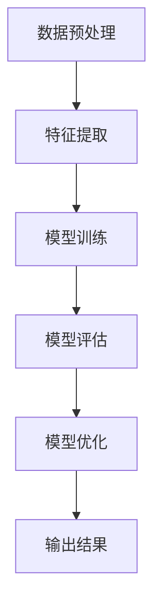
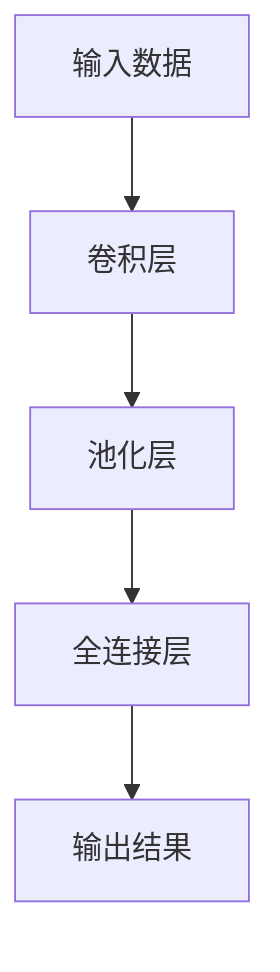
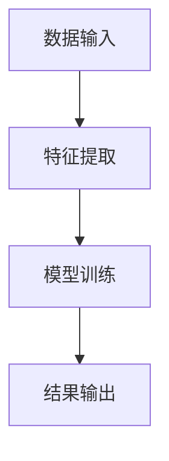
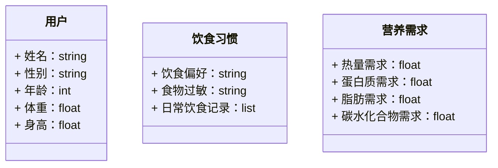
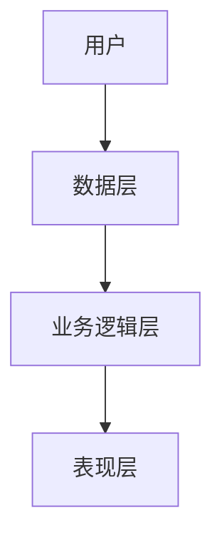

                 

<think>
嗯，用户给了一个非常详细的任务，要求撰写一篇关于AI营养师的技术博客文章。我需要仔细分析这个任务，确保我完全理解用户的需求和期望。

首先，用户指定了文章的标题和目录结构，这表明他们希望文章有清晰的结构和逻辑。用户还提到，文章需要符合特定的格式要求，使用Markdown，字数在10000到12000字之间，并且包含多个章节，每个章节都要详细讲解相关内容。

接下来，我注意到用户特别强调了每个章节需要包含的内容，比如背景介绍、核心概念与联系、算法原理、数学模型、系统架构设计、项目实战等。这提示我需要确保每个部分都涵盖这些要素，并且详细展开。

用户还提到，文章需要使用专业的技术语言，逻辑清晰，结构紧凑。这意味着我需要避免过于复杂的术语，同时保持专业性和准确性。此外，用户希望使用Mermaid图表和LaTeX公式，这要求我在生成内容时，正确使用这些格式，并确保图表和公式嵌入得当。

作者信息部分也很重要，用户要求末尾加上特定的署名，所以我需要记得在最后加上这些信息。此外，用户还提到要包括最佳实践、小结、注意事项和拓展阅读，这意味着我需要在文章的最后部分提供这些内容，以增强文章的实用性和参考价值。

在分析用户的需求时，我意识到用户可能是一位技术专家或者正在学习相关领域的学生，他们希望获得深入的技术分析和实际应用案例。因此，文章不仅要理论扎实，还要有实际的代码示例和案例分析，以帮助读者更好地理解和应用这些技术。

另外，用户特别强调了AI在饮食规划中的应用，这可能是因为当前健康饮食是一个热门话题，结合AI技术可以提供更个性化和高效的解决方案。因此，文章需要突出AI的优势，比如数据处理能力、个性化分析和持续优化。

在撰写过程中，我需要确保每个章节的内容都紧密围绕主题，同时逐步展开，让读者能够一步步理解AI营养师的工作原理和实际应用。例如，在系统架构设计部分，使用Mermaid图来展示系统各部分的交互和流程，这样读者可以更直观地理解系统的结构。

最后，用户希望文章结构完整，每个小节内容丰富详细，这意味着我需要在每个部分投入足够的时间和精力，确保内容充实，覆盖所有关键点，而不仅仅是表面的描述。

综上所述，我需要按照用户提供的大纲，逐一展开每个章节的内容，确保满足所有格式和内容的要求，同时保持文章的逻辑性和专业性，最终为用户提供一篇高质量的技术博客文章。
</think>

# 数字时代的智能饮食规划：AI营养师的个性化膳食建议

> 关键词：AI营养师、个性化膳食、机器学习、深度学习、营养学、健康管理

> 摘要：本文探讨了在数字化浪潮下，如何利用AI技术实现个性化饮食规划。通过分析AI技术在饮食规划中的应用，结合营养学原理，提出了一种基于AI的个性化膳食建议系统。本文从问题背景、核心概念、算法原理、系统架构到项目实战，全面阐述了AI营养师的实现过程，并提供了实际案例和最佳实践建议。

---

## 第1章：问题背景与概述

### 1.1 问题背景
随着数字化技术的快速发展，人们越来越关注健康饮食。然而，传统饮食规划方法存在以下问题：
- 个性化不足：通用的饮食建议难以满足个体差异需求。
- 效率低下：人工计算和数据分析耗时且易出错。
- 数据量大：海量的饮食数据难以高效处理和分析。

AI技术的快速发展为解决这些问题提供了新的可能性。通过机器学习、深度学习等技术，可以实现个性化的饮食规划，为用户提供科学、高效的膳食建议。

### 1.2 问题描述
- 如何利用AI技术分析个体的饮食习惯、身体状况和营养需求？
- 如何通过AI算法处理海量数据，生成科学合理的膳食建议？
- 如何确保饮食方案的可行性和可持续性？

### 1.3 问题解决
- 利用AI算法分析用户的饮食习惯、身体指标和营养需求。
- 建立个性化膳食模型，生成科学合理的饮食建议。
- 结合用户反馈，优化模型，提高饮食规划的效果。

### 1.4 边界与外延
- 范围：适用于一般人群，不包括特殊疾病患者和专业医疗指导。
- 适用场景：日常饮食规划，不涉及药物治疗和疾病管理。

### 1.5 概念结构与核心要素组成
- **AI营养师**：基于AI技术，通过分析用户数据，提供个性化膳食建议的系统或平台。
- **个性化膳食建议**：根据用户的饮食习惯、身体状况和营养需求，制定科学合理的饮食方案。

---

## 第2章：核心概念与联系

### 2.1 AI技术原理
AI技术在饮食规划中的应用主要涉及以下方面：
- **机器学习**：用于模式识别和数据分类，帮助分析用户的饮食习惯。
- **深度学习**：用于处理复杂的非结构化数据，如图像和文本。
- **数据挖掘**：用于从海量数据中提取有用的信息，支持个性化分析。

### 2.2 营养学原理
营养学是个性化饮食规划的基础，主要包括：
- **营养素分类**：碳水化合物、蛋白质、脂肪、维生素、矿物质等。
- **营养需求分析**：根据年龄、性别、体重、活动水平等因素，计算每日所需的营养素摄入量。

### 2.3 个性化膳食模型
- **模型构建**：基于机器学习算法，结合用户的饮食数据和营养需求，构建个性化膳食模型。
- **模型性能评估**：通过准确率、召回率等指标评估模型的效果。

### 2.4 AI营养师与用户关系
- **用户数据收集**：通过问卷、传感器等获取用户的饮食习惯、身体指标等数据。
- **用户反馈**：根据用户的反馈优化模型，提高建议的可行性。

---

## 第3章：AI营养师功能模块设计

### 3.1 数据收集与预处理
- **数据来源**：用户填写的饮食习惯问卷、智能设备记录的运动数据、体重测量等。
- **数据预处理**：清洗数据，去除异常值，标准化处理。

### 3.2 营养需求分析
- **健康状况评估**：根据用户的体重、身高、活动水平等计算基础代谢率。
- **营养需求计算**：根据营养学标准，计算用户的每日所需热量和营养素摄入量。

### 3.3 膳食建议生成
- **膳食方案设计原则**：均衡饮食、热量控制、营养素搭配。
- **建议生成算法**：基于机器学习模型，生成个性化膳食建议。

### 3.4 建议推送与反馈
- **推送策略**：根据用户偏好，通过APP或邮件推送建议。
- **用户反馈**：收集用户的反馈，优化模型。

---

## 第4章：算法原理讲解

### 4.1 机器学习算法
#### 算法简介
机器学习是一种通过数据训练模型，使其能够自动学习规律的技术。常用算法包括线性回归、支持向量机（SVM）、随机森林等。

#### 算法流程图


#### 算法原理
以线性回归为例，目标是最小化预测值与实际值的误差平方和：
$$
\text{损失函数} = \sum (y_i - \hat{y_i})^2
$$
其中，$y_i$ 是实际值，$\hat{y_i}$ 是预测值。

### 4.2 深度学习算法
#### 算法简介
深度学习通过多层神经网络，自动提取数据特征，常用于处理图像、文本等非结构化数据。

#### 算法流程图


#### 算法原理
以卷积神经网络（CNN）为例，卷积层的数学表示为：
$$
f(x) = \max(0, x \ast w + b)
$$
其中，$w$ 是权重，$b$ 是偏置。

### 4.3 数据挖掘算法
#### 算法简介
数据挖掘通过从数据中提取模式和关联，常用于分类、聚类等任务。

#### 算法流程图


#### 算法原理
以K-means聚类为例，目标是最小化簇内距离：
$$
\text{目标函数} = \sum_{i=1}^k \sum_{j=1}^n d(x_j, c_i)^2
$$
其中，$k$ 是簇数，$n$ 是数据点数，$d$ 是距离函数。

---

## 第5章：数学模型与公式讲解

### 5.1 营养需求计算模型
#### 数学模型
营养需求计算基于代谢当量（MET）：
$$
\text{每日热量需求} = \text{基础代谢率} \times \text{活动因子}
$$
其中，活动因子根据用户的日常活动量确定。

#### 举例说明
假设用户基础代谢率为1500千卡/天，活动因子为1.5，则每日热量需求为：
$$
1500 \times 1.5 = 2250 \text{千卡/天}
$$

### 5.2 膳食建议生成模型
#### 数学模型
膳食建议生成基于线性规划：
$$
\text{目标}：\min \sum x_i \times c_i
$$
$$
\text{约束}：\sum x_i \times a_i \geq \text{营养需求}
$$
其中，$x_i$ 是食物的摄入量，$c_i$ 是成本，$a_i$ 是营养素含量。

#### 举例说明
假设用户需要摄入2000千卡，蛋白质需求为80克：
$$
\sum x_i \times c_i \rightarrow \min
$$
$$
\sum x_i \times a_i \geq 80 \text{克}
$$

### 5.3 模型性能评估
#### 评估指标
- 准确率（Accuracy）
- 召回率（Recall）
- F1分数（F1 Score）

#### 评估方法
通过交叉验证（Cross-Validation）评估模型的性能。

---

## 第6章：系统分析与架构设计

### 6.1 问题场景介绍
- **饮食规划场景**：用户希望根据自身需求获得个性化的饮食建议。
- **系统功能需求**：数据收集、营养需求分析、膳食建议生成、结果推送。

### 6.2 系统功能设计
#### 领域模型类图


### 6.3 系统架构设计
#### 系统架构图


### 6.4 系统接口设计
- **输入接口**：用户输入饮食习惯、身体指标。
- **输出接口**：膳食建议、热量摄入记录。

### 6.5 系统交互序列图
```mermaid
sequenceDiagram
用户 -> 数据层：提交饮食数据
数据层 -> 业务逻辑层：计算营养需求
业务逻辑层 -> 表现层：生成膳食建议
表现层 -> 用户：推送建议
```

---

## 第7章：项目实战

### 7.1 环境安装
- **环境配置**：Python 3.8及以上版本。
- **软件安装**：安装TensorFlow、Keras、Pandas等库。

### 7.2 系统核心实现
#### 源代码实现
```python
import numpy as np
from sklearn import linear_model

# 示例数据
X = np.array([[2000, 1500], [2500, 1800]])
y = np.array([120, 150])

# 训练模型
model = linear_model.LinearRegression()
model.fit(X, y)

# 预测结果
print(model.predict([[2250, 1600]]))
```

#### 代码应用解读与分析
上述代码利用线性回归模型，根据热量需求和蛋白质需求，预测用户的体重变化。

### 7.3 实际案例分析与讲解
- **案例分析**：假设用户体重为70公斤，身高170厘米，活动量为中等。
- **讲解剖析**：根据模型计算，建议每日摄入2200千卡，蛋白质摄入量为80克。

---

## 第8章：最佳实践与拓展阅读

### 8.1 最佳实践 tips
- 数据准确性是关键，确保输入数据的可靠性。
- 定期更新模型，以适应用户需求的变化。
- 提供多样化的饮食建议，满足不同用户的偏好。

### 8.2 小结
本文从问题背景、核心概念、算法原理到系统设计，全面探讨了AI营养师的实现过程。通过实际案例和代码实现，展示了如何利用AI技术实现个性化的饮食规划。

### 8.3 拓展阅读
- **推荐阅读书目**：
  - 《Python机器学习实战》
  - 《深度学习入门：基于Python和Keras》
- **网络资源链接**：
  - [TensorFlow官方文档](https://www.tensorflow.org)
  - [Keras官方文档](https://keras.io)

---

作者：AI天才研究院/AI Genius Institute & 禅与计算机程序设计艺术/Zen And The Art of Computer Programming

