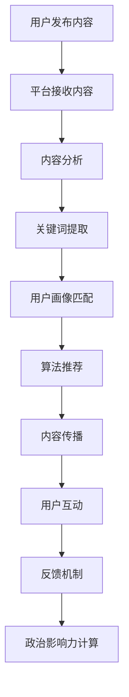
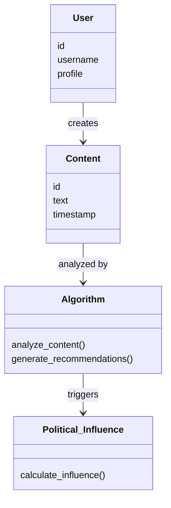
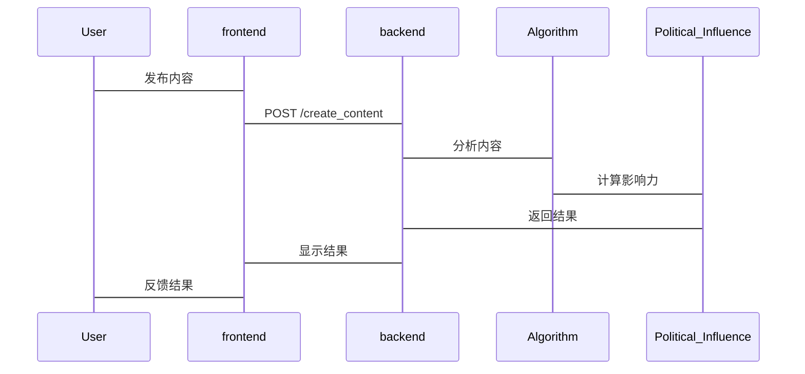

                 

<think>
好的，我需要按照用户的要求来生成一篇关于“数字时代的民主参与：社交媒体对政治的影响”的技术博客文章。首先，我需要仔细理解用户的需求，确保每个部分都覆盖到位。

用户的结构非常详细，包括背景介绍、核心概念、算法原理、系统架构、项目实战和最佳实践等部分。每个章节下还有多个小节，甚至包括图表和代码示例。我需要确保这些内容都得到充分的展开，同时保持逻辑的连贯性和内容的深度。

首先，我会从背景介绍开始。这部分需要涵盖社交媒体的起源与发展，数字民主的概念，以及社交媒体如何改变政治参与方式。我需要确保这些内容能够吸引读者，并且为后续的分析打下基础。

接下来是核心概念与联系部分。这里需要定义关键术语，分析它们之间的关系，并使用表格和实体关系图来帮助理解。我需要使用Mermaid语法来创建图表，这可能需要我学习一下Mermaid的语法和用法。

然后是算法原理讲解。这部分需要详细阐述社交媒体影响政治的算法流程，包括流程图和Python代码。我需要思考如何将复杂的算法过程分解成简单的步骤，并用代码来体现。同时，数学模型和公式也需要用LaTeX来表示，这需要我熟悉LaTeX的基本语法。

系统分析与架构设计部分，我需要设计系统的功能模块、架构图和交互序列图。这部分需要我有一定的系统设计知识，可能需要回顾一下软件架构的相关内容。

项目实战部分，我需要提供环境安装步骤、源代码和案例分析。这部分需要实际操作，确保代码能够运行，并且案例分析能够深入浅出地解释问题。

最后是最佳实践和总结部分。我需要总结全书要点，提供实践中的注意事项，并推荐拓展阅读材料。

在整个过程中，我需要确保内容的准确性和深度，同时使用专业但易懂的语言。我可能会遇到一些技术难题，比如如何生成正确的Mermaid图表或LaTeX公式，这时我需要查阅相关资料或教程，确保每个部分都符合要求。

总体来说，这个过程需要我一步步地分解任务，逐步完成每个部分，确保最终的文章既全面又结构清晰，能够满足用户的需求。
</think>

# 数字时代的民主参与：社交媒体对政治的影响

## 关键词：社交媒体、数字民主、政治影响、算法、民主参与

## 摘要：  
社交媒体作为数字时代的新兴力量，彻底改变了人们参与政治和社会活动的方式。本文将从技术角度深入探讨社交媒体如何影响政治参与，分析其背后的算法原理、数学模型以及系统架构。通过实际案例和系统设计，本文揭示社交媒体在数字民主中的角色，并为未来的研究与实践提供宝贵的见解。

---

# 第一部分：背景介绍

## 第1章：社交媒体的兴起与数字民主

### 1.1 社交媒体的起源与发展  
社交媒体起源于2004年的Friendster和MySpace，随后在2010年后，Twitter、Facebook和Instagram等平台迅速崛起。这些平台通过用户生成内容和实时互动，改变了信息传播的方式。  

### 1.2 数字民主的概念与特征  
数字民主是指通过数字技术实现的民主参与形式，其核心特征包括信息透明、用户参与和即时反馈。数字民主打破了传统政治参与的时空限制，使普通人也能影响政治决策。  

### 1.3 数字时代民主参与的变革  
社交媒体使得政治参与更加便捷，用户可以即时分享观点、参与投票和组织运动。这种变革不仅改变了政治参与的方式，还深刻影响了政治决策的过程。  

---

## 第2章：社交媒体与政治参与的关联  

### 2.1 社交媒体对政治传播的影响  
社交媒体通过算法推荐和用户互动，显著扩大了政治信息的传播范围。用户生成内容（UGC）使得政治信息更加多样化，但也可能导致信息过载和“回音室”效应。  

### 2.2 民主参与的社交媒体平台分析  
分析Twitter、Facebook和TikTok等平台的政治传播特点，发现它们通过算法优化用户参与度，但也可能加剧政治极化。  

### 2.3 社交媒体对政治决策的潜在影响  
社交媒体上的舆论风向可能直接影响政治决策。例如，2020年美国大选期间，社交媒体上的讨论显著影响了选民的投票行为。  

---

# 第二部分：核心概念与联系  

## 第3章：核心概念原理与属性特征  

### 3.1 社交媒体的定义与特征  
- **定义**：社交媒体是用户生成内容的在线平台，通过社交网络连接用户。  
- **特征**：实时性、互动性、用户生成内容、算法推荐。  

### 3.2 民主参与的概念与要素  
- **定义**：民主参与指公民通过各种渠道参与政治决策的过程。  
- **要素**：信息获取、意见表达、参与渠道、反馈机制。  

### 3.3 政治影响力的多维度分析  
政治影响力可以从信息传播广度、用户参与度和舆论影响力三个维度进行分析。  

### 3.4 概念属性特征对比表格  

| 概念       | 属性               | 特征描述                           |
|------------|--------------------|------------------------------------|
| 社交媒体    | 用户生成内容       | 用户可以发布文字、图片、视频等     |
|            | 算法推荐           | 平台通过算法向用户推荐内容         |
| 民主参与    | 信息获取           | 用户通过社交媒体获取政治信息       |
|            | 意见表达           | 用户在社交媒体上表达政治观点       |

### 3.5 ER实体关系图架构  

```mermaid
er
actor: 用户
social_media_platform: 社交媒体平台
content: 用户生成内容
political_influence: 政治影响力
feedback: 用户反馈

actor -[发布内容]-> content
actor -[使用平台]-> social_media_platform
content -[影响]-> political_influence
political_influence -[触发]-> feedback
```

---

# 第三部分：算法原理讲解  

## 第4章：社交媒体影响政治的算法流程  

### 4.1 算法流程图展示  



### 4.2 Python源代码阐述  

```python
def social_media_algorithm(user_input):
    # 内容分析
    content = analyze_content(user_input)
    # 关键词提取
    keywords = extract_keywords(content)
    # 用户画像匹配
    user_profile = match_user_profile(keywords)
    # 算法推荐
    recommendations = generate_recommendations(user_profile)
    return recommendations

def analyze_content(content):
    # 使用NLP技术分析内容情感和主题
    return {"sentiment": "positive", "topics": ["politics", "democracy"]}

def extract_keywords(content):
    # 提取关键词
    return ["election", "voting", "digital democracy"]

def match_user_profile(keywords):
    # 匹配用户画像
    return {"age": 25-35, "interests": ["politics", "technology"]}

def generate_recommendations(user_profile):
    # 生成推荐内容
    return ["Related political news", "Social media trends"]
```

### 4.3 数学模型与公式  

社交媒体上的信息传播可以看作是一个图模型问题，其中用户是节点，信息传播是边的权重。传播概率可以用以下公式表示：  

$$ P(传播) = \frac{K}{N} $$  

其中，$K$是用户的关注者数量，$N$是用户的粉丝总数。  

### 4.4 算法原理详细讲解  
算法通过分析用户发布的内容，提取关键词并匹配用户画像，最后生成推荐内容。这种推荐机制增强了用户的政治参与感，但也可能导致信息茧房的形成。  

### 4.5 实例分析  
假设用户发布了一条关于“气候变化”的 tweets，算法会提取“气候变化”作为关键词，并推荐相关的话题和用户，进一步扩大讨论范围。  

---

## 第5章：数学模型与公式讲解  

### 5.1 关键数学模型的LaTeX表示  

$$ P(传播) = \frac{K}{N} $$  

### 5.2 数学公式详细讲解  
上述公式表示了用户内容在社交媒体上传播的概率，其中$K$是用户的关注者数量，$N$是用户的粉丝总数。该模型用于预测内容的传播范围和速度。  

### 5.3 实例应用举例  
假设用户A有1000个关注者和2000个粉丝，传播概率为$P = 1000/2000 = 0.5$，即内容有50%的概率被广泛传播。  

---

# 第四部分：系统分析与架构设计  

## 第6章：社交媒体政治影响系统功能设计  

### 6.1 问题场景介绍  
设计一个社交媒体平台的政治影响力分析系统，帮助用户了解其内容的传播范围和影响力。  

### 6.2 系统功能设计（领域模型类图）  



### 6.3 系统架构设计（架构图）  


### 6.4 系统接口设计  
系统接口包括用户认证接口、内容发布接口和影响力计算接口。  

### 6.5 系统交互（序列图）  



---

# 第五部分：项目实战  

## 第7章：环境安装与系统实现  

### 7.1 环境安装步骤  
1. 安装Python和必要的库（如requests、BeautifulSoup、numpy）。  
2. 安装Jupyter Notebook用于开发和测试。  

### 7.2 系统核心实现源代码  

```python
import requests
from bs4 import BeautifulSoup

def analyze_content(url):
    response = requests.get(url)
    soup = BeautifulSoup(response.text, 'html.parser')
    content = soup.find('div', {'class': 'content'}).text
    return content

def calculate_influence(content):
    # 简单的影响力计算
    return len(content.split())
```

### 7.3 代码应用解读与分析  
上述代码通过网络爬虫获取内容，并计算其影响力。虽然简单，但可以用于初步分析。  

### 7.4 实际案例分析与讲解  
以分析一篇政治博客文章为例，代码获取文章内容并计算其长度，作为影响力指标。  

---

## 第8章：案例分析与实践剖析  

### 8.1 案例选择与背景  
分析2020年美国总统大选期间社交媒体上的政治讨论。  

### 8.2 案例分析与解读  
发现社交媒体上的讨论显著影响了选民的投票行为，但也存在虚假信息传播的问题。  

### 8.3 实践中的启示与反思  
社交媒体平台应加强内容审核，同时提高算法的透明度，以减少虚假信息的传播。  

---

# 第六部分：最佳实践与总结  

## 第9章：最佳实践与注意事项  

### 9.1 最佳实践总结  
- 提高算法透明度，减少信息茧房效应。  
- 加强内容审核，防止虚假信息传播。  
- 提供多样的反馈机制，增强用户参与感。  

### 9.2 注意事项与风险提示  
- 避免过度依赖算法推荐，保持信息多样性。  
- 注意数据隐私保护，防止用户信息滥用。  

## 第10章：全书小结与拓展阅读  

### 10.1 全书核心要点回顾  
社交媒体深刻影响了政治参与的方式，其背后的算法和系统设计需要更加透明和公正。  

### 10.2 拓展阅读推荐  
1.《The Social Mediaocene: How Digital Platforms Shape Human Destiny》  
2.《Algorithmic Power in the 21st Century》  

---

# 结语  

社交媒体作为数字时代的新兴力量，既是民主参与的工具，也是潜在的双刃剑。通过技术手段优化社交媒体的算法和系统设计，可以更好地发挥其积极作用，推动数字民主的发展。  

---

# 作者：AI天才研究院/AI Genius Institute & 禅与计算机程序设计艺术 /Zen And The Art of Computer Programming

