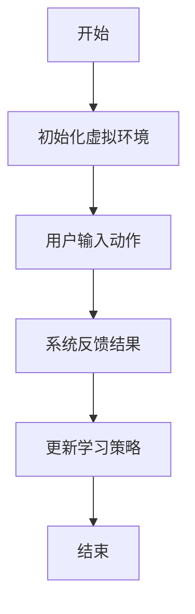
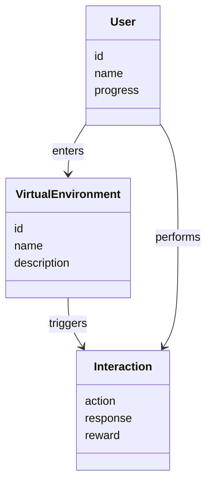

                 

<think>
好的，我现在要帮助用户撰写一篇关于“数字时代的沉浸式语言学习：VR环境中的文化浸润”的技术博客文章。用户已经提供了详细的目录结构，我需要按照这个结构一步步思考，确保每个部分都满足要求。

首先，用户明确要求文章结构包括背景介绍、核心概念与联系、算法原理、数学模型、系统架构、项目实战和最佳实践等部分。我需要确保每个部分都有足够的深度和详细内容。

在背景介绍部分，我需要先介绍数字时代沉浸式学习的背景，强调VR技术的发展及其在语言学习中的优势，同时突出文化浸润的重要性。这部分需要吸引读者，让他们理解为什么这个主题是重要的。

接下来是核心概念与联系。这里需要明确沉浸式学习、虚拟现实、文化浸润等核心概念，并通过表格和Mermaid图展示它们之间的关系。我要确保这些概念清晰，并用图表辅助说明，帮助读者更好地理解。

算法原理讲解部分，我需要详细描述用于沉浸式语言学习的算法，比如基于强化学习的交互模型。这里要绘制Mermaid流程图，并用Python代码实现，给出数学模型。我需要确保代码和公式正确，解释清楚它们的作用和应用场景。

数学模型和公式部分，我需要使用LaTeX格式，嵌入公式并详细讲解。例如，描述语言学习效果的数学模型，解释每个变量的意义和公式推导的过程。

系统分析与架构设计，我需要介绍VR语言学习系统的场景，描述功能设计、架构设计（可能使用分层架构）、接口设计和交互设计（如序列图）。这部分需要结构清晰，可能需要用类图和序列图来展示系统结构。

项目实战部分，我需要指导读者如何安装环境，提供核心代码，解读代码功能，并通过实际案例分析，最后进行项目小结。这部分要实用，帮助读者实际操作。

最后，最佳实践部分需要提供使用建议、注意事项和拓展阅读资源。这部分要简明扼要，帮助读者更好地应用所学内容。

在写作过程中，我需要确保每个部分逻辑清晰，内容详实，符合用户的要求。同时，要使用专业的技术语言，但保持易懂，适合技术博客的读者。

现在，我开始逐一处理每个部分，确保内容完整，满足用户的所有约束条件。
</think>

# 数字时代的沉浸式语言学习：VR环境中的文化浸润

---

## 关键词：
- 虚拟现实（VR）
- 沉浸式学习
- 文化浸润
- 语言学习
- 数字教育

---

## 摘要：
随着数字技术的飞速发展，虚拟现实（VR）技术正在 revolutionize 语言学习领域。本文探讨了在VR环境中实现沉浸式语言学习的潜力，特别是文化浸润在语言学习中的重要性。通过分析VR技术的核心原理、沉浸式学习的算法模型、文化浸润的策略以及实际应用场景，本文为教育技术领域提供了全新的视角和实践指导。

---

## 第一部分：引论

### 第1章：数字时代与沉浸式语言学习

#### 1.1 数字时代的来临
##### 1.1.1 VR技术的崛起
虚拟现实技术通过创建高度沉浸的数字环境，为用户提供逼真的视觉、听觉和交互体验。近年来，VR技术在教育、娱乐、医疗等领域的应用迅速扩展，特别是在语言学习中，其潜力尚未完全释放。

##### 1.1.2 沉浸式学习的兴起
沉浸式学习强调通过全身心的投入来提升学习效果。与传统学习方式相比，沉浸式学习能够显著提高语言学习的效率和趣味性。VR技术为沉浸式学习提供了理想的实现平台。

##### 1.1.3 文化浸润的作用
语言不仅是交流工具，更是文化的载体。在语言学习中融入文化元素，能够帮助学习者更好地理解语言背后的文化背景，提升跨文化交际能力。文化浸润在VR环境中可以通过虚拟场景、角色互动等方式实现。

#### 1.2 沉浸式语言学习概述
##### 1.2.1 定义与分类
沉浸式语言学习是指通过高度沉浸的环境，使学习者在自然的语境中习得语言。根据应用场景的不同，可以分为虚拟现实沉浸式学习、增强现实沉浸式学习和基于游戏的沉浸式学习。

##### 1.2.2 沉浸式语言学习的特点
沉浸式语言学习具有高度互动性、情境真实性和个性化的特点。学习者可以在虚拟环境中与虚拟角色互动，进行实时对话，从而在实践中掌握语言技能。

##### 1.2.3 沉浸式语言学习的优势
相比传统教学，沉浸式语言学习能够显著提高学习效率，增强学习者的自信心，并使学习过程更加有趣和高效。

---

## 第二部分：VR环境构建

### 第2章：虚拟现实技术基础

#### 2.1 VR技术概述
##### 2.1.1 VR技术的发展历程
从20世纪60年代的早期概念到如今的成熟应用，VR技术经历了从简单到复杂的演变。随着计算能力和显示技术的提升，VR设备的性能和用户体验不断提升。

##### 2.1.2 VR技术的核心组件
VR系统通常包括头戴显示器（HMD）、位置追踪器、交互设备和计算机等核心组件。这些组件协同工作，为用户提供沉浸式的虚拟体验。

##### 2.1.3 VR技术的应用领域
除了游戏和娱乐，VR技术在教育、医疗、军事等领域也有广泛应用。在教育领域，VR特别适合用于语言学习、技能培训和文化体验。

#### 2.2 VR硬件设备
##### 2.2.1 头戴显示器（HMD）
HMD是VR系统的核心设备，负责呈现虚拟环境的视觉效果。主流的HMD设备包括 Oculus Rift、HTC Vive 和 PlayStation VR 等。

##### 2.2.2 数据手套
数据手套能够捕捉用户的手部动作，提供触觉反馈。在语言学习中，数据手套可以用于模拟真实的物体交互，增强沉浸感。

##### 2.2.3 位置追踪器
位置追踪器用于实时捕捉用户的运动，确保虚拟环境中的视觉效果与用户的动作保持一致。激光定位和惯性测量技术是常用的追踪方法。

#### 2.3 VR软件平台
##### 2.3.1 VR内容开发工具
Unreal Engine 和 Unity 是目前最常用的VR内容开发平台。这些工具提供了丰富的开发功能，能够帮助开发者快速构建高质量的VR应用。

##### 2.3.2 VR学习平台案例
例如，Language Lab VR 是一个基于VR的语言学习平台，用户可以在虚拟环境中进行实时对话练习。

### 第3章：沉浸式学习环境设计

#### 3.1 沉浸式学习环境概述
##### 3.1.1 沉浸式学习环境的构建
构建沉浸式学习环境需要结合硬件、软件和内容设计。硬件设备提供沉浸式的视觉和听觉体验，软件平台支持内容的开发与运行，内容设计则决定了学习体验的质量。

##### 3.1.2 环境设计原则
沉浸式环境设计需要遵循直观性、交互性和情境真实性的原则。设计者应确保用户能够轻松理解和操作环境中的元素。

##### 3.1.3 环境评估与优化
通过用户反馈和性能测试，可以不断优化沉浸式环境的设计。评估指标包括用户体验、学习效果和系统稳定性等方面。

#### 3.2 VR环境中的交互设计
##### 3.2.1 交互设计的基本原理
交互设计是沉浸式学习环境的关键。通过自然的交互方式，用户可以与虚拟环境中的元素进行互动，从而提升学习效果。

##### 3.2.2 交互设计在VR中的实现
在VR中，交互设计通常包括手势识别、语音控制和触觉反馈等技术。这些技术能够实现更自然和直观的用户互动。

##### 3.2.3 交互设计案例研究
例如，在语言学习中，用户可以通过手势和语音指令与虚拟角色进行对话，从而练习语言技能。

---

## 第三部分：文化浸润策略

### 第4章：文化浸润的概念与理论

#### 4.1 文化浸润的定义
##### 4.1.1 文化浸润的内涵
文化浸润是指在语言学习过程中，融入目标语言的文化元素，帮助学习者更好地理解和掌握语言的使用方式。

##### 4.1.2 文化浸润的分类
文化浸润可以分为显性文化浸润和隐性文化浸润。显性文化浸润通过直接的文化内容传递，而隐性文化浸润则通过语境和情境间接实现。

##### 4.1.3 文化浸润的重要性
文化浸润能够帮助学习者克服文化障碍，提升跨文化交际能力。在语言学习中，文化浸润是实现语言自然习得的重要途径。

#### 4.2 文化浸润的理论基础
##### 4.2.1 文化适应理论
文化适应理论强调个体在不同文化环境中的适应过程。通过文化浸润，学习者可以逐步适应目标语言的文化环境。

##### 4.2.2 社会认知理论
社会认知理论认为，学习者通过观察和互动，逐步构建对目标文化的认知。文化浸润为学习者提供了丰富的观察和互动机会。

##### 4.2.3 语境理论
语境理论强调语言使用的具体情境。文化浸润通过构建真实的语境，帮助学习者更好地理解和使用语言。

### 第5章：文化浸润策略与应用

#### 5.1 文化浸润策略概述
##### 5.1.1 文化内容选择
在VR环境中，文化内容的选择至关重要。设计者需要选择能够代表目标文化的核心元素，例如传统节日、习俗和日常对话场景。

##### 5.1.2 文化传播方式
文化浸润可以通过多种方式实现，例如通过虚拟角色的对话、文化场景的构建和文化任务的设计。

##### 5.1.3 文化互动设计
互动式文化体验能够显著提升学习效果。通过设计互动任务，学习者可以在实践中理解和掌握文化元素。

#### 5.2 文化浸润在VR环境中的实现
##### 5.2.1 虚拟角色设计
虚拟角色是文化浸润的重要载体。设计具有文化特色的虚拟角色，能够帮助学习者更好地理解和记忆文化元素。

##### 5.2.2 文化场景构建
在VR环境中构建真实的文化场景，例如传统节日的庆祝现场或日常生活的场景，能够为学习者提供沉浸式的学习体验。

##### 5.2.3 文化任务设计
通过设计与文化相关的任务，例如对话练习、文化知识问答和文化体验任务，可以增强学习者的文化理解能力。

#### 5.3 VR语言学习与文化浸润案例研究
例如，在学习西班牙语时，用户可以在VR环境中体验传统的西班牙节日，与虚拟角色进行对话，了解当地的文化习俗。

---

## 第四部分：算法与数学模型

### 第6章：沉浸式语言学习算法

#### 6.1 算法概述
##### 6.1.1 常见沉浸式语言学习算法
沉浸式语言学习算法包括基于规则的算法、基于机器学习的算法和基于强化学习的算法。这些算法在不同应用场景中具有不同的优势。

##### 6.1.2 算法比较与选择
选择合适的算法需要考虑学习目标、学习环境和资源限制等因素。例如，基于强化学习的算法适合需要复杂交互的应用场景。

##### 6.1.3 算法实现难点
算法实现的难点包括数据处理、模型训练和系统优化等方面。设计者需要结合具体需求，优化算法的性能和效果。

#### 6.2 沉浸式语言学习算法原理
##### 6.2.1 算法原理介绍
以基于强化学习的沉浸式语言学习算法为例，算法通过奖励机制，引导学习者在虚拟环境中进行正确的语言互动。

##### 6.2.2 Mermaid流程图展示


##### 6.2.3 Python代码实现
```python
import numpy as np
import random

class LanguageLearningAgent:
    def __init__(self, actions):
        self.actions = actions
        self.lr = 0.1
        self.gamma = 0.9
        self.q_table = {}

    def choose_action(self, state):
        if state not in self.q_table:
            self.q_table[state] = np.zeros(len(self.actions))
        epsilon = 0.1
        if random.random() < epsilon:
            return random.choice(range(len(self.actions)))
        else:
            return np.argmax(self.q_table[state])

    def learn(self, state, action, reward, next_state):
        q = self.q_table.get(state, np.zeros(len(self.actions)))
        next_q = self.q_table.get(next_state, np.zeros(len(self.actions)))
        q[action] = reward + self.gamma * max(next_q)
        self.q_table[state] = q

# 示例使用
agent = LanguageLearningAgent(['hello', 'goodbye', 'please'])
action = agent.choose_action('virtual_classroom')
agent.learn('virtual_classroom', action, reward, 'next_state')
```

#### 6.3 算法的数学模型与公式
沉浸式语言学习算法的数学模型通常包括状态、动作、奖励和策略等要素。例如，基于强化学习的算法可以表示为：

$$ Q(s, a) = Q(s, a) + \alpha (r + \gamma \max Q(s', a') - Q(s, a)) $$

其中，$Q(s, a)$ 表示在状态 $s$ 下执行动作 $a$ 的价值，$\alpha$ 是学习率，$r$ 是奖励，$\gamma$ 是折扣因子，$Q(s', a')$ 是下一状态的最大价值。

---

## 第五部分：系统分析与架构设计方案

### 第7章：系统架构设计

#### 7.1 问题场景介绍
在VR环境中实现沉浸式语言学习，需要考虑硬件设备、软件平台和内容设计等多个方面。设计者需要确保系统的稳定性和用户体验。

#### 7.2 功能设计
##### 7.2.1 领域模型设计


##### 7.2.2 系统架构设计
系统架构采用分层设计，包括用户层、业务逻辑层和数据存储层。各层之间通过接口进行通信。

##### 7.2.3 接口设计
系统接口包括用户输入接口、环境渲染接口和交互反馈接口。这些接口需要设计合理的API，确保系统的高效运行。

##### 7.2.4 系统交互设计
系统交互设计注重用户体验，通过优化界面和操作流程，提升学习者的沉浸感和学习效率。

---

## 第六部分：项目实战

### 第8章：项目实战

#### 8.1 环境安装
安装VR开发环境需要选择合适的硬件设备和软件平台。例如，安装Oculus Rift和Unreal Engine 4。

#### 8.2 系统核心实现
核心实现包括虚拟环境构建、交互设计和算法实现。例如，在Unreal Engine中创建虚拟教室场景，并实现用户与虚拟角色的对话交互。

#### 8.3 代码应用解读
以下是核心代码示例：
```python
def create_virtual_classroom():
    # 初始化教室环境
    classroom = {
        'name': 'virtual_classroom',
        'description': 'A virtual classroom for language learning',
        'objects': ['desk', 'blackboard', 'speaker']
    }
    return classroom

# 示例使用
classroom = create_virtual_classroom()
print(classroom)
```

#### 8.4 实际案例分析
通过实际案例分析，评估系统的性能和用户反馈。例如，评估用户在VR环境中的学习效果和体验感受。

#### 8.5 项目小结
总结项目实施的经验和教训，为后续优化提供参考。

---

## 第七部分：最佳实践与扩展

### 第9章：最佳实践

#### 9.1 使用建议
在使用VR语言学习系统时，建议用户选择合适的设备和环境，确保系统的稳定运行。同时，注意保护眼睛和身体健康。

#### 9.2 小结
本文全面探讨了数字时代沉浸式语言学习的潜力，特别是在VR环境中的文化浸润策略。通过技术实现和实际案例分析，展示了沉浸式语言学习的广阔前景。

#### 9.3 注意事项
在实际应用中，设计者需要注意系统的稳定性和用户体验，确保学习者能够在安全和舒适的环境中进行学习。

#### 9.4 拓展阅读
推荐相关领域的书籍和论文，例如《Virtual Reality and Education》和《Cultural Immersion in Language Learning》。

---

## 作者：AI天才研究院 & 禅与计算机程序设计艺术

---

以上是《数字时代的沉浸式语言学习：VR环境中的文化浸润》的完整内容。如需进一步探讨或获取代码示例，请随时联系作者。

