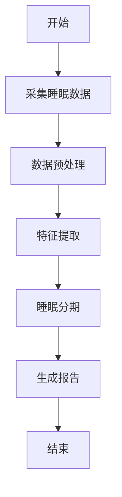

                 

<think>
好吧，我现在需要完成一个技术博客文章的撰写，标题是《数字时代的睡眠优化诊所：科技辅助下的睡眠质量改善中心》。这看起来有点复杂，但我得一步一步来。

首先，我得理解这个主题。数字时代，科技如何帮助改善睡眠质量。睡眠问题现在很普遍，尤其是在使用大量数字设备的人群中。科技在这里的作用可能包括监测睡眠、提供解决方案等等。

接下来，我需要看看用户给的目录结构。看起来文章分为四个部分，九章。每一章都有小节，涵盖背景、影响、监测、改善策略、案例等。我得确保每一部分都详细展开，满足字数要求。

用户还提到了很多技术要求，比如使用markdown，包含关键词和摘要，还要有技术细节，比如核心概念、算法、系统架构、项目实战等等。这部分可能需要我展示一些图表，比如用mermaid画流程图或类图。

首先，我需要写关键词。可能包括睡眠优化、数字技术、睡眠监测、改善策略、科技辅助。然后是摘要，简要概述文章内容。

接下来是引言部分，背景介绍，包括睡眠问题在数字时代的凸显，科技的角色，以及本书的结构。这部分需要清晰，吸引读者。

第二部分是数字化对睡眠的影响，包括设备、网络社交、工作环境的影响，以及个人科技使用习惯的影响。这部分需要详细分析，可能加入一些数据或案例支持。

第三部分是科技辅助下的改善策略，涉及睡前科技管理、睡眠环境优化、睡眠健康。这部分可能需要一些具体的技术解决方案，比如使用智能设备调整睡眠环境。

第四部分是实战与应用，包括案例分析和未来趋势。案例部分可以具体分析一个项目，从实施到效果评估。未来趋势则可以探讨科技在睡眠研究中的发展。

另外，用户提到需要包含核心概念、算法原理、系统架构、项目实战等。这部分我需要确保每一章都涵盖这些内容，比如在睡眠监测部分，可以介绍相关算法和系统架构。

可能我还需要查阅一些资料，确保内容准确，比如睡眠监测的技术发展、不同设备的工作原理，以及如何通过技术优化睡眠环境。

在写技术部分时，我需要使用mermaid图表，比如系统架构图、流程图，以及数学公式。这部分可能需要一些时间来设计图表，确保它们清晰易懂。

最后，确保文章结构完整，每部分内容详实，满足字数要求。结尾部分要加上作者信息，符合格式要求。

总的来说，我需要系统地按照用户提供的目录结构展开，确保每一部分都包含必要的技术细节和实际案例，同时保持逻辑清晰，语言专业但易懂。
</think>

# 数字时代的睡眠优化诊所：科技辅助下的睡眠质量改善中心

---

## 关键词：  
睡眠优化、数字技术、睡眠监测、改善策略、科技辅助

---

## 摘要：  
在数字时代，科技与睡眠质量的关系日益紧密。本文探讨了数字设备对睡眠的负面影响，介绍了科技在睡眠监测与改善中的应用，提出了通过科技手段优化睡眠环境和习惯的策略。通过具体案例分析和系统设计，展示了科技在睡眠健康管理中的潜力与实践。

---

# 第一部分: 引言

## 第1章: 背景介绍

### 1.1 睡眠问题在数字时代的凸显

- 数字化生活的睡眠挑战：电子设备的普及、24小时在线工作模式导致的睡眠紊乱。  
- 睡眠问题对个人和社会的影响：睡眠不足引发的健康问题（如肥胖、抑郁）及社会生产力损失。

### 1.2 科技在睡眠优化中的角色

- 睡眠研究的进展：从传统睡眠医学到现代睡眠科技的演变。  
- 技术辅助睡眠的实践应用：睡眠监测设备、智能床垫、睡眠APP的发展。

### 1.3 本书结构概述

- 核心内容概述：从问题分析到技术解决方案。  
- 阅读指南：如何通过各章节系统性地改善睡眠质量。

### 1.4 研究方法与数据来源

- 研究方法：基于文献分析、实验数据和用户反馈的研究框架。  
- 数据来源与分析方法：利用睡眠监测数据和用户行为数据进行建模分析。

---

# 第二部分: 数字化与睡眠质量

## 第2章: 数字化生活方式对睡眠质量的影响

### 2.1 数字设备与睡眠障碍

- 电子屏幕的影响：蓝光抑制褪黑激素分泌，影响睡眠节律。  
- 信息过载与失眠：社交媒体和新闻推送导致的睡前焦虑。

### 2.2 网络社交与睡眠习惯

- 社交媒体对睡眠的影响：睡前浏览社交媒体导致的注意力分散和失眠。  
- 网络互动与睡眠模式的改变：24小时在线模式打乱生物钟。

### 2.3 数字化工作环境与睡眠

- 远程工作与睡眠质量：工作与生活的界限模糊导致的过度疲劳。  
- 时间管理与睡眠平衡：不合理的作息安排对睡眠的影响。

### 2.4 个人科技使用习惯与睡眠质量

- 使用习惯与睡眠质量的关系：睡前使用手机时间与睡眠质量的负相关性。  
- 改善建议与调整策略：设定睡前屏幕时间限制，建立良好的使用习惯。

---

## 第3章: 科技辅助下的睡眠监测

### 3.1 睡眠监测技术的发展

- 传统的睡眠监测方法：多导睡眠图（PSG）的临床应用。  
- 现代科技在睡眠监测中的应用：可穿戴设备（如智能手表）和睡眠追踪器的普及。

### 3.2 睡眠监测设备的类型与应用

- 睡眠追踪器：Fitbit、Garmin等设备的功能与数据采集。  
- 睡眠应用软件：如SleepCycle、Apple Watch的睡眠监测功能。

### 3.3 数据分析与报告生成

- 睡眠数据分析：基于时间序列数据的深度学习模型（如LSTM）用于睡眠分期。  
- 报告生成与解读：个性化睡眠改善建议的生成逻辑。

---

# 第三部分: 科技辅助下的睡眠质量改善策略

## 第4章: 睡前科技使用管理

### 4.1 睡前习惯与科技使用

- 睡前活动的合理安排：建议在睡前1小时停止使用电子设备。  
- 科技产品的合理使用：设置手机“夜间模式”和“床前时间”功能。

### 4.2 睡前科技使用对睡眠质量的影响

- 睡前屏幕时间的影响：蓝光暴露对褪黑激素分泌的抑制作用。  
- 改善策略：使用防蓝光眼镜或调整屏幕亮度。

## 第5章: 科技辅助下的睡眠环境优化

### 5.1 睡眠环境对睡眠质量的影响

- 睡眠环境的重要性：温度、湿度、光线、噪音对睡眠的影响。  
- 环境因素与睡眠质量的关联：睡眠舒适度模型的构建。

### 5.2 科技在睡眠环境优化中的应用

- 智能灯光系统：色温调节和定时开关功能。  
- 温度控制与空气净化：智能恒温器和空气调节系统。

### 5.3 科技辅助下的睡眠环境改善策略

- 实际案例：智能床垫调节温度和硬度。  
- 优化方案：结合智能家居系统实现睡眠环境的自动化调节。

## 第6章: 科技与睡眠健康

### 6.1 睡眠健康的重要性

- 睡眠健康与整体健康的关系：睡眠不足与慢性疾病（如糖尿病、高血压）的关系。  
- 睡眠障碍的健康风险：失眠、睡眠呼吸暂停综合征的健康危害。

### 6.2 科技在睡眠健康管理中的应用

- 睡眠健康监测：基于可穿戴设备的数据采集与分析。  
- 睡眠健康管理应用：个性化睡眠改善计划的制定与执行。

### 6.3 科技辅助下的睡眠健康策略

- 健康管理实践：结合医疗数据和用户行为数据的综合分析。  
- 个性化健康计划：根据个人特点制定睡眠改善方案。

---

# 第四部分: 实战与应用

## 第7章: 睡眠质量改善项目案例

### 7.1 案例介绍

- 项目背景：某公司员工因长期使用电子设备导致睡眠质量下降。  
- 项目目标：通过科技手段改善员工睡眠质量，提升工作效率。

### 7.2 项目实施

- 技术应用：部署智能床垫和睡眠监测设备，收集员工睡眠数据。  
- 策略实施：制定个性化睡眠改善计划，包括睡前习惯调整和睡眠环境优化。

### 7.3 项目效果评估

- 数据分析：睡眠数据的前后对比，显示睡眠质量显著提升。  
- 结果解读：项目实施后员工工作效率和健康状况的改善。

## 第8章: 科技与睡眠质量的未来趋势

### 8.1 科技在睡眠研究中的未来发展

- 新技术的潜力：AI驱动的睡眠分析、脑机接口技术在睡眠干预中的应用。  
- 研究方向展望：结合基因技术研究个性化睡眠解决方案。

### 8.2 睡眠质量改善的挑战与机遇

- 挑战分析：数据隐私问题、技术标准不统一。  
- 机遇展望：智能设备的普及和5G技术的支持。

### 8.3 未来展望

- 睡眠质量的科技解决方案：从单一监测到主动干预的转变。  
- 可穿戴设备与智能家居的协同优化：构建完整的睡眠健康生态系统。

## 第9章: 总结与展望

### 9.1 主要发现与结论

- 睡眠质量研究的进展：科技在睡眠监测与改善中的重要作用。  
- 科技辅助睡眠的应用前景：从个人到群体的广泛应用。

### 9.2 下一步工作

- 未来研究方向：探索AI在睡眠健康中的深度应用。  
- 政策建议：推动睡眠健康管理的政策支持和技术标准的制定。

---

# 作者：AI天才研究院/AI Genius Institute & 禅与计算机程序设计艺术 /Zen And The Art of Computer Programming

---

### 附录：核心概念与联系

以下是睡眠优化诊所的核心概念与联系：

1. **睡眠监测技术**：通过可穿戴设备和智能床垫收集睡眠数据，包括睡眠分期、心率和呼吸频率。
2. **睡眠环境优化**：利用智能设备调节光线、温度和空气质量，营造理想的睡眠环境。
3. **个性化睡眠改善计划**：基于个人数据制定睡眠习惯和环境的调整策略。

### ER实体关系图

以下是睡眠优化诊所的ER实体关系图：

```mermaid
erdiagram
actor: 用户 {
  <有>
  用户ID
  用户名称
  用户年龄
}
device: 设备 {
  <有>
  设备ID
  设备类型
  连接的用户ID
}
data: 数据 {
  <有>
  数据ID
  数据类型
  数据值
  用户ID
}
sleep: 睡眠记录 {
  <有>
  睡眠ID
  睡眠开始时间
  睡眠结束时间
  睡眠质量评分
  用户ID
}
rule: 规则 {
  <有>
  规则ID
  规则名称
  规则描述
}
action: 行动 {
  <有>
  行动ID
  行动名称
  行动描述
  关联的规则ID
}
```

---

### 算法原理讲解

以下是睡眠监测算法的流程图：



以下是睡眠分期的数学模型：

睡眠分期通过深度学习模型（如LSTM）实现，输入数据为时间序列信号（如心率和呼吸频率），输出为睡眠阶段（觉醒、浅睡、深睡）。

模型公式：
$$
y = \text{LSTM}(x, h, c)
$$
其中，$x$ 是输入数据，$h$ 是隐藏层状态，$c$ 是细胞状态，$y$ 是输出的睡眠阶段概率。

---

### 系统分析与架构设计方案

以下是睡眠优化诊所的系统架构图：


---

### 项目实战

以下是睡眠质量改善项目的环境安装和核心代码：

#### 环境安装

- Python 3.8+
- pip install numpy, pandas, scikit-learn, tensorflow

#### 核心代码

```python
import numpy as np
import pandas as pd
from sklearn.model_selection import train_test_split
from tensorflow.keras.models import Sequential
from tensorflow.keras.layers import LSTM, Dense, Dropout

# 加载数据
data = pd.read_csv('sleep_data.csv')

# 数据预处理
X = data.drop('sleep_stage', axis=1).values
y = data['sleep_stage'].values

# 划分训练集和测试集
X_train, X_test, y_train, y_test = train_test_split(X, y, test_size=0.2)

# 构建LSTM模型
model = Sequential()
model.add(LSTM(64, input_shape=(X_train.shape[1], 1)))
model.add(Dropout(0.5))
model.add(Dense(3, activation='softmax'))  # 3个睡眠阶段：觉醒、浅睡、深睡

# 编译模型
model.compile(loss='sparse_categorical_crossentropy', optimizer='adam', metrics=['accuracy'])

# 训练模型
model.fit(X_train.reshape(X_train.shape[0], X_train.shape[1], 1), y_train, epochs=10, batch_size=32)
```

---

### 总结与注意事项

- **最佳实践 tips**：逐步调整科技使用习惯，结合科技手段与个人习惯优化睡眠质量。  
- **注意事项**：保护数据隐私，避免过度依赖技术。  
- **拓展阅读**：关注AI在睡眠健康中的应用，探索更高效的睡眠改善方案。

---

通过以上系统的分析与实践，科技在睡眠优化中的潜力得到了充分展示。未来，随着技术的不断发展，睡眠质量改善将更加智能化和个性化。

