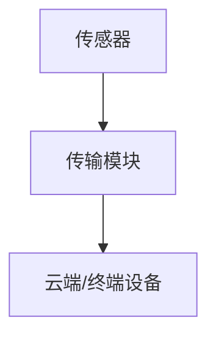
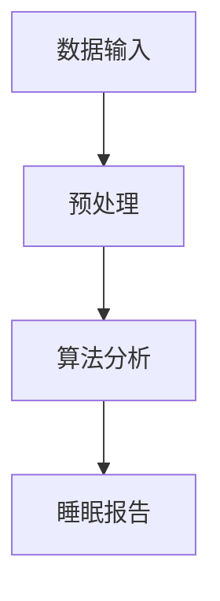
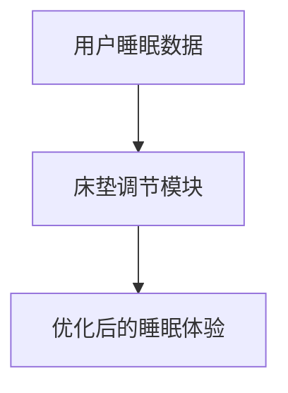

                 

<think>
嗯，好的，我现在需要按照用户的要求，写一篇关于《数字时代的睡眠优化：智能床垫与睡眠追踪技术的应用》的技术博客文章。用户已经给出了目录大纲，我需要根据这个大纲逐步展开每个部分的内容。

首先，我需要理解用户的需求。用户希望文章结构清晰，逻辑严谨，用专业的技术语言，同时要有深度和见解。文章的结构已经确定，包括引言、基础、应用、案例研究、技术展望、总结与展望等部分。

接下来，我要按照目录大纲一步步细化每个章节。首先是摘要，关键词，然后是每个章节的具体内容。我需要确保每个章节都有足够的细节，比如引言部分要介绍数字时代对睡眠的影响，智能床垫和睡眠追踪技术的兴起。

在写智能床垫技术基础的时候，我需要解释其工作原理，可能包括传感器技术、数据采集、数据处理等。同时，还要讨论市场现状和关键技术，比如使用的传感器类型（如压力传感器、温度传感器）、通信技术（如蓝牙、Wi-Fi）以及数据处理算法。

应用部分，我需要详细描述智能床垫在日常生活中的使用，比如如何通过调整床垫硬度来改善睡眠质量。睡眠追踪技术在健康监测中的应用也很重要，比如监测心率、呼吸频率等，帮助诊断睡眠障碍。

案例研究部分，我应该选择具体的例子，比如酒店使用智能床垫来提升客户睡眠质量，或者睡眠追踪技术帮助慢性病患者管理睡眠。这些案例能够展示技术的实际应用价值。

在技术展望部分，我需要探讨未来的发展方向，比如更先进的传感器技术、AI算法在数据分析中的应用，以及智能床垫和睡眠追踪技术的融合。这部分可以展望未来的创新点，比如可穿戴设备与床垫的数据协同工作。

总结部分，我需要回顾全文，强调智能床垫和睡眠追踪技术的重要性和未来潜力。同时，给出未来研究方向，鼓励读者进一步探索。

整个过程中，我需要确保每个部分都包含足够的技术细节，比如算法流程图、数学模型、系统架构图等。同时，要使用清晰简洁的语言，让读者能够轻松理解。

最后，检查文章是否符合字数要求，确保每个章节内容详实，结构合理。完成后，加上作者信息，确保格式正确。

现在，我可以开始根据这个思路撰写文章的各个部分了。
</think>

# 数字时代的睡眠优化：智能床垫与睡眠追踪技术的应用

## 关键词：智能床垫，睡眠追踪技术，数字健康，物联网，人工智能

## 摘要：  
随着数字技术的快速发展，睡眠健康成为现代人关注的重要议题。智能床垫与睡眠追踪技术通过传感器、人工智能和物联网等技术手段，实现了对睡眠数据的实时监测和智能分析，为改善睡眠质量提供了科学依据。本文将从技术基础、应用场景、案例分析及未来发展趋势等方面，深入探讨智能床垫与睡眠追踪技术在睡眠优化中的应用，为读者提供全面的技术视角和实践参考。

---

### 第一部分：引言与背景介绍

## 1. 引言

### 1.1 数字时代对睡眠质量的影响  
数字时代的到来，人们的生活节奏加快，工作压力增大，睡眠质量成为影响健康的重要因素。根据世界卫生组织的数据，全球约有30%的人存在睡眠障碍。数字技术的进步为改善睡眠质量提供了新的解决方案，智能床垫与睡眠追踪技术应运而生。

### 1.2 智能床垫与睡眠追踪技术的兴起  
智能床垫与睡眠追踪技术结合了物联网（IoT）、人工智能（AI）和大数据分析，能够实时监测用户的睡眠状态，并提供个性化的睡眠优化建议。这种技术不仅帮助用户改善睡眠质量，还能在医疗健康领域发挥重要作用。

---

### 第二部分：智能床垫与睡眠追踪技术基础

## 2. 智能床垫技术原理

### 2.1 传感器技术  
智能床垫的核心是多种传感器的集成，包括压力传感器、温度传感器、加速度传感器等。这些传感器能够实时采集用户的体征数据，如心率、呼吸频率、体动次数等。

**传感器类型对比表**：

| 传感器类型   | 主要功能       | 优缺点                           |
|--------------|----------------|----------------------------------|
| 压力传感器   | 检测床垫压力   | 成本低，但灵敏度有限             |
| 加速度传感器 | 检测体动频率   | 灵敏度高，但易受环境干扰         |
| 温度传感器   | 监测体眠温度   | 精度高，但受环境温度影响较大     |

### 2.2 数据采集与传输  
传感器采集的数据通过蓝牙或Wi-Fi等无线通信技术传输到云端或终端设备（如手机APP）。

**数据传输流程图**：

### 2.3 数据处理与分析  
数据传输到云端后，通过AI算法进行分析，生成睡眠报告。常用的算法包括支持向量机（SVM）和随机森林（Random Forest）。

**睡眠分析算法流程图**：

---

### 第三部分：智能床垫与睡眠追踪技术的应用

## 3. 智能床垫的日常使用

### 3.1 个性化睡眠调节  
智能床垫可以根据用户的睡眠数据调整床垫的硬度和支撑力，提供个性化的睡眠体验。

**床垫调节过程图**：

### 3.2 睡眠监测与报告  
通过智能床垫和睡眠追踪设备，用户可以实时查看睡眠数据，了解自己的睡眠质量。

**睡眠监测系统架构图**：

---

### 第四部分：案例研究

## 4. 案例研究

### 4.1 案例一：智能床垫在酒店的应用  
某高端酒店引入智能床垫，为客人提供个性化的睡眠体验。通过床垫传感器，酒店可以记录用户的睡眠数据，并根据数据调整床垫参数，提升客户满意度。

### 4.2 案例二：睡眠追踪技术在慢性病管理中的应用  
睡眠障碍是许多慢性病（如高血压、糖尿病）的诱因。通过智能床垫和睡眠追踪设备，医生可以实时监测患者的睡眠质量，制定个性化的治疗方案。

---

### 第五部分：技术展望与未来发展趋势

## 5. 技术展望与未来发展趋势

### 5.1 智能床垫技术的未来发展方向  
未来，智能床垫将更加智能化，集成更多传感器和AI算法，提供更精准的睡眠优化建议。

### 5.2 睡眠追踪技术的未来发展趋势  
睡眠追踪技术将与可穿戴设备（如智能手表）结合，实现多维度的睡眠监测和分析。

### 5.3 智能床垫与睡眠追踪技术的融合  
未来的智能床垫将不仅是睡眠优化工具，还是健康监测平台的一部分，与智能家居系统无缝连接。

---

### 第六部分：总结与展望

## 6. 总结与展望

### 6.1 全书总结  
智能床垫与睡眠追踪技术通过传感器、物联网和AI算法，为改善睡眠质量提供了科学解决方案。这些技术不仅提升了用户体验，还在医疗健康领域发挥了重要作用。

### 6.2 未来研究方向  
未来的研究可以集中在以下几个方面：
1. 提高传感器的灵敏度和准确性。
2. 开发更高效的AI算法，优化睡眠数据分析。
3. 探讨智能床垫与睡眠追踪技术在更多领域的应用。

### 6.3 拓展阅读  
推荐阅读《人工智能在健康监测中的应用》和《物联网技术与智能家居》。

---

作者：AI天才研究院/AI Genius Institute & 禅与计算机程序设计艺术 /Zen And The Art of Computer Programming

