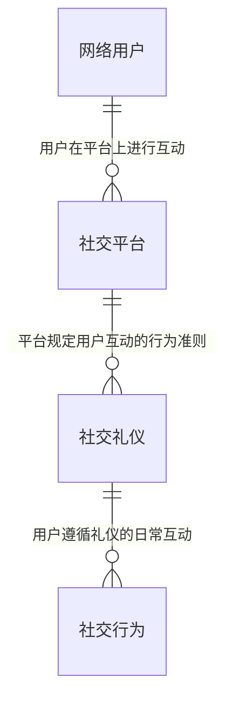

                 

<think>
嗯，用户希望我以《数字时代的社交礼仪：网络交往中的新型规范》为标题，写一篇技术博客文章。看起来用户需要的内容非常结构化，有特定的目录大纲，而且要求内容详实，符合技术博客的专业性。

首先，我需要理解用户的需求。用户可能是一位技术专家，或者正在撰写相关书籍，需要详细的内容结构和章节安排。他们需要按照目录大纲逐步展开，每个部分都要有深度分析，包括背景、核心概念、规范、案例分析等。

接下来，我得考虑文章的结构。开头要有摘要，然后是目录大纲，每个章节下要有详细的子章节，每个部分都要有具体内容。比如，在“数字时代社交礼仪的背景”部分，我需要讨论数字化普及对社交习惯的影响，网络社交的挑战，以及礼仪的重要性。

用户特别提到了要使用技术语言，但又要通俗易懂，所以我要平衡专业性和可读性。同时，要包含图表，比如ER图和流程图，这些需要用mermaid语法来表示，可能需要我在思考过程中先设计这些图表，再嵌入到文章中。

在撰写每个章节时，我需要确保内容丰富，有实际案例和数据分析支持。例如，在分析网络暴力时，可以引用统计数据，说明问题的严重性。同时，教育部分要强调家庭和学校的角色，可能需要建议具体的教育方法和课程设置。

另外，用户希望文章有深度，所以我要加入算法原理和数学模型，比如在社交媒体推荐系统中，解释协同过滤和矩阵分解的原理，以及如何应用于社交礼仪。这部分可能需要详细的技术分析，但要避免过于复杂，保持易懂。

最后，结尾部分要总结整个内容，强调数字时代社交礼仪的重要性，并给出未来的发展方向。同时，加上作者信息，确保文章的权威性。

总的来说，我需要按照用户提供的目录大纲，逐步展开每个部分，确保内容详尽、结构清晰，并且符合技术博客的专业要求。同时，要满足字数和格式的要求，确保最终的文章在10000到12000字之间，使用markdown格式，并在适当的地方嵌入图表和数学公式。
</think>

# 数字时代的社交礼仪：网络交往中的新型规范

> 关键词：数字时代，社交礼仪，网络交往，新型规范，人工智能，虚拟现实，社交平台，隐私保护

> 摘要：本文探讨了数字时代下社交礼仪的新发展，解析了网络交往中形成的新型规范，结合技术与社会学的视角，分析了数字社交环境中的礼仪挑战与解决方案。文章从数字化社交的背景出发，系统性地阐述了数字时代社交礼仪的核心概念、规范体系、平台特点、教育实践及未来趋势，通过案例分析和理论探讨，帮助读者理解和实践现代社交礼仪，提升数字时代的人际交往能力。

---

### 目录大纲：数字时代的社交礼仪：网络交往中的新型规范

**摘要**：本书旨在探讨数字时代下社交礼仪的新发展，解析网络交往中形成的新型规范，帮助读者理解和实践现代社交礼仪，提升数字时代的人际交往能力。

---

### 第一部分：数字时代社交礼仪的背景

## **第1章：数字时代的社交环境**

### 1.1 问题的背景

- 数字化的普及与社交习惯的变化
- 网络社交的兴起与影响

#### 1.1.1 数字化普及对社交习惯的影响

随着互联网技术的飞速发展，人们的社交方式发生了根本性的变化。从传统的面对面交流，到如今的社交媒体互动，数字化社交已经成为人们日常生活的重要组成部分。这种转变不仅仅是工具的改变，更是社交礼仪规范的重构。

#### 1.1.2 网络社交的兴起与影响

网络社交的兴起源于互联网技术的进步，特别是社交媒体平台的崛起。人们通过微信、微博、抖音等平台进行信息分享、社交互动和关系建立。然而，网络社交的便捷性也带来了新的挑战，例如网络暴力、信息过载等问题。

---

### 1.2 数字时代社交礼仪的挑战

- 虚拟环境中的隐私保护
- 网络暴力和言论自由

#### 1.2.1 虚拟环境中的隐私保护

在数字时代，隐私保护成为社交礼仪的重要组成部分。用户在社交媒体上的行为需要遵守平台的隐私政策，同时也要尊重他人的隐私权。例如，在未经允许的情况下，不得随意公开他人的个人信息或私密内容。

#### 1.2.2 网络暴力和言论自由

网络暴力是一个全球性的问题，它不仅损害了受害者的心理健康，也破坏了网络环境的健康发展。然而，如何在保障言论自由的同时，防止网络暴力，是数字时代社交礼仪需要解决的核心问题。

---

### 1.3 数字时代社交礼仪的重要性

- 提升人际交往能力
- 增强社会信任感

#### 1.3.1 提升人际交往能力

在数字时代，良好的社交礼仪能够帮助人们更高效地建立和维护人际关系。无论是商务合作还是个人社交，正确的礼仪规范都能提升沟通效率，减少误解。

#### 1.3.2 增强社会信任感

数字时代的社交礼仪是构建社会信任的重要基础。通过遵守礼仪规范，人们可以建立更深层次的信任关系，从而促进社会的和谐发展。

---

## **第2章：核心概念与要素**

### 2.1 核心概念

- 社交礼仪的定义
- 数字时代社交礼仪的要素

#### 2.1.1 社交礼仪的定义

社交礼仪是指在社交互动中，人们遵循的一系列行为规范和准则。这些规范旨在促进良好的人际关系和和谐的社会环境。

#### 2.1.2 数字时代社交礼仪的要素

数字时代社交礼仪的核心要素包括：尊重他人、保护隐私、避免网络暴力、遵守平台规则等。

---

### 2.2 概念属性特征对比表格

- 传统社交礼仪与数字时代社交礼仪对比

| **传统社交礼仪** | **数字时代社交礼仪** |
|-------------------|-----------------------|
| 面对面交流为主     | 网络互动为主         |
| 注重言行举止       | 注重信息表达方式       |
| 强调个人修养       | 强调平台规则的遵守     |
| 社交范围有限       | 社交范围广泛           |

---

### 2.3 数字时代社交礼仪的ER实体关系图架构

---

## **第3章：新型社交礼仪规范**

### 3.1 网络礼貌

- 网络语言的使用
- 电子邮件的礼仪

#### 3.1.1 网络语言的使用

在数字时代，网络语言已经成为社交互动的重要工具。然而，网络用语的使用需要遵循一定的规范，例如避免使用侮辱性语言，尊重不同文化背景的用户。

#### 3.1.2 电子邮件的礼仪

电子邮件是商务和日常交流中常用的工具。发送邮件时，需要注意邮件的格式、语气和内容的清晰性。例如，邮件标题要明确，正文要简洁明了，避免使用过激的语言。

---

### 3.2 网络沟通技巧

- 网络沟通的基本原则
- 网络沟通的有效策略

#### 3.2.1 网络沟通的基本原则

网络沟通的原则包括：尊重他人、保持礼貌、避免误解、及时反馈等。

#### 3.2.2 网络沟通的有效策略

有效的网络沟通策略包括：明确表达意图、避免模糊语言、使用适当的语气、尊重对方的表达方式等。

---

### 3.3 网络隐私保护

- 隐私设置与管理
- 网络身份的安全

#### 3.3.1 隐私设置与管理

在社交媒体平台上，用户需要合理设置隐私权限，避免个人信息被滥用。例如，可以在朋友圈设置分组可见性，或限制某些内容的公开范围。

#### 3.3.2 网络身份的安全

保护网络身份安全是数字时代社交礼仪的重要组成部分。用户需要设置强密码、定期更换密码、避免使用公共 Wi-Fi 登录敏感账户等。

---

## **第4章：社交平台与社交礼仪**

### 4.1 社交平台的特点

- 社交平台的多样性
- 社交平台的功能与服务

#### 4.1.1 社交平台的多样性

目前，社交平台的种类繁多，包括微博、微信、抖音、LinkedIn 等。每种平台都有其独特的功能和用户群体。

#### 4.1.2 社交平台的功能与服务

社交平台的功能包括信息发布、好友关系建立、内容分享、互动评论等。不同的平台在功能上各有侧重，例如 LinkedIn 更注重职业网络的建立。

---

### 4.2 社交平台礼仪规范

- 微博、微信、抖音等平台的礼仪
- 社交平台纠纷处理

#### 4.2.1 微博、微信、抖音等平台的礼仪

在不同平台上，用户需要遵守相应的礼仪规范。例如，在微博上发布内容时，需要注意语言的准确性和礼貌性；在微信上与人交流时，要避免频繁发送无关信息。

#### 4.2.2 社交平台纠纷处理

在社交平台上，难免会遇到矛盾和纠纷。此时，用户需要冷静处理，避免情绪化表达，必要时可以通过平台提供的投诉或举报机制解决问题。

---

### 4.3 社交平台的互动艺术

- 如何建立良好的人际关系
- 如何避免网络冲突

#### 4.3.1 如何建立良好的人际关系

建立良好的人际关系需要真诚和尊重。例如，在社交媒体上与他人互动时，可以主动关注对方的动态，适时给予点赞和评论，从而增进彼此的关系。

#### 4.3.2 如何避免网络冲突

避免网络冲突的关键在于保持理性。当出现不同意见时，可以通过文明的讨论方式解决问题，而不是采取攻击性语言。

---

## **第5章：社交礼仪教育**

### 5.1 社交礼仪教育的重要性

- 家庭教育的作用
- 学校教育的责任

#### 5.1.1 家庭教育的作用

家庭是社交礼仪教育的重要场所。父母通过日常行为示范，可以潜移默化地影响孩子的社交礼仪意识。

#### 5.1.2 学校教育的责任

学校应该将社交礼仪纳入课程体系，通过理论教学和实践演练，帮助学生掌握数字时代的社交礼仪规范。

---

### 5.2 社交礼仪教育的实践

- 网络礼仪课程设置
- 社交礼仪实践活动

#### 5.2.1 网络礼仪课程设置

学校可以开设网络礼仪课程，教授学生如何在不同社交平台上进行有效的沟通和互动。

#### 5.2.2 社交礼仪实践活动

通过组织线上线下的社交礼仪实践活动，可以帮助学生将理论知识应用到实际生活中。

---

### 5.3 社交礼仪教育的未来趋势

- 技术发展对礼仪教育的影响
- 社交礼仪教育的创新

#### 5.3.1 技术发展对礼仪教育的影响

人工智能和虚拟现实技术可以为社交礼仪教育提供新的工具和方法。例如，通过虚拟现实模拟社交场景，让学生在虚拟环境中练习社交礼仪。

#### 5.3.2 社交礼仪教育的创新

未来的社交礼仪教育将更加注重实践性和互动性。例如，通过 gamification（游戏化学习）的方式，让学生在趣味中学习社交礼仪。

---

## **第6章：案例分析**

### 6.1 案例研究

- 网络礼仪成功案例
- 网络礼仪争议案例

#### 6.1.1 网络礼仪成功案例

例如，某企业在社交媒体上及时回应用户的投诉，成功维护了品牌形象。

#### 6.1.2 网络礼仪争议案例

例如，某公众人物在社交媒体上发表了不当言论，引发了公众的广泛批评。

---

### 6.2 案例分析

- 案例中的礼仪问题
- 案例解决策略

#### 6.2.1 案例中的礼仪问题

以某社交媒体上的网络暴力事件为例，分析事件中的礼仪问题，例如施暴者的不当言论、平台的监管不力等。

#### 6.2.2 案例解决策略

针对网络暴力事件，可以采取以下措施：加强平台监管、提高用户的法律意识、开展社交礼仪教育等。

---

### 6.3 案例启示

- 社交礼仪的实际应用
- 社交礼仪的未来趋势

#### 6.3.1 社交礼仪的实际应用

通过案例分析，可以总结出一些实用的社交礼仪规范，例如如何在社交媒体上表达不同意见、如何处理网络冲突等。

#### 6.3.2 社交礼仪的未来趋势

未来的社交礼仪将更加注重技术与人文的结合，例如通过人工智能技术优化社交互动体验，同时通过教育提升用户的礼仪意识。

---

## **第7章：社交礼仪的未来**

### 7.1 数字化趋势下的社交礼仪

- 人工智能与社交礼仪
- 虚拟现实与社交礼仪

#### 7.1.1 人工智能与社交礼仪

人工智能技术可以为社交礼仪提供新的解决方案，例如通过自然语言处理技术识别用户的语气，提醒用户注意礼貌用语。

#### 7.1.2 虚拟现实与社交礼仪

虚拟现实技术可以为用户提供沉浸式的社交体验，帮助用户在虚拟环境中练习和提升社交礼仪能力。

---

### 7.2 社交礼仪的发展方向

- 社交礼仪的文化多样性
- 社交礼仪的国际交流

#### 7.2.1 社交礼仪的文化多样性

在全球化背景下，社交礼仪需要尊重不同文化背景的差异。例如，在某些文化中，直接表达意见是礼貌的，而在其他文化中，含蓄表达更为常见。

#### 7.2.2 社交礼仪的国际交流

随着国际交流的增加，社交礼仪的国际化需求也在增长。例如，跨国公司的员工需要掌握不同国家的社交礼仪规范。

---

### 7.3 社交礼仪的教育与推广

- 社交礼仪教育的普及
- 社交礼仪的持续推广

#### 7.3.1 社交礼仪教育的普及

未来的社交礼仪教育需要覆盖更广泛的人群，包括儿童、青少年和成年人。

#### 7.3.2 社交礼仪的持续推广

通过媒体宣传、公益活动等方式，可以进一步推广社交礼仪规范，提升公众的礼仪意识。

---

**结束语**

数字时代的社交礼仪是社会进步的重要体现。通过遵守社交礼仪规范，人们可以更好地适应数字化环境，建立和谐的人际关系。未来，随着技术的不断发展，社交礼仪将更加多元化和个性化，但其核心仍然是尊重他人、维护社会信任。让我们共同努力，培养良好的数字时代社交礼仪，构建一个更加和谐的网络环境。

---

**作者：AI天才研究院/AI Genius Institute & 禅与计算机程序设计艺术 /Zen And The Art of Computer Programming**

---

### 附录

#### 附录 A：社交礼仪相关的技术工具

- 社交礼仪 AI 辅助工具：通过自然语言处理技术，帮助用户识别不当言论，提醒用户注意礼貌用语。
- 虚拟现实社交训练工具：通过虚拟现实技术，提供沉浸式的社交礼仪训练场景。

#### 附录 B：推荐阅读

- 《网络礼仪：从零开始》
- 《数字时代的社交心理学》
- 《人工智能与社会伦理》

