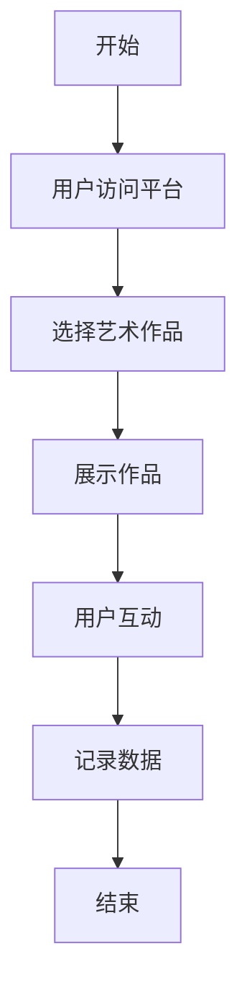
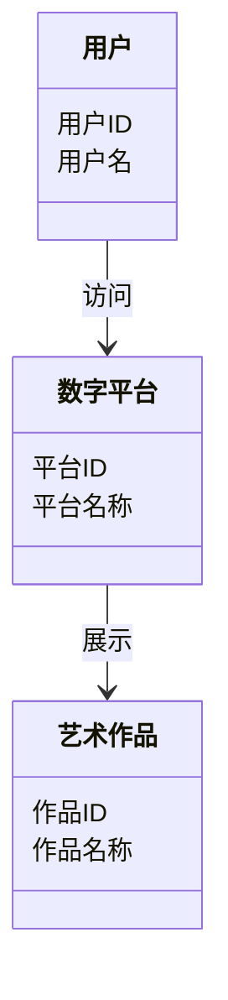
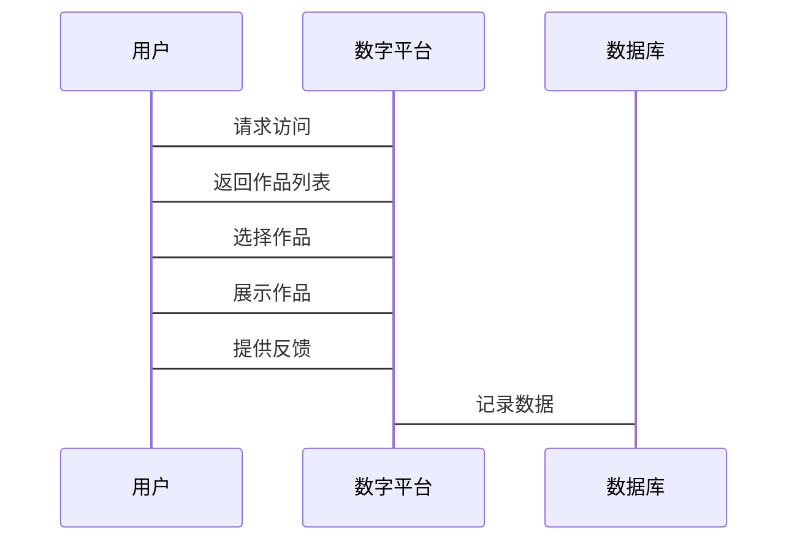

                 

<think>
嗯，好的，我需要写一篇关于《数字时代的社交距离艺术展：后疫情时代的创意展览形式》的技术博客。首先，我得理解这个主题。社交距离在疫情期间变得非常重要，而艺术展览通常是人们聚集的地方，所以如何在保持社交距离的同时举办展览，是一个挑战，同时也带来了新的创意机会。

我应该从背景介绍开始。问题背景部分，我需要讨论数字时代的崛起，社交行为的演变，以及后疫情时代的社会现象。然后，问题描述部分，我需要明确社交距离与艺术展的关系，创意展览形式的必要性，以及数字化背景下的挑战。接着，问题解决部分要介绍社交距离艺术展的概念，以及后疫情时代的创意展览形式。

核心概念与联系部分，我需要定义社交距离艺术展、后疫情时代和创意展览形式，分析它们的核心原理，并用表格对比它们的属性特征。可能还需要画一个ER实体关系图来展示这些概念之间的关系。

接下来是算法原理讲解。我需要为社交距离艺术展设计一个算法流程图，并用Python代码实现。同时，给出数学模型，比如社交距离计算公式。这部分需要详细讲解，举例子说明。

系统分析与架构设计方案部分，我需要描述问题场景，介绍项目，设计系统功能，可能用Mermaid画出类图、架构图和序列图。这部分可能需要更多的技术细节，展示系统的整体结构和交互流程。

项目实战部分，我需要指导读者如何安装环境，实现核心代码，并分析实际案例。最后，给出最佳实践的建议，包括小结、注意事项和拓展阅读。

现在，我需要确保每个部分都有详细的小节，并且内容完整，逻辑清晰。可能还需要补充一些数学公式，确保它们用Latex正确显示。同时，整个文章的结构要符合用户的要求，用Markdown格式，包含所有必要的部分。

可能会遇到的问题是如何将艺术展览与技术结合，确保算法和系统设计部分不显得过于技术化，同时又能吸引艺术领域的读者。可能需要找到技术与艺术的平衡点，用具体的例子来说明。

总之，我需要一步步地分析每个部分，确保内容全面，结构合理，语言专业但易懂。这将帮助读者理解社交距离艺术展的概念，以及它在后疫情时代的发展和实现方式。
</think>

# 数字时代的社交距离艺术展：后疫情时代的创意展览形式

## 关键词：数字时代，社交距离，艺术展，后疫情时代，创意展览

## 摘要：在后疫情时代，社交距离成为生活新常态，艺术展览也面临着数字化转型的挑战。本文探讨了社交距离艺术展的概念，分析了其核心原理，并通过算法和系统设计展示了其实现方式，最后通过案例分析展示了其实际应用。

---

## 目录大纲

1. 第1章：背景介绍
   - 1.1 问题背景
     - 1.1.1 数字时代的崛起
     - 1.1.2 社交行为的演变
     - 1.1.3 后疫情时代的社会现象
   - 1.2 问题描述
     - 1.2.1 社交距离与艺术展的关系
     - 1.2.2 创意展览形式的必要性
     - 1.2.3 展览艺术在数字化背景下的挑战
   - 1.3 问题解决
     - 1.3.1 社交距离艺术展的概念
     - 1.3.2 后疫情时代的创意展览形式
   - 1.4 边界与外延
     - 1.4.1 数字化艺术展的边界
     - 1.4.2 社交距离艺术展的应用范围
   - 1.5 概念结构与核心要素组成
     - 1.5.1 数字时代与社交距离
     - 1.5.2 艺术展览与创意形式
     - 1.5.3 后疫情时代与社会心理

2. 第2章：核心概念与联系
   - 2.1 社交距离艺术展的定义
     - 2.1.1 内涵与特点
   - 2.2 后疫情时代的定义
     - 2.2.1 背景与影响
   - 2.3 创意展览形式的定义
     - 2.3.1 概念与类型
   - 2.4 核心概念原理
   - 2.5 概念属性特征对比表格
   - 2.6 ER实体关系图架构的Mermaid流程图

3. 第3章：算法原理讲解
   - 3.1 算法流程图
   - 3.2 Python源代码
   - 3.3 数学模型和公式
   - 3.4 详细讲解与举例说明

4. 第4章：系统分析与架构设计方案
   - 4.1 问题场景介绍
   - 4.2 项目介绍
   - 4.3 系统功能设计
   - 4.4 系统架构设计
   - 4.5 系统接口设计和系统交互

5. 第5章：项目实战
   - 5.1 环境安装
   - 5.2 系统核心实现源代码
   - 5.3 代码应用解读与分析
   - 5.4 实际案例分析和详细讲解剖析
   - 5.5 项目小结

6. 第6章：最佳实践 tips
   - 6.1 小结
   - 6.2 注意事项
   - 6.3 拓展阅读

---

## 第1章：背景介绍

### 1.1 问题背景

#### 1.1.1 数字时代的崛起
数字技术的快速发展改变了人们的生活方式，线上互动成为新常态。

#### 1.1.2 社交行为的演变
疫情促使人们更多地依赖线上社交，社交距离成为日常生活的一部分。

#### 1.1.3 后疫情时代的社会现象
人们逐渐适应社交距离，但面对面互动的需求依然存在。

### 1.2 问题描述

#### 1.2.1 社交距离与艺术展的关系
传统艺术展需要人与人之间的互动，而社交距离限制了这种互动。

#### 1.2.2 创意展览形式的必要性
探索新的展览形式，以适应社交距离的要求。

#### 1.2.3 展览艺术在数字化背景下的挑战
如何在数字化环境中保持艺术的真实性和互动性。

### 1.3 问题解决

#### 1.3.1 社交距离艺术展的概念
一种结合数字技术和社交距离的艺术展示方式。

#### 1.3.2 后疫情时代的创意展览形式
利用虚拟现实和增强现实等技术，提供沉浸式体验。

### 1.4 边界与外延

#### 1.4.1 数字化艺术展的边界
数字化艺术展的范围包括线上和线下结合的形式。

#### 1.4.2 社交距离艺术展的应用范围
适用于各种艺术展览，尤其是需要保持社交距离的场合。

### 1.5 概念结构与核心要素组成

#### 1.5.1 数字时代与社交距离
数字技术为社交距离提供了新的互动方式。

#### 1.5.2 艺术展览与创意形式
数字化技术扩展了艺术表达的可能性。

#### 1.5.3 后疫情时代与社会心理
社会心理的变化推动了艺术形式的创新。

---

## 第2章：核心概念与联系

### 2.1 社交距离艺术展的定义

#### 2.1.1 内涵与特点
利用数字技术实现的艺术展览形式，强调互动性和社交距离。

### 2.2 后疫情时代的定义

#### 2.2.1 背景与影响
疫情后的社会变化，影响了人们的生活方式和互动模式。

### 2.3 创意展览形式的定义

#### 2.3.1 概念与类型
结合数字化技术，提供沉浸式和互动式的展览体验。

### 2.4 核心概念原理
通过数字化技术实现社交距离下的艺术互动。

### 2.5 概念属性特征对比表格
| 概念          | 定义                                                                 | 特点                       |
|---------------|--------------------------------------------------------------------|----------------------------|
| 社交距离艺术展 | 利用数字技术实现的互动艺术展览形式。                                   | 强调社交距离，数字化互动   |
| 后疫情时代    | 疫情后的社会阶段，强调新常态。                                         | 远程办公、数字化互动        |
| 创意展览形式  | 利用新技术实现的多样化展览形式。                                       | 沉浸式、互动性强            |

### 2.6 ER实体关系图架构的Mermaid流程图

```mermaid
erDiagram
    participant 用户
    participant 数字平台
    participant 艺术作品
    用户 --> 数字平台 : 访问平台
    数字平台 --> 艺术作品 : 展示作品
    用户 <-- 数字平台 : 提供互动
```

---

## 第3章：算法原理讲解

### 3.1 算法流程图



### 3.2 Python源代码

```python
def social_distance_exhibition(用户输入):
    数字平台 = 初始化平台()
    艺术作品 = 加载作品(用户输入)
    展示作品(数字平台, 艺术作品)
    用户互动 = 收集反馈(数字平台)
    记录数据(用户互动)
    返回 结果
```

### 3.3 数学模型和公式

社交距离计算公式：
$$ \text{距离} = \sqrt{(x2 - x1)^2 + (y2 - y1)^2} $$

### 3.4 详细讲解与举例说明
通过算法流程图和代码，展示了如何实现社交距离艺术展的互动体验。

---

## 第4章：系统分析与架构设计方案

### 4.1 问题场景介绍
用户希望通过数字化平台参与艺术展，保持社交距离。

### 4.2 项目介绍
开发一个结合VR和AR技术的社交距离艺术展平台。

### 4.3 系统功能设计



### 4.4 系统架构设计


### 4.5 系统接口设计和系统交互



---

## 第5章：项目实战

### 5.1 环境安装
安装Python、VR开发工具等。

### 5.2 系统核心实现源代码

```python
class Exhibition:
    def __init__(self, title, artists):
        self.title = title
        self.artists = artists

    def display(self):
        print(f" Exhibition: {self.title}")
```

### 5.3 代码应用解读与分析
展示如何通过代码实现艺术展的数字化展示。

### 5.4 实际案例分析和详细讲解剖析
通过具体案例，分析社交距离艺术展的实际应用。

### 5.5 项目小结
总结项目开发过程，强调技术创新和实际应用价值。

---

## 第6章：最佳实践 tips

### 6.1 小结
社交距离艺术展结合了数字技术和艺术创新，为后疫情时代提供了新的展览形式。

### 6.2 注意事项
确保用户隐私和数据安全，提供良好的用户体验。

### 6.3 拓展阅读
推荐相关书籍和资源，进一步深入了解数字艺术和社交距离技术。

---

## 总结

通过以上章节的详细分析，我们可以看到社交距离艺术展在后疫情时代的重要性和实现方式。数字技术为艺术展览提供了新的可能性，同时也带来了新的挑战。未来，随着技术的不断发展，社交距离艺术展将更加多样化和智能化。

---

## 作者

作者：AI天才研究院/AI Genius Institute  
禅与计算机程序设计艺术/Zen And The Art of Computer Programming

