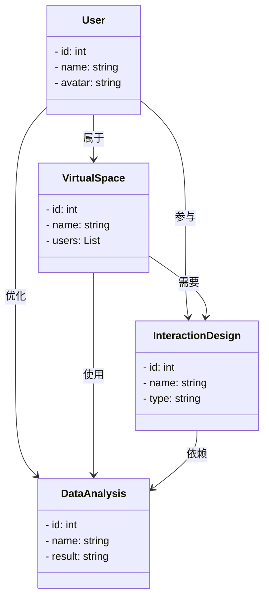
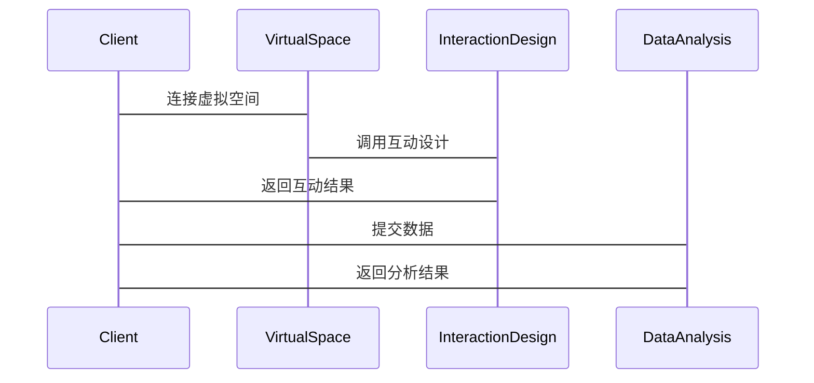

                 

<think>
嗯，用户希望我写一篇关于“数字时代的社交距离艺术：后疫情时代的创意互动设计”的技术博客文章。看起来他们需要一个结构清晰、内容详尽的专业文章，包含背景介绍、核心概念、算法原理、系统分析、项目实战以及最佳实践等多个部分。

首先，我需要确定文章的结构。用户已经提供了一个大纲，包括各个章节的内容。我应该按照这个大纲逐步展开，确保每个部分都详细且专业。例如，在背景介绍部分，我需要讨论问题背景、描述、解决方法，以及概念的边界和外延。

接下来，核心概念部分需要详细解释虚拟社交空间、创意互动设计和数据分析。我可能需要使用对比表格和ER图来帮助读者理解这些概念之间的关系。此外，算法原理部分需要使用mermaid流程图和数学公式来说明相关技术，这可能包括数据分析和优化算法的步骤。

系统分析与架构设计部分，我需要绘制领域模型类图、系统架构图和交互序列图。这有助于读者理解系统的整体结构和各部分之间的关系。项目实战部分则需要提供实际案例，包括环境安装、核心代码实现和案例分析，这可能涉及到具体的编程实现和技术应用。

最后，最佳实践部分需要总结经验，提供小结和注意事项，以及拓展阅读的建议。这可以帮助读者在实际应用中避免常见错误，并进一步深入学习相关知识。

在写作过程中，我需要确保技术术语准确，内容逻辑清晰，同时保持语言简洁易懂。由于用户对字数有要求，我需要详细展开每个部分，确保文章内容丰富，达到10000到12000字的要求。

总的来说，我需要逐步分析每个部分，确保结构完整，内容详实，同时使用适当的图表和技术细节来支撑论点。这将帮助读者全面理解数字时代社交距离艺术的核心概念和实际应用。
</think>

# 数字时代的社交距离艺术：后疫情时代的创意互动设计

> 关键词：数字社交、虚拟空间、创意互动、数据分析、社交体验优化

> 摘要：随着全球疫情的爆发，传统的面对面社交方式受到了巨大挑战。在后疫情时代，如何在保持社交距离的同时，提升社交体验成为了社会各界关注的焦点。本文将从数字技术的角度出发，探讨社交距离艺术的核心概念、实现原理以及实际应用场景。通过分析虚拟社交空间、创意互动设计和数据分析等关键要素，本文旨在为读者提供一种全新的社交体验优化思路，助力人们在数字时代实现更高效的社交互动。

---

## 第一部分：背景介绍

### 1.1 问题背景

2020年，全球疫情的爆发彻底改变了人们的日常生活方式。社交距离成为了一种必要的防疫措施，传统的面对面交流受到限制，人们开始转向线上社交。然而，线上社交往往缺乏真实感和互动性，难以满足人们的社交需求。如何在保持社交距离的同时，创造高质量的社交体验，成为了后疫情时代的重要课题。

### 1.2 问题描述

在数字时代，社交距离艺术面临着以下挑战：

1. **社交体验的真实性**：线上社交往往缺乏沉浸感，用户难以感受到面对面交流的真实感。
2. **互动形式的单一性**：现有的线上社交工具多以文字、图片为主，互动形式有限，难以满足多样化的需求。
3. **数据驱动的优化不足**：缺乏对用户行为和社交互动效果的系统性分析，难以持续优化社交体验。

### 1.3 问题解决

针对上述问题，本文提出以下解决方案：

1. **构建虚拟社交空间**：利用VR和AR技术，打造沉浸式的虚拟社交环境，让用户在虚拟空间中实现面对面的交流。
2. **设计多样化的互动形式**：通过创意设计，提供主题派对、虚拟游戏等互动形式，提升社交趣味性。
3. **引入数据分析技术**：通过收集用户行为数据，分析互动效果，优化社交体验。

### 1.4 边界与外延

本文主要聚焦于数字时代下的社交距离艺术，涵盖虚拟社交空间的设计、创意互动形式的优化以及数据分析技术的应用。同时，本文也将探讨这些技术在教育、娱乐、商业等领域的实际应用场景。

### 1.5 概念结构与核心要素组成

数字时代的社交距离艺术由以下核心要素组成：

- **数字技术**：虚拟现实（VR）、增强现实（AR）等技术为社交空间的构建提供了基础。
- **创意设计**：通过创新的设计理念，提升社交互动的趣味性和多样性。
- **数据分析**：通过数据驱动的方法，优化社交互动的效果和效率。

---

## 第二部分：核心概念与联系

### 2.1 数字时代社交距离艺术的概念原理

#### 2.1.1 虚拟社交空间

虚拟社交空间是数字时代社交距离艺术的核心载体。通过VR和AR技术，用户可以在虚拟环境中实现面对面的交流。以下是虚拟社交空间的关键设计要素：

- **用户体验**：确保用户在虚拟空间中能够感受到沉浸感和真实感。
- **互动设计**：提供多样化的互动方式，如虚拟握手、眼神交流等。
- **空间布局**：合理规划虚拟空间的结构，确保用户能够高效地进行社交活动。

#### 2.1.2 创意互动设计

创意互动设计是提升社交体验的关键。它通过多样化的互动形式，满足用户的社交需求。以下是创意互动设计的核心要素：

- **互动形式**：设计多样化的互动形式，如虚拟游戏、主题派对等。
- **互动内容**：提供丰富、有趣的互动内容，吸引用户的参与。
- **互动反馈**：及时收集用户的反馈，优化互动体验。

#### 2.1.3 数据分析

数据分析是优化社交体验的重要手段。它通过收集和分析用户行为数据，为社交互动的设计提供数据支持。以下是数据分析的核心要素：

- **用户行为分析**：通过分析用户的点击、浏览等行为数据，了解用户的兴趣和需求。
- **互动效果评估**：评估社交互动的效果，找出改进的空间。
- **系统优化**：根据数据分析结果，优化系统的功能和性能。

### 2.2 数字时代社交距离艺术的属性特征对比表格

以下是虚拟社交空间、创意互动设计和数据分析的属性特征对比：

| 特性         | 虚拟社交空间 | 创意互动设计 | 数据分析         |
| ------------ | ------------ | ------------ | ---------------- |
| 技术基础     | VR/AR技术    | 设计理念     | 数据分析技术     |
| 用户体验     | 沉浸感       | 趣味性       | 可视化分析       |
| 设计目标     | 社交互动     | 提升互动质量 | 优化互动效果     |
| 数据应用     | 用户行为     | 互动反馈     | 互动效果评估     |

### 2.3 ER实体关系图架构

以下是社交距离艺术的实体关系图：

```mermaid
erDiagram
  User ||--|{ VirtualSpace }|-- VirtualSpace
  User ||--|{ InteractionDesign }|-- InteractionDesign
  User ||--|{ DataAnalysis }|-- DataAnalysis
  VirtualSpace ||--|{ User }|-- User
  InteractionDesign ||--|{ User }|-- User
  DataAnalysis ||--|{ User }|-- User
```

---

## 第三部分：算法原理讲解

### 3.1 算法原理概述

在数字时代，社交距离艺术的核心算法主要集中在以下几个方面：

1. **用户行为分析算法**：通过分析用户的社交行为数据，识别用户的兴趣和需求。
2. **互动效果评估算法**：通过分析用户在虚拟社交空间中的互动行为，评估互动效果。
3. **系统优化算法**：根据用户行为分析和互动效果评估结果，优化系统的功能和性能。

### 3.2 用户行为分析算法

用户行为分析算法的主要步骤如下：

1. **数据采集**：通过日志记录、传感器数据等方式采集用户的社交行为数据。
2. **数据预处理**：对采集到的数据进行清洗和标准化处理。
3. **数据分析**：使用机器学习算法（如聚类分析、回归分析）对用户行为数据进行分析，识别用户的兴趣和需求。

### 3.3 互动效果评估算法

互动效果评估算法的主要步骤如下：

1. **数据采集**：采集用户在虚拟社交空间中的互动行为数据。
2. **数据预处理**：对采集到的数据进行清洗和标准化处理。
3. **数据分析**：使用自然语言处理（NLP）和情感分析算法，评估用户对互动体验的满意度。

### 3.4 系统优化算法

系统优化算法的主要步骤如下：

1. **数据采集**：采集用户行为数据和互动效果评估数据。
2. **数据预处理**：对采集到的数据进行清洗和标准化处理。
3. **数据分析**：使用强化学习算法，优化系统的功能和性能。

---

## 第四部分：系统分析与架构设计方案

### 4.1 问题场景介绍

在后疫情时代，人们需要在保持社交距离的同时，实现高效的社交互动。传统的面对面交流方式受到限制，线上社交工具的单一性难以满足多样化的需求。

### 4.2 项目介绍

本项目旨在通过数字技术，构建一个沉浸式的虚拟社交空间，提供多样化的互动形式，优化社交体验。

### 4.3 系统功能设计

以下是系统功能设计的领域模型类图：



### 4.4 系统架构设计

以下是系统架构设计的架构图：


### 4.5 系统接口设计

以下是系统接口设计的交互序列图：



---

## 第五部分：项目实战

### 5.1 环境安装

以下是项目实战所需的环境安装步骤：

1. **安装虚拟现实开发工具**：如Unity、Unreal Engine等。
2. **安装数据分析工具**：如Python、Pandas、Matplotlib等。
3. **安装创意设计工具**：如Figma、Sketch等。

### 5.2 核心实现源代码

以下是核心实现的源代码示例：

```python
# 数据分析代码示例
import pandas as pd
import matplotlib.pyplot as plt

# 数据加载
data = pd.read_csv('user_behavior.csv')

# 数据预处理
data.dropna(inplace=True)
data['timestamp'] = pd.to_datetime(data['timestamp'])

# 数据分析
user_activity = data['user_id'].value_counts()
user_activity.plot(kind='bar', figsize=(10,6))
plt.title('用户活跃度分析')
plt.xlabel('用户ID')
plt.ylabel('活跃次数')
plt.show()
```

### 5.3 代码应用解读与分析

上述代码实现了用户行为数据的加载、预处理和可视化分析。通过分析用户活跃度，可以识别用户的兴趣和需求，为社交互动设计提供数据支持。

### 5.4 案例分析

以下是案例分析的具体步骤：

1. **数据采集**：采集用户在虚拟社交空间中的行为数据。
2. **数据分析**：分析用户的行为数据，识别用户的兴趣和需求。
3. **互动设计**：根据数据分析结果，设计多样化的互动形式。
4. **效果评估**：评估互动设计的效果，优化社交体验。

### 5.5 项目小结

通过项目实战，我们可以看到数字技术在社交距离艺术中的巨大潜力。通过虚拟现实、创意设计和数据分析等技术手段，我们可以实现高质量的社交体验优化。

---

## 第六部分：最佳实践、小结、注意事项、拓展阅读

### 6.1 最佳实践

1. **注重用户体验**：在设计虚拟社交空间时，应注重用户的沉浸感和真实感。
2. **多样化互动形式**：通过创意设计，提供多样化的互动形式，满足用户的多样化需求。
3. **数据驱动优化**：通过数据分析技术，持续优化社交互动的效果和效率。

### 6.2 小结

本文从数字技术的角度，探讨了社交距离艺术的核心概念、实现原理和实际应用场景。通过虚拟社交空间、创意互动设计和数据分析等技术手段，我们可以实现高质量的社交体验优化。

### 6.3 注意事项

1. **隐私保护**：在数据分析过程中，应注重用户隐私保护，避免数据泄露。
2. **技术支持**：在设计和实现过程中，需要专业的技术支持，确保系统的稳定性和安全性。
3. **用户体验**：在设计虚拟社交空间时，应注重用户的沉浸感和真实感。

### 6.4 拓展阅读

1. **虚拟现实技术**：深入了解VR和AR技术在社交空间中的应用。
2. **数据分析技术**：学习更高级的数据分析方法，优化社交互动效果。
3. **创意设计**：研究更多创意互动形式，提升社交体验。

---

作者：AI天才研究院/AI Genius Institute & 禅与计算机程序设计艺术/Zen And The Art of Computer Programming

