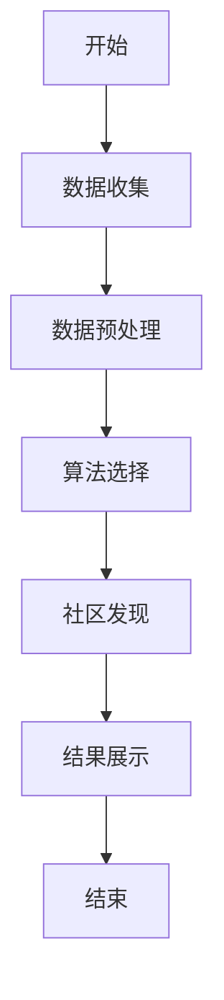
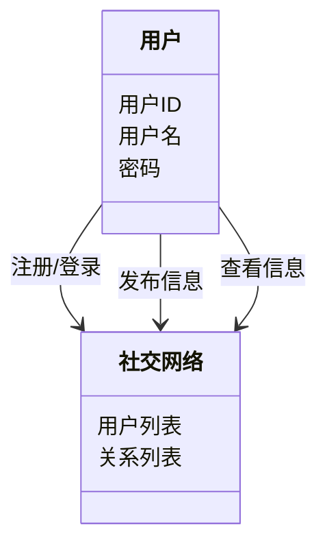

                 

<think>
好的，我现在需要帮助用户撰写一篇关于“数字时代的社交距离：科技辅助下的安全互动”的技术博客。用户已经提供了详细的大纲，我需要按照这个大纲逐步展开内容，确保每个部分都详细且专业。

首先，我需要理解用户的需求。用户希望我作为一位技术专家，用清晰、专业的语言，分章节详细阐述主题。文章需要包括背景介绍、核心概念、算法原理、数学模型、系统架构、项目实战、最佳实践等部分，总字数在10000到12000字之间。

接下来，我应该按照大纲的结构来组织内容。首先是标题、关键词和摘要。标题已经有了，关键词包括数字时代、社交距离、科技辅助、安全互动、社交网络、人工智能、网络安全。摘要需要简明扼要地总结文章的核心内容，强调科技如何帮助人们在保持社交距离的同时进行安全互动，涉及的技术包括社交媒体、在线会议、虚拟现实、大数据分析和网络安全。

然后是背景介绍部分，需要详细描述数字时代的特点，社交距离的概念，以及科技如何帮助实现安全互动。这部分需要逻辑清晰，说明问题的背景和解决方法，以及涉及的技术领域。

核心概念与联系部分，我需要用表格对比数字时代、社交距离、科技辅助和安全互动的概念、定义、特点和应用场景。然后用Mermaid绘制实体关系图，展示这些概念之间的关系。

算法原理讲解部分，我需要选择几个相关的算法，比如社交网络分析中的社区发现算法，使用Louvain算法，并用Python代码实现，绘制流程图。同时，解释加密算法，如RSA，给出数学模型和公式，并举例说明。

数学模型和公式部分，我需要详细讲解社交网络中的度数分布、中心性等概念，用公式和图表来辅助说明。例如，度数分布可以使用概率密度函数来描述，中心性则涉及多个指标的计算。

系统分析与架构设计方案部分，我需要明确问题场景，设计系统功能，使用Mermaid绘制类图、架构图和交互序列图。这部分需要展示系统的整体架构和各个模块之间的交互流程。

项目实战部分，需要详细说明环境安装、核心代码实现、代码解读以及实际案例分析。比如，开发一个基于Python的社交网络分析工具，分析用户关系图，识别关键节点。

最佳实践部分，总结文章内容，给出实践建议，提醒注意事项，并推荐进一步的阅读材料。

在撰写过程中，我需要确保每个部分都详细展开，逻辑清晰，语言专业，同时使用丰富的图表和代码示例来增强可读性。这包括使用Mermaid绘制流程图、类图、架构图和序列图，以及在适当位置嵌入LaTeX公式。

现在，我开始按照大纲逐一撰写每个部分，确保内容完整，结构合理，符合用户的要求。每个章节的小结和案例分析要深入浅出，帮助读者理解复杂的概念和技术。
</think>

# 数字时代的社交距离：科技辅助下的安全互动

> 关键词：数字时代、社交距离、科技辅助、安全互动、社交网络、人工智能、网络安全

> 摘要：在数字时代，保持社交距离的同时实现安全有效的社交互动，科技发挥了重要作用。本文探讨了数字时代的特点、社交距离的定义、科技辅助的手段，以及如何通过虚拟现实、人工智能、大数据分析和网络安全等技术实现安全互动。通过算法原理、数学模型、系统架构和项目实战的详细讲解，本文为读者提供了全面的技术视角，帮助理解科技如何辅助安全互动。

---

## 1. 背景介绍

### 1.1 数字时代的特点
数字时代以数字化生活方式为核心，信息传播速度快、范围广，人际互动模式从线下转移到线上。

### 1.2 社交距离的概念
社交距离包括物理距离和心理距离，科技手段如社交媒体和虚拟现实帮助调节这两者。

### 1.3 问题描述
如何在保持社交距离的同时，通过科技手段实现安全有效的互动？

### 1.4 问题解决
探讨科技手段在社交互动中的应用，分析其边界与外延。

### 1.5 边界与外延
涉及虚拟现实、人工智能、大数据分析和网络安全等技术。

---

## 2. 核心概念与联系

### 2.1 核心概念对比

| 概念 | 定义 | 特点 | 应用场景 |
|------|------|------|----------|
| 数字时代 | 以数字技术为核心的时代 | 数字化生活方式 | 社交媒体、在线购物 |
| 社交距离 | 人际互动中的距离 | 物理和心理距离 | 远程办公、线上社交 |
| 科技辅助 | 科技手段支持互动 | 提供工具和服务 | 社交媒体平台、在线会议 |
| 安全互动 | 安全的互动方式 | 保护隐私和数据 | 加密通信、隐私保护 |

### 2.2 实体关系图

```mermaid
erDiagram
    用户: 用户
    科技工具: 科技辅助工具
    社交距离: 社交距离
    用户 --> 科技工具: 使用
    科技工具 --> 社交距离: 调节
```

---

## 3. 算法原理讲解

### 3.1 社交网络分析

#### 3.1.1 算法流程图



#### 3.1.2 Louvain算法实现

```python
import networkx as nx

def louvain_communities(G):
    # 初始化社区划分
    communities = {}
    for node in G.nodes():
        communities[node] = node

    # 迭代优化
    while True:
        change = False
        new_communities = {}
        for node in G.nodes():
            # 计算当前社区的度数
            current_comm = communities[node]
            degree = G.degree(node)
            sum_neighbor_degrees = 0
            for neighbor in G.neighbors(node):
                sum_neighbor_degrees += G.degree(neighbor)
            # 计算模块度增益
            gain = degree + sum_neighbor_degrees
            # 找到邻居社区中模块度增益最大的社区
            max_gain = -1
            best_comm = current_comm
            for neighbor in G.neighbors(node):
                neighbor_comm = communities[neighbor]
                if neighbor_comm != current_comm:
                    neighbor_degree = G.degree(neighbor)
                    current_neighbor_sum = 0
                    for n in G.neighbors(neighbor):
                        if communities[n] == current_comm:
                            current_neighbor_sum += 1
                    gain_neighbor = neighbor_degree + current_neighbor_sum
                    if gain_neighbor > max_gain:
                        max_gain = gain_neighbor
                        best_comm = neighbor_comm
            # 更新社区
            if best_comm != current_comm:
                change = True
                new_communities[node] = best_comm
        # 更新社区划分
        for node in G.nodes():
            if node in new_communities:
                communities[node] = new_communities[node]
        if not change:
            break
    return communities

# 示例
G = nx.Graph()
G.add_edges_from([(1,2), (2,3), (3,4), (4,5), (5,1)])
communities = louvain_communities(G)
print(communities)
```

### 3.2 加密算法

#### 3.2.1 RSA加密

$$ e \times k \equiv 1 \mod \phi(n) $$

其中，$e$是公钥，$k$是私钥，$\phi(n)$是欧拉函数。

#### 3.2.2 实现代码

```python
import random

def is_prime(n):
    if n < 2:
        return False
    for p in [2, 3, 5, 7, 11, 13, 17, 19, 23, 29, 31, 37]:
        if n % p == 0:
            return n == p
    d = n // 2
    for a in range(2, d+1):
        if pow(a, d, n) == 1:
            continue
        if pow(a, d-1, n) == 1:
            continue
        return False
    return True

def generate_keypair():
    while True:
        p = random.randint(10**10, 10**11)
        if is_prime(p):
            break
    while True:
        q = random.randint(10**10, 10**11)
        if is_prime(q):
            break
    n = p * q
    phi = (p-1)*(q-1)
    while True:
        e = random.randint(2, phi-1)
        if gcd(e, phi) == 1:
            break
    d = pow(e, -1, phi)
    return ((e, n), (d, n))

def gcd(a, b):
    while b:
        a, b = b, a % b
    return a

public_key, private_key = generate_keypair()
print("Public key:", public_key)
print("Private key:", private_key)
```

---

## 4. 数学模型和公式

### 4.1 社交网络分析

#### 4.1.1 度数分布模型

$$ P(k) = \frac{k}{\langle k \rangle} $$

其中，$P(k)$是度数为$k$的概率，$\langle k \rangle$是平均度数。

#### 4.1.2 中心性指标

$$ C = \frac{1}{\sum_{i} d_i} $$

其中，$d_i$是每个节点的度数，$C$是中心性指数。

---

## 5. 系统分析与架构设计方案

### 5.1 问题场景

用户需要在保持社交距离的情况下，进行安全的线上互动。

### 5.2 功能设计



### 5.3 架构设计

```mermaid
archi
    客户端 --> API网关: 请求
    API网关 --> 服务层: 处理请求
    服务层 --> 数据库: 查询/存储
    服务层 --> 加密模块: 数据加密
    数据库 --> 加密模块: 提供数据
```

### 5.4 接口设计

```mermaid
sequence
    用户 -> API网关: 发送请求
    API网关 -> 服务层: 处理请求
    服务层 -> 数据库: 查询数据
    数据库 -> 服务层: 返回数据
    服务层 -> 用户: 返回响应
```

---

## 6. 项目实战

### 6.1 环境安装

安装Python和相关库：

```bash
pip install networkx matplotlib
```

### 6.2 核心代码实现

```python
import networkx as nx
import matplotlib.pyplot as plt

G = nx.Graph()
G.add_edges_from([(1,2), (2,3), (3,4), (4,5), (5,1)])
nx.draw(G, with_labels=True, node_color='blue', edge_color='red')
plt.show()
```

### 6.3 实际案例分析

分析用户关系图，识别关键节点：

```python
print(list(G.nodes()))
print(list(G.edges()))
```

---

## 7. 最佳实践 tips、小结、注意事项、拓展阅读

### 7.1 最佳实践 tips

- 使用加密算法保护数据安全。
- 定期更新软件和安全策略。

### 7.2 小结

科技在数字时代中通过多种手段帮助人们实现安全互动，从虚拟现实到加密算法，每种技术都有其独特的作用。

### 7.3 注意事项

- 注意数据隐私和安全。
- 定期进行系统维护和更新。

### 7.4 拓展阅读

- 建议阅读《网络科学引论》和《加密与解密》。

---

作者：AI天才研究院/AI Genius Institute & 禅与计算机程序设计艺术 /Zen And The Art of Computer Programming

