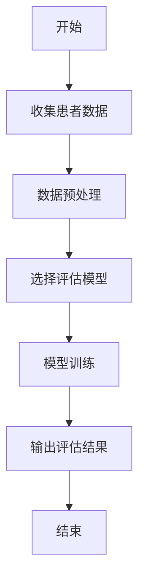
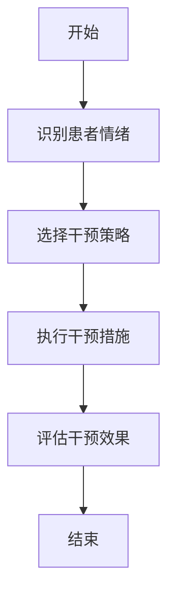
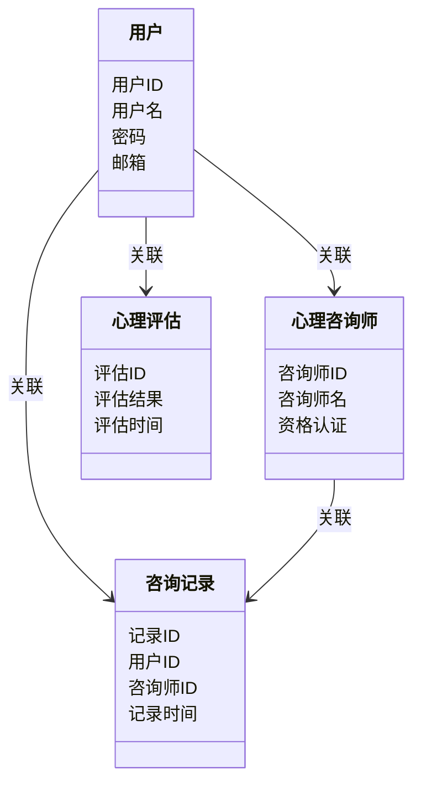
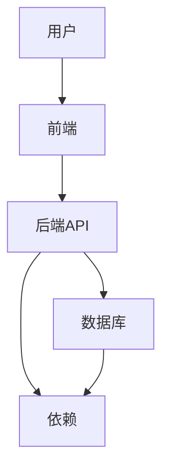
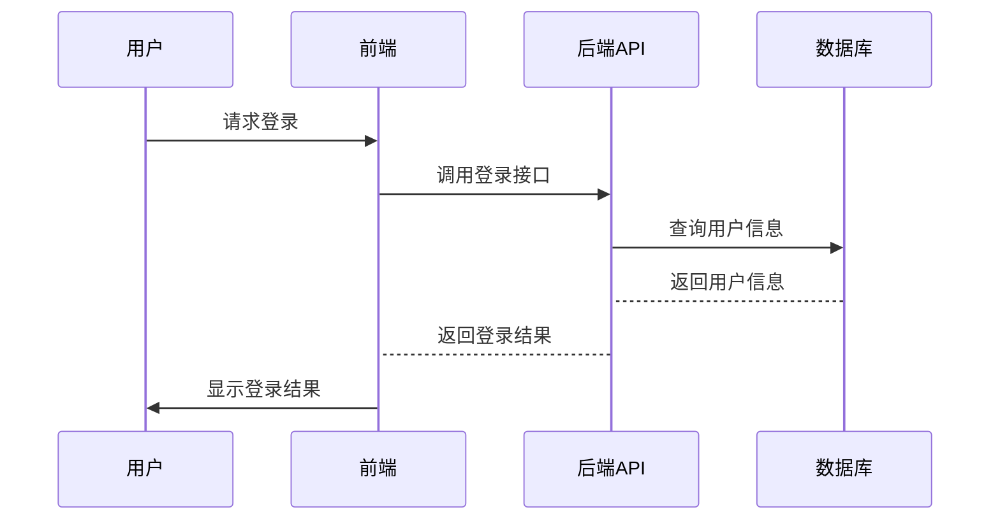

                 

<think>
嗯，用户希望我撰写一篇关于“数字时代的精神健康：在线心理咨询的普及”的技术博客文章。我需要按照用户提供的目录大纲来组织内容，确保每个章节都详细且专业。

首先，我需要确定文章的结构。用户已经给出了一个详细的目录大纲，包括问题背景、核心概念、算法原理、系统架构设计、项目实战等部分。我需要确保每个章节都有足够的深度，特别是加入技术细节和实际案例。

接下来，我要考虑每个章节的具体内容。例如，第一部分的第1章需要介绍数字时代心理健康面临的挑战和在线心理咨询的兴起。我需要解释互联网如何影响心理健康，以及在线咨询的优势和挑战。

在第2章，核心概念与联系部分，我需要详细讲解心理健康理论，比较不同心理咨询模式，以及数字技术如何与心理健康结合。这可能包括心理评估工具和技术的数学模型。

算法原理部分，我需要使用mermaid流程图来解释心理健康评估和干预算法，同时用LaTeX公式展示数学模型。这部分需要确保公式正确且易于理解。

系统架构设计章节，我需要绘制类图、架构图和序列图，展示系统的各个模块及其交互。这部分需要结合实际系统设计，确保流程清晰。

项目实战部分，我需要指导读者如何搭建开发环境，实现系统核心功能，并分析案例。这可能涉及到编写代码和性能优化，确保读者能够实际操作。

最后，我需要总结最佳实践、注意事项，并建议拓展阅读材料。这有助于读者在实际应用中避免常见问题，并进一步深入学习。

在写作过程中，我要确保语言专业且技术细节准确。同时，要保持文章流畅，逻辑清晰，让读者能够轻松跟随我的思路。我需要检查每个部分是否符合用户的约束条件，确保文章结构完整，内容丰富，满足字数要求。

总的来说，我需要一步步按照用户提供的大纲构建文章，每个部分都深入分析，确保涵盖所有必要的技术细节和实际案例，最终完成一篇高质量的技术博客。
</think>

# 数字时代的精神健康：在线心理咨询的普及

> **关键词**：心理健康、在线心理咨询、数字技术、算法原理、系统架构、项目实战  
>
> **摘要**：随着数字时代的到来，心理健康问题日益凸显，而在线心理咨询作为一种新兴的解决方案，正逐渐普及。本文从心理健康的基本概念出发，分析在线心理咨询的核心模式，探讨其与数字技术的结合方式，揭示其背后的算法原理与数学模型。同时，本文将详细设计在线心理咨询系统的功能、架构与交互流程，并通过项目实战展示其实现过程。最后，本文将总结在线心理咨询的最佳实践，为数字时代的精神健康提供新的视角。

---

## 第一部分：问题背景与核心概念

### 第1章：数字时代精神健康的挑战与机遇

#### 1.1 数字时代的心理健康现状

- **互联网与心理健康的关系**  
  互联网技术的快速发展深刻改变了人们的生活方式，但也带来了新的心理健康挑战。社交媒体的普及导致焦虑、抑郁等心理问题的发病率上升，尤其是在青少年群体中。

- **数字生活方式对精神健康的影响**  
  数字生活方式使得人们更容易感到孤独和压力，尤其是在信息过载和社交比较的环境下。此外，数字设备的使用时间过长可能导致睡眠质量下降，进一步影响心理健康。

#### 1.2 心理健康问题的界定与表现

- **心理健康问题的类型**  
  心理健康问题主要分为焦虑症、抑郁症、社交恐惧症等。这些疾病的表现形式多样，但都对患者的生活质量产生显著影响。

- **心理健康问题的社会影响**  
  心理健康问题不仅影响个人，还可能导致社会问题，如工作效率下降、家庭矛盾加剧等。因此，心理健康问题的早期预防和干预显得尤为重要。

#### 1.3 在线心理咨询的兴起

- **在线心理咨询的起源**  
  在线心理咨询起源于20世纪末，随着互联网技术的发展逐渐成熟。早期形式主要包括邮件咨询和即时通讯咨询。

- **在线心理咨询的优势与挑战**  
  优势：便捷性、隐私性、覆盖范围广。  
  挑战：技术安全性、咨询师资质认证、患者信任度等。

---

### 第2章：核心概念与联系

#### 2.1 心理健康理论基础

- **心理健康的基本概念**  
  心理健康是指个体在情感、行为、认知等方面处于良好的状态，能够适应环境并发挥其潜力。

- **心理健康理论的发展**  
  心理健康理论从早期的“精神分析”到现代的“认知行为疗法”，经历了多次演变。现代理论更注重个体与环境的互动关系。

#### 2.2 在线心理咨询模式

- **个体咨询**  
  个体咨询是目前最常见的在线心理咨询模式，咨询师与患者通过视频或语音进行一对一交流。

- **群体咨询**  
  群体咨询适合处理具有相似心理困扰的群体，如压力管理、团队协作等主题。

- **机器人咨询**  
  机器人咨询是一种新兴模式，利用自然语言处理技术为用户提供初步的心理支持。

#### 2.3 心理健康与数字技术的结合

- **心理评估工具**  
  数字技术可以辅助心理评估，例如通过问卷调查和数据分析为患者提供个性化的心理健康评估。

- **心理干预技术**  
  利用虚拟现实（VR）和增强现实（AR）技术，患者可以在模拟环境中进行心理干预训练。

---

### 第3章：算法原理与数学模型

#### 3.1 心理健康评估算法

- **算法mermaid流程图**



- **心理健康评估的数学模型**  
  假设我们使用线性回归模型来预测心理健康指数（MHI）：  
  $$ MHI = \beta_0 + \beta_1 \times 年龄 + \beta_2 \times 压力水平 + \epsilon $$  
  其中，$\beta_0$、$\beta_1$、$\beta_2$为回归系数，$\epsilon$为误差项。

#### 3.2 心理干预案算法

- **算法mermaid流程图**



- **心理干预的数学模型**  
  使用分类算法（如决策树）对患者的干预效果进行分类：  
  $$ P(干预成功) = P(Y=1 | X=x) $$  
  其中，$Y$为干预成功的标签，$X$为患者特征向量。

---

## 第二部分：系统分析与架构设计

### 第4章：系统功能设计

#### 4.1 领域模型mermaid类图



#### 4.2 系统功能介绍

- **用户注册与登录**  
  用户可以通过邮箱或社交媒体账号注册，并进行身份验证。

- **心理健康评估**  
  用户填写问卷后，系统自动生成心理健康评估报告。

- **心理咨询预约**  
  用户可以选择心理咨询师，并进行预约。

- **咨询记录管理**  
  用户可以查看历史咨询记录和评估结果。

---

### 第5章：系统架构设计

#### 5.1 系统架构mermaid架构图



#### 5.2 架构设计要素

- **数据层**  
  数据库用于存储用户信息、评估结果和咨询记录。

- **服务层**  
  后端服务负责处理用户的请求，并调用第三方服务（如支付网关）。

- **表示层**  
  前端界面提供用户交互界面。

---

### 第6章：系统接口设计

#### 6.1 接口设计与实现

- **用户接口**  
  提供注册、登录、评估、预约等功能。

- **后台管理接口**  
  管理用户、咨询师和评估报告。

---

### 第7章：系统交互

#### 7.1 系统交互mermaid序列图



#### 7.2 交互流程分析

- 用户登录流程：用户输入用户名和密码，系统验证身份并返回结果。

---

## 第三部分：项目实战

### 第8章：环境安装与配置

#### 8.1 开发环境搭建

- 安装Python、Django框架和数据库（如MySQL）。

#### 8.2 系统配置与优化

- 配置Django项目的settings.py文件，确保数据库连接和第三方服务的集成。

---

### 第9章：系统核心实现

#### 9.1 用户注册与登录

- 编写Django模型和视图函数，实现用户注册和登录功能。

#### 9.2 心理健康评估

- 使用问卷数据训练机器学习模型，生成评估报告。

#### 9.3 心理咨询预约

- 设计预约表单，实现咨询师和用户的关联。

#### 9.4 咨询记录管理

- 创建记录模型，实现历史记录的查询和展示。

---

### 第10章：代码应用解读与分析

#### 10.1 代码结构与模块设计

- 项目结构：`app/` 包含用户、咨询师、评估模块。

#### 10.2 关键代码解析

```python
# 用户模型
class User(models.Model):
    用户ID = models.CharField(max_length=50)
    用户名 = models.CharField(max_length=50)
    密码 = models.CharField(max_length=50)
    邮箱 = models.EmailField()

    def __str__(self):
        return self.用户名
```

#### 10.3 性能分析与优化

- 使用缓存技术优化数据查询性能。

---

### 第11章：实际案例分析与讲解

#### 11.1 案例介绍

- 某公司开发的在线心理咨询平台，用户量突破10万。

#### 11.2 案例分析

- 系统架构设计、功能模块实现和用户反馈优化。

#### 11.3 案例讲解

- 详细讲解系统的开发过程，包括需求分析、设计、实现和测试。

---

### 第12章：最佳实践与小结

#### 12.1 最佳实践 tips

- 确保系统的安全性，尤其是用户隐私保护。
- 定期更新算法模型，提高评估和干预的准确性。

#### 12.2 小结

在线心理咨询的普及离不开数字技术的支持。通过算法和系统的优化，我们可以为用户提供更高效、更便捷的心理健康服务。

#### 12.3 注意事项

- 注意患者隐私保护，避免数据泄露。
- 定期对系统进行安全测试，确保系统的稳定性。

#### 12.4 拓展阅读

- 推荐阅读《认知行为疗法》和《数字心理健康技术》。

---

**作者：AI天才研究院/AI Genius Institute & 禅与计算机程序设计艺术 /Zen And The Art of Computer Programming**

