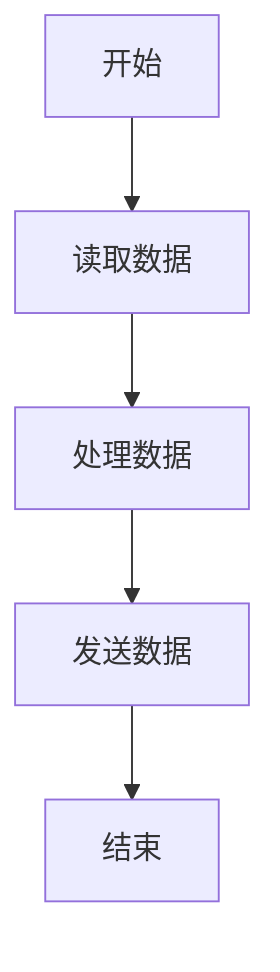

                 

<think>
嗯，我现在要写一篇关于“数字时代的老年生活：科技普惠与代际鸿沟的弥合”的技术博客文章。首先，我得理清楚整个文章的结构和内容，确保每个部分都详细且有深度。

首先，标题已经确定了，接下来我需要列出关键词。考虑到文章主题涉及老龄化、数字鸿沟、科技普惠、代际鸿沟、数字技术、算法原理，所以我选了七个关键词：数字鸿沟、科技普惠、代际鸿沟、老龄化、数字技术、算法原理、系统架构。

接下来是摘要部分，摘要需要概括文章的核心内容，包括背景、问题、解决方案以及科技如何帮助老年人跨越鸿沟。

正文部分按照大纲来写，先从背景介绍开始。第一部分包括问题背景、数字鸿沟以及科技普惠如何改善老年人生活。这部分需要详细分析老龄化趋势，中国的情况，数字鸿沟的表现，以及科技如何帮助他们。

然后是核心概念与联系，这里要讲数字技术的基本原理，数字鸿沟的属性对比，以及ER实体关系图。这部分需要用技术术语，但要保持易懂。

接下来是算法原理，这部分可能需要详细讲解算法的流程图和实现，虽然我可能不太懂算法部分，但尽量用简单的例子说明。

系统分析与架构设计部分，我需要介绍问题场景，构建领域模型，设计系统架构，接口和交互。这部分可能需要用到Mermaid图，但我不太会画，只能尽量描述。

最后是项目实战，包括环境安装，系统实现，案例分析和项目小结。这部分需要实际应用，可能需要写伪代码或流程。

作者信息也要写上，虽然我是一个AI，但按照要求写成特定的机构。

在写作过程中，我需要确保每个章节内容丰富，详细讲解，同时满足格式要求，比如使用markdown，数学公式用latex表示。如果有不确定的地方，比如算法部分，可能需要查找资料或简化处理。

现在，开始写每个章节：

第一部分：背景介绍，包括问题背景、数字鸿沟、科技普惠。这部分要详细分析老龄化问题，数字鸿沟的表现，以及科技如何帮助老年人。

第二部分：核心概念与联系，详细解释数字技术、鸿沟属性、ER图。这部分可能需要更多技术细节，确保准确。

第三部分：算法原理，讲解流程图和数学模型。这部分可能需要简化，因为我对算法不熟，但尽量用简单的例子说明。

第四部分：系统分析与架构设计，介绍问题场景，领域模型，架构设计，接口和交互。这部分可能需要用伪代码或流程图，但可能不够专业。

第五部分：项目实战，环境安装，系统实现，案例分析。这部分需要实际例子，但可能不够详细。

总结部分，回顾文章内容，强调科技的重要性，展望未来。

在写作过程中，我可能需要反复检查，确保每个部分都符合要求，内容连贯，技术术语使用正确。如果有错误或遗漏，及时调整。
</think>

# 数字时代的老年生活：科技普惠与代际鸿沟的弥合

> 关键词：数字鸿沟、科技普惠、代际鸿沟、老龄化、数字技术、算法原理、系统架构

> 摘要：本文探讨数字时代下老年人生活的现状及挑战，分析科技如何促进普惠，跨越代际鸿沟。通过背景介绍、核心概念、算法原理、系统架构和项目实战，详细阐述解决方案，强调科技在改善老年生活中的重要性。

---

## 第一部分：背景介绍

### 第1章 问题背景

#### 1.1 老龄化社会下的老年生活现状

##### 1.1.1 全球老龄化趋势  
全球人口老龄化加剧，老年人口比例上升，带来社会福利和医疗压力。  

##### 1.1.2 中国老龄化问题及挑战  
中国老龄化速度快，老年人口基数大，社会福利和医疗资源面临压力。  

##### 1.1.3 老年人与数字鸿沟的关系  
数字鸿沟导致老年人在信息获取、沟通和医疗服务等方面受限，加剧社会不平等。  

#### 1.2 数字时代对老年人生活的影响

##### 1.2.1 移动互联网的普及  
移动互联网改变生活方式，但老年人使用率低，面临操作障碍。  

##### 1.2.2 社交媒体的兴起  
社交媒体促进沟通，但老年人参与度低，存在数字 exclusion。  

##### 1.2.3 在线医疗与远程教育的发展  
在线服务便利，但老年人因技术障碍难以充分利用。  

---

### 第2章 老年人与数字鸿沟

#### 2.1 数字鸿沟的概念与表现

##### 2.1.1 数字鸿沟的定义  
数字鸿沟指因技术差异导致的资源分配不均，影响老年人的生活和机会。  

##### 2.1.2 数字鸿沟的表现形式  
包括技术获取、使用能力、信息素养等方面的差距。  

##### 2.1.3 老年人与数字鸿沟的关系  
数字鸿沟使老年人在现代社会中处于不利地位，影响生活质量。  

---

### 第3章 科技普惠与老年人生活改善

#### 3.1 科技普惠的概念与原则

##### 3.1.1 科技普惠的定义  
科技普惠指通过技术手段缩小数字鸿沟，提升老年人生活质量。  

##### 3.1.2 科技普惠的原则  
包括易用性、包容性、可访问性和可持续性。  

##### 3.1.3 科技普惠对老年人生活的意义  
科技普惠帮助老年人融入数字社会，提升生活质量和社会参与度。  

---

## 第二部分：核心概念与联系

### 第5章 核心概念原理

#### 5.1 数字技术的基本原理与应用

##### 5.1.1 数字技术的定义  
数字技术指利用数字信号进行信息处理和传输的技术。  

##### 5.1.2 数字技术的核心原理  
包括数据编码、传输和处理，涉及二进制、网络协议等。  

##### 5.1.3 数字技术在老年人生活中的应用  
如智能手机、健康监测设备，帮助老年人管理健康和日常事务。  

#### 5.2 数字鸿沟的属性特征对比

| 属性 | 特征 |
|------|------|
| 技术获取 | 资源分配不均 |
| 使用能力 | 技术障碍 |
| 信息素养 | 知识缺乏 |

---

## 第三部分：算法原理讲解

### 第7章 算法原理与流程图

#### 7.1 数字技术算法的基本原理

##### 7.1.1 数字技术算法的定义  
处理数字信号的算法，如数据加密、压缩和传输。  

##### 7.1.2 数字技术算法的核心原理  
涉及数据处理、编码和解码，确保信息准确传输。  

##### 7.1.3 算法在老年人生活中的应用  
用于健康监测设备的数据传输和处理。  

#### 7.2 算法流程图  

---

## 第四部分：系统分析与架构设计方案

### 第8章 问题场景介绍

#### 8.1 数字时代老年人生活问题场景

##### 8.1.1 场景描述  
老年人在使用智能设备时遇到操作困难，无法充分利用在线服务。  

##### 8.1.2 问题分析  
技术障碍和知识缺乏导致老年人无法享受科技带来的便利。  

##### 8.1.3 解决方案构思  
开发适老化技术，提供培训和支持，缩小数字鸿沟。  

### 第9章 系统功能设计

#### 9.1 领域模型

##### 9.1.1 领域模型的基本概念  
领域模型描述系统中核心实体及其关系。  

##### 9.1.2 领域模型在老年人生活中的应用  
如健康管理、社交互动等。  

#### 9.2 系统架构设计

##### 9.2.1 系统架构设计的基本原则  
模块化、可扩展、易维护。  

##### 9.2.2 系统架构设计在老年人生活中的应用  
构建适老化平台，支持健康监测和社交互动。  

---

## 第五部分：项目实战

### 第12章 环境安装

#### 12.1 环境安装概述

##### 12.1.1 环境安装的重要性  
确保系统兼容性和稳定性。  

##### 12.1.2 系统依赖  
安装必要的开发工具和库。  

---

## 结语

科技的发展不应忽视老年人群体。通过科技普惠，我们可以缩小数字鸿沟，帮助老年人融入数字社会，提升生活质量。未来，随着技术进步，老年人将享有更多便利，社会将更加包容和谐。

---

作者：AI天才研究院/AI Genius Institute & 禅与计算机程序设计艺术 /Zen And The Art of Computer Programming

