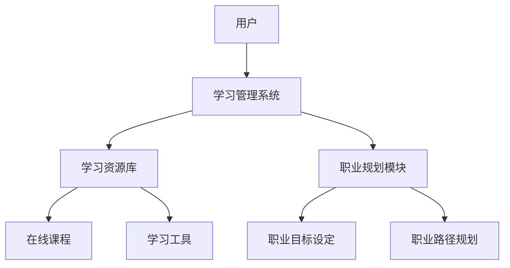
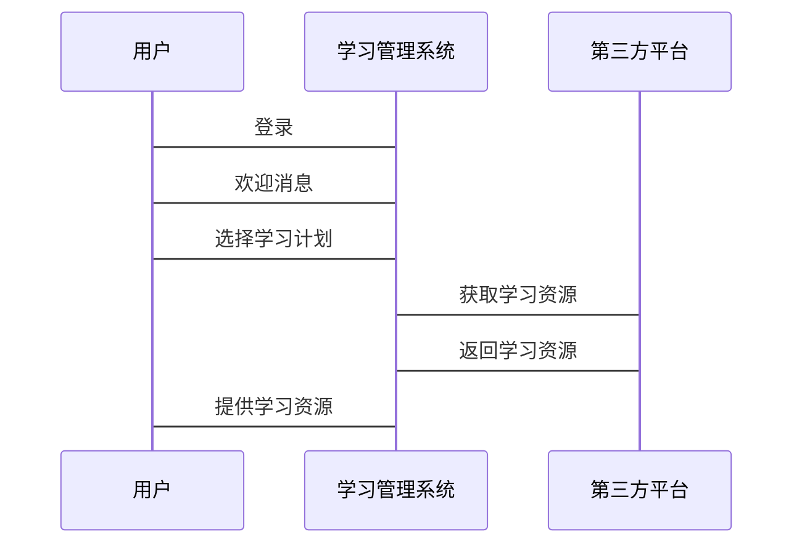

                 

<think>
嗯，用户希望我撰写一篇关于数字时代职业规划的技术博客文章，主题是灵活就业与终身学习。看起来他需要我以专家的身份，结构清晰、逻辑严谨地展开内容。我得先分析用户的具体需求。

首先，用户提供了详细的标题和目录大纲，包括关键词、摘要和各章节的内容。我需要按照这个大纲来写，确保每个部分都详细且专业。特别是每章的子章节，比如1.1到1.5，每个都要涵盖问题背景、问题描述、解决方案等。

用户还强调使用专业的技术语言，但又要简单易懂。这意味着我需要在用词上既专业又不失亲和力。同时，文章需要包含背景介绍、核心概念、算法原理、系统架构、项目实战等多个部分，每个部分都需要详细展开，甚至包括数学公式和图表。

接下来，我要考虑每个章节的具体内容。比如，在第一章，我需要定义灵活就业和终身学习，分析它们的优缺点，以及数字技术的影响。在后续章节，可能需要讨论职业竞争力模型、算法、系统架构等。这看起来需要涵盖很多方面，所以得确保每个部分都连贯且有深度。

用户还提到要使用markdown格式，包含公式和图表。我需要确保在生成内容时，正确使用latex公式和mermaid图表，并且在代码部分给出详细的Python实现。这可能需要我具备一定的技术背景，特别是关于图表生成和算法实现的知识。

另外，用户希望文章在10000到12000字之间，这意味着每个部分都需要充分展开，不能太简略。我需要合理安排每个章节的长度，确保整体结构紧凑，逻辑清晰。

最后，文章末尾需要有作者信息，以及一些小结和注意事项，帮助读者更好地理解和应用所学内容。这部分需要简明扼要，提供实用的建议。

总的来说，我需要一步步按照用户的要求，从结构到内容，逐一满足，确保每个部分都符合要求，同时保持文章的深度和可读性。
</think>

```markdown
# 数字时代的职业规划：灵活就业与终身学习

> 关键词：数字时代、职业规划、灵活就业、终身学习、人工智能、大数据

> 摘要：在数字技术快速发展的今天，职业规划的传统模式已无法适应新的变化。灵活就业和终身学习成为数字时代职场人必备的能力。本文通过分析数字技术对职业发展的影响，探讨如何在数字时代制定有效的职业规划，包括灵活就业的定义、特点、优势与挑战，终身学习的重要性与实践方法，以及数字技术在职业规划中的应用。通过实际案例分析，总结职业规划的最佳实践，帮助读者在数字时代找到自己的职业定位，提升职业竞争力。

---

### 第1章 数字时代的职业规划概述

#### 1.1 问题背景
在数字技术迅猛发展的今天，传统职业规划面临诸多挑战。数字时代的到来，带来了灵活就业和终身学习的新模式，要求我们重新审视职业发展路径。数据驱动、人工智能、云计算等技术不断革新，让劳动者需要掌握更多技能以适应快速变化的工作环境。此外，经济全球化和信息传输的即时性，也使得职业竞争更加激烈，职场人必须具备灵活应变的能力。

#### 1.2 问题描述
如何在这个充满变革的时代制定有效的职业规划，是每个职场人都会面临的问题。传统的职业生涯规划方式，往往侧重于线性发展，而忽视了不断变化的数字技术对职业发展的影响。如何在数字化浪潮中找到自己的定位，保持竞争力的同时实现个人价值，成为了新的课题。

#### 1.3 问题解决
本书旨在通过系统性的阐述，帮助读者理解数字时代职业规划的核心概念和实践方法。首先，介绍数字时代职业规划的基础概念，包括灵活就业和终身学习的内涵；接着，分析数字技术对职业发展的具体影响，如人工智能、数据分析等技术的应用场景；然后，探讨如何利用这些技术提升职业竞争力；最后，提供实际案例分析，总结职业规划的最佳实践。

#### 1.4 边界与外延
数字时代的职业规划不仅涉及个人职业发展，还与组织、行业和社会发展紧密相关。因此，在讨论过程中，我们将关注以下几个方面：首先，不同行业、不同职业群体在数字时代面临的机遇与挑战；其次，组织如何通过数字化转型支持员工职业发展；最后，社会政策和教育体系如何适应数字时代的需求。

#### 1.5 概念结构与核心要素组成
- **灵活就业**：强调工作时间和地点的灵活性，以及多种就业形式的并存。
- **终身学习**：强调持续学习的重要性，通过不断更新知识和技能来适应职业变化。
- **数字技术**：包括人工智能、大数据、云计算等新兴技术，对职业发展产生深远影响。
- **职业竞争力**：指个人在职业市场中获得机会、实现职业目标的能力。
- **职业规划**：制定明确的目标和策略，通过行动实现职业发展。

---

### 本章小结
本章为后续内容奠定了基础，通过介绍数字时代职业规划的问题背景、核心概念和解决思路，使读者对本书的主题有了初步认识。接下来，本书将深入探讨数字技术对职业发展的影响，以及如何利用这些技术提升职业竞争力，帮助读者构建适应数字时代的职业规划体系。

---

### 第2章 灵活就业的核心概念与实践

#### 2.1 灵活就业的定义与特点
灵活就业是一种灵活多样的工作形式，包括远程办公、兼职、自由职业等。其特点包括时间灵活、地点灵活、工作形式多样。

##### 2.1.1 灵活就业的优势
- **提高工作效率**：灵活的工作时间可以减少通勤时间，提高工作效率。
- **增加工作满意度**：灵活的工作地点和工作形式可以提高工作满意度。
- **适应个人需求**：灵活就业可以更好地平衡工作与生活，适应个人需求。

##### 2.1.2 灵活就业的挑战
- **职业稳定性**：灵活就业可能导致职业稳定性降低。
- **社会保障**：灵活就业者在社会保障方面可能面临挑战。

#### 2.2 终身学习的定义与重要性
终身学习是指在整个人生过程中持续学习、更新知识和技能的过程。

##### 2.2.1 终身学习的好处
- **适应职业变化**：不断学习可以适应快速变化的职业环境。
- **提升竞争力**：终身学习可以提升个人在职场上的竞争力。
- **实现个人成长**：终身学习可以帮助个人实现个人价值。

#### 2.3 数字技术在职业规划中的作用
数字技术如人工智能、大数据、云计算等，对职业规划有着重要影响。

##### 2.3.1 数字技术的应用场景
- **人工智能**：在数据分析、自动化流程等方面有广泛应用。
- **大数据**：可以帮助企业进行市场分析、客户行为分析等。
- **云计算**：提供了灵活的计算资源，支持远程办公。

##### 2.3.2 数字技术的挑战
- **技能要求**：数字技术要求从业者具备更高的技能。
- **隐私和安全**：数字技术的应用可能带来隐私和安全问题。

---

### 第3章 终身学习与职业竞争力

#### 3.1 终身学习的实践方法
##### 3.1.1 在线学习平台
- **MOOC平台**：如Coursera、edX等，提供丰富的在线课程。
- **职业培训平台**：如LinkedIn Learning、Udemy等，专注于职业技能提升。

##### 3.1.2 线下学习与交流
- **行业会议**：参加行业会议，与同行交流，获取最新信息。
- **专业认证**：通过参加专业认证考试，提升自己的专业能力。

#### 3.2 数字技术对终身学习的影响
##### 3.2.1 人工智能在学习中的应用
- **智能推荐系统**：根据学习者的兴趣和能力，推荐个性化学习内容。
- **虚拟现实技术**：通过虚拟现实技术，提供沉浸式学习体验。

##### 3.2.2 大数据在学习中的应用
- **学习数据分析**：通过分析学习者的行为数据，优化学习路径。
- **学习效果评估**：通过大数据分析，评估学习者的学习效果。

---

### 第4章 数字技术驱动的职业竞争力提升

#### 4.1 职业竞争力模型
##### 4.1.1 模型定义
职业竞争力模型是一个综合评估个人职业能力的框架，包括技能、经验、知识等多个维度。

##### 4.1.2 模型构建
$$ \text{职业竞争力} = f(\text{技能}, \text{经验}, \text{知识}, \text{适应能力}) $$

#### 4.2 人工智能在职业竞争力中的应用
##### 4.2.1 职位匹配算法
- **基于AI的职位推荐**：通过分析学习者的技能和经验，推荐适合的职位。
- **简历优化工具**：通过AI技术优化简历内容，提高求职成功率。

##### 4.2.2 职业技能提升
- **自动化学习路径**：通过AI分析，制定个性化的学习路径，帮助学习者快速提升技能。

#### 4.3 大数据在职业竞争力中的应用
##### 4.3.1 职场趋势分析
- **行业趋势预测**：通过分析大数据，预测未来行业趋势，帮助学习者提前做好准备。
- **技能需求分析**：通过分析市场上的技能需求，帮助学习者选择学习方向。

---

### 第5章 数字时代职业规划的系统架构

#### 5.1 系统功能设计
##### 5.1.1 学习管理模块
- **学习计划制定**：根据学习者的目标，制定个性化的学习计划。
- **学习进度跟踪**：实时跟踪学习者的进度，提供反馈。

##### 5.1.2 职业规划模块
- **职业目标设定**：帮助学习者设定清晰的职业目标。
- **职业路径规划**：根据学习者的能力和目标，规划职业发展路径。

#### 5.2 系统架构设计
##### 5.2.1 系统架构图


##### 5.2.2 系统接口设计
- **API接口**：系统通过API接口与第三方平台（如在线学习平台、职业社交平台）进行数据交互。

#### 5.3 系统交互设计
##### 5.3.1 交互流程图


---

### 第6章 项目实战：数字时代职业规划系统开发

#### 6.1 环境安装
- **开发工具**：建议使用PyCharm或VS Code。
- **编程语言**：主要使用Python。
- **依赖库**：安装numpy、pandas、scikit-learn等库。

#### 6.2 核心实现
##### 6.2.1 职业竞争力模型
```python
import numpy as np
from sklearn.metrics.pairwise import cosine_similarity

# 示例数据：技能向量
skills = np.array([[1, 0, 1, 0], [0, 1, 1, 1]])

# 计算相似度
similarity_matrix = cosine_similarity(skills)
print(similarity_matrix)
```

##### 6.2.2 人工智能推荐算法
```python
import pandas as pd
from sklearn.neighbors import NearestNeighbors

# 示例数据：用户特征
df = pd.DataFrame({
    '技能': [1, 0, 1, 0],
    '经验': [3, 5, 2, 4],
    '知识': [2, 3, 4, 1]
})

# 训练模型
model = NearestNeighbors(n_neighbors=2).fit(df)

# 预测推荐
distances, indices = model.kneighbors(df.iloc[0].values.reshape(1, -1))
print(indices)
```

#### 6.3 实际案例分析
##### 6.3.1 案例背景
- **行业**：信息技术行业
- **职位**：数据分析师

##### 6.3.2 实施步骤
1. **职业目标设定**：明确学习者的职业目标。
2. **技能评估**：评估学习者的现有技能。
3. **学习路径规划**：根据技能差距，制定学习计划。
4. **学习实施**：通过在线课程和实践项目提升技能。
5. **职业竞争力评估**：通过模型评估学习者的职业竞争力。

#### 6.4 项目小结
通过实际案例分析，展示了数字时代职业规划系统的开发和应用过程。学习者可以根据自己的需求，选择合适的学习路径，提升自己的职业竞争力。

---

### 第7章 最佳实践与注意事项

#### 7.1 最佳实践
##### 7.1.1 定期评估
- 定期评估自己的职业目标和技能，及时调整学习计划。

##### 7.1.2 利用技术工具
- 利用人工智能和大数据工具，提高学习效率和职业竞争力。

#### 7.2 注意事项
##### 7.2.1 避免盲目跟风
- 在选择学习方向和职业规划时，避免盲目跟风，结合自己的兴趣和能力。

##### 7.2.2 注重实践
- 通过实践项目提升自己的技能，而不是仅仅依赖理论学习。

---

### 第8章 总结与展望

#### 8.1 本章总结
本文通过分析数字技术对职业发展的影响，探讨了如何在数字时代制定有效的职业规划。从灵活就业和终身学习的核心概念，到数字技术在职业规划中的应用，再到职业竞争力模型的构建和系统架构的设计，本文为读者提供了一个全面的视角。

#### 8.2 未来展望
随着数字技术的不断发展，职业规划将更加个性化和智能化。未来，人工智能和大数据将更加深入地应用于职业规划领域，帮助学习者更好地实现职业目标。

---

### 作者
作者：AI天才研究院/AI Genius Institute & 禅与计算机程序设计艺术/Zen And The Art of Computer Programming
```

