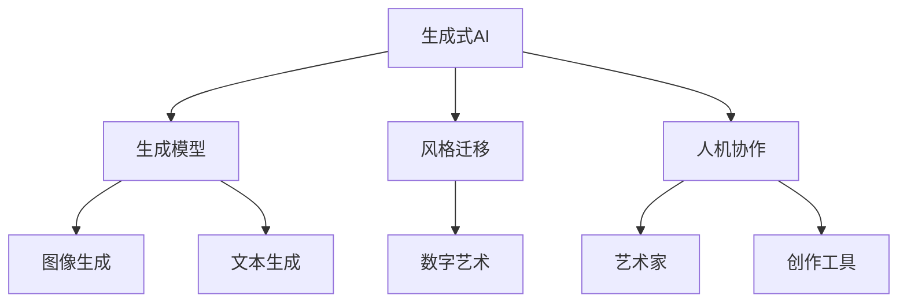
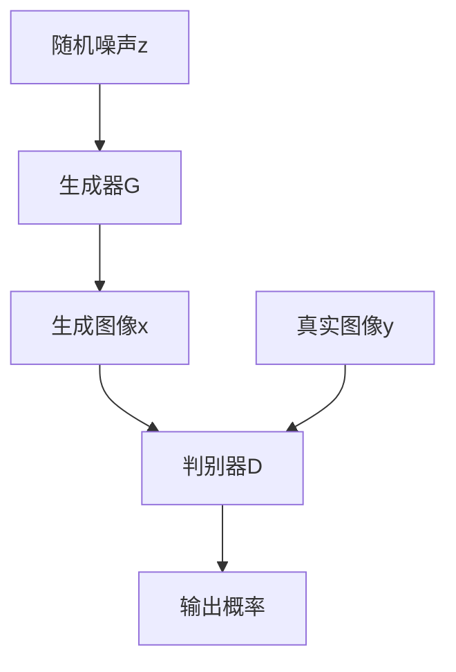
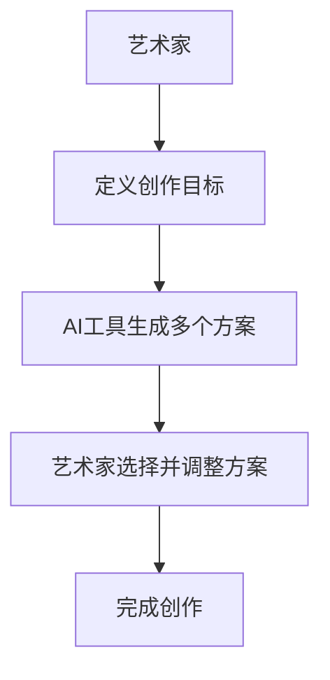

                 

<think>
嗯，用户希望我以《数字时代的艺术创作：AI与人类艺术家的协作》为标题写一篇技术博客文章。首先，我需要分析用户的需求。他是一位资深的IT专家，可能在技术领域有很高的造诣，现在想探讨AI在艺术创作中的应用，特别是人类与AI的协作。

我应该先明确文章的结构。用户已经给出了一个详细的目录，包括背景、AI基础、工具、协作案例、伦理挑战、未来趋势等。这需要我按部就班地展开每个部分，确保内容详尽且逻辑清晰。

接下来，我要考虑每个章节的具体内容。比如，在背景部分，我需要介绍数字艺术的发展和AI的崛起，以及两者如何结合。在AI基础部分，我应该解释机器学习的基本概念，以及它们如何应用在艺术创作中。

用户特别提到要使用技术语言，但又要求易懂。因此，我需要用专业但不晦涩的语言来描述复杂的概念。例如，解释GANs时，可以用一个简单的例子，比如风格迁移，让读者更容易理解。

我还需要确保每个部分都有足够的细节，比如在工具部分，列举具体的工具如DeepArt、Runway ML，并解释它们的工作原理。同时，提供数学公式和算法流程图，以增强技术深度，但要用mermaid和latex来呈现，这样既专业又清晰。

在伦理部分，我需要探讨版权、原创性等问题，这可能涉及到法律和哲学层面，所以要深入分析。未来趋势部分，可以预测生成式AI的发展和AI工具的普及，以及艺术家如何适应这些变化。

最后，我需要总结全文，强调AI与人类协作的重要性，以及这种协作对艺术未来的影响。同时，结尾加上作者信息，符合格式要求。

总的来说，我需要确保文章结构完整，每个部分都有足够的深度和具体例子，同时保持逻辑连贯，让读者能够一步步理解AI在艺术中的作用和协作模式。
</think>

# 数字时代的艺术创作：AI与人类艺术家的协作

---

## 关键词：AI艺术、数字艺术、人机协作、生成式AI、艺术创作工具、创意技术

---

## 摘要

在数字时代，人工智能（AI）技术正在深刻改变艺术创作的方式。从生成式AI到深度学习算法，艺术家们开始与智能系统合作，创造出前所未有的艺术形式。本文将探讨AI在艺术创作中的角色，分析人类与AI协作的可能性与挑战，结合实际案例和技术细节，揭示数字艺术的未来趋势。我们不仅会从技术角度解读AI算法的工作原理，还会从哲学层面思考艺术的本质与人类创造力的独特价值。

---

## 目录

1. [背景与引言](#背景与引言)
2. [AI与艺术创作的核心概念](#AI与艺术创作的核心概念)
3. [AI工具与艺术创作的数学基础](#AI工具与艺术创作的数学基础)
4. [人类与AI的协作模式](#人类与AI的协作模式)
5. [案例研究：AI辅助的艺术项目](#案例研究：AI辅助的艺术项目)
6. [伦理与挑战：AI艺术的边界](#伦理与挑战：AI艺术的边界)
7. [未来趋势与创新](#未来趋势与创新)
8. [总结与展望](#总结与展望)

---

## 1. 背景与引言

在20世纪末，计算机技术的快速发展为艺术创作开辟了新的可能性。数字工具的普及让艺术家能够以全新的方式表达创意，而21世纪初，深度学习算法的突破进一步推动了艺术创作的数字化转型。如今，生成式AI（如GPT、GAN等）正在改变艺术创作的规则，甚至挑战人类对“创造力”的传统理解。

AI与艺术的结合不仅仅是技术的创新，更是人类与机器协作的新范式。艺术家可以利用AI工具扩展创作能力，而AI系统则通过学习人类艺术风格来辅助创作。这种协作模式不仅提高了创作效率，还开拓了新的艺术表现形式。

---

## 2. AI与艺术创作的核心概念

### 2.1 核心概念与术语

| 概念 | 描述 |
|------|------|
| 生成式AI | 通过生成模型（如GAN、Transformers）创造新的内容，包括图像、音乐、文本等。 |
| 深度学习 | 一种机器学习技术，通过多层神经网络模拟数据的高层次特征。 |
| 风格迁移 | 将一种艺术风格（如梵高的画风）应用到其他图像上的技术，常用于数字艺术创作。 |
| 元学习（Meta-Learning） | 一种机器学习方法，允许模型快速适应新任务，而无需大量训练数据。 |

### 2.2 问题背景与描述

艺术创作的核心是人类的情感表达与创意实现。然而，随着AI技术的引入，艺术家面临新的可能性：他们可以利用AI工具生成灵感、辅助设计、甚至创作完整的艺术作品。与此同时，AI的创作是否具有“原创性”也引发了广泛争议。

### 2.3 AI在艺术创作中的边界与外延

AI艺术创作的边界包括技术能力（如生成图像的质量）、法律问题（如版权归属）以及伦理问题（如原创性）。外延则涉及AI辅助设计、数字艺术市场以及跨学科艺术研究。

### 2.4 核心概念的结构与组成

以下是一个简化的概念关系图，展示了AI艺术创作的核心要素：



---

## 3. AI工具与艺术创作的数学基础

### 3.1 核心算法原理

以生成式对抗网络（GANs）为例，其核心思想是通过两个神经网络（生成器和判别器）的对抗训练来生成逼真的图像。数学模型如下：

- **生成器**：通过函数 $G(z)$ 将随机噪声 $z$ 映射到目标数据空间。
- **判别器**：通过函数 $D(x)$ 判断输入 $x$ 是否为真实数据或生成数据。

训练过程通过最小化 $D$ 的错误来优化 $G$，最终达到生成逼真数据的目的。

### 3.2 GANs的数学模型

生成器和判别器的损失函数分别为：

$$
\text{Loss}(D) = -\mathbb{E}[\log(D(x))] - \mathbb{E}[\log(1 - D(G(z)))]
$$

$$
\text{Loss}(G) = -\mathbb{E}[\log(D(G(z)))]
$$

### 3.3 算法流程图

以下是一个简化的GANs训练流程图：



### 3.4 代码实现示例

以下是一个简单的GANs实现示例（使用Python和TensorFlow）：

```python
import tensorflow as tf
from tensorflow.keras import layers

# 定义生成器
def generator():
    model = tf.keras.Sequential([
        layers.Dense(256, activation='relu', input_shape=(100,)),
        layers.Dense(128, activation='relu'),
        layers.Dense(784, activation='sigmoid')
    ])
    return model

# 定义判别器
def discriminator():
    model = tf.keras.Sequential([
        layers.Dense(256, activation='relu', input_shape=(784,)),
        layers.Dense(128, activation='relu'),
        layers.Dense(1, activation='sigmoid')
    ])
    return model

# 初始化模型
g = generator()
d = discriminator()

# 定义损失函数和优化器
cross_entropy = tf.keras.losses.BinaryCrossentropy()
g_optimizer = tf.keras.optimizers.Adam(0.0002)
d_optimizer = tf.keras.optimizers.Adam(0.0002)

# 训练过程
for epoch in range(100):
    for batch in dataset:
        noise = tf.random.normal([batch_size, 100])
        generated_images = g(noise)
        real_labels = tf.ones((batch_size, 1))
        generated_labels = tf.zeros((batch_size, 1))

        # 训练判别器
        with tf.GradientTape() as tape:
            d_loss = cross_entropy(real_labels, d(batch)) + cross_entropy(generated_labels, d(generated_images))
        d_grad = tape.gradient(d_loss, d.trainable_weights)
        d_optimizer.apply_gradients(zip(d_grad, d.trainable_weights))

        # 训练生成器
        with tf.GradientTape() as tape:
            g_loss = cross_entropy(tf.ones_like(generated_labels), d(generated_images))
        g_grad = tape.gradient(g_loss, g.trainable_weights)
        g_optimizer.apply_gradients(zip(g_grad, g.trainable_weights))
```

---

## 4. 人类与AI的协作模式

### 4.1 人机协作的核心要素

1. **艺术家的角色**：艺术家提供创意方向和情感表达，AI提供技术支持。
2. **工具的可用性**：AI工具必须易于使用，同时具备强大的生成能力。
3. **协作过程**：艺术家可以先生成多个AI建议，再从中选择并调整，最终完成创作。

### 4.2 协作流程图

以下是一个简化的协作流程图：



### 4.3 优势与局限

- **优势**：AI可以快速生成大量灵感，帮助艺术家探索更多可能性。
- **局限**：AI无法完全理解人类情感，创作结果可能缺乏深度。

---

## 5. 案例研究：AI辅助的艺术项目

### 5.1 案例1：AI生成的艺术画作

- **项目简介**：使用GANs生成抽象画作，艺术家通过调整生成参数，最终完成一幅具有独特风格的作品。
- **技术细节**：使用DeepArt工具，结合风格迁移算法，生成梵高风格的风景画。

### 5.2 案例2：AI与音乐创作

- **项目简介**：利用生成式AI生成音乐旋律，艺术家通过修改和调整，创作出一首融合人类情感的音乐作品。
- **技术细节**：使用MuseNet模型，生成跨风格的音乐片段。

---

## 6. 伦理与挑战：AI艺术的边界

### 6.1 版权与原创性

- **问题**：AI生成的作品是否属于创作者？谁是“作者”？
- **解决方案**：明确法律框架，规定AI生成内容的版权归属。

### 6.2 艺术的定义

- **问题**：AI是否能够创造“真正的艺术”？
- **观点**：艺术的本质是表达，无论创作者是人类还是AI，只要能够引发情感共鸣，就可以被视为艺术。

---

## 7. 未来趋势与创新

### 7.1 生成式AI的普及

- 预测：生成式AI将变得更加用户友好，艺术家可以更轻松地使用这些工具。
- 技术创新：新的算法（如AI绘画助手）将提供更多个性化选项。

### 7.2 艺术与技术的融合

- 趋势：数字艺术市场将继续增长，AI将成为艺术创作的核心工具之一。

---

## 8. 总结与展望

AI与人类艺术家的协作正在改变艺术创作的方式，但人类的情感与创造力仍然是艺术的核心。未来，艺术家需要学会与AI工具合作，同时保持对艺术本质的深刻理解。AI不仅是工具，更是人类创造力的延伸。

---

## 作者

作者：AI天才研究院/AI Genius Institute & 禅与计算机程序设计艺术 /Zen And The Art of Computer Programming

