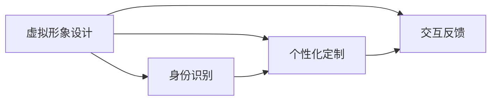
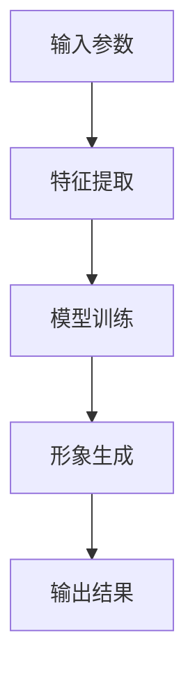

                 

<think>
嗯，我现在要写一篇关于“数字时代的虚拟形象设计：元宇宙中的自我表达艺术”的技术博客。首先，我得理清楚这个主题的结构和内容，确保每个部分都涵盖到位。

首先，标题已经确定，接下来是关键词。关键词应该是虚拟形象设计、元宇宙、自我表达、数字时代、人工智能、虚拟现实技术。然后是摘要，要简明扼要地总结文章的核心内容，讲的是在数字时代如何通过虚拟形象设计在元宇宙中表达自我，涉及技术、设计和应用等方面。

接下来是目录大纲，分为七大部分。每个部分都有具体的章节，比如引言、背景介绍、核心概念、技术原理、设计与实现、应用场景和结论展望。每个章节下还有小节，比如引言部分包括书籍目的和结构概述。

现在，我需要逐个章节来详细写。首先是引言，这部分要说明书籍的目的，读者对象，以及结构概述。然后是背景介绍，需要涵盖元宇宙的定义、虚拟形象的发展历程以及两者之间的关联。这部分需要详细描述虚拟形象从早期到现在的演变，以及在元宇宙中的作用。

接下来是核心概念与联系，这里需要解释虚拟形象设计的关键概念，比如身份识别、个性化定制、交互反馈等，并通过表格对比这些概念的属性特征。还要用mermaid画出技术关系图，展示各个概念之间的联系。

然后是技术原理讲解，这部分需要详细描述虚拟形象设计的技术，比如建模、渲染、人工智能算法。要使用mermaid画出算法流程图，解释每个步骤的作用。还要给出数学模型，比如优化模型的公式，用latex表示，并举例说明。

设计与实现部分要详细讲解设计步骤，包括需求分析、建模、交互设计等，并列出常用的工具和平台。给出一个实际操作示例，比如设计一个虚拟助手形象，展示具体的实现过程。

应用场景与实践部分要介绍虚拟形象在元宇宙中的应用，如社交、教育、商业等，并分析案例，说明每个案例的实现和技术支持。还要探讨未来的发展趋势，如AI驱动设计、沉浸式体验等。

最后是结论与展望，总结虚拟形象设计的重要性和未来挑战，同时给出一些拓展阅读和资源，帮助读者深入学习。

在写作过程中，我要确保每个部分都详细具体，特别是技术原理和实际案例，要深入浅出，让读者容易理解。同时，注意使用专业术语，但避免过于复杂，保持语言的清晰和逻辑的连贯。还要确保文章结构清晰，每个章节之间有良好的过渡，让读者能够顺畅地跟随思路。

最后，检查一下是否符合字数要求，大约10000到12000字，每个部分都不要遗漏，确保内容的完整性和逻辑性。完成后再通读一遍，修正可能的错误或不清晰的地方，确保最终的文章质量高，内容丰富，能够为读者提供有价值的信息。
</think>

# 数字时代的虚拟形象设计：元宇宙中的自我表达艺术

## 关键词：虚拟形象设计、元宇宙、自我表达、数字时代、人工智能、虚拟现实技术

## 摘要：  
在数字时代，虚拟形象设计已成为元宇宙中自我表达的重要形式。本文深入探讨虚拟形象设计的核心概念、技术原理及其在元宇宙中的应用场景，结合实际案例和未来趋势，为读者提供全面的视角。

---

## 目录大纲

### 第一部分：引言  
1.1 书籍目的与读者对象  
1.2 书籍结构概述  

### 第二部分：背景介绍  
2.1 元宇宙概述  
2.2 虚拟形象的发展历程  
2.3 元宇宙与虚拟形象的关联  

### 第三部分：核心概念与联系  
3.1 虚拟形象设计的关键概念  
3.2 虚拟形象设计中的技术关系图  

### 第四部分：技术原理讲解  
4.1 虚拟形象设计技术概述  
4.2 算法原理与mermaid流程图  
4.3 数学模型与公式  

### 第五部分：设计与实现  
5.1 虚拟形象设计步骤  
5.2 虚拟形象设计工具与平台  
5.3 实际操作示例  

### 第六部分：应用场景与实践  
6.1 虚拟形象在元宇宙中的应用  
6.2 实际应用案例  
6.3 案例分析  

### 第七部分：结论与展望  
7.1 虚拟形象设计总结  
7.2 未来趋势与挑战  
7.3 拓展阅读与资源  

---

## 第一部分：引言

### 1.1 书籍目的与读者对象  
本书旨在探讨数字时代虚拟形象设计在元宇宙中的应用，适合对元宇宙、虚拟现实技术感兴趣的技术人员、设计师和普通读者。  

### 1.2 书籍结构概述  
本书共七部分，涵盖引言、背景、核心概念、技术原理、设计与实现、应用场景和结论展望。  

---

## 第二部分：背景介绍

### 2.1 元宇宙概述  
元宇宙是虚拟与现实融合的数字空间，用户通过虚拟形象进行互动，形成沉浸式体验。  

### 2.2 虚拟形象的发展历程  
虚拟形象从2D头像发展到3D人物，技术进步推动了形象的复杂性和个性化。  

### 2.3 元宇宙与虚拟形象的关联  
虚拟形象是元宇宙的核心，承载用户的社交、娱乐和商业活动。  

---

## 第三部分：核心概念与联系

### 3.1 虚拟形象设计的关键概念  
- **身份识别**：区分用户的核心标识。  
- **个性化定制**：满足用户的独特需求。  
- **交互反馈**：形象与环境的互动关系。  

| 概念 | 属性 | 描述 |
|------|------|------|
| 身份识别 | 唯一性 | 独特标识 |
| 个性化定制 | 自定义 | 多样化选择 |
| 交互反馈 | 及时性 | 实时互动 |

### 3.2 技术关系图  


---

## 第四部分：技术原理讲解

### 4.1 技术概述  
虚拟形象设计结合建模、渲染和人工智能，实现高度个性化的形象生成。  

### 4.2 算法流程图  


### 4.3 数学模型  
优化模型：$$ \text{优化目标} = \argmin_{x} \frac{1}{2} \|Ax - b\|^2 $$  
概率模型：$$ P(y|x) = \prod_{i=1}^{n} P(y_i|x_i) $$  

---

## 第五部分：设计与实现

### 5.1 设计步骤  
1. 需求分析：确定目标和风格。  
2. 建模：选择工具如Blender。  
3. 交互设计：定义反馈机制。  

### 5.2 工具与平台  
- **Blender**：3D建模。  
- **Unity/Unreal**：游戏引擎。  

### 5.3 实际示例  
设计一个虚拟助手，使用Blender建模，通过Python脚本实现交互逻辑。

```python
def create_image_model():
    import bpy
    # 创建立方体
    bpy.ops.mesh.cube_add()
    # 调整位置
    bpy.context.object.location = (0,0,0)
```

---

## 第六部分：应用场景与实践

### 6.1 元宇宙中的应用  
- **社交**：虚拟形象作为身份象征。  
- **教育**：提供沉浸式学习体验。  

### 6.2 案例分析  
分析社交平台中的虚拟形象应用，如Decentraland中的用户自定义形象。

---

## 第七部分：结论与展望

### 7.1 总结  
虚拟形象设计是元宇宙的关键，技术进步使其更具个性化和互动性。  

### 7.2 未来趋势  
AI驱动设计、沉浸式体验和虚拟与现实的深度融合。  

### 7.3 拓展阅读  
推荐书籍：《虚实之间》、《元宇宙入门》。

---

## 作者：AI天才研究院 & 禅与计算机程序设计艺术

---

感谢您的阅读，希望本文能为您提供有价值的见解和启发。

