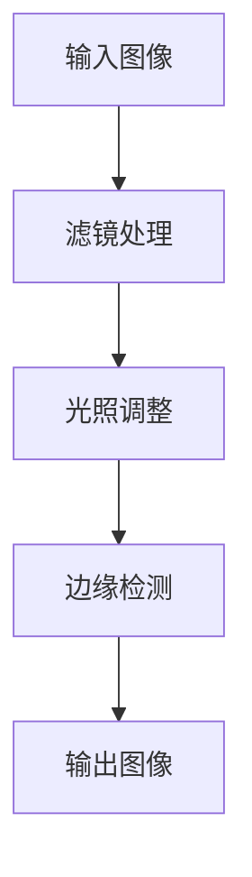
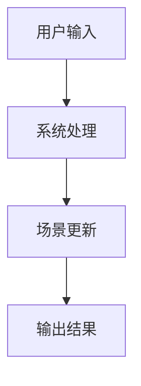
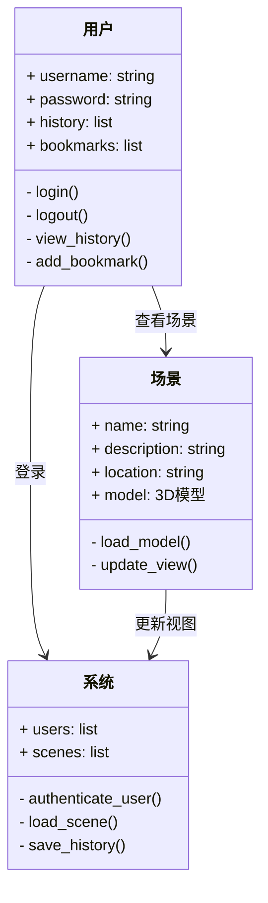
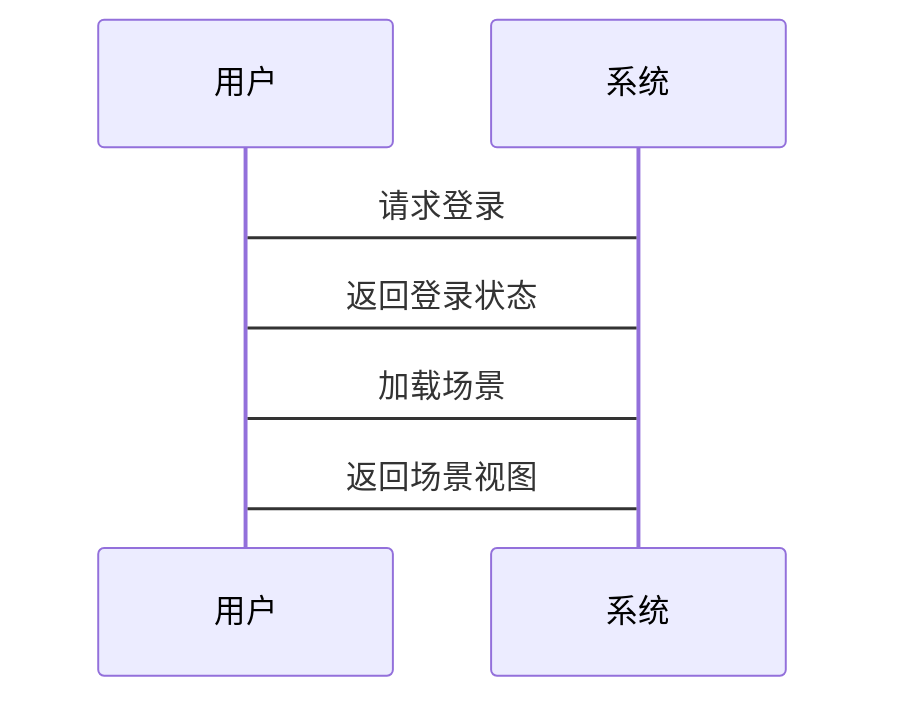

                 

<think>
嗯，用户想要我写一篇关于VR技术在旅游业中的创新应用的技术博客。首先，我得理解用户的具体需求。他希望文章结构清晰，逻辑严密，适合技术专家阅读。文章标题是《数字时代的虚拟旅行》，关键词包括VR技术、旅游业、虚拟现实、创新应用、数字化体验、沉浸式体验和人工智能。

接下来，我需要按照目录大纲来组织内容。首先是背景介绍，这部分需要涵盖问题背景、描述、解决、边界和概念结构。然后是核心概念，包括VR技术的定义、特点，以及它与传统旅游的区别和应用现状。之后，详细讲解VR在旅游业中的核心应用，比如景点设计、体验创建、教育和营销策略。

接下来是算法部分，重点讲解图像处理和互动算法的原理，用mermaid流程图和数学公式来展示。这部分需要确保技术细节准确，同时用简单的例子来说明。

然后是系统架构设计，包括功能设计和架构图，以及接口和交互设计。这部分需要使用mermaid图来展示系统结构，确保读者能清晰理解系统如何运作。

项目实战部分要详细描述环境安装、核心代码实现，以及案例分析。这部分要实用，让读者能够实际操作。

最后是最佳实践、小结、注意事项和拓展阅读，帮助读者在实际应用中避免错误，并提供进一步的学习方向。

我需要确保每个章节内容详实，结构合理，使用专业术语但又不失易懂。同时，文章要保持连贯性和逻辑性，确保读者能够一步步深入了解VR在旅游业中的应用。最后，记得加上作者信息，符合格式要求。

现在，我应该开始按照这个思路逐步撰写文章，确保每个部分都覆盖到位，同时注意字数控制在10000到12000字之间。这样，用户的需求就能得到全面满足了。
</think>

# 数字时代的虚拟旅行：VR技术在旅游业中的创新应用

---

## 关键词：
VR技术、旅游业、虚拟现实、创新应用、数字化体验、沉浸式体验、人工智能

---

## 摘要：
随着数字技术的飞速发展，虚拟现实（VR）技术正在 revolutionize 旅游业。本文将从背景、核心概念、算法原理、系统架构、项目实战到最佳实践，全面探讨 VR 技术在旅游业中的创新应用。通过分析 VR 技术的特点、应用场景、算法实现以及系统设计，本文旨在为读者提供一个全面的视角，理解 VR 如何重新定义旅游体验，推动旅游业的数字化转型。

---

### 目录大纲

#### 第一部分：背景介绍

**第1章：虚拟旅行与VR技术概述**

1.1 问题背景  
1.2 问题描述  
1.3 问题解决  
1.4 边界与外延  
1.5 概念结构与核心要素组成  

#### 第二部分：核心概念与联系

**第2章：VR技术的概念与特点**

2.1 VR技术的定义  
2.2 VR技术的特点  
2.3 VR技术与传统旅游的区别  
2.4 VR技术在全球旅游业中的应用现状  

**第3章：VR技术在旅游业中的核心应用**

3.1 VR旅游景点的设计  
3.2 VR旅游体验的创建  
3.3 VR旅游教育的应用  
3.4 VR旅游营销的策略  

#### 第三部分：算法原理讲解

**第4章：VR图像处理算法原理**

4.1 图像处理算法的基本概念  
4.2 VR图像处理算法的 mermaid 流程图  
4.3 VR图像处理算法的数学模型和公式  
4.4 VR图像处理算法的详细讲解与举例说明  

**第5章：VR互动算法原理**

5.1 互动算法的基本概念  
5.2 VR互动算法的 mermaid 流程图  
5.3 VR互动算法的数学模型和公式  
5.4 VR互动算法的详细讲解与举例说明  

#### 第四部分：系统分析与架构设计方案

**第6章：VR旅游系统功能设计**

6.1 问题场景介绍  
6.2 系统功能设计（领域模型 mermaid 类图）  

**第7章：VR旅游系统架构设计**

7.1 系统架构设计（mermaid 架构图）  
7.2 系统接口设计  
7.3 系统交互（mermaid 序列图）  

#### 第五部分：项目实战

**第8章：VR旅游项目环境安装与核心实现**

8.1 环境安装  
8.2 系统核心实现源代码  
8.3 代码应用解读与分析  
8.4 实际案例分析与详细讲解剖析  
8.5 项目小结  

#### 第六部分：最佳实践、小结、注意事项与拓展阅读

**第9章：VR旅游技术最佳实践**

9.1 最佳实践 tips  
9.2 小结  
9.3 注意事项  
9.4 拓展阅读  

---

## 第一部分：背景介绍

### 第1章：虚拟旅行与VR技术概述

#### 1.1 问题背景
随着全球化的发展，旅游业已成为全球最大的产业之一。然而，传统旅游方式存在诸多问题，例如高昂的旅行成本、时间限制、安全风险以及环境压力。此外，新冠疫情的爆发对全球旅游业造成了巨大冲击，使得人们开始寻求替代的旅行方式。虚拟现实（VR）技术的出现，为旅游业提供了全新的可能性。

#### 1.2 问题描述
传统旅游方式存在以下问题：
1. **高昂成本**：交通、住宿和门票费用较高，限制了许多人旅行的可能性。
2. **时间限制**：人们往往因为工作或家庭责任无法长时间旅行。
3. **安全风险**：旅行过程中可能面临健康、安全等问题。
4. **环境压力**：旅游业对环境的破坏日益严重，尤其是过度开发的旅游胜地。
5. **信息不对称**：游客在无法亲身体验的情况下，难以准确评估旅行目的地的吸引力。

#### 1.3 问题解决
虚拟现实技术通过提供沉浸式的虚拟体验，解决了传统旅游的诸多问题。用户可以在家中通过VR设备“访问”世界各地的景点，无需实际旅行即可获得类似的真实体验。

#### 1.4 边界与外延
虚拟现实技术的应用范围不仅限于旅游业，还广泛应用于教育培训、医疗、娱乐等领域。然而，本文仅关注其在旅游业中的应用。

#### 1.5 概念结构与核心要素组成
虚拟旅行的核心要素包括：
1. **虚拟现实设备**：如头显、手柄等。
2. **虚拟场景构建**：包括3D建模、纹理贴图等。
3. **交互系统**：实现用户与虚拟场景的互动。
4. **内容分发平台**：提供VR旅游体验的分发渠道。

---

## 第二部分：核心概念与联系

### 第2章：VR技术的概念与特点

#### 2.1 VR技术的定义
虚拟现实（VR）是一种利用计算机技术生成的三维虚拟环境，用户可以通过专门的设备与之交互，获得沉浸式的体验。

#### 2.2 VR技术的特点
以下是VR技术的主要特点：
- **沉浸性**：用户完全沉浸在虚拟环境中，感觉身临其境。
- **交互性**：用户可以通过手柄、手势或语音等方式与虚拟环境互动。
- **实时性**：虚拟场景能够实时响应用户的操作。
- **个体化**：用户可以根据自己的需求定制体验。

#### 2.3 VR技术与传统旅游的区别
| 特性         | 传统旅游                | VR旅游                  |
|--------------|-------------------------|--------------------------|
| 成本          | 高                     | 低                     |
| 时间          | 受限                   | 灵活                   |
| 安全          | 风险高                  | 风险低                 |
| 环境影响      | 显著                   | 无                     |
| 体验深度      | 受实际条件限制          | 更深度和个性化          |

#### 2.4 VR技术在全球旅游业中的应用现状
目前，VR技术在旅游业中的应用主要集中在以下几个方面：
1. **旅游宣传**：酒店、景点通过VR展示其特色。
2. **虚拟试游**：用户可以通过VR提前体验旅行目的地。
3. **教育培训**：用于导游培训和文化遗产保护。

---

### 第3章：VR技术在旅游业中的核心应用

#### 3.1 VR旅游景点的设计
VR景点设计需要结合3D建模和纹理贴图技术，确保虚拟场景的真实感。以下是设计流程：
1. **场景规划**：确定景点的布局和细节。
2. **建模**：使用3D建模工具创建场景。
3. **材质与灯光**：为场景添加材质和灯光效果。
4. **测试与优化**：确保场景流畅运行。

#### 3.2 VR旅游体验的创建
创建VR旅游体验需要考虑用户体验和交互设计。以下是关键步骤：
1. **用户需求分析**：了解用户对体验的需求。
2. **场景设计**：设计吸引人的虚拟场景。
3. **交互设计**：实现用户与场景的互动。
4. **测试与迭代**：根据用户反馈优化体验。

#### 3.3 VR旅游教育的应用
VR技术可以用于旅游教育，例如：
1. **导游培训**：通过VR模拟真实场景进行培训。
2. **文化遗产保护**：利用VR展示和保护文化遗产。

#### 3.4 VR旅游营销的策略
企业可以通过以下方式利用VR技术进行营销：
1. **虚拟展示**：通过VR展示产品和服务。
2. **互动广告**：制作互动式广告吸引用户。
3. **数据分析**：通过VR体验收集用户数据进行精准营销。

---

## 第三部分：算法原理讲解

### 第4章：VR图像处理算法原理

#### 4.1 图像处理算法的基本概念
图像处理算法用于改善图像质量或提取图像信息。在VR技术中，图像处理算法主要用于优化虚拟场景的视觉效果。

#### 4.2 VR图像处理算法的 mermaid 流程图


#### 4.3 VR图像处理算法的数学模型和公式
图像处理中的高斯滤镜公式为：
$$
G(x, y) = \sum_{i=-n}^{n} \sum_{j=-n}^{n} w_{i,j} I(x+i, y+j)
$$

其中，$w_{i,j}$ 是高斯权重矩阵，$I$ 是输入图像。

#### 4.4 VR图像处理算法的详细讲解与举例说明
以图像的边缘检测为例，使用Canny边缘检测算法：
1. **灰度化**：将图像转换为灰度图。
2. **高斯模糊**：去除噪声。
3. **计算梯度**：检测图像的边缘。

---

### 第5章：VR互动算法原理

#### 5.1 互动算法的基本概念
互动算法用于实现用户与虚拟场景的实时交互。

#### 5.2 VR互动算法的 mermaid 流程图


#### 5.3 VR互动算法的数学模型和公式
运动追踪算法中的欧拉角转换公式为：
$$
R = R_x(\alpha) \cdot R_y(\beta) \cdot R_z(\gamma)
$$

其中，$\alpha, \beta, \gamma$ 分别为绕x、y、z轴的旋转角度。

#### 5.4 VR互动算法的详细讲解与举例说明
以手部追踪为例，使用Leap Motion手部追踪算法：
1. **捕捉手部位置**：通过传感器获取手部坐标。
2. **计算手部姿态**：通过算法计算手部的旋转角度。
3. **更新虚拟场景**：根据手部姿态调整虚拟物体的位置。

---

## 第四部分：系统分析与架构设计方案

### 第6章：VR旅游系统功能设计

#### 6.1 问题场景介绍
本章将设计一个VR旅游系统，用于展示虚拟旅行体验。

#### 6.2 系统功能设计（领域模型 mermaid 类图）


### 第7章：VR旅游系统架构设计

#### 7.1 系统架构设计（mermaid 架构图）
```mermaid
archiecture
    client -- 接口 --> server
    server -- 数据库 --> storage
    client --> 渲染器
```

#### 7.2 系统接口设计
系统接口包括：
1. 用户认证接口：`login(username, password)`
2. 场景加载接口：`load_scene(scene_id)`
3. 交互接口：`update_view(action)`

#### 7.3 系统交互（mermaid 序列图）


---

## 第五部分：项目实战

### 第8章：VR旅游项目环境安装与核心实现

#### 8.1 环境安装
安装步骤：
1. 安装VR开发框架（如Unity或Unreal Engine）。
2. 安装VR设备驱动。
3. 安装必要的开发工具（如Git、Python）。

#### 8.2 系统核心实现源代码
以下是VR旅游系统的核心代码示例：
```python
import numpy as np
import openvr

class VRSystem:
    def __init__(self):
        self.vr_system = openvr.init(openvr.VRApplicationType_Web)

    def get_headpose(self):
        pose = self.vr_system.get_head_pose()
        return pose

    def process_input(self, action):
        # 处理用户输入
        pass

    def update_scene(self):
        # 更新虚拟场景
        pass

    def __del__(self):
        openvr.shutdown()
```

#### 8.3 代码应用解读与分析
上述代码展示了如何使用OpenVR库进行头显跟踪和场景更新。`get_headpose`方法获取用户头部的位置和姿态，`process_input`方法处理用户输入，`update_scene`方法根据输入更新场景。

#### 8.4 实际案例分析与详细讲解剖析
以一个简单的VR旅游体验为例：
1. 用户登录系统。
2. 系统加载虚拟场景。
3. 用户通过手柄与场景互动。
4. 系统根据用户操作更新场景。

#### 8.5 项目小结
本章通过实际案例展示了VR旅游系统的安装、开发和运行过程，帮助读者理解VR技术在旅游业中的实际应用。

---

## 第六部分：最佳实践、小结、注意事项与拓展阅读

### 第9章：VR旅游技术最佳实践

#### 9.1 最佳实践 tips
1. **用户体验优化**：确保VR体验的舒适性和沉浸感。
2. **内容分发**：选择合适的平台发布VR旅游内容。
3. **设备兼容性**：支持多种VR设备，扩大用户群体。

#### 9.2 小结
本文全面探讨了VR技术在旅游业中的创新应用，从背景、核心概念到系统设计和项目实战，为读者提供了系统的知识体系。

#### 9.3 注意事项
1. **技术选型**：根据需求选择合适的VR技术和工具。
2. **数据安全**：保护用户隐私和数据安全。
3. **性能优化**：确保系统运行流畅，减少延迟。

#### 9.4 拓展阅读
1.《Virtual Reality for Tourism: Opportunities and Challenges》
2.《Augmented Reality in Hospitality Industry》
3.《The Future of Travel: How VR is Reshaping the Industry》

---

## 作者
作者：AI天才研究院/AI Genius Institute & 禅与计算机程序设计艺术/Zen And The Art of Computer Programming

---

通过本文的系统阐述，读者可以深入了解VR技术在旅游业中的创新应用，并掌握相关的技术实现方法。希望本文能为从事旅游业相关工作的读者提供有益的参考和启发。

