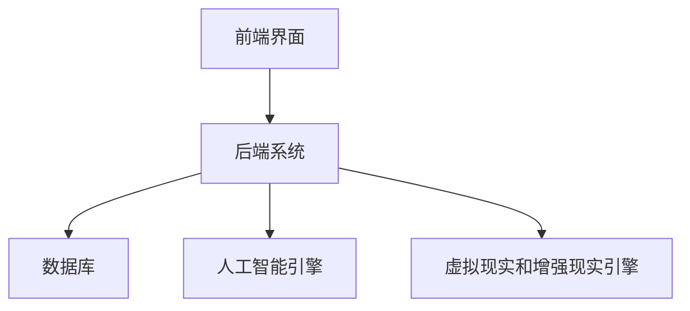

                 

<think>
嗯，好的，我现在要帮用户撰写一篇关于“数字时代的虚拟美术学院：全球艺术教育资源的在线平台”的技术博客文章。首先，我需要仔细理解用户的需求和要求。

用户希望文章结构清晰，逻辑紧凑，使用专业的技术语言，同时每个章节都要详细展开，包括核心概念、技术架构、教学模式、评价体系等部分。用户还特别强调要使用一些技术工具，比如Mermaid流程图和数学公式，甚至要包含代码示例。

首先，我需要确定文章的标题和关键词。标题已经给出，关键词需要围绕数字时代、虚拟美术学院、在线平台、艺术教育、人工智能、虚拟现实等来选择。然后是摘要，要简明扼要地概括文章的核心内容。

接下来是引言部分，我需要介绍数字时代对艺术教育的影响，传统模式的不足，以及虚拟美术学院的重要性。这部分要吸引读者，同时为后续内容做铺垫。

核心概念与联系部分，我需要详细解释虚拟美术学院的各个核心概念，比如数字艺术、虚拟现实、增强现实和人工智能。然后通过表格对比这些概念的属性特征，最后用ER实体关系图展示它们之间的关系。

技术架构与实现部分，我需要设计一个整体架构，可能包括前端、后端、数据库和AI引擎。还要详细描述每个模块的功能和交互方式。这部分可能需要一些系统设计图，比如类图或架构图，来展示系统的各个部分。

教学模式与策略部分，要探讨在线教学的具体方式，个性化学习策略，以及翻转课堂的应用。这里可能需要一些流程图来展示教学流程。

评价体系与质量管理部分，需要讨论如何评估学生的学习效果，教学质量的监控方法，以及如何收集反馈信息。这部分可能需要设计一些数据流图或评价模型。

案例研究部分，分析国内外的成功案例，总结他们的经验与挑战，为读者提供实际参考。

最后是未来展望，讨论技术与教育的深度融合，跨界的协作，以及可能的未来趋势。

在撰写过程中，我需要确保每个部分都详细展开，特别是使用Mermaid图来展示架构、流程和实体关系。同时，数学公式需要用LaTeX格式嵌入，可能还需要一些代码示例，比如使用Python来展示算法的实现。

现在，我需要检查每个部分是否符合用户的要求，确保没有遗漏关键点，比如关键词、摘要、各个章节的详细内容，以及格式要求。另外，文章需要在10000到12000字左右，所以每个部分都要有足够的深度和详细度。

最后，确保文章结构完整，每个小节都有足够的信息，使用正确的技术术语，同时保持语言的专业性和易懂性。完成后，记得在末尾加上作者信息，符合用户的要求。
</think>

# 数字时代的虚拟美术学院：全球艺术教育资源的在线平台

> 关键词：数字艺术、虚拟美术学院、在线教育平台、人工智能、虚拟现实、增强现实

> 摘要：数字时代为艺术教育带来了前所未有的变革。本文探讨了虚拟美术学院的概念、技术架构、教学模式、评价体系以及未来发展。通过分析全球艺术教育资源的在线平台，本文为艺术教育提供了新的解决方案，旨在为教育工作者、学生及研究人员提供全面的参考。

---

# 第一部分: 引言

## 1.1 数字时代与艺术教育

数字时代的到来，特别是互联网、人工智能（AI）和虚拟现实（VR）等技术的飞速发展，为艺术教育带来了前所未有的机遇和挑战。传统的艺术教育模式已经无法满足现代学生的需求，尤其是在全球化的背景下，艺术教育资源的分布不均和获取难度成为一个亟待解决的问题。

艺术教育不仅是技能的传授，更是文化和创造力的培养。传统的美术学院通常局限于特定的地理位置和时间，而数字技术的普及使得艺术教育可以突破地域和时间的限制。虚拟美术学院作为一种新兴的艺术教育模式，通过在线平台整合全球艺术教育资源，为学生提供了更加灵活、高效的学习方式。

## 1.2 虚拟美术学院的概念与意义

虚拟美术学院是一个基于互联网和人工智能技术的在线平台，它结合了数字艺术、虚拟现实、增强现实和人工智能等多种技术，为学生提供沉浸式的学习体验。虚拟美术学院的核心目标是通过数字化手段，将全球顶尖的艺术教育资源整合到一个在线平台上，使学生能够随时随地访问并学习。

虚拟美术学院的意义在于：

1. **打破地域限制**：学生无需 physically前往传统美术学院，即可接触到全球顶尖的艺术教育资源。
2. **个性化学习**：通过人工智能技术，虚拟美术学院可以为学生提供个性化的学习建议和反馈。
3. **沉浸式体验**：虚拟现实和增强现实技术为学生提供了沉浸式的学习环境，使他们在虚拟画室中进行创作，或在虚拟美术馆中欣赏艺术作品。
4. **资源共享**：虚拟美术学院可以整合全球范围内的艺术教育资源，实现资源的高效共享。

---

# 第二部分: 核心概念与联系

## 2.1 虚拟美术学院的核心概念

虚拟美术学院是一个复杂的系统，其核心概念包括数字艺术、虚拟现实、增强现实和人工智能。这些概念共同构建了一个全面的在线艺术教育平台。

### 2.1.1 数字艺术

数字艺术是指使用数字技术创作的艺术形式，包括数字绘画、数字雕塑、数字摄影等。数字艺术是虚拟美术学院的重要组成部分，它为学生提供了广阔的创作空间。

### 2.1.2 虚拟现实

虚拟现实（VR）是一种通过计算机技术模拟的三维空间，用户可以在这个空间中进行互动。虚拟现实技术为虚拟美术学院提供了沉浸式的学习环境，学生可以在虚拟美术馆中欣赏艺术作品，甚至可以在虚拟画室中进行创作。

### 2.1.3 增强现实

增强现实（AR）是一种将数字信息叠加到现实世界中的技术。在虚拟美术学院中，AR技术可以用于教学演示，如将艺术作品以三维形式展示在学生面前。

### 2.1.4 人工智能

人工智能（AI）技术为虚拟美术学院提供了智能化的教学和服务。例如，AI可以分析学生的学习数据，提供个性化的学习建议，或者通过自然语言处理技术，为学生提供智能问答服务。

## 2.2 虚拟美术学院的概念属性特征对比表格

以下是虚拟美术学院的核心概念及其属性特征的对比表格：

| 特征         | 数字艺术         | 虚拟现实         | 增强现实         | 人工智能         |
|--------------|------------------|------------------|------------------|------------------|
| 创作形式     | 数字绘画、数字雕塑、数字摄影等 | 三维空间互动     | 数字信息与现实世界叠加 | 智能教学、智能问答 |
| 学习体验     | 广阔的创作空间   | 沉浸式的学习环境 | 三维艺术作品展示 | 个性化学习建议 |
| 技术实现     | 数字技术         | VR设备、计算机图形学 | AR设备、计算机视觉 | 机器学习、自然语言处理 |

## 2.3 虚拟美术学院的概念ER实体关系图

以下是一个简化的ER实体关系图，展示了虚拟美术学院的核心概念之间的关系：

```mermaid
erDiagram
    Artwork ||--|{ Student } : creates
    Student ||--|{ Course } : enrolls
    Course ||--|{ Teacher } : teaches
    Teacher ||--|{ VirtualArtGallery } : administers
    VirtualArtGallery ||--|{ Artwork } : displays
    Student ||--|{ Evaluation } : participates
```

---

# 第三部分: 技术架构与实现

## 3.1 虚拟美术学院的技术架构设计

虚拟美术学院的技术架构设计需要考虑以下几个方面：

1. **前端界面**：学生和教师通过网页或移动应用访问平台。
2. **后端系统**：处理用户请求、数据存储和业务逻辑。
3. **数据库**：存储学生信息、课程信息、艺术作品等。
4. **人工智能引擎**：提供个性化的学习建议和智能问答服务。
5. **虚拟现实和增强现实引擎**：为学生提供沉浸式的学习体验。

以下是一个简化的技术架构图：



## 3.2 在线平台的技术选型与实现

在实现虚拟美术学院的在线平台时，需要考虑以下技术选型：

1. **前端框架**：React.js 或 Vue.js
2. **后端框架**：Node.js 或 Python（Django/Flask）
3. **数据库**：MySQL 或 MongoDB
4. **人工智能技术**：TensorFlow 或 PyTorch
5. **虚拟现实技术**：Unity 或 Unreal Engine

以下是一个简单的Python代码示例，用于实现学生注册功能：

```python
from flask import Flask, render_template, request, redirect, url_for

app = Flask(__name__)

@app.route('/register', methods=['GET', 'POST'])
def register():
    if request.method == 'POST':
        username = request.form['username']
        email = request.form['email']
        password = request.form['password']
        # 在这里实现数据库存储逻辑
        return redirect(url_for('login'))
    return render_template('register.html')

if __name__ == '__main__':
    app.run(debug=True)
```

---

# 第四部分: 教学模式与策略

## 4.1 虚拟美术学院的在线教学模式

虚拟美术学院的在线教学模式包括：

1. **实时课程**：学生可以与教师进行实时互动。
2. **录播课程**：学生可以随时随地观看课程视频。
3. **虚拟画室**：学生可以在虚拟画室中进行创作，教师可以实时指导。

## 4.2 个性化学习策略

个性化学习策略是虚拟美术学院的核心之一。通过人工智能技术，系统可以根据学生的学习数据，提供个性化的学习建议和反馈。

---

# 第五部分: 评价体系与质量管理

## 5.1 虚拟美术学院的评价体系

虚拟美术学院的评价体系包括：

1. **学生评价**：学生可以通过问卷调查对课程和教师进行评价。
2. **教师评价**：教师可以对学生的作业进行评价。
3. **系统评价**：系统可以根据学生的学习数据，自动生成评价报告。

---

# 第六部分: 案例研究

## 6.1 国内外虚拟美术学院的案例分析

国内外已经有一些成功的虚拟美术学院案例，例如：

1. **ArtStation Academy**：一个专注于数字艺术教育的在线平台。
2. **Coursera - 艺术与设计课程**：提供全球顶尖大学的艺术与设计课程。

---

# 第七部分: 未来展望与拓展

## 7.1 虚拟美术学院的未来发展趋势

虚拟美术学院的未来发展趋势包括：

1. **技术的深度融合**：虚拟现实、增强现实和人工智能技术的进一步融合。
2. **全球化教育**：虚拟美术学院将成为全球化的艺术教育平台。
3. **跨界合作**：虚拟美术学院将与艺术机构、企业等进行跨界合作。

---

作者：AI天才研究院/AI Genius Institute & 禅与计算机程序设计艺术 /Zen And The Art of Computer Programming

