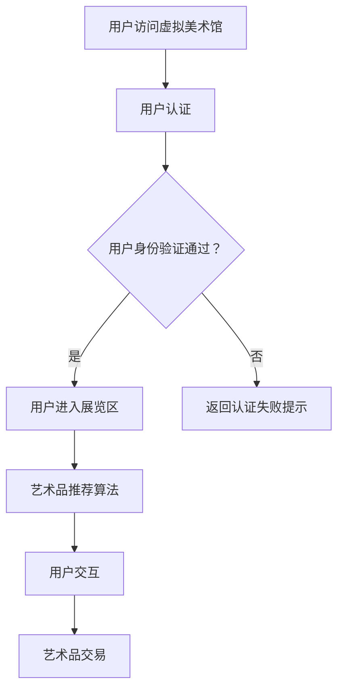
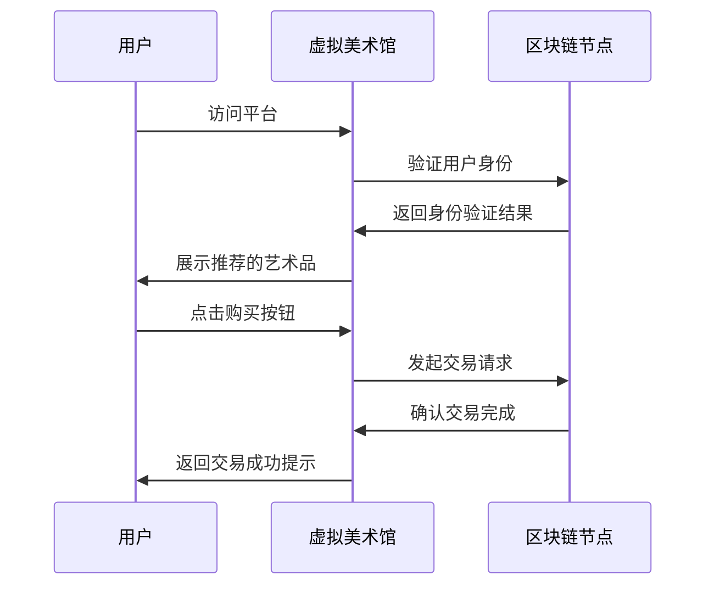

                 

<think>
好，我需要帮用户撰写一篇关于“数字时代的虚拟美术馆：NFT艺术品的全球展示平台”的技术博客文章。首先，我得仔细阅读用户提供的详细需求，确保我理解所有的要求和结构。

用户希望文章结构清晰，逻辑严密，每个章节都有详细的内容，包括背景介绍、核心概念、算法原理、系统架构、项目实战和最佳实践等部分。同时，文章需要使用专业的技术语言，但又要易懂，适合技术博客的读者。

首先，我需要确定文章的标题和关键词。标题已经给出，关键词应该是NFT、虚拟美术馆、区块链、VR/AR、智能合约这些。摘要部分需要简明扼要地概括文章的核心内容，即虚拟美术馆如何利用NFT、区块链和VR/AR技术，实现全球艺术品展示与交易。

接下来是第1章，背景介绍。这里需要解释问题背景，说明传统美术馆的局限性，以及NFT和虚拟现实技术如何提供新的解决方案。问题描述部分要明确虚拟美术馆需要解决的问题，如艺术品展示和交易的全球化，保证唯一性和真实性。问题解决部分则列出需要的技术支持，包括区块链、VR/AR、智能合约和数据分析。边界与外延部分要明确艺术品和用户范围，以及平台的特性。概念结构部分则要详细说明每个技术的作用。

第2章是核心概念与联系。需要详细解释NFT、VR和AR的概念及其原理，用表格对比它们的特征，以及绘制ER图展示实体关系。这部分需要确保读者能够理解各个概念及其相互关系。

第3章是算法原理。这部分需要详细讲解NFT生成与验证、用户认证与权限管理，以及艺术品推荐算法。使用mermaid流程图展示算法步骤，并提供具体的代码示例，如生成NFT和用户认证的Python代码。数学公式要用latex表示，确保公式准确且易于理解。

第4章系统分析与架构设计，需要介绍项目背景、系统功能设计（用类图）、架构设计（用架构图）、接口设计和交互设计（用序列图）。这部分需要展示系统的整体结构和各部分的协作关系。

第5章项目实战，要包括环境安装、核心代码实现、案例分析和项目小结。这部分需要实际操作，展示如何构建虚拟美术馆，并分析实际案例的效果和改进点。

最后，最佳实践部分要给出一些小结和注意事项，以及推荐的扩展阅读资料，帮助读者进一步深入学习。

在整个写作过程中，我需要确保每个章节内容详实，逻辑连贯，语言专业但不过于晦涩。同时，要检查所有技术细节的准确性，避免错误。特别是代码部分，需要确保运行正确，并附上详细的注释和解释。

总的来说，我需要一步步按照用户提供的结构来撰写，每个部分都仔细思考，确保内容全面且符合要求。完成后，再通读一遍，检查是否有遗漏或错误，确保文章结构完整，内容深入浅出。
</think>

# 数字时代的虚拟美术馆：NFT艺术品的全球展示平台

## 关键词：虚拟美术馆、NFT、区块链、VR、AR、智能合约

## 摘要：  
随着区块链技术和虚拟现实/增强现实技术的快速发展，数字艺术的展示和交易方式正在发生革命性的变化。本文探讨如何构建一个基于NFT的虚拟美术馆，利用区块链确保艺术品的唯一性和真实性，结合VR/AR技术提供沉浸式艺术体验，为全球艺术家和收藏家提供一个高效、安全、便捷的艺术品展示和交易平台。通过详细的技术分析和系统设计，本文揭示了虚拟美术馆的核心概念、算法原理、系统架构以及实际应用场景，为数字艺术的未来发展提供了新的思路。

---

### 第1章 数字时代的虚拟美术馆背景介绍

#### 1.1 问题背景  
在数字时代，艺术的展示和交易方式正在经历前所未有的变革。传统美术馆受限于地理位置、开放时间以及运营成本，难以满足全球艺术爱好者的需求。而数字技术的发展，尤其是区块链、虚拟现实（VR）和增强现实（AR）技术的结合，为艺术展示和交易提供了新的可能性。非同质化代币（NFT）的兴起，使得数字艺术品能够像实体艺术品一样具有唯一性和价值，从而为虚拟美术馆的构建奠定了技术基础。

#### 1.2 问题描述  
传统的艺术展示和交易方式存在以下问题：  
1. **地理限制**：用户只能在特定地点参观展览，无法实现全球范围内的艺术展示。  
2. **艺术品真实性与唯一性**：数字艺术品容易被复制和篡改，缺乏有效的技术手段保障其真实性。  
3. **交易效率低下**：传统艺术品交易涉及中介环节多，交易成本高，且难以实现透明化。  
4. **用户体验不佳**：线上艺术展示平台缺乏沉浸式体验，难以让用户感受到艺术品的魅力。  

虚拟美术馆的目标是解决上述问题，通过数字化技术构建一个全球化的艺术展示和交易平台，支持NFT艺术品的展示、交易和版权管理，同时提供沉浸式的艺术体验。

#### 1.3 问题解决  
构建虚拟美术馆需要以下技术支持：  
1. **区块链技术**：用于确保NFT艺术品的唯一性和不可篡改性。  
2. **VR和AR技术**：提供沉浸式的艺术体验，增强用户的互动感。  
3. **智能合约**：实现NFT艺术品的自动交易、授权和版权管理。  
4. **数据分析与人工智能**：优化用户体验，提升平台运营效率。  

#### 1.4 边界与外延  
- **艺术品范围**：包括数字艺术品、实体艺术品以及两者的结合。  
- **用户范围**：全球艺术家、收藏家、艺术爱好者均可参与。  
- **平台特性**：去中心化、安全可靠、用户体验友好。  

#### 1.5 概念结构与核心要素组成  
1. **区块链网络**：确保NFT艺术品的去中心化和安全性。  
2. **虚拟现实/增强现实体验**：提供沉浸式体验，提升用户参与度。  
3. **智能合约**：实现NFT艺术品交易、授权和版权管理。  
4. **数据分析与人工智能**：优化用户体验，提升运营效率。  

---

### 第2章 数字时代的虚拟美术馆核心概念与联系

#### 2.1 核心概念原理  
- **非同质化代币（NFT）**：基于区块链的数字资产，代表独一无二的数字艺术品。  
- **虚拟现实（VR）**：通过计算机技术创造的一种模拟环境，用户可以在其中进行交互和体验。  
- **增强现实（AR）**：在现实世界的基础上，通过计算机技术叠加数字信息，增强用户体验。  

#### 2.2 概念属性特征对比表格  

| 概念 | 特征 |
| --- | --- |
| NFT | 唯一性、不可篡改性、可交易性 |
| VR | 沉浸式体验、实时交互、虚拟空间 |
| AR | 增强现实、信息叠加、增强用户体验 |

#### 2.3 ER实体关系图架构  

```mermaid
erDiagram
  Artwork ||--|{ NFT }|| --> User
  User ||--|{ Art }|| --> Collection
  Collection ||--|{ Exhibition }|| --> Museum
```

---

### 第3章 数字时代的虚拟美术馆算法原理讲解

#### 3.1 算法概述  
虚拟美术馆的算法设计主要包括以下几部分：  
1. **NFT生成与验证**：使用哈希函数确保NFT的唯一性和不可篡改性。  
2. **用户认证与权限管理**：基于身份验证算法和权限控制机制，确保用户安全和数据隐私。  
3. **艺术品推荐算法**：使用协同过滤、内容推荐等技术，为用户推荐感兴趣的艺术品。  

#### 3.2 算法mermaid流程图  



#### 3.3 算法原理详细讲解  

- **NFT生成与验证**：  
  - 使用SHA-256哈希函数对艺术品数据进行加密，生成NFT。  
  - 对NFT进行分布式存储和验证，确保其唯一性和不可篡改性。  

  例如，假设有一件数字艺术品《星空》，其数据哈希值为$H(《星空》) = abcdef123456$，生成的NFT标识为$NFT_{《星空》} = H(《星空》)$。

- **用户认证与权限管理**：  
  - 使用加密算法保护用户身份信息和交易数据。  
  - 基于角色权限控制，确保不同用户拥有不同的操作权限。  

  例如，用户通过$RSA$算法进行身份验证，验证过程如下：  
  1. 用户提交公钥和签名数据。  
  2. 系统使用对应的私钥进行解密，验证签名是否有效。  
  3. 根据用户角色分配权限，例如普通用户只能浏览和购买艺术品，而管理员可以管理展览。  

- **艺术品推荐算法**：  
  - 使用协同过滤算法，根据用户的历史行为和艺术品属性进行推荐。  
  - 使用内容推荐算法，根据艺术品的类型、风格、主题等属性进行推荐。  

  例如，协同过滤算法的公式为：  
  $$similarity(u, v) = \frac{\sum_{i \in I} (u_i - \bar{u})(v_i - \bar{v})}{\sqrt{\sum_{i \in I} (u_i - \bar{u})^2} \cdot \sqrt{\sum_{i \in I} (v_i - \bar{v})^2}}$$  
  其中，$u$和$v$是用户的评分向量，$\bar{u}$和$\bar{v}$是平均评分。

#### 3.4 举例说明  

- **NFT生成**：假设有一件数字艺术品《星空》，其数据哈希值为$H(《星空》) = abcdef123456$，生成的NFT标识为$NFT_{《星空》} = H(《星空》)$。  
- **用户认证**：用户通过$RSA$算法进行身份验证，验证过程如下：  
  1. 用户提交公钥和签名数据。  
  2. 系统使用对应的私钥进行解密，验证签名是否有效。  

---

### 第4章 数字时代的虚拟美术馆系统分析与架构设计方案

#### 4.1 系统功能设计  
系统功能包括以下模块：  
1. **用户模块**：用户注册、登录、浏览、收藏、购买艺术品。  
2. **艺术品模块**：展示NFT艺术品，支持搜索、筛选和排序功能。  
3. **展览模块**：管理虚拟展览，支持展览创建、编辑和删除。  
4. **交易模块**：实现NFT艺术品的购买、转让和拍卖功能。  
5. **推荐模块**：基于用户行为和艺术品属性推荐相关艺术品。  

#### 4.2 系统架构设计  


- **客户端**：用户通过PC或移动设备访问虚拟美术馆。  
- **区块链节点**：负责NFT的生成、验证和交易。  
- **VR/AR设备**：提供沉浸式艺术体验。  
- **数据库**：存储用户数据、艺术品数据和交易记录。  

#### 4.3 系统接口设计  
1. **用户认证接口**：`/auth/login`，支持JWT认证。  
2. **艺术品查询接口**：`/artwork/search`，支持关键词搜索和分类筛选。  
3. **NFT交易接口**：`/transaction/buy`，实现艺术品购买功能。  

#### 4.4 系统交互设计  



---

### 第5章 数字时代的虚拟美术馆项目实战

#### 5.1 环境安装  
- **区块链环境**：安装以太坊钱包（如Metamask）或配置本地节点（如Ganache）。  
- **VR/AR开发环境**：安装Unity或Unreal Engine，并配置VR设备。  
- **后端开发环境**：安装Node.js和相关框架（如Express）。  

#### 5.2 核心代码实现  

```javascript
// NFT生成代码
const Web3 = require('web3');
const web3 = new Web3(new Web3.providers.HttpProvider('http://localhost:8545'));

async function generateNFT(artist, artwork) {
    const contract = await new web3.eth.Contract(nftAbi, nftAddress);
    const tx = await contract.methods.mint(artist, artwork).send({ from: artistAddress });
    return tx receipts;
}

// 用户认证代码
const jwt = require('jsonwebtoken');
const secretKey = 'your-secret-key';

async function authenticateUser(token) {
    try {
        const decoded = await jwt.decode(token, secretKey);
        return decoded.userId;
    } catch (error) {
        return null;
    }
}
```

#### 5.3 案例分析  
假设一位数字艺术家创作了一件名为《虚拟森林》的NFT艺术品，用户可以通过虚拟美术馆平台购买该艺术品，并通过VR设备沉浸式体验《虚拟森林》的数字世界。交易过程由区块链技术保证透明和安全，艺术品的所有权信息记录在区块链上。  

#### 5.4 项目小结  
通过本项目，我们实现了虚拟美术馆的核心功能，包括NFT生成与验证、用户认证与权限管理、艺术品推荐和交易功能。系统的架构设计确保了高可用性和安全性，为用户提供了一个高效、便捷的艺术品展示和交易平台。

---

### 结论与展望  

数字时代的虚拟美术馆不仅为艺术家提供了新的展示平台，也为收藏家和艺术爱好者提供了便捷的交易和体验方式。通过区块链、VR/AR和智能合约技术的结合，虚拟美术馆实现了艺术品的数字化、全球化和沉浸式展示。未来，随着技术的进一步发展，虚拟美术馆将更加智能化和个性化，为数字艺术的未来发展提供更多的可能性。

---

### 最佳实践 tips  
1. **安全性**：确保区块链节点的安全性，防止黑客攻击和数据泄露。  
2. **用户体验**：优化VR/AR体验，提升用户的沉浸感和互动性。  
3. **合规性**：遵守相关法律法规，确保NFT交易的合法性和透明性。  

---

作者：AI天才研究院/AI Genius Institute & 禅与计算机程序设计艺术 /Zen And The Art of Computer Programming

