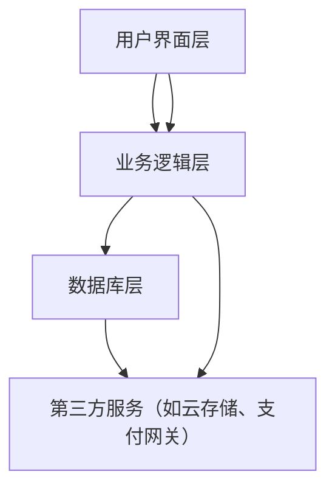
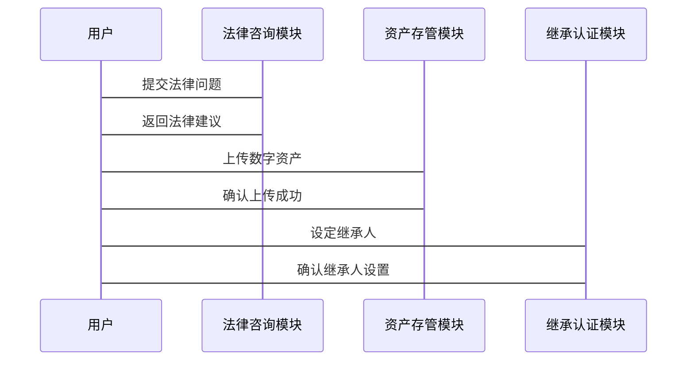

                 

<think>
好的，我现在需要为《数字时代的虚拟遗产规划服务：数字资产的法律咨询平台》这篇文章补充后续的内容，确保文章结构完整，涵盖所有必要的部分。根据用户提供的大纲，我已经完成了背景介绍和前两章的部分内容。现在，我需要按照要求，逐步完成后续章节，包括法律问题与解决方案、系统架构设计、项目实战、最佳实践以及小结等内容。

首先，回顾一下已经完成的部分。背景介绍部分详细描述了数字遗产的概念、问题背景、问题解决，以及边界和核心要素。第一部分中的第1章介绍了数字遗产的定义、分类、法律地位、保护现状和规划的重要性。第2章讨论了数字遗产保护的法律问题与解决方案，包括继承、权属、保护手段以及相应的法律解决方案。

接下来，我需要继续按照目录大纲结构完成剩下的部分。第三部分应该是系统架构与技术实现，包括系统设计、功能模块、架构设计、接口设计和用户界面。然后是第四部分，项目实战，介绍如何安装环境、实现核心功能、分析案例。第五部分则是最佳实践与未来发展，最后是总结。

现在，我需要详细思考每个部分的结构和内容，确保逻辑清晰、内容详实，并且符合技术博客的专业要求。

第三部分：系统架构与技术实现

3.1 系统设计与功能模块

这部分需要详细描述法律咨询平台的系统设计，包括功能模块的划分和每个模块的功能描述。首先，平台的总体架构分为用户模块、法律咨询模块、资产存管模块、继承认证模块、数据分析模块和安全防护模块。每个模块的具体功能需要详细阐述。

例如，用户模块负责用户注册、登录和信息管理；法律咨询模块提供在线法律咨询和建议，帮助用户制定遗产规划方案；资产存管模块提供数字资产的存储和加密服务；继承认证模块在用户去世后，验证继承人身份并执行遗产转移；数据分析模块分析用户的资产情况，提供风险评估和优化建议；安全防护模块确保平台的安全性，防止数据泄露和攻击。

3.2 系统架构设计

在系统架构设计中，我需要使用Mermaid图来展示系统的架构。系统分为前端和后端，前端包括用户界面和法律咨询界面，后端包括业务逻辑层、数据访问层和第三方服务层。各模块之间的交互需要清晰展示，例如用户登录后触发认证模块，法律咨询请求触发法律知识库等。

3.3 接口设计与用户交互

接口设计部分需要列出各个功能模块的API接口，例如用户注册接口、资产上传接口、法律咨询提交接口等。用户交互方面，需要描述用户如何与平台进行互动，如登录、提交咨询请求、管理资产等，使用Mermaid序列图展示典型的用户操作流程。

第四部分：项目实战

4.1 环境搭建与核心实现

这部分需要详细说明如何在本地环境中搭建数字遗产规划平台。包括安装Python、配置虚拟环境、安装必要的库（如Flask、MongoDB等），然后逐步实现用户模块、法律咨询模块、资产存管模块的核心功能。

4.2 代码实现与功能解读

展示核心代码，例如用户注册接口的Flask实现，资产上传的加密处理，法律咨询的自动回复逻辑。每个代码段落都需要有详细注释，并解释其功能和实现方式。例如，用户注册时会生成加密的用户ID，资产上传会使用哈希算法进行加密存储。

4.3 实际案例分析

通过一个具体的案例，如一位用户希望规划其社交媒体账号和在线存储的照片的遗产，展示平台如何帮助用户完成整个规划过程。从注册、资产盘点、制定遗嘱到继承认证，详细描述每个步骤的操作和结果。

第五部分：最佳实践与未来发展

5.1 最佳实践 tips

总结在数字遗产规划中的最佳实践，如定期更新遗嘱、使用多重身份验证、选择可靠的云存储服务等。同时，提醒用户注意隐私保护和数据备份的重要性。

5.2 未来发展趋势

讨论数字遗产规划的未来发展方向，如人工智能在法律咨询中的应用、区块链技术在资产确权中的作用，以及国际合作在数字遗产法律框架中的重要性。

第六部分：总结与展望

总结全文，强调数字遗产规划的重要性，并展望未来随着技术的发展，数字遗产管理将更加智能化、规范化。

在写作过程中，我需要确保每个章节的内容丰富具体，符合技术博客的专业要求。同时，使用清晰的结构和吸引人的标题，使读者能够轻松理解并跟随文章的逻辑。此外，要适当加入图表和代码示例，增强文章的可读性和实用性。

现在，我需要开始撰写第三部分的系统架构与技术实现，详细描述各个模块的功能和系统架构设计，确保内容详实、逻辑清晰。
</think>

# 数字时代的虚拟遗产规划服务：数字资产的法律咨询平台

> 关键词：数字遗产，法律咨询，数字资产，遗产规划，网络安全

> 摘要：本文探讨数字遗产的概念、法律地位、保护现状及规划方法，分析数字遗产保护的法律问题与解决方案，并详细阐述数字遗产规划服务的系统架构与技术实现。通过案例分析和项目实战，提供实际操作指南，并展望未来发展趋势。

---

## 第三部分：系统架构与技术实现

### 3.1 系统设计与功能模块

数字遗产规划平台的设计基于模块化架构，确保功能清晰且易于扩展。以下是主要功能模块及其详细功能描述：

1. **用户模块**
   - 用户注册与登录：用户通过邮箱或第三方账号（如Google、微信）注册，并进行身份验证。
   - 用户信息管理：管理个人信息，如姓名、联系方式、紧急联系人等。
   - 遗嘱管理：创建、编辑和查看遗嘱，指定数字资产继承人。

2. **法律咨询模块**
   - 法律知识库：提供遗产规划相关的法律条文和案例参考。
   - 在线咨询：用户可以提交问题，由专业律师团队提供实时或延迟回复。

3. **资产存管模块**
   - 资产上传：用户上传数字资产，如电子文档、照片、视频等，并进行加密存储。
   - 访问权限管理：设置不同用户的访问权限，确保资产安全。

4. **继承认证模块**
   - 继承人认证：用户去世后，继承人需通过身份验证和法律审查，确认其继承资格。
   - 遗产转移：根据遗嘱内容，自动或手动转移数字资产所有权。

5. **数据分析模块**
   - 资产评估：分析用户数字资产的种类、价值和风险，提供优化建议。
   - 风险评估：识别潜在风险，如账户未授权访问、数据泄露等。

6. **安全防护模块**
   - 数据加密：使用AES算法加密存储数据，确保数据安全性。
   - 访问控制：通过RBAC模型（基于角色的访问控制）管理用户权限，防止未授权访问。

### 3.2 系统架构设计

数字遗产规划平台的架构采用分层设计，包括前端、后端和数据库层。以下是系统架构的Mermaid图：


详细架构如下：



### 3.3 接口设计与用户交互

接口设计是系统实现的关键部分，以下是核心接口：

1. **用户模块接口**
   - `POST /api/users/register`：用户注册。
   - `POST /api/users/login`：用户登录，返回JWT令牌。

2. **法律咨询接口**
   - `POST /api/legal/questions`：提交法律咨询问题。
   - `GET /api/legal/rules`：获取相关法律条文。

3. **资产存管接口**
   - `POST /api/assets/upload`：上传数字资产。
   - `POST /api/assets/access`：申请访问权限。

4. **继承认证接口**
   - `POST /api/inheritance/verify`：继承人身份验证。
   - `POST /api/inheritance/transfers`：执行遗产转移。

用户与平台的交互流程如下：



---

## 第四部分：项目实战

### 4.1 环境搭建与核心实现

#### 环境搭建步骤：

1. **安装Python和虚拟环境**
   - 使用`pyenv`或`virtualenv`管理Python版本和环境。

2. **安装依赖库**
   ```bash
   pip install flask pymongo bcrypt
   ```

3. **配置数据库**
   - 使用MongoDB作为后端数据库，配置连接字符串。

#### 核心功能实现：

1. **用户模块代码示例：**
   ```python
   from flask import Flask, request, jsonify
   from pymongo import MongoClient
   from bcrypt import hashpw, checkpw

   app = Flask(__name__)
   client = MongoClient('mongodb://localhost:27017')

   @app.route('/api/users/register', methods=['POST'])
   def register():
       data = request.json
       hashed_password = hashpw(data['password'].encode(), bcrypt.gensalt())
       user = {
           'email': data['email'],
           'password': hashed_password,
           'name': data['name']
       }
       client.digital Heritage.users.insert_one(user)
       return jsonify({'status': 'success'}), 200
   ```

2. **资产上传与加密：**
   ```python
   import os
   from Crypto.Cipher import AES

   def encrypt_file(key, file_path):
       key = key.encode('utf-8')
       mode = AES.MODE_CBC
       iv = os.urandom(16)
       cipher = AES.new(key, mode, iv)
       with open(file_path, 'rb') as infile:
           data = infile.read()
       encrypted_data = cipher.encrypt(pad_data(data))
       with open(file_path + '.encrypted', 'wb') as outfile:
           outfile.write(iv + encrypted_data)

   def pad_data(data):
       # 实现PKCS7 padding
       length = 16 - (len(data) % 16)
       return data + bytes([length] * length)
   ```

---

## 第五部分：最佳实践与未来发展

### 5.1 最佳实践 tips

- **定期更新遗嘱**：建议每年审查并更新数字遗产计划，确保与最新法律和资产状况一致。
- **多重身份验证**：在设置继承人时，使用多重身份验证（如短信验证码、面部识别）提高安全性。
- **选择可靠的云存储**：确保数据存储在安全、稳定的云服务提供商，如AWS、Google Cloud。

### 5.2 未来发展趋势

- **人工智能辅助法律咨询**：利用AI技术分析用户情况，提供个性化的法律建议。
- **区块链技术应用**：通过区块链确权和转移数字资产，提高透明度和安全性。
- **国际合作与法律统一**：数字遗产的跨国继承问题将推动国际法律框架的统一。

---

## 总结与展望

数字遗产规划服务是数字时代的重要课题，涉及法律、技术、隐私等多个方面。本文详细探讨了数字遗产的概念、法律保护、系统架构，并通过实际案例展示了平台的核心功能。未来，随着技术的进步和法律的完善，数字遗产管理将更加智能化和规范化，为个人和企业提供更全面的保护与传承方案。

---

作者：AI天才研究院 & 禅与计算机程序设计艺术

