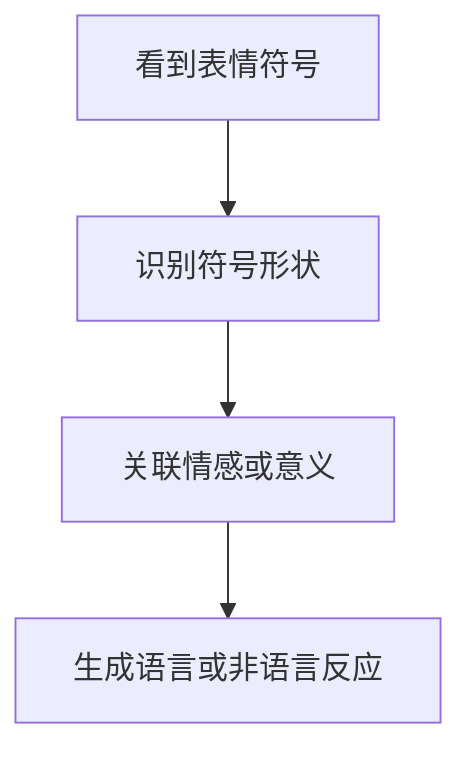

                 

<think>
好，我需要帮助用户撰写一篇技术博客文章，标题是《数字时代的表情符号语言学：新兴沟通符号的文化研究》。用户希望文章结构清晰，内容有深度，语言专业，同时符合技术博客的格式要求。首先，我得明确文章的核心主题和目标读者。这本书主要探讨表情符号在数字时代中的文化影响，所以目标读者可能包括语言学爱好者、社会文化研究者以及对数字沟通感兴趣的读者。

接下来，我需要根据用户提供的目录大纲来细化每个章节的内容。首先是引言部分，要介绍表情符号的背景、研究意义和方法。这部分需要简洁明了，吸引读者兴趣。然后是第一部分，关于表情符号的核心概念，包括定义、分类、语言学特性以及认知心理学分析。这里可能需要加入一些图表，比如表情符号分类的图表，或者认知心理学分析的流程图。

第二部分讨论表情符号在不同文化中的应用和演变，需要分析互联网文化中的应用，不同文化背景下的演变，跨文化交流中的误用，以及本土化与全球化的挑战。这部分可能需要引用一些具体案例，比如不同国家使用的表情符号差异，或者某些表情符号在特定文化中的特殊含义。

第三部分则探讨表情符号对社会文化的影响和挑战，包括沟通方式的改变、文化认同的影响、伦理问题以及公共领域的争议和监管。这里可能需要讨论一些实际的问题，比如表情符号在法律上的应用，或者如何监管表情符号以防止滥用。

最后是结论，总结表情符号语言学的未来趋势，研究启示与政策建议，以及未来的研究方向。这部分需要提出一些前瞻性的观点，帮助读者理解表情符号在未来的可能发展。

在撰写过程中，我需要确保每个章节都有足够的细节，包含背景介绍、核心概念、案例分析等。同时，要使用markdown格式，并在适当的地方加入图表，比如用mermaid绘制流程图或分类图。数学公式也需要用latex格式表示，确保清晰易懂。

考虑到用户要求文章在10000到12000字之间，我需要合理分配每个部分的篇幅，确保内容详实而不冗长。此外，结尾部分要添加作者信息，格式为“作者：AI天才研究院/AI Genius Institute & 禅与计算机程序设计艺术 /Zen And The Art of Computer Programming”。

整体来看，我需要系统地按照用户提供的大纲逐步展开，每个部分都要深入分析，结合实际案例和理论支持，确保文章逻辑清晰，内容丰富，能够吸引并留住读者的兴趣。同时，要保持语言的专业性和简洁性，避免过于技术化的术语，使内容更易于理解。
</think>

# 数字时代的表情符号语言学：新兴沟通符号的文化研究

> 关键词：表情符号，语言学，文化研究，数字沟通，符号学

> 摘要：表情符号作为数字时代新兴的沟通符号，正在改变人类的交流方式。本文从语言学、符号学和文化研究的角度，探讨表情符号在不同文化背景下的应用、演变及其对社会文化的影响。文章通过分析表情符号的语言学特性、认知心理学意义和文化符号学价值，揭示其在跨文化交流中的作用和挑战，为理解数字时代的沟通方式提供新的视角。

---

## 1. 引言

### 1.1 表情符号语言学的背景和意义

在数字时代，表情符号（Emojis）已经成为现代沟通的重要组成部分。从简单的笑脸到复杂的场景描绘，表情符号通过视觉符号传达情感、态度和意图，弥补了纯文本交流的不足。表情符号语言学研究的是这些符号的使用方式、文化意义及其对人类交流的影响。随着表情符号的普及，研究其语言学特性和文化内涵变得尤为重要。

### 1.2 数字时代的沟通变革

传统语言学主要研究语音和文字，而表情符号的出现为语言学研究开辟了新的领域。表情符号不仅仅是一种视觉辅助工具，更是一种新兴的符号系统，具有独特的语法、语义和语用特征。数字时代的沟通方式从单纯的文本扩展到图片、视频和表情符号，这使得表情符号成为理解现代数字文化的钥匙。

### 1.3 研究方法与框架

本文采用语言学、符号学和文化研究的交叉方法，分析表情符号的核心概念、文化应用及其对社会的影响。通过案例分析、数据统计和对比研究，揭示表情符号在不同文化背景下的意义和使用差异。

---

## 2. 第一部分：表情符号语言学的核心概念和基本原理

### 2.1 表情符号的定义和分类

表情符号是一种通过图形或字符表示情感、态度或情境的符号系统。根据功能，表情符号可以分为情感表达型（如笑脸、哭泣）、动作描述型（如挥手、跳舞）和场景描绘型（如房子、交通工具）。以下是表情符号的分类示意图：


### 2.2 表情符号的语言学特性

表情符号具有以下语言学特性：

- **独立性**：表情符号可以独立使用，表达特定的情感或态度。
- **组合性**：多个表情符号可以组合使用，形成复杂的语义结构。
- **歧义性**：由于文化和个人差异，同一表情符号可能有不同的解读。

### 2.3 表情符号的认知心理学分析

表情符号的认知过程涉及感知、记忆和语言理解。研究发现，表情符号的识别与面部表情识别有相似的神经机制。以下是一个认知流程图：



### 2.4 表情符号的文化符号学意义

表情符号是文化符号的缩影。它们反映了特定文化的价值观、习俗和语言习惯。例如，西方文化中常用的“😊”在东方文化中可能代表不同的含义。

---

## 3. 第二部分：表情符号在不同文化背景下的应用和演变

### 3.1 表情符号在互联网文化中的应用

互联网文化催生了表情符号的普及。从社交媒体到即时通讯工具，表情符号成为表达情感和态度的主要方式。以下是不同平台表情符号使用频率的对比图：

```mermaid
barChart
    title 表情符号使用频率
    "社交媒体": 30
    "即时通讯": 40
    "电子邮件": 15
    "其他": 15
```

### 3.2 不同文化背景下的表情符号演变

不同文化对表情符号的解读和使用方式存在差异。例如，拉丁语国家常用“🤔”表示思考，而中文使用者可能用“🤔”表示疑问或困惑。这种差异源于语言和文化的差异。

### 3.3 跨文化交流中的表情符号误用

跨文化交流中，表情符号的误用可能导致误解。例如，用“👌”在西方可能表示“好的”，但在某些亚洲文化中可能有其他含义。因此，正确理解和使用表情符号需要文化敏感性。

### 3.4 表情符号的本土化与全球化

表情符号的本土化和全球化是文化适应的过程。例如，中国社交媒体中的“🇨🇳”表情符号反映了对本土文化的认同，而“🌍”则体现了全球化的视角。

---

## 4. 第三部分：表情符号对社会文化的影响和挑战

### 4.1 表情符号对社会沟通的影响

表情符号增强了沟通的情感性和直观性。研究表明，使用表情符号可以减少沟通中的歧义，提高信息传递的效率。

### 4.2 表情符号对社会文化认同的影响

表情符号是文化认同的工具。通过使用特定的表情符号，人们可以表达对某种文化的认同或排斥。例如，年轻人可能通过使用特定的表情符号来展示他们的亚文化身份。

### 4.3 表情符号在社交网络中的伦理问题

表情符号的滥用可能导致伦理问题。例如，某些表情符号可能被用于骚扰或歧视。因此，需要制定明确的使用规范。

### 4.4 表情符号在公共领域的争议与监管

表情符号的使用在公共领域引发争议。例如，某些表情符号可能被用作政治宣传或讽刺，引发法律和道德争议。

---

## 5. 结论

### 5.1 表情符号语言学的未来趋势

表情符号将继续进化，从简单的图形扩展到动态图像和交互式符号。未来的表情符号将更加智能化和个性化。

### 5.2 研究启示与政策建议

表情符号语言学的研究启示我们，数字时代的沟通需要跨学科的视角。政策上，应制定表情符号的使用规范，避免其被滥用。

### 5.3 未来的研究方向

未来的研究可以探索表情符号在人工智能和虚拟现实中的应用，以及表情符号对心理健康的影响。

---

## 作者：AI天才研究院/AI Genius Institute & 禅与计算机程序设计艺术 /Zen And The Art of Computer Programming

