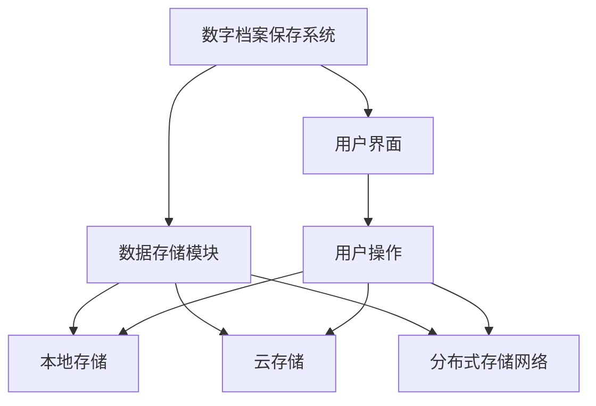

                 

<think>
嗯，用户想要我写一篇关于数字时代记忆保存的博客，特别是个人数字档案的重要性。首先，我得理解用户的需求。他们可能是一位技术专家，或者是对数字档案感兴趣的人，想了解如何在数字时代保存个人记忆。文章需要结构清晰，有深度，符合技术博客的风格。

我注意到用户提供了详细的目录大纲，分为三个主要部分：问题背景与核心概念、个人数字档案的重要性，以及数字档案的长期保存与利用。每个部分下还有多个章节，每个章节都有小节。这意味着我需要按照这个结构来展开，确保每个部分都有足够的细节。

接下来，用户还提到文章需要满足一些约束条件，比如字数在10000到12000字左右，使用markdown格式，包含关键词和摘要。文章末尾要有作者信息，内容要完整，每个小节要丰富详细。此外，还需要包括背景介绍、核心概念、算法原理、系统分析、项目实战等部分，甚至用mermaid图和数学公式来解释。

这可能有点挑战，因为用户希望内容不仅要有技术深度，还要有实际案例和最佳实践。我需要确保在每个章节中都涵盖这些方面。例如，在第一部分，我需要介绍数字化时代的挑战，定义个人数字档案，讨论保存的必要性和可行性。同时，可能需要列出不同类型的数字档案格式，并讨论保存和备份策略。

在第二部分，关于数字记忆与个人身份，我需要解释数字记忆的概念，如何与传统记忆不同，以及它在身份认证中的作用。然后，讨论数字档案的社会价值，包括家族文化传承、隐私保护和学术应用。这部分可能需要比较不同存储技术的优缺点，并探讨长期保存的挑战和策略。

第三部分涉及数字档案的长期保存技术，包括技术演进、系统设计，以及利用与共享的方法。这里可能需要比较不同存储技术，如分布式存储、区块链等，以及如何设计一个可靠的数字档案保存系统。

最后，教育和政策部分需要讨论如何推广数字记忆保存的教育，当前的政策现状，以及未来的趋势。这部分可能需要引用一些政策文件或案例，展示数字档案在社会中的应用。

在写作过程中，我需要确保每个章节都有足够的细节，包括技术术语的解释，实际案例的分析，以及对未来的展望。同时，使用mermaid图来展示系统架构和数据流，用数学公式解释相关算法，这将使文章更具专业性和可读性。

可能遇到的困难是如何在有限的篇幅内涵盖这么多内容，同时保持文章的连贯性。需要合理分配字数，确保每个部分都有足够的深度，但又不显得冗长。此外，如何将技术内容与实际应用结合起来，使读者能够理解并应用这些知识，也是一个挑战。

总的来说，我需要按照用户提供的大纲，逐步展开每个部分，确保每个章节都详细且有深度。同时，结合实际案例和技术细节，使文章既有理论支持，又有实际应用，满足用户的需求。
</think>

# 数字时代的记忆保存：个人数字档案的重要性

> 关键词：数字档案、记忆保存、个人身份、隐私保护、数字遗产、长期保存

> 摘要：在数字化浪潮席卷全球的今天，个人数字档案的重要性日益凸显。数字档案不仅是个人记忆的载体，更是身份认同、隐私保护和社会传承的重要工具。本文从数字记忆的形成、数字档案的管理与保存技术、数字档案的社会价值等方面展开分析，探讨个人数字档案在数字时代的多重意义。

---

## 第一部分：问题背景与核心概念

### 第1章：数字时代的记忆保存问题

#### 1.1 数字化时代的变迁与记忆保存的挑战

##### 1.1.1 数字化信息爆炸对记忆保存的影响

在数字化浪潮的推动下，人类社会产生了海量的数字信息。每天，我们通过社交媒体、电子邮件、云存储、照片、视频等方式生成大量数据。这些数据记录了我们的生活、工作和思想，构成了数字时代的“记忆”。然而，随着数据量的激增，如何有效地保存和管理这些数字记忆成为一项严峻的挑战。

传统的纸质档案虽然易于保存，但在数字化时代已经无法满足人们对信息快速检索、共享和备份的需求。数字信息的脆弱性（如格式过时、存储介质损坏等）进一步加剧了记忆保存的难度。

##### 1.1.2 个人数字档案的定义与重要性

个人数字档案是指以数字形式存储的、反映个人生活、工作和思想的所有信息的集合。它包括但不限于文本文件、照片、视频、音频、日志、社交媒体数据等。个人数字档案的重要性体现在以下几个方面：

1. **身份认同**：数字档案记录了一个人的成长历程、成就和经历，是个人身份的重要组成部分。
2. **隐私保护**：通过合理管理数字档案，可以有效保护个人隐私，防止信息泄露。
3. **知识传承**：数字档案不仅是个人记忆的载体，也是家族文化和知识传承的重要工具。
4. **应急备份**：在意外情况下（如设备损坏、数据丢失等），数字档案是恢复个人数据的重要手段。

##### 1.1.3 数字记忆保存的必要性与可行性

数字记忆保存的必要性源于以下几点：

1. **数据的脆弱性**：数字信息依赖于特定的格式和存储介质，格式过时或介质损坏可能导致数据丢失。
2. **社会需求**：随着数字化进程的加快，个人和社会对数字档案的需求日益增长。
3. **法律与伦理要求**：在某些情况下（如遗产继承、法律纠纷等），数字档案的完整性至关重要。

数字记忆保存的可行性体现在以下几点：

1. **技术进步**：云存储、区块链等技术为数字档案的长期保存提供了可靠的技术支持。
2. **工具丰富**：各种数字档案管理工具（如云存储服务、档案管理软件等）为个人提供了便捷的管理手段。
3. **成本降低**：随着技术的进步，存储成本逐渐降低，使得个人数字档案的保存更加经济可行。

---

#### 1.2 数字档案的类型与格式

##### 1.2.1 文字文件格式

文字文件是数字档案中最常见的类型，主要包括以下格式：

- **TXT**：纯文本格式，兼容性高，但缺少排版信息。
- **DOC/DOCX**：微软Word文档格式，支持复杂的排版和内容。
- **PDF**： Portable Document Format，支持跨平台的文件显示和打印。

##### 1.2.2 图片和视频文件格式

- **JPEG/PNG**：常用的图片格式，适用于照片和图像。
- **MP4/AVI**：视频文件格式，广泛应用于视频存储和播放。
- **GIF**：动图格式，适合短小精悍的动态图像。

##### 1.2.3 音频文件格式

- **MP3**：最常见的音频文件格式，支持高质量的音乐播放。
- **WAV**：无损音频格式，适合专业音频存储。
- **FLAC**：无损压缩音频格式，支持高压缩率和高质量音效。

---

#### 1.3 数字档案的保存与备份策略

##### 1.3.1 数字档案保存的基本原则

1. **分散存储**：避免将所有数据集中存储在单一设备上，建议采用分布式存储策略。
2. **格式兼容性**：选择通用文件格式，确保数据在未来仍然可读。
3. **定期备份**：定期进行数据备份，防止数据丢失。
4. **安全加密**：对敏感数据进行加密存储，确保隐私安全。

##### 1.3.2 数字档案备份的方法与技术

- **本地备份**：将数据备份到外部硬盘或SSD中。
- **云备份**：利用云存储服务（如Google Drive、iCloud等）进行备份。
- **双重备份**：结合本地备份和云备份，确保数据的安全性。
- **区块链备份**：通过区块链技术实现数据的不可篡改性和分布式存储。

---

## 第二部分：个人数字档案的重要性

### 第3章：数字记忆与个人身份

#### 3.1 数字记忆的概念与特征

##### 3.1.1 数字记忆的形成与存储

数字记忆的形成依赖于个人在数字化过程中的行为，包括拍照、录影、发社交媒体帖子、写日记等。这些行为生成的数据构成了个人数字记忆的核心内容。

##### 3.1.2 数字记忆与传统记忆的比较

| 特性       | 数字记忆                 | 传统记忆               |
|------------|--------------------------|------------------------|
| 存储方式   | 数字化存储               | 纸质、口述等方式         |
| 可追溯性   | 高，可以通过技术手段检索 | 低，依赖于人的记忆和记录 |
| 完整性     | 高，数据不易篡改           | 低，容易遗漏或失真       |
| 可共享性   | 高，可以通过网络快速共享 | 低，需要物理介质或面对面交流 |

#### 3.2 数字档案与个人身份的关联

##### 3.2.1 数字档案对个人身份记录的重要性

数字档案记录了一个人的数字足迹，包括社交媒体上的互动、工作中的成就、个人兴趣的体现等。这些记录不仅是个人身份的证明，也是未来回忆的重要依据。

##### 3.2.2 数字档案在身份认证中的应用

数字档案可以作为身份认证的辅助工具，例如通过社交媒体数据验证一个人的身份信息。

#### 3.3 数字记忆与个人情感的关系

##### 3.3.1 数字记忆对个人情感的保存

数字记忆可以保存照片、视频、语音留言等，这些内容能够唤起人们的回忆和情感共鸣。

##### 3.3.2 数字档案在情感记忆中的角色

数字档案不仅是情感记忆的载体，还可以通过共享和交流，增强人与人之间的情感联系。

---

### 第4章：个人数字档案的社会价值

#### 4.1 数字档案的传承与家族文化

##### 4.1.1 数字档案在家族文化传承中的意义

数字档案可以记录家族的历史、重要事件和成员的成就，成为家族文化的数字遗产。

##### 4.1.2 数字档案在家庭记忆保存中的作用

通过数字档案，家庭成员可以方便地共享和回顾家族的记忆，增强家庭凝聚力。

#### 4.2 数字档案与个人信息隐私

##### 4.2.1 数字档案对个人隐私的保护需求

数字档案可能包含大量敏感信息（如照片、通信记录等），需要采取加密和访问控制等措施保护隐私。

##### 4.2.2 数字档案隐私保护的方法与策略

1. **数据加密**：对敏感数据进行加密存储，确保未经授权无法访问。
2. **访问控制**：通过权限管理，限制只有授权人员可以访问数字档案。
3. **隐私保护技术**：利用隐私计算、联邦学习等技术，在保护隐私的前提下进行数据共享和分析。

#### 4.3 数字档案在学术研究与社会发展中的应用

##### 4.3.1 数字档案在学术研究中的重要性

数字档案为学术研究提供了丰富的数据资源，例如历史事件的记录、人物访谈的整理等。

##### 4.3.2 数字档案在社会发展中的作用

数字档案可以作为社会发展的重要记录，例如记录社会变迁、政策实施效果等。

---

## 第三部分：数字档案的长期保存与利用

### 第5章：数字档案的长期保存技术

#### 5.1 数字档案长期保存的挑战与策略

##### 5.1.1 数字档案长期保存的挑战

1. **技术过时**：存储格式和硬件的更新换代可能导致数据无法读取。
2. **介质损坏**：存储介质可能出现物理损坏，导致数据丢失。
3. **数据膨胀**：随着数据量的增加，存储和管理成本也随之上升。

##### 5.1.2 数字档案长期保存的应对策略

1. **格式迁移**：定期将数据迁移到新的存储格式，确保数据的可读性。
2. **介质多样化**：采用多种存储介质（如硬盘、光盘、云存储等）进行数据备份。
3. **分布式存储**：利用分布式存储技术（如区块链、IPFS等）实现数据的去中心化存储。

#### 5.2 数字档案保存技术的演进

##### 5.2.1 传统存储技术的局限性

传统存储技术（如磁带、硬盘等）存在以下问题：

1. 易受物理损坏。
2. 数据格式可能过时。
3. 存储成本较高。

##### 5.2.2 新型存储技术的发展与应用

1. **区块链技术**：通过区块链实现数据的不可篡改性和分布式存储。
2. **分布式存储技术**：如IPFS（InterPlanetary File System），提供去中心化的文件存储服务。
3. **AI驱动的存储优化**：利用人工智能技术优化存储空间和数据访问效率。

---

#### 5.3 数字档案保存系统的设计

##### 5.3.1 数字档案保存系统的架构设计

以下是一个数字档案保存系统的简单架构图：

##### 5.3.2 数字档案保存系统的功能模块

1. **数据采集模块**：负责收集用户生成的数字数据。
2. **数据分类模块**：对数据进行分类和标签化管理。
3. **数据存储模块**：将数据存储到本地、云存储或分布式存储网络中。
4. **数据备份模块**：定期进行数据备份，防止数据丢失。
5. **数据检索模块**：支持快速检索和查询数据。

---

### 第6章：数字档案的利用与共享

#### 6.1 数字档案的利用与检索

##### 6.1.1 数字档案的检索技术与工具

常用的数字档案检索工具包括：

1. **全文检索引擎**：支持对文本内容的关键词检索。
2. **多媒体检索工具**：支持对图片、视频的特征检索。
3. **智能检索系统**：利用AI技术实现语义检索。

##### 6.1.2 数字档案的利用流程与规范

1. **数据分类**：对数字档案进行分类和标签化管理，便于快速检索。
2. **权限管理**：根据用户权限控制数据的访问范围。
3. **数据共享**：通过共享链接或权限设置，实现数据的安全共享。

#### 6.2 数字档案的共享与开放

##### 6.2.1 数字档案共享的意义与原则

数字档案的共享可以促进知识的传播和合作，但需要遵循以下原则：

1. **合法性**：确保共享的数据不侵犯他人的隐私和版权。
2. **安全性**：防止数据在共享过程中被篡改或泄露。
3. **可追溯性**：记录数据的来源和使用情况，便于追查问题。

##### 6.2.2 数字档案开放的政策与措施

1. **数据开放平台**：建立开放的数据平台，供公众访问和使用数字档案。
2. **数据共享协议**：制定数据共享协议，明确数据的使用权限和责任。

#### 6.3 数字档案的版权管理与使用

##### 6.3.1 数字档案版权的概念与特征

数字档案的版权是指对数字档案的使用权、复制权、修改权等。与传统版权相比，数字档案的版权具有以下特征：

1. **无形性**：数字档案的版权依赖于数字技术实现。
2. **可复制性**：数字档案可以被快速复制和传播。
3. **全球性**：数字档案可以通过网络在全球范围内传播。

##### 6.3.2 数字档案版权保护的方法与措施

1. **数字水印**：在数字档案中嵌入水印，防止未经授权的复制和传播。
2. **访问控制**：通过技术手段限制未经授权的访问。
3. **法律保护**：通过法律手段保护数字档案的版权。

---

### 第7章：数字时代的记忆保存教育与政策

#### 7.1 数字记忆保存的教育推广

##### 7.1.1 数字记忆保存教育的重要性

随着数字化进程的加快，数字记忆保存教育的重要性日益凸显。通过教育，可以提高公众对数字档案的认识和管理能力。

##### 7.1.2 数字记忆保存教育的实践与探索

1. **学校教育**：将数字档案管理纳入学校课程，培养学生的数字素养。
2. **社会培训**：举办数字档案管理培训，提高公众的数字档案管理能力。
3. **社区活动**：通过社区活动宣传数字档案的重要性，增强公众的数字档案意识。

#### 7.2 数字档案政策与发展趋势

##### 7.2.1 数字档案政策的现状与挑战

当前，许多国家和地区已经开始制定数字档案相关政策，例如欧盟的《通用数据保护条例》（GDPR）等。然而，数字档案政策的制定仍面临以下挑战：

1. **技术复杂性**：数字档案涉及多种技术手段，政策制定需要考虑技术的多样性和复杂性。
2. **隐私保护**：如何在保护隐私的前提下实现数字档案的共享和利用是一个难点。
3. **国际协调**：数字档案的跨境流动需要国际间的政策协调。

##### 7.2.2 数字档案政策的发展方向与策略

1. **加强立法**：制定和完善数字档案相关法律法规，明确数字档案的管理责任和权利。
2. **推动技术创新**：支持数字档案管理技术的研发和应用，提高数字档案的保存和利用效率。
3. **促进国际合作**：加强国际间的政策协调和合作，推动数字档案的全球治理。

#### 7.3 数字时代的记忆保存：挑战与机遇

##### 7.3.1 数字时代记忆保存的挑战

1. **技术挑战**：数字技术的快速变化对数字档案的长期保存提出了更高的要求。
2. **隐私挑战**：如何在保护隐私的前提下实现数字档案的共享和利用是一个难题。
3. **社会挑战**：公众对数字档案的认识和重视程度不足，影响数字档案的推广和应用。

##### 7.3.2 数字时代记忆保存的机遇

1. **技术进步**：人工智能、区块链等技术为数字档案的管理提供了新的解决方案。
2. **政策支持**：越来越多的国家和地区开始重视数字档案的管理，政策支持力度加大。
3. **社会需求**：随着数字化进程的加快，个人和社会对数字档案的需求不断增加，为数字档案的推广提供了广阔的空间。

---

## 结论

### 8.1 本书总结

本文从数字记忆的形成、数字档案的管理与保存技术、数字档案的社会价值等多个方面，深入探讨了个人数字档案在数字时代的多重意义。通过分析数字档案的类型、保存策略、管理工具以及长期保存技术，本文为个人数字档案的管理和利用提供了理论和实践的参考。

### 8.2 数字时代记忆保存的展望

随着数字化进程的加快，个人数字档案的重要性将越来越凸显。未来，随着技术的进步和社会的发展，数字档案的管理将更加智能化、便捷化和安全化。同时，数字档案的社会价值也将进一步提升，成为社会传承、文化保护和知识共享的重要工具。

作者：AI天才研究院/AI Genius Institute & 禅与计算机程序设计艺术 /Zen And The Art of Computer Programming

