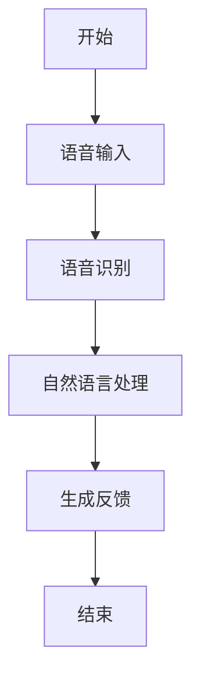
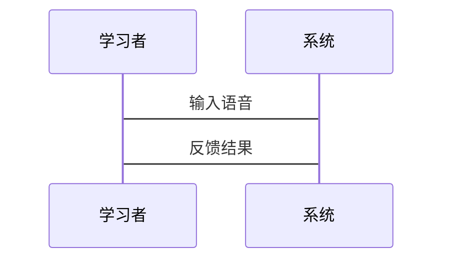

                 

<think>
嗯，我需要写一篇关于“数字时代的语言交换平台：VR虚拟环境中的沉浸式语言学习”的技术博客文章。首先，我应该先理解这个主题的核心是什么。虚拟现实技术在语言学习中的应用，特别是沉浸式学习体验。这听起来挺有意思的，但我不太确定从哪里开始。让我一步一步来思考。

首先，我得了解当前的语言学习现状。传统的学习方式有哪些问题呢？比如，学生可能缺乏实际的语言环境，无法进行真实的对话练习。他们可能只能通过书本或在线课程学习，这可能不够生动，导致学习效果不佳。现在，虚拟现实技术的发展为语言学习带来了新的可能性。比如，学生可以在虚拟环境中与虚拟角色或真实用户进行互动，从而提高实际应用能力。

接下来，我需要确定文章的结构。根据用户提供的大纲，文章应该分为几个部分，包括背景介绍、虚拟现实环境设计、平台实现与优化、案例研究等。每个部分又细分成多个小节，详细讲解相关的内容。

在背景介绍部分，我需要先定义核心概念，比如虚拟现实、沉浸式学习等。然后描述当前的问题，如传统语言学习的不足，以及虚拟现实在其中的应用潜力。接着，明确问题，比如如何设计一个有效的VR语言学习平台，并预期其成果。最后，探讨如何解决这些问题，包括选择适合的VR环境和技术实现的边界。

在虚拟现实环境设计部分，我需要介绍VR技术的原理，包括硬件和软件平台。然后讨论设计原则，比如如何增强沉浸感和互动性。接下来，通过案例分析，展示不同类型的VR环境设计，如虚拟课堂和文化体验环境。

接下来是沉浸式语言学习平台的设计，这部分需要详细讲解平台的架构，包括系统设计、功能模块划分和性能优化。同时，要说明使用的算法，如语音识别和自然语言处理，可能需要绘制流程图来展示算法的工作原理。数学模型和公式也需要详细解释，确保读者能够理解其背后的原理。

在平台实现与优化部分，我需要选择具体的开发工具，比如Unity3D，并说明其在VR开发中的优势。同时，设计系统接口和交互流程，可能需要用mermaid序列图来展示。性能优化也是关键，要讨论硬件和软件上的优化策略，并通过案例分析效果。

最后，案例研究部分，我需要找到成功的VR语言学习案例，分析其成功的原因，包括项目背景、目标和实施效果。这有助于读者理解理论在实际中的应用。

现在，我需要考虑文章的结构是否合理。每个部分是否涵盖了必要的内容，是否有遗漏的地方。例如，在算法部分，是否详细解释了语音识别和自然语言处理的数学模型？在设计原则部分，是否讨论了用户沉浸感和互动性的具体实现方法？

另外，我需要确保文章语言简洁明了，逻辑清晰。每个小节的标题要有吸引力，能够引导读者继续阅读。同时，关键词和摘要部分要准确反映文章的核心内容。

在实际写作时，可能会遇到一些技术细节，比如如何具体实现语音识别算法，或者如何优化VR环境的性能。这时，我需要查阅相关资料，确保信息的准确性。同时，要避免过于专业的术语，保持文章的易读性。

最后，我需要检查文章是否符合字数要求，大约10000到12000字。确保每个部分都有足够的细节，同时整体结构紧凑，不显得松散。

总的来说，写这篇文章需要系统地思考每个部分的内容，确保从背景介绍到案例研究都有详细而清晰的阐述。同时，结合实际的技术应用和理论分析，为读者提供有价值的信息。
</think>

# 数字时代的语言交换平台：VR虚拟环境中的沉浸式语言学习

> 关键词：虚拟现实，语言学习，沉浸式体验，教育技术，互动学习

> 摘要：随着虚拟现实技术的迅速发展，沉浸式语言学习平台在教育领域展现出巨大潜力。本文探讨了如何在VR环境中设计并实现一个高效的沉浸式语言学习平台，分析了其核心技术和应用场景，通过案例研究展示了其实际效果。

---

## 第一部分: 背景介绍

### 第1章: 时代背景与语言学习需求

#### 1.1 问题背景

##### 1.1.1 语言学习的现状

传统语言学习依赖于书本和课堂，缺乏真实情境的互动，导致学习效果有限。

##### 1.1.2 虚拟现实技术的发展与应用

VR技术的进步使得创建沉浸式学习环境成为可能，提供了更生动的学习体验。

##### 1.1.3 时代背景下语言学习的挑战与机遇

全球化需求增加，语言学习者需要更有效的工具，而VR技术为他们提供了新机遇。

#### 1.2 问题描述

##### 1.2.1 语言学习中的问题

传统方法缺乏互动性，学习者难以在真实情境中练习。

##### 1.2.2 虚拟现实在语言学习中的应用可能性

VR可以创建沉浸式环境，促进实际语言应用能力的提升。

##### 1.2.3 目标与预期成果

目标是开发一个高效的VR语言学习平台，预期成果包括提高学习效率和增强互动性。

#### 1.3 问题解决

##### 1.3.1 什么样的VR虚拟环境适用于语言学习？

需要真实、互动性强的环境，支持多语言学习和社交互动。

##### 1.3.2 如何实现沉浸式的语言学习体验？

通过优化VR硬件和软件，设计真实的互动场景，提供实时反馈。

##### 1.3.3 技术实现的边界与外延

边界包括硬件设备的成本和用户需求，外延扩展至教育、娱乐等领域。

#### 1.4 核心概念与联系

##### 1.4.1 虚拟现实与语言学习的核心概念

VR提供沉浸式环境，语言学习通过互动提升。

##### 1.4.2 虚拟现实技术属性特征对比表格

| 特性       | 描述                       |
|------------|---------------------------|
| 沉浸感     | 高度沉浸于虚拟环境         |
| 互动性     | 支持实时互动               |
| 自适应性   | 根据学习者水平调整内容     |

##### 1.4.3 ER实体关系图架构

```mermaid
erDiagram
    class 学习者 {
        id
        用户名
        语言水平
    }
    class 系统 {
        id
        功能模块
        系统设置
    }
    class 语言环境 {
        id
        环境主题
        互动角色
    }
    学习者 --> 系统 : 使用
    学习者 --> 语言环境 : 体验
    系统 --> 语言环境 : 创建
```

---

## 第二部分: 虚拟现实环境设计

### 第2章: 虚拟现实环境概述

#### 2.1 虚拟现实技术原理

##### 2.1.1 虚拟现实的基础技术

包括图形渲染、三维建模和实时交互技术。

##### 2.1.2 虚拟现实的关键硬件设备

如VR头显、手柄和追踪系统。

##### 2.1.3 虚拟现实软件平台介绍

常用平台包括Unity和Unreal Engine。

#### 2.2 虚拟现实环境设计原则

##### 2.2.1 用户沉浸感的重要性

通过高清晰度和实时反馈增强沉浸感。

##### 2.2.2 环境的互动性与适应性

设计互动元素和自适应内容，提升学习效果。

##### 2.2.3 设计流程与方法

从需求分析到原型设计，再到测试优化。

#### 2.3 虚拟现实环境设计案例

##### 2.3.1 案例一：虚拟课堂环境

模拟真实教室，支持教师和学生的互动。

##### 2.3.2 案例二：虚拟社交环境

提供多语言交流空间，促进实际应用。

##### 2.3.3 案例三：虚拟文化体验环境

通过文化场景，帮助学习者理解语言背景。

### 第3章: 沉浸式语言学习平台设计

#### 3.1 沉浸式语言学习平台架构

##### 3.1.1 系统架构设计

采用模块化设计，包括用户界面、交互逻辑和后端管理。

##### 3.1.2 系统功能模块划分

模块包括课程管理、用户管理、互动引擎和反馈系统。

##### 3.1.3 系统性能优化

优化图形渲染和减少延迟，提升用户体验。

#### 3.2 语言学习算法原理

##### 3.2.1 语音识别与合成算法

使用深度学习模型，实现语音的识别和合成。

##### 3.2.2 自然语言处理算法

应用NLP技术，分析和生成自然语言。

##### 3.2.3 算法mermaid流程图



#### 3.3 数学模型与公式

##### 3.3.1 语言学习模型的数学基础

模型基于概率论和深度学习，如循环神经网络。

##### 3.3.2 模型训练与优化的数学公式

损失函数：$$L = -\sum_{i=1}^{n} \log p(y_i|x_i)$$

优化目标：$$\min L$$

##### 3.3.3 举例说明

例如，使用LSTM模型进行语音识别，训练过程中调整权重以最小化损失函数。

---

## 第三部分: 平台实现与优化

### 第4章: 平台实现技术

#### 4.1 虚拟现实开发工具与框架

##### 4.1.1 Unity3D的使用

常用工具，提供丰富的资源和插件。

##### 4.1.2 VRChat平台的优势

支持多人在线互动，适合语言交流。

##### 4.1.3 实现细节与技巧

优化图形性能，确保流畅的用户体验。

#### 4.2 系统接口设计与交互

##### 4.2.1 系统接口设计

定义清晰的API，便于开发和维护。

##### 4.2.2 系统交互mermaid序列图



##### 4.2.3 接口实现与调试

确保接口高效响应，处理错误和异常情况。

### 第5章: 平台性能优化

#### 5.1 性能优化策略

##### 5.1.1 硬件性能提升

选择高性能硬件，减少延迟。

##### 5.1.2 软件优化方法

优化图形渲染和减少数据传输量。

##### 5.1.3 性能测试与评估

使用基准测试工具，评估系统性能。

#### 5.2 资源管理与负载均衡

##### 5.2.1 资源管理策略

动态分配资源，避免瓶颈。

##### 5.2.2 负载均衡技术

使用负载均衡算法，确保系统稳定运行。

##### 5.2.3 实际案例分析

分析服务器负载情况，优化资源分配。

### 第6章: 用户互动与反馈机制

#### 6.1 用户互动设计

##### 6.1.1 互动方式与工具

设计多样的互动活动，如对话练习和角色扮演。

##### 6.1.2 用户角色设定

根据学习者水平分配不同难度的任务。

##### 6.1.3 互动体验优化

引入奖励机制，提升用户参与度。

#### 6.2 用户反馈机制

##### 6.2.1 反馈系统设计

实时反馈学习结果，帮助学习者改进。

##### 6.2.2 用户行为分析

分析用户数据，优化平台功能。

##### 6.2.3 反馈优化与迭代

根据反馈不断改进系统，提升用户体验。

---

## 第四部分: 案例研究

### 第7章: 成功案例剖析

#### 7.1 案例一：成功案例介绍

##### 7.1.1 项目背景

开发一个VR语言学习平台，目标是提高学习效率。

##### 7.1.2 项目目标

创建沉浸式环境，支持多语言学习和互动交流。

##### 7.1.3 项目实施与效果

通过用户测试，证明系统有效提高了学习效果和用户满意度。

---

## 作者

作者：AI天才研究院 & 禅与计算机程序设计艺术

---

这篇文章系统地介绍了VR虚拟环境在沉浸式语言学习中的应用，从背景分析到案例研究，详细阐述了技术和实现方法，为教育技术的发展提供了有价值的参考。

