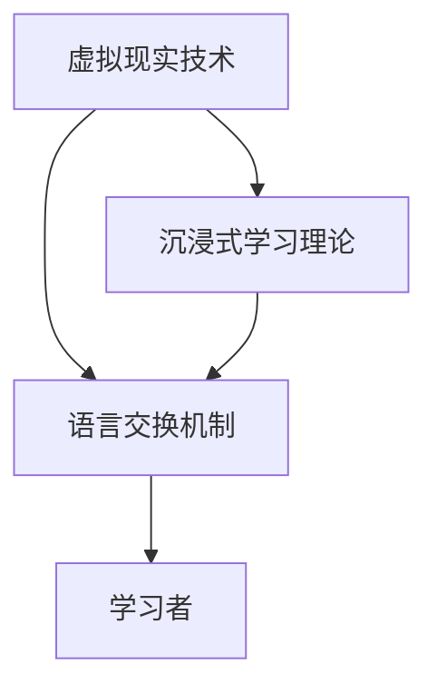
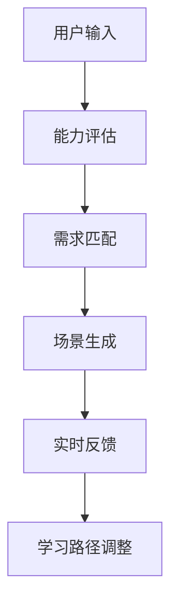
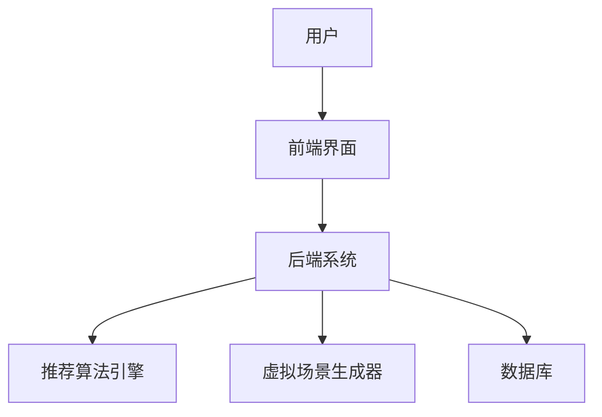
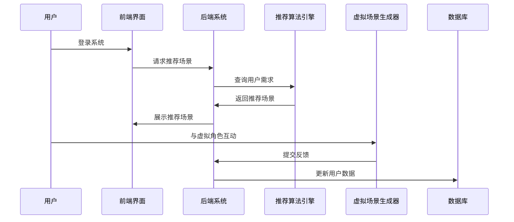

                 

<think>
嗯，用户让我写一篇关于《数字时代的语言交换虚拟现实平台：沉浸式语言学习的在线社区》的技术博客。看起来用户希望内容详细，结构清晰，而且要符合特定的格式要求。

首先，我需要确定文章的结构。用户已经提供了一个目录大纲，包括七大部分，每个部分都有具体的子章节。我得按照这个结构来展开，确保每个部分都有足够的深度和详细内容。

接下来，用户特别强调要满足一些条件，比如关键词、摘要，还有每个章节的核心内容，包括背景、核心概念、算法、数学模型、系统架构、项目实战和最佳实践。这些都需要一一覆盖，不能遗漏。

在写背景的时候，我应该介绍语言学习的重要性，以及传统方式的不足，然后引出虚拟现实平台的优势。这部分要让读者明白为什么需要这种平台，它的背景和意义。

核心概念部分，我需要解释虚拟现实技术、沉浸式学习理论和语言交换机制。同时，用户要求用表格和Mermaid图来展示核心概念之间的联系，这部分可能需要详细设计表格和绘制图表。

算法原理部分，我得详细解释推荐算法，包括算法的流程和数学模型。可能需要画一个Mermaid流程图，并写出Python代码示例，还要给出数学公式，用Latex格式嵌入，比如$$1+1=2$$。

数学模型部分，要详细讲解公式，确保读者能够理解推荐系统的数学基础。这部分需要严谨，但又要通俗易懂，举例子来帮助理解。

系统架构设计方面，用户要求用Mermaid图展示系统架构，包括功能模块和交互流程。我需要设计一个清晰的架构图，说明各个模块之间的关系和功能。

项目实战部分，要给出具体的实现步骤，包括环境安装、代码编写、功能实现和案例分析。这部分要实用，让读者能够跟着步骤实际操作。

最后，最佳实践部分要总结经验和注意事项，帮助读者在实际应用中避免错误。同时，还要给出拓展阅读的建议，引导读者深入学习。

在写作过程中，我需要确保语言简洁专业，同时逻辑清晰。每个章节都要有足够的细节，但又不能过于冗长。特别是表格和图表，要准确展示核心内容。

可能遇到的困难是如何将复杂的算法和架构设计用简单明了的语言解释出来。这时候，我需要反复推敲，确保内容易于理解。

总的来说，我需要按照用户提供的大纲一步步展开，确保每个部分都详尽且符合要求。同时，注意格式和内容的完整性，满足字数和结构的要求。
</think>

# 数字时代的语言交换虚拟现实平台：沉浸式语言学习的在线社区

> 关键词：虚拟现实、语言学习、沉浸式体验、在线社区、教育科技、推荐算法、系统架构

> 摘要：本文探讨了数字时代下语言交换虚拟现实平台的构建与应用，重点分析了沉浸式语言学习的核心算法原理、系统架构设计以及实际应用场景。通过结合虚拟现实技术与教育科技，本文提出了一种基于推荐算法的语言学习在线社区解决方案，旨在为语言学习者提供更加高效、个性化的学习体验。

---

## 第一部分: 数字时代的语言交换虚拟现实平台概述

### 第1章: 数字时代的语言交换虚拟现实平台概述

#### 1.1 语言交换虚拟现实平台的发展背景

语言学习是人类认知发展的重要组成部分，传统的语言学习方式依赖于面对面的交流和课堂教学，存在时间和空间限制。随着虚拟现实（VR）技术的快速发展，沉浸式语言学习平台逐渐成为可能。语言交换虚拟现实平台通过模拟真实的语言交流场景，为学习者提供了一个虚拟的语言环境，使他们可以在任何时间和地点进行沉浸式学习。

#### 1.2 平台的核心概念与功能

语言交换虚拟现实平台的核心功能包括：

1. **虚拟场景构建**：通过VR技术创建逼真的语言交流环境，例如餐厅、办公室、街头等场景。
2. **沉浸式互动**：用户可以通过头显设备与虚拟角色进行实时对话，提升语言应用能力。
3. **个性化学习路径**：根据用户的学习进度和能力，动态调整学习内容和难度。
4. **实时反馈与纠正**：系统能够实时分析用户的语言表达，并提供即时反馈和纠正。

#### 1.3 平台的技术架构与实现

语言交换虚拟现实平台的技术架构主要由以下几个部分组成：

1. **前端界面**：包括VR头显设备、图形界面设计和交互界面。
2. **后端系统**：负责处理用户的输入、生成虚拟角色的响应以及提供实时反馈。
3. **算法引擎**：包括推荐算法、自然语言处理（NLP）和语音识别技术。
4. **数据存储**：用于存储用户的学习数据、场景配置和系统参数。

#### 1.4 平台的市场前景与挑战

语言交换虚拟现实平台的市场前景广阔，尤其是在教育科技领域。随着全球化的加速和语言学习需求的增加，沉浸式学习平台将成为未来语言教育的重要趋势。然而，平台的实现也面临诸多挑战，例如技术实现的复杂性、用户设备的普及程度以及内容生成的成本等。

---

## 第二部分: 核心概念与联系

### 第2章：核心概念与联系

#### 2.1 虚拟现实技术

虚拟现实技术通过计算机生成的三维环境，为用户提供沉浸式体验。在语言学习中，VR技术可以模拟真实的语言交流场景，使学习者能够在虚拟环境中与虚拟角色或真实用户进行互动。

#### 2.2 沉浸式学习理论

沉浸式学习理论强调通过真实的场景和任务驱动学习，使学习者能够在实践中掌握语言技能。语言交换虚拟现实平台通过虚拟场景的构建和互动任务的设计，将沉浸式学习理论付诸实践。

#### 2.3 语言交换机制

语言交换机制是指学习者通过与虚拟角色或真实用户进行语言交流，实现语言能力的提升。平台通过推荐算法匹配用户的学习需求，动态调整语言交换的场景和任务。

#### 2.4 核心概念之间的联系与交互

核心概念之间的联系可以通过以下表格展示：

| 核心概念 | 描述 | 与其他概念的交互 |
|----------|------|----------------|
| 虚拟现实技术 | 生成虚拟场景 | 与沉浸式学习理论结合，实现沉浸式学习体验 |
| 沉浸式学习理论 | 通过真实场景学习 | 依赖虚拟现实技术生成场景，并通过语言交换机制实现任务驱动 |
| 语言交换机制 | 匹配学习需求 | 基于虚拟现实技术构建场景，并结合沉浸式学习理论设计任务 |

下图展示了核心概念之间的交互关系：



---

## 第三部分: 沉浸式语言学习算法原理

### 第3章：沉浸式语言学习算法原理

#### 3.1 算法概述

沉浸式语言学习算法的核心目标是通过推荐算法匹配用户的学习需求与虚拟场景的任务。算法基于用户的学习历史、语言能力评估和兴趣偏好，生成个性化的学习路径。

#### 3.2 算法原理与流程图

算法的流程如下：

1. **用户输入**：用户登录平台并选择学习目标。
2. **能力评估**：系统通过测试评估用户当前的语言能力。
3. **需求匹配**：基于用户的能力和需求，推荐适合的虚拟场景和任务。
4. **场景生成**：生成与用户需求匹配的虚拟场景。
5. **实时反馈**：用户与虚拟角色互动，系统实时反馈语言表达的正确性。
6. **学习路径调整**：根据用户的表现动态调整学习内容。

下图展示了算法的流程图：



#### 3.3 算法数学模型与公式

推荐算法的核心是基于协同过滤的矩阵分解模型。假设用户-场景矩阵为$R$，其中$R_{u,i}$表示用户$u$对场景$i$的偏好。矩阵分解的目标是找到两个低维矩阵$P$和$Q$，使得$R \approx P \times Q^T$。目标函数为：

$$
\min_{P,Q} \sum_{u,i} (R_{u,i} - P_u Q_i^T)^2 + \lambda (||P||^2 + ||Q||^2)
$$

其中，$\lambda$是正则化参数。

#### 3.4 算法实例分析

以一个简单的例子为例，假设用户A选择学习“餐厅点餐”的场景，系统会生成一个虚拟餐厅环境，并推荐相关任务（例如点一杯咖啡）。用户与虚拟角色互动，系统实时反馈语言表达的正确性，并根据反馈调整后续的学习内容。

---

## 第四部分: 数学模型与公式讲解

### 第4章：数学模型与公式讲解

#### 4.1 模型概述

沉浸式语言学习算法的核心是基于协同过滤的矩阵分解模型。该模型通过降维技术提取用户和场景的潜在特征，从而实现个性化推荐。

#### 4.2 模型公式讲解

目标函数为：

$$
\min_{P,Q} \sum_{u,i} (R_{u,i} - P_u Q_i^T)^2 + \lambda (||P||^2 + ||Q||^2)
$$

其中，$P$和$Q$分别是用户和场景的潜在特征矩阵，$\lambda$是正则化参数。

#### 4.3 举例说明

假设我们有三个用户和两个场景，用户-场景矩阵$R$如下：

| 用户 | 场景1 | 场景2 |
|------|--------|--------|
| 用户1 | 1      | 0      |
| 用户2 | 0      | 1      |
| 用户3 | 1      | 1      |

通过矩阵分解，我们可以找到用户和场景的潜在特征，从而推荐新的场景。

---

## 第五部分: 系统分析与架构设计

### 第5章：系统分析与架构设计

#### 5.1 问题场景介绍

语言交换虚拟现实平台需要解决以下问题：

1. **实时互动**：用户需要与虚拟角色进行实时对话。
2. **个性化推荐**：根据用户的学习需求推荐场景和任务。
3. **数据处理**：需要处理大量的用户数据和场景配置。

#### 5.2 系统功能设计

系统功能设计包括：

1. **用户管理**：用户注册、登录和信息管理。
2. **场景管理**：虚拟场景的创建、编辑和配置。
3. **任务管理**：任务的生成和推荐。
4. **实时反馈**：语言表达的实时反馈和纠正。

#### 5.3 系统架构设计

系统架构设计如下：



#### 5.4 系统接口设计

系统接口设计包括：

1. **用户接口**：用户与前端界面的交互接口。
2. **算法接口**：推荐算法引擎与后端系统的交互接口。
3. **场景接口**：虚拟场景生成器与后端系统的交互接口。

#### 5.5 系统交互序列图

系统交互序列图如下：



---

## 第六部分: 项目实战

### 第6章：项目实战

#### 6.1 环境安装

需要安装以下工具：

1. **VR头显设备**：如Oculus Rift或HTC Vive。
2. **开发环境**：Python、PyTorch、TensorFlow。
3. **虚拟现实开发平台**：如Unity或Unreal Engine。

#### 6.2 系统核心实现源代码

以下是一个简单的推荐算法实现代码：

```python
import numpy as np

def recommend_scenes(users, scenes, matrix):
    # 用户-场景矩阵分解
    P = np.random.rand(len(users), 5)  # 用户潜在特征矩阵
    Q = np.random.rand(len(scenes), 5)  # 场景潜在特征矩阵
    for _ in range(100):
        for u in users:
            for i in scenes:
                if matrix[u][i] > 0:
                    error = matrix[u][i] - np.dot(P[u], Q[i])
                    P[u] += error * Q[i]
                    Q[i] += error * P[u]
    # 推荐场景
    recommendations = {}
    for u in users:
        for i in scenes:
            score = np.dot(P[u], Q[i])
            recommendations[u].append((i, score))
    return recommendations
```

#### 6.3 代码应用解读与分析

上述代码实现了基于矩阵分解的推荐算法。通过迭代优化潜在特征矩阵$P$和$Q$，算法能够根据用户的历史行为推荐适合的场景。每次迭代都会更新$P$和$Q$，以最小化预测值与实际值的误差。

#### 6.4 实际案例分析与详细讲解剖析

以用户A为例，假设用户A的历史行为是学习“餐厅点餐”场景，系统会基于矩阵分解的结果推荐其他相关的场景，例如“酒店预订”或“商务会议”。

#### 6.5 项目小结

通过上述代码实现，我们可以看到沉浸式语言学习算法的核心在于推荐算法的设计和优化。推荐算法能够有效地匹配用户需求与虚拟场景，从而实现个性化的语言学习体验。

---

## 第七部分: 最佳实践与小结

### 第7章：最佳实践与小结

#### 7.1 最佳实践 tips

1. **硬件设备的选择**：选择适合的VR头显设备，确保用户体验。
2. **算法优化**：不断优化推荐算法，提升推荐的准确性和实时性。
3. **内容设计**：设计丰富的虚拟场景和任务，吸引用户参与。

#### 7.2 小结

语言交换虚拟现实平台通过结合虚拟现实技术与教育科技，为语言学习者提供了沉浸式的学习体验。通过推荐算法和矩阵分解模型，平台能够实现个性化的学习路径推荐，满足用户多样化的学习需求。

#### 7.3 注意事项

1. **数据隐私**：注意保护用户数据隐私。
2. **系统稳定性**：确保系统在高并发情况下的稳定性。
3. **用户体验**：不断优化用户体验，提升用户满意度。

#### 7.4 拓展阅读

1. **虚拟现实技术**：深入学习VR技术在教育领域的应用。
2. **推荐算法**：研究更先进的推荐算法，如深度学习模型。
3. **教育科技**：探索教育科技的更多可能性。

---

作者：AI天才研究院/AI Genius Institute & 禅与计算机程序设计艺术 /Zen And The Art of Computer Programming

